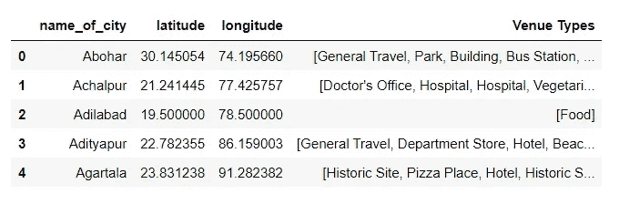

# 500 多个印度城市的自定义聚类

> 原文：<https://medium.com/analytics-vidhya/custom-clustering-of-500-indian-cities-c8d3468d612b?source=collection_archive---------10----------------------->

什塔尔·盖克瓦德

使用 FourSquare API 的数据科学项目

2021 年 7 月 12 日

> ***简介***

**1.1** **背景**

印度是世界上最多样化的国家之一，有 29 个邦，每个邦都有自己独特的语言、传统和宗教。印度大约有 4600 万个城市。印度有 54 个人口在 100 万以上的城市群。

虽然印度是世界上城市化程度较低的国家之一，只有 27.78%的人口居住在城市密集区/城镇，但该国目前正面临着严重的城市增长危机。尽管城市化一直是经济、社会和政治进步的工具，但它也导致了严重的社会经济问题。城市化主要是由于人们为了获得更好的教育、医疗保健、卫生设施、住房、商业机会和交通而迁移到城市地区。因此，有必要在缺乏这些设施的地区实施更多的设施。这个国家有几个偏远地区缺乏学校、医院、交通等基础设施。该项目旨在提供一个恰当的场景，以获得洞察力并提出解决方案。

**1.2**问题

据说“一幅画胜过千言万语”。可视化可以提供很好的洞察力来克服任何危机。然而，当数据非常庞大时(例如:数据价值超过 500 个城市，每个城市包含 100 多个场馆)，聚类是关键。在这个项目中，我根据社会经济、地理、发展因素等对印度 500 多个城市进行了分类。

我还添加了一个用户输入部分，用户可以添加他们想要分割和可视化城市的关键字。例如:“学校”、“医院”、“地铁”、“公交车站”等

**1.3**利息

政府可以利用这种可视化来执行项目，这些项目可以帮助该国迫切需要关注的地区的发展和增长。此外，将数据分割成簇可以提供有意义的见解，有助于国家基础设施的发展。

> ***数据采集和清理***

**2.1** **数据来源**

包含 500 多个印度城市的数据集可以在 Kaggle 上找到。纬度和经度数据是该数据集的一部分，可以选择从 Python [geopy](https://geopy.readthedocs.io/en/stable/) 获取。可以使用 [FourSquare](https://developer.foursquare.com/) API 探索城市附近的场馆。

数据集由几列组成，这些列不是该项目的必要特征。因此，我删除了除“城市名称”之外的其他列。此外，我想要这些城市的纬度和经度，手动添加它们会浪费很多时间，所以我使用了 python 的 geopy 库。

添加位置后，数据集对于项目来说已经足够了。

我把这个数据框架保存到一个 csv 文件中，以便于将来访问。

> M ***方法学***

在我保存了包含所有城市及其位置(纬度、经度)的新数据帧后，我用叶子在印度地图上画出了所有这些城市。**叶子**是一个用于可视化地理空间数据的 Python 库

**1。** **使用 FourSquare API 探索城市中的场馆**

我创建了一个函数，使用纬度和经度数据获取所有城市的所有场馆类型。所需信息通过 FourSquare API 获得。

“场馆类型”栏根据每个场馆进行了划分，然后根据每个城市进行了分组。因此，我创建了一个新的数据框架，并将其保存以便于访问。

**2。** **聚类是指对数据集进行聚类**

*Kmeans* 算法是一种迭代算法，试图将数据集划分为 K 个预定义的不同非重叠子组(聚类)。因此，为了恰当地对城市进行聚类，我必须找到最佳的聚类数。这可以使用 KElbowVisualizer 来完成。

根据 KElbowVisualizer=6，此数据集的最佳聚类数。我已经定义了一个函数，它将为数据帧的每个子集提供最佳聚类。

> ***结果***

在开发了这个模型之后，我用它来根据几个因素对城市进行分类。我还添加了一个函数，该函数显示一个数据框架和一个饼图，以确定集群在数据集上的分布。

以下是不同因素的一些示例结果:

## a.跨城市的高校

从这些集群和相应的数据来看，很明显，城市在学院和大学方面存在差异，这可能是导致城市化的迁移的驱动因素。

**b .**T2【交通设施

包括公交线路、公交车站、公交车站、地铁站、出租车站、火车站、电车站、交通服务、旅游和交通。

**c.** **医疗设施—** 包括医院、诊所等

缺乏适当的医疗设施也是农村地区缺乏增长和发展的一个主要原因

**d.** **住宅建筑/公寓和 e .学校**

**f.** **基于用户输入的聚类**

用户被要求输入一个关键字(如场地、学校、酒店等)，数据框中的列与关键字匹配，并作为模型开发的参数传递，结果被显示。

1.  示例 1

2.示例 2

> ***讨论***

我创建了这个项目，作为对全国几个城市的社会经济变化和其他因素的一点贡献。这些图像证明了基础设施中有几个因素需要当局解决。人们还可以获得关于国家多样性的知识，并可以将这种知识用于国家的增长和发展。

> ***结论***

在这项研究中，我分析了印度 500 多个城市中几个因素的变化。所有城市的场馆信息都是从 Foursquare API 获得的，并且是准确的。Python 的 sklearn 库中的 KMeans 算法用于基于相似模式对数据集进行聚类。有几个地区缺乏基础设施，如适当的学校、学院、交通等。可以进一步分析这些区域或它们的集群，并且可以获得关于它们的几个其他因素的洞察力。

> ***项目链接* :**

[*点击这里访问包含源代码*](https://github.com/shitalssg123/Clustering_Indian_Cities) *的 github 资源库。*

> ***数据集链接:***

[*https://www.kaggle.com/zed9941/top-500-indian-cities*](https://www.kaggle.com/zed9941/top-500-indian-cities)