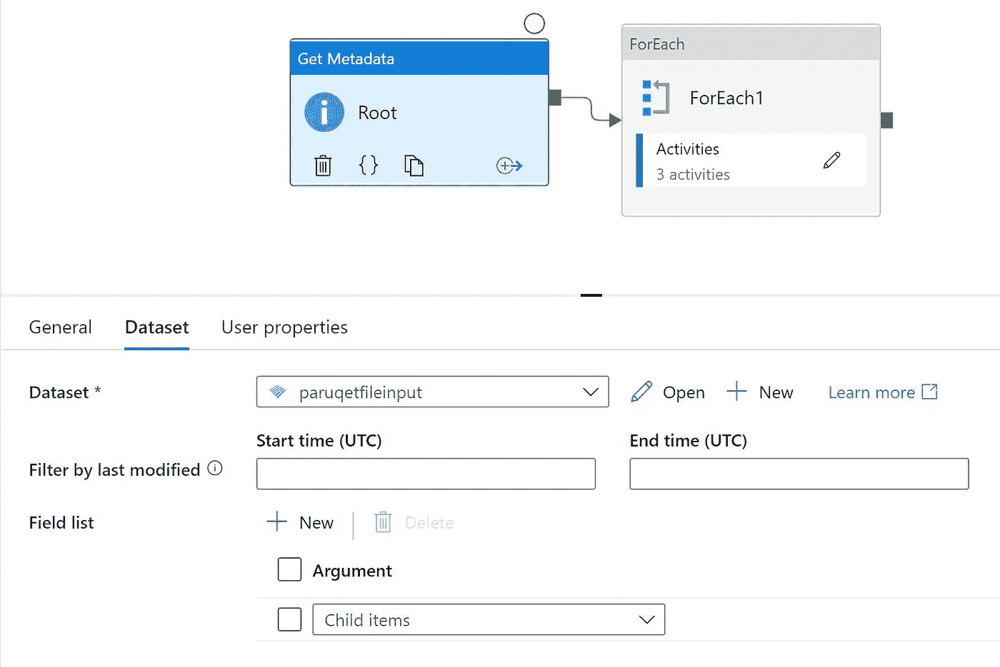

# 使用 Azure 数据工厂的自定义数据目录拼花文件

> 原文：<https://medium.com/analytics-vidhya/custom-data-catalog-parquet-file-using-azure-data-factory-7312f406b662?source=collection_archive---------13----------------------->

# 用例

*   使用 ADF 构建基于元数据的模式信息抽取
*   解析拼花地板并查找列
*   更新数据库以存储详细信息
*   如果可能的话，提供一个计划的方法
*   手动提供拼花文件夹

# 体系结构


# 先决条件

*   创建 Azure 帐户
*   创建存储帐户
*   创建 Azure 数据工厂
*   创建 Azure SQL
*   创建函数

# 数据库ˌ资料库

*   用列名创建一个表
*   创建数据库
*   创建适当的访问权限以写入表

```
Drop table metacolumn; 
Create Table metacolumn ( 
id bigint IDENTITY(1,1), 
filename varchar(200), 
columnname varchar(200), 
columntype varchar(200) 
)
```


# 加载样本数据

*   创建存储帐户
*   加载样本数据
*   我创建了名为 USpopulationInput\fact 的文件夹
*   加载了几个样本拼花文件

# Azure 数据工厂

*   创建 Azure 数据工厂管道
*   我们将使用获取元数据
*   为每个循环创建一个
*   总流量



*   选择拼花文件所在的文件夹
*   拖动 Foreach 并选择选择子项


*   现在转到活动
*   每个内装带以下组件


```
@dataset().FileName
```

*   创建新字段
*   一个用于项目名称
*   一个用于项目类型
*   上次修改时间
*   具有列集合的结构
*   对于文件名类型


# Azure 函数

*   在门户中创建一个名为 metafunc1 的 Azure 函数
*   使用 Visual Studio 代码创建和编码

```
using System;
using System.IO;
using System.Threading.Tasks;
using Microsoft.AspNetCore.Mvc;
using Microsoft.Azure.WebJobs;
using Microsoft.Azure.WebJobs.Extensions.Http;
using Microsoft.AspNetCore.Http;
using Microsoft.Extensions.Logging;
using Newtonsoft.Json;
using Newtonsoft.Json.Linq;
using System.Collections.Generic;
using System.Data.SqlClient;namespace Company.Function
{public class metadataItem
    {
        public string name {
            get; set;
        }
        public string type {
            get;
            set;
        }
    }public class metadata
    {
        public string filename {
            get; set;
        }
        public List<metadataItem> name {
            get; set;
        }}public static class metafunc1
    {[FunctionName("metafunc1")]
        public static async Task<IActionResult> Run(
            [HttpTrigger(AuthorizationLevel.Function, "get", "post", Route = null)] HttpRequest req,
            ILogger log)
        {
            log.LogInformation("C# HTTP trigger function processed a request.");//string name = req.Query["name"];string requestBody = await new StreamReader(req.Body).ReadToEndAsync();
            metadata data = JsonConvert.DeserializeObject<metadata>(requestBody);

            string connectionString = "Server=tcp:sqlservername.database.windows.net,1433;Initial Catalog=databasename;Persist Security Info=False;User ID=username;Password=xxxxxxx;MultipleActiveResultSets=False;Encrypt=True;TrustServerCertificate=False;Connection Timeout=30;";//JObject body = new JObject<(data);

                using(SqlConnection connection = new SqlConnection(connectionString)){
                    // Opening a connection
                    connection.Open();

                    // Defining the log message and Create Date
                    //var logMessage = $"{name} has logged in.";
                    var createDate = DateTime.UtcNow;foreach(var ea in data.name)
                    {
                         // Prepare the SQL Query
                        var query = $"INSERT INTO [metacolumn] ([filename],[columnname], [columntype]) VALUES('{data.filename}', '{ea.name}', '{ea.type}')";

                        // Prepare the SQL command and execute query
                        SqlCommand command = new SqlCommand(query,connection);

                        // Open the connection, execute and close connection
                        if(command.Connection.State == System.Data.ConnectionState.Open){
                            command.Connection.Close();
                        }
                        command.Connection.Open();
                        command.ExecuteNonQuery();
                        log.LogInformation("data value. {0} {1}", ea.name, ea.type);
                    }

                   connection.Close();

                }
            // Using the connection string to open a connection
            //try{
            //
            //}
            //catch(Exception e){
            //    log.LogError(e.ToString());
                //responseMessage = e.ToString();
            //}string responseMessage = $"Hello, { data.name.Count}. This HTTP triggered function executed successfully.";JObject result = new JObject();
            result.Add("result", responseMessage);
            dynamic response = JsonConvert.SerializeObject(result);
            return new JsonResult(result);
        }
    }
}dotnet add package System.Data.SqlClient
```

*   安装其他必要的软件包
*   部署功能
*   创建资源组


```
{ "name": [ { "name": "decennialTime", "type": "String" }, { "name": "stateName", "type": "String" }, { "name": "countyName", "type": "String" }, { "name": "population", "type": "Int32" }, { "name": "race", "type": "String" }, { "name": "sex", "type": "String" }, { "name": "minAge", "type": "Int32" }, { "name": "maxAge", "type": "Int32" } ] }
```


# Azure 数据工厂


*   拯救管道
*   全部验证
*   发布管道
*   然后转到管道，单击添加触发器并选择立即触发
*   转到监视器并查看结果
*   查看作业并选择作业运行以查看详细信息


*最初发表于*[*【https://github.com】*](https://github.com/balakreshnan/Accenture/blob/master/cap/parquetdatadictadf.md)*。*