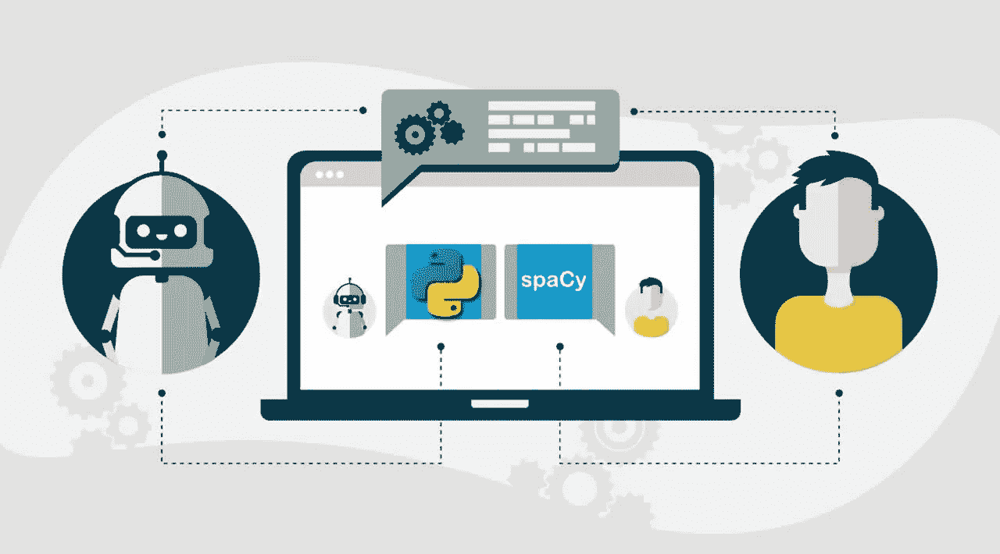
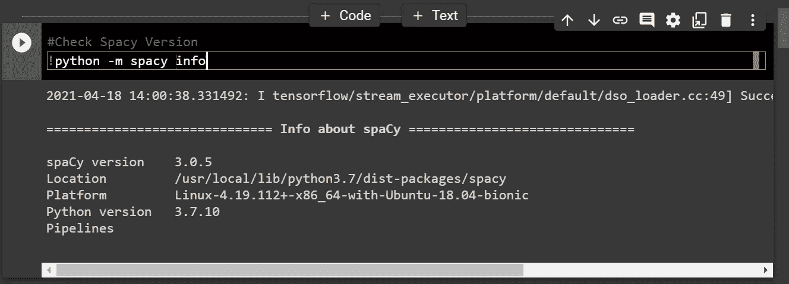
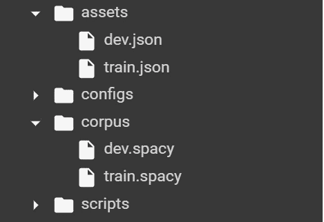
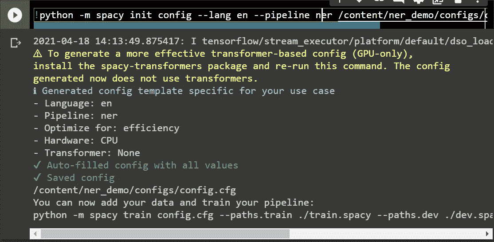
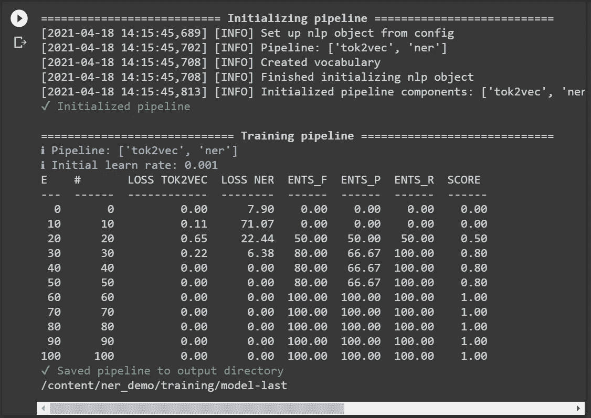
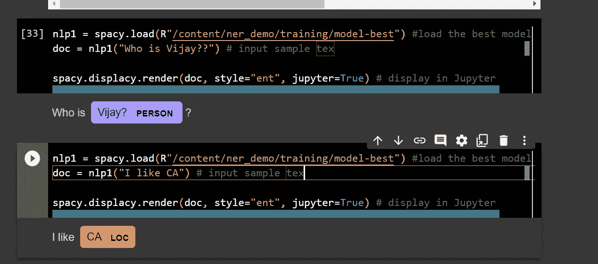

# 自定义命名实体识别(NER)模型，包含四个步骤的空间 3

> 原文：<https://medium.com/analytics-vidhya/custom-named-entity-recognition-ner-model-with-spacy-3-in-four-steps-7e903688d51?source=collection_archive---------0----------------------->

如果你觉得这篇文章有用。敬请订阅支持我多写文章。

命名实体识别是信息提取的一个子任务，它试图定位非结构化文本中提到的命名实体并将其分类成预定义的类别，例如人名、组织、位置、医疗代码、时间表达式、数量、货币值、百分比等。,

> 链接到代码:[https://github.com/Vijayvj1/Custom_NER_Spacy3](https://github.com/Vijayvj1/Custom_NER_Spacy3)

# **第一步:**安装

检查空间版本

# 步骤 2:创建培训数据

现在，主要部分是为输入文本创建您的定制实体数据，其中*命名实体*将在测试期间由模型识别。

> **注意:但是，spaCy v3.1 版不再采用** `**.json**` **格式，必须将其转换为** `**.spacy**`

将`.json`转换为`.spacy`的代码

要在 CL(命令行)模式下运行:

。空间文件已生成

# **步骤 3:创建配置并训练模型**

1.  **创建配置:**

在进行培训之前，您需要创建配置文件。要创建自定义配置文件，请点击此处的[按钮](https://spacy.io/usage/training#config)

在 CL(命令行)模式下运行:

这将使用默认值配置您从 Spacy 的小部件下载的文件。你可以使用默认设置，并根据你的需要进行调整，但是现在让我们使用默认设置。

2.**训练模型:**

一旦完成，你就可以训练你的模型了！此时，您手头应该有三个文件:(config.cfg 文件，(2)`.spacy`格式的训练数据和(3)评估数据集。在这种情况下，我没有创建另一个评估数据集，而是简单地使用我的训练数据作为评估数据集(这不是一个好主意，但只适用于本文！).确保这三个文件都在运行 CLI 的文件夹中。在这里，我还将`--gpu-id`设置为 1，以便选择我的 GPU。

在 CL(comman line)模式下运行:

1.  **E** —纪元
2.  ***#*** —优化步骤
3.  **损失 NER** —模型损失
4.  **模型的 ENTS_F、ENTS_P 和 ENTS_R** —精度、召回和 [fscore](https://en.wikipedia.org/wiki/Precision_and_recall)

# **第四步:预测**

加载模型

是啊！！我们做到了！！

# 结论

我希望你现在已经明白如何用 spaCy 3 NER 模型训练你自己的 NER 模型。感谢阅读！

如果你觉得这篇文章有用。敬请订阅支持我多写文章。

如果你想了解更多关于机器学习的知识，请继续阅读我的博客:

1.  **音频数据增强:**[https://vijay-anandan . medium . com/lets-augment-a-Audio-Data-part-1-5a b5 f 6a 87 BAE](https://vijay-anandan.medium.com/lets-augment-a-audio-data-part-1-5ab5f6a87bae)
2.  **语音数据的情感分析:**[https://vijay-anandan . medium . com/personance-Analysis-of-Voice-Data-64533 a 952617](https://vijay-anandan.medium.com/sentiment-analysis-of-voice-data-64533a952617)
3.  **对极度不平衡的数据集进行重采样:**[https://vijay-anandan . medium . com/how-to-re-sample-an-unbalanced-datasets-8e 413 dabb 21](https://vijay-anandan.medium.com/how-to-resample-an-imbalanced-datasets-8e413dabbc21)
4.  **神经网络在深度学习中到底是如何工作的:**[https://medium . com/analytics-vid hya/How-Do-Neural-Networks-Really-Work-in-the-Deep-Learning-72f 0 e 8 C4 c419](/analytics-vidhya/how-do-neural-networks-really-work-in-the-deep-learning-72f0e8c4c419)
5.  **使用 AutoML 的五步情感分析:**[https://medium . com/analytics-vid hya/opinion-Analysis-in-Five-Steps-using-AutoML-d 16 fee ab 2a 36](/analytics-vidhya/sentiment-analysis-in-five-steps-using-automl-d16feeab2a36)

[https://www.linkedin.com/in/vijay-anadan/](https://www.linkedin.com/in/vijay-anadan/)