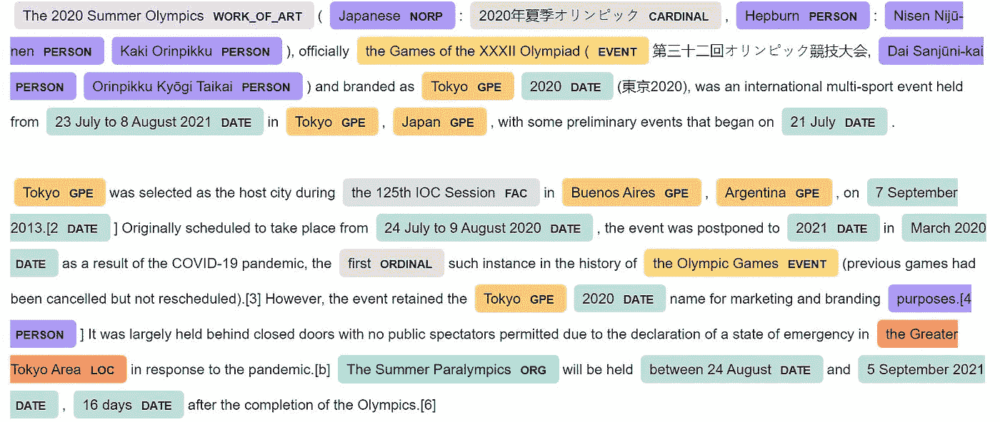
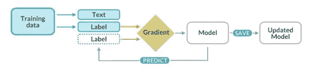

# 用于提取疾病实体的自定义 NER

> 原文：<https://medium.com/analytics-vidhya/custom-ner-for-extracting-disease-entities-c620aca2e1bb?source=collection_archive---------1----------------------->

## 了解如何使用 spaCY 的 NER 从非结构化文本中提取疾病名称。

随着数字数据的不断增加，从大量数据中提取有用的信息一直是一项艰巨的任务，尤其是在处理非结构化文本时。

因此，如果我们能够用几行代码提取有意义的实体/具体细节，而不是一行一行地浏览每一篇文章或任何其他文本资源，那该有多好。

这就是 NER 发挥作用的地方！

## 什么是 NER？

> 命名实体识别是提取预定义实体的过程，例如人名、位置、组织、时间、日期等。从非结构化的文本数据中。



NER 关于东京奥运会的维基百科文章

假设我们有下面的文本，

"脸书是一家美国在线社交网络服务公司，由马克·扎克伯格于 2004 年创立."

对上面的文本执行 NER 将提取如下实体，如组织、人员、年份，

脸书组织
2004 年度
马克·扎克伯格人物

然后，提取的实体可以组合在一起，用于各种信息提取任务。

在本文中，我使用 spacy 来执行自定义命名实体识别，以从文本文章中识别疾病名称。

所以让我们开始吧！

**使用空间自定义 NER**

SpaCy 是一个免费的开源 Python 自然语言处理库，可用于多种自然语言处理任务，如 NER、词性标注、依存解析、词向量等。

让我们首先安装和导入空间

```
#importing necessary libraries
!pip install -U spacy
import spacy#for NER visualization
from spacy import displacy
```

加载空间并检查它是否有 NER

```
nlp=spacy.load('en_core_web_sm')
nlp.pipe_names['tok2vec', 'tagger', 'parser', 'attribute_ruler', 'lemmatizer', 'ner']
```

现在让我们使用 spaCY 的默认实体在一个关于东京奥运会的小文本数据上执行 NER。

```
*#text with details of tokyo olympics*
text_olympics = """ The 2020 Summer Olympics (Japanese: 2020 年夏季オリンピック, Hepburn: Nisen Nijū-nen Kaki Orinpikku), officially the Games of the XXXII Olympiad (第三十二回オリンピック競技大会, Dai Sanjūni-kai Orinpikku Kyōgi Taikai) and branded as Tokyo 2020 (東京 2020), was an international multi-sport event held from 23 July to 8 August 2021 in Tokyo, Japan, with some preliminary events that began on 21 July.

Tokyo was selected as the host city during the 125th IOC Session in Buenos Aires, Argentina, on 7 September 2013.[2] Originally scheduled to take place from 24 July to 9 August 2020, the event was postponed to 2021 in March 2020 as a result of the COVID-19 pandemic, the first such instance in the history of the Olympic Games
 """*#ner on tokyo olympics text*
doc=nlp(text_olympics)
**for** ent **in** doc.ents:
  print(ent.text,ent.label_)
```

提取的实体是，

```
The 2020 Summer Olympics WORK_OF_ART
Japanese NORP
2020 年夏季オリンピック CARDINAL
Hepburn PERSON
Nisen Nijū-nen PERSON
Kaki Orinpikku PERSON
the Games of the XXXII Olympiad ( EVENT
Dai Sanjūni-kai PERSON
Orinpikku Kyōgi Taikai PERSON
Tokyo GPE
2020 DATE
23 July to 8 August 2021 DATE
Tokyo GPE
Japan GPE
21 July DATE
Tokyo GPE
the 125th IOC Session FAC
Buenos Aires GPE
Argentina GPE
7 September 2013.[2 DATE
24 July to 9 August 2020 DATE
2021 DATE
March 2020 DATE
first ORDINAL
the Olympic Games
  EVENT
```

对于实体的描述，

```
*#description of entities*
spacy.explain("EVENT")'Named hurricanes, battles, wars, sports events, etc.'
```

正如我们所看到的，虽然 spaCY 在提取实体方面做得很好，但让我们对不同的文本数据进行同样的尝试，看看效果如何。

```
text_disease = """Based on the statistics from WHO and the Centers for Disease Control and Prevention,here are the five most common infectious diseases.
According to current statistics, hepatitis B is the most common infectious disease in the world, affecting some 2 billion people -- that's more than one-quarter of the world's population. This disease, which is characterized by an inflammation of the liver that leads to jaundice, nausea, and fatigue, can lead to long-term complications such as cirrhosis of the liver or even liver cancer. 
.
.
.
however, there were still 8.6 million new cases of TB reported last year, and roughly one-third of the world's population carries a latent form of TB,
meaning they've been infected but aren't ill and can't transmit the disease yet. """
```

整个文本数据可以在[这里](https://github.com/sangee1301/Custom-Named-Entity-Recognition-on-Diseases/blob/main/text_disease.txt)下载。

NER 对上述疾病的 _text、

```
doc=nlp(text_disease)
**for** ent **in** doc.ents:
  print(ent.text,ent.label_)WHO ORG
the Centers for Disease Control and Prevention ORG
five CARDINAL
some 2 billion CARDINAL
more than one-quarter CARDINAL
about 350 million CARDINAL
Malaria GPE
more than 500 million CARDINAL
annually DATE
between 1 million and 3 million QUANTITY
second ORDINAL
annual DATE
Malaria GPE
TB ORG
```

正如我们在这里看到的，与疾病名称相关的实体被错误地归类为 GPE 或 ORG。例如，疟疾被归类为 GPE，这是没有意义的。

让我们看看如何改进上面的模型，通过使用一个新的标签 DISEASE，让 spaCY 对疾病进行分类。

## 用新标签“疾病”更新 NER

```
*# Load pre-existing spacy model*
**import spacy**
nlp=spacy.load('en_core_web_sm')
*# Getting the pipeline component for ner*
ner=nlp.get_pipe("ner")
ner
```

用自定义实体定义 TRAIN_DATA，

```
TRAIN_DATA = [(text_disease , {"entities": [(654,661, 'DISEASE'),(1890,1896, 'DISEASE'),(2311,2323, 'DISEASE'),
                                            (1382,1391, 'DISEASE'), (406,414, 'DISEASE'), 
                                            (2539,2543, 'DISEASE'), (168,177, 'DISEASE'),
                                           (2325,2327, 'DISEASE'), (518,524, 'DISEASE')]})]
```

自定义实体应以上述格式指定。应该为它提供一个文本和一个字典，其中包含对应于该特定文本的键实体。“实体”键具有在该特定文本中标识的实体列表。列表中的每个实体元组都有单词的跨度(例如:(654，661)是 text_disease 数据中单词疟疾的跨度。)及其相应的标签。

你既可以手动指定实体，也可以使用本文[中列出的任何 NER 注释工具。](https://bohemian.ai/blog/text-annotation-tools-which-one-pick-2020)

要手动查找单词的跨度，可以使用下面的代码行。

```
string = text_disease
match = re.search("Malaria", string)
print('**%d**,**%d**' % (match.start(), match.end()))654,661
```

现在让我们给 NER 添加新标签，

```
*# Add the new labels to ner*
**for** _, annotations **in** TRAIN_DATA:
  **for** ent **in** annotations.get("entities"):
    ner.add_label(ent[2])
```

## 训练 NER

这里，我们将使用现有的空间模型来训练实体，而不是空白的空间模型。如果使用现有的模型，我们必须在训练期间使用 [nlp.disable_pipes](https://spacy.io/api/language#disable_pipes) 禁用所有其他管道组件，这样只有 NER 得到训练，其他的被忽略。

禁用不需要更改的管道组件，让我们开始培训吧！

```
pipe_exceptions = ["ner", "trf_wordpiecer", "trf_tok2vec"]
unaffected_pipes = [pipe **for** pipe **in** nlp.pipe_names **if** pipe **not** **in** pipe_exceptions]*#import necessary libraries for training*
**import** **random**
**from** **spacy.util** **import** minibatch, compounding
**from** **spacy.training** **import** Example*# Begin training by disabling other pipeline components*
 **with** nlp.disable_pipes(*unaffected_pipes) :

   sizes = compounding(1.0, 4.0, 1.001)
   *# Training for 100 iterations* 
   **for** itn **in** range(100):
     *# shuffle examples before training*
     random.shuffle(TRAIN_DATA)
     *# batch up the examples using spaCy's minibatch*
     batches = minibatch(TRAIN_DATA, size=sizes)
     *# dictionary to store losses*
     losses = {}
     **for** batch **in** batches:
       **for** text, annotations **in** batch:
         doc = nlp.make_doc(text)
         example = Example.from_dict(doc, annotations)
         nlp.update([example], drop=0.5, losses=losses)
         print("Losses",losses)
```

我们已经使用了 [nlp.update](https://spacy.io/api/language#update) ，对每个训练示例进行预测。然后，它使用注释中的已训练实体来检查预测。如果预测是正确的，它保存权重，如果预测是错误的，它调整其权重，以便下次可以做出更好的预测。

训练是一个迭代过程，其中模型的预测与参考注释进行比较，以估计损失的**梯度。损失的梯度然后通过[反向传播](https://thinc.ai/docs/backprop101)用于计算权重的梯度。梯度指示权重值应如何变化，以便模型的预测随着时间的推移变得更类似于参考标注。**



来源:[https://spacy.io/usage/training](https://spacy.io/usage/training)

**测试 NER**

现在让我们测试 NER 中与疾病相关的新文本，看看结果

```
# Testing the NER
 doc = nlp(“Hepatitis is a disease which causes inflammation of the liver and it can also cause jaundice.Tuberculosis is caused by a bacterium called Mycobacterium tuberculosis.AIDS is the late stage of HIV infection that occurs when the body’s immune system is badly damaged because of the virus.Typhoid is a bacterial infection that can lead to a high fever, diarrhea, and vomiting.Cancer is a disease in which some of the body’s cells grow uncontrollably and spread to other parts of the body.Chikungunya is a viral disease transmitted to humans by infected mosquitoes.Pneumonia is an infection that inflames the air sacs in one or both lungs.Malaria is a disease caused by a parasite.” )
 print(“Entities”, [(ent.text, ent.label_) for ent in doc.ents])
```

提取的实体是，

```
Entities [(‘Hepatitis’, ‘DISEASE’), (‘Tuberculosis’, ‘DISEASE’), (‘AIDS’, ‘DISEASE’), (‘Cancer’, ‘DISEASE’), (‘Chikungunya’, ‘DISEASE’), (‘Pneumonia’, ‘DISEASE’), (‘Malaria’, ‘DISEASE’)]
```

还不错！

正如我们所看到的，模型已经正确地提取了大部分实体。虽然我没有使用过肺炎，但在训练中基孔肯雅病毒也很好地预测了它们。

希望我的文章能帮助您理解如何使用 NER 执行自定义命名实体识别。尝试不同的数据集，让我知道你的评论和反馈如下。

源代码可以在[这里](https://github.com/sangee1301/Custom-Named-Entity-Recognition-on-Diseases)找到。

感谢您的阅读！