# 使用 R 的客户行为评分模型

> 原文：<https://medium.com/analytics-vidhya/customer-behavior-scoring-model-using-r-51f8f92d33eb?source=collection_archive---------9----------------------->

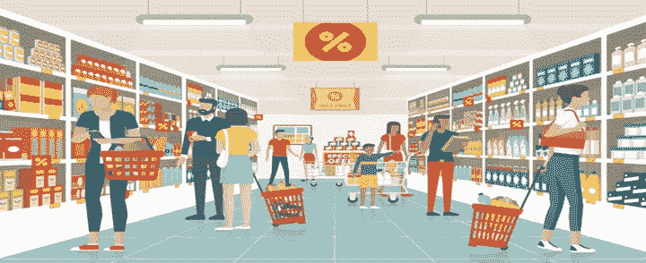

来源—[https://www . newfoodmagazine . com/article/107325/the-impacts-of-evolving-consumer-preference/](https://www.newfoodmagazine.com/article/107325/the-impacts-of-evolving-consumer-preference/)

组织经常开发和推出新产品/服务，或者参与产品/服务的增强，以增加他们的收入和 ROI(投资回报)。因此，事先知道产品的哪一个属性是顾客最看重的，这是一个稳赢的机会。

在这篇文章中，我将向您展示如何使用 R 语言开发客户行为评分模型。

让我们从一家酒类公司的案例研究开始，比如翠鸟、百威英博或 Groupe Castel，任何一家。

公司计划扩张并希望扩展其产品线，但事先希望根据某些属性了解其客户行为。

为了获取属性信息，公司向随机选择的受访者展开调查。

新产品线—葡萄酒

受访者人数——50 人

使用**全因子设计**，生成的组合总数为 3⁵ = 243

基于每个属性中的级别或类别数= 3，并且

属性数量= 5，包括许多相关的组合。

因此，为了避免多重共线性，正交设计将是我们的理想选择。

考虑的设计—正交设计

确定的属性和级别

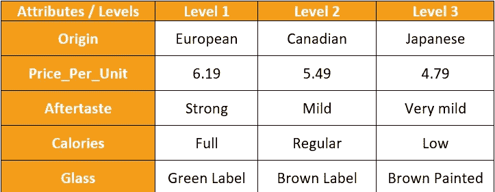

作者图片

让我们首先使用 r 中列出的属性和水平创建一个正交设计。

R-Studio 截图。

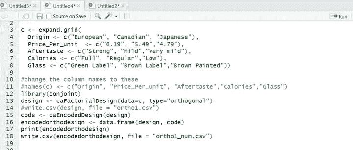

作者图片

因此，这给了我们 13 个正交组合:

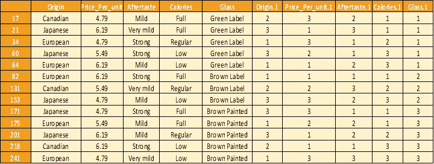

作者图片

检查 RStudio 中正交组合之间的共线性。

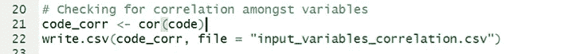

作者图片

因此，这给出了相关性为 0，即零:

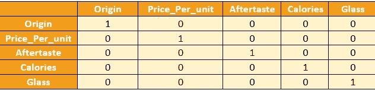

作者图片

这 13 个不相关的组合与 50 名受访者分享，以获取他们的回答/评分(1-10 分)。

收集的回复一瞥

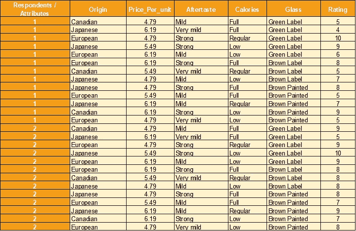

作者图片

对收集的响应数据执行线性回归

R-Studio 代码

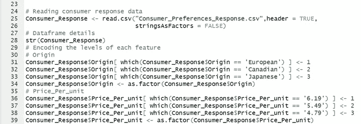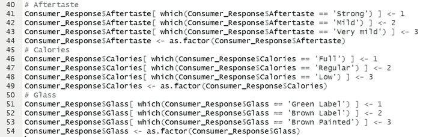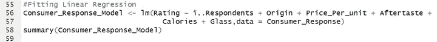

作者图片

从 RStudio 捕获的模型摘要。

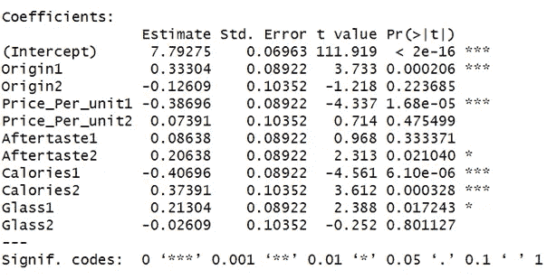

这表明顾客对产地、单价和卡路里高度敏感。

让我们找出每个属性重要性的数值。

R-Studio 代码

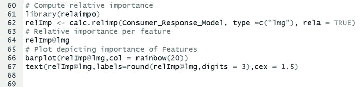

下面是每个属性的确切重要性值。

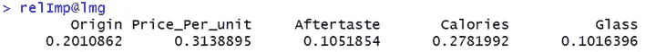

用于可视化的条形图。

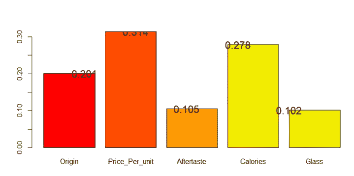

作者图片

这再次清楚地表明，我们的顾客对价格、产地和卡路里非常敏感。

余味和玻璃是相对不太重要的偏好。事实证明，这是一种表现客户行为得分的好方法，有助于组织进行产品线扩展，并从中获得最大的投资回报。

我得出这样的结论。

希望这能帮助你更好地理解这个主题。