# 音乐流媒体服务的客户流失预测

> 原文：<https://medium.com/analytics-vidhya/customer-churn-prediction-of-music-streaming-service-534e4378e87b?source=collection_archive---------6----------------------->

预测可能想要取消服务的客户是一个具有挑战性的问题，在面向客户的业务中经常遇到。

# 介绍

在这项分析中，我们将使用 Sparkify 上收集的数据，Sparkify 是一个类似于 Spotify 的数字音乐平台。数据集是虚构的，由 Udacity 为数据科学纳米学位项目*的项目生成。*我们将探索用户数据并挖掘可能有用的特征，以建立一个预测模型，告诉我们哪些客户可能会离开。

文章组织如下:

*   **问题设置**:讨论问题情境及为什么值得研究。
*   **关于数据**:查看数据及其格式，检查数据偏差，以及从小数据到大数据分析的一些思考。
*   **定义流失:**我们如何定义流失客户和非流失客户？
*   **业务理解:**学习对象是谁？它们对增加收入有什么影响？
*   **探索性数据分析:**我们将探索许多与时间相关的变量，以及用户的页面访问活动和他们的账户概况。
*   **建模:**本节包括建立模型的每个步骤。从使用的变量、应用的算法、评估指标和模型验证。给出了结果，并讨论了可能的改进。
*   **业务成果:**应用场景是什么，或者它如何帮助决策？

# 问题设置

在 Sparkify 上，用户可以选择使用在歌曲之间放置广告的免费计划，或者每月支付统一费用来享受无广告的音乐。用户可以在免费和付费计划之间切换，或者随时取消服务。这样，让你的用户对服务满意是至关重要的。对于那些似乎有可能离开服务的人，我们可能会向他们提供折扣，以提高他们继续使用服务的意愿。

## 为什么重要？

对流失用户的准确标记有助于增加总订阅量，从而增加收入，而错误的标记，例如将不打算取消的用户标记为取消，将减少在不向客户发送促销的情况下可以获得的原始收入。

# 关于数据

每当用户在播放歌曲、注销或降级服务时与服务进行交互，都会生成数据。通过查看日志数据，我们将了解用户的偏好以及他们对服务的参与程度。这些可以是确定用户是否要离开的指示符。

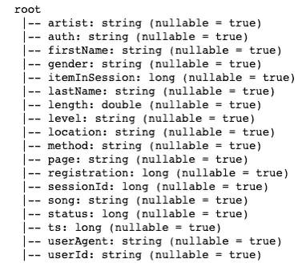

日志数据变量及其格式。

我们使用 Spark APIs 从一个小数据集(12 GB 完整数据集中的 128 MB)开始研究。在这个数据集中，我们有 18 个特征的 286500 行日志。它们是由 225 个用户在删除一小部分缺少 userId 记录的日志后生成的。

## **超级用户？**

我想在把日志潜水分为付费和免费的时候回答这个问题。在图 1 中，我们可以看到确实有一些用户比其他人更活跃。图 2 定性地告诉我们:20%的用户做了 30%–50%的日志，这仍然在合理的范围内。

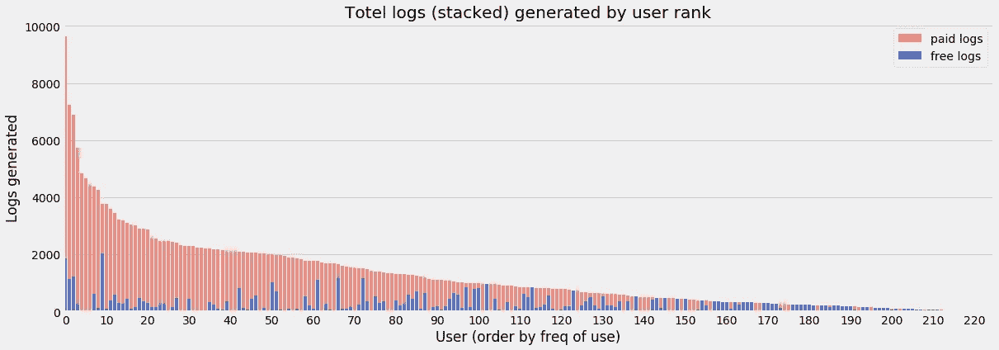

图 1:每个用户产生了多少数据？

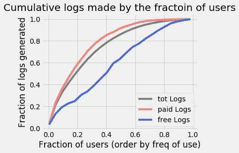

图 2:用户产生的数据累积量。

所以我们要建立一个预测模型，这个模型不仅仅基于一小群用户。这给了我们信心，数据不是很有偏差，当更大的数据到达时，我们可以扩展模型。

## 小数据与大数据

对于流服务平台，数据会随着时间快速增长。很快就会从几十 MB 开始到几 GB 甚至更大。当分析大量数据时，Spark 本身就是为处理此类任务而设计的，它的处理效率将远远超过 scikit-learn 等非分布式框架。最终，当数据变得非常大时，框架通常运行在云上，利用计算平台提供商，如 AWS、IBM 或微软云。

# *定义流失*

如果用户提交了“取消确认”，该用户将被标记为“流失客户”。在类似的情况下，如果用户提交“降级确认”，该客户将被标记为“降级客户”。

图 3:用户构成比例。两个绿色音调代表仍然活跃的用户，两个红色音调代表最终离开服务的用户。

图 3 显示了根据这个定义的用户组成。我们总共有 23%的流失用户。在流失者中，大部分是直接取消服务(23%中的 19%)，而不是在使用降级版本后取消(23%中的仅 4%)。当我们谈到那些使用降级版的用户时，共有 22%的用户使用过免费版，其中大部分(22%中的 18%)仍在使用免费版。

# *商业理解*

当用户使用免费计划时，将播放广告。广告可以带来收入，虽然这种收入可能不如来自订阅费(取决于价格)的收入。我们可以说，无论客户选择哪种计划，只要他们不离开服务，我们就可以盈利。从这个意义上说，目前研究的重点是成功识别最终离开服务的客户，即 23%。

降低流失率的极端情况是向所有用户提供促销，不管他们是否打算离开。许多用户打算继续使用该服务，但当他们收到折扣时，他们会很乐意接受。这似乎违背了我们追求利润最大化的初衷，也无形中提高了忠实用户对未来给予他们更多优惠的期待。这种极端的提议显然不是一个好的解决方案。我们需要一个好的标签来区分流失和非流失。

客户流失预测的精确度当然是我们最关心的，但同时我们也关心召回率。这就像当我们致力于增加真阳性(正确地将流失标记为流失)时，我们也重视降低假阳性(错误地将非流失标记为流失)和减少假阴性(将流失视为非流失)。F-1 分数是为它准备的度量标准。

# *探索性数据分析*

我们可以从三类不同的变量中观察用户的行为。第一个是与时间相关的变量。二是关于用户的页面访问活动。第三个是关于用户的个人资料。有些变量可以直接从文件中提取，有些需要稍加处理。

> *【时间相关】:*

这些变量显示了流失和非流失之间的差异。

*   用户第一次和最后一次播放歌曲之间的天数— > *大多数流失用户不会听音乐超过 50 天，而在非流失用户中，他们会停留更长时间*
*   用户注册后的天数— > *大多数流失用户倾向于比参与用户少呆 25 天左右*

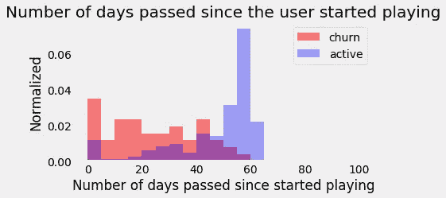

用户注册后，过了多少天才第一次使用？

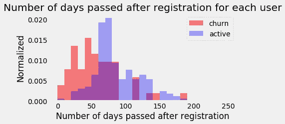

用户注册后已经过了多少天？

这些变量在流失和非流失之间略有差异，但不足以对现有的统计数据进行评论。当更多的数据到达时，它们值得再次检查，也许有些值得添加到模型中。

*   用户拥有的会话数。— > *没有区别*
*   用户每次会话停留的平均分钟数。— > *略*
*   用户在会话中的最长使用分钟数。— > *略*
*   用户在会话中的最短使用时间。— > *无差异*
*   用户在两次会话之间使用分钟的标准偏差(如稳定性)。— > *略*
*   用户每天创建的平均日志量。— > *无差异*

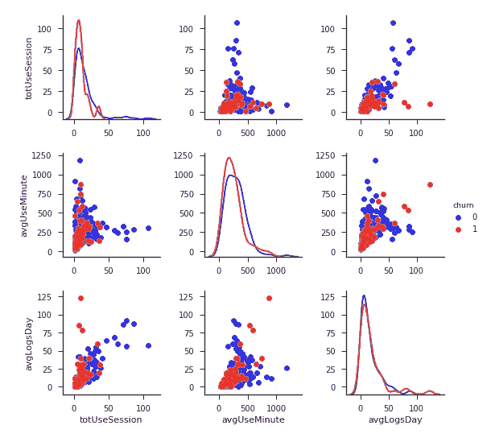

*' totuseservice ':使用的会话总数*
' *avgUseMinute ':每个会话的平均使用分钟数*
' *avgLogsDay ':用户每天拥有的平均日志数*

*‘最大使用分钟’:每个用户会话间最大使用分钟数*
‘最小使用分钟’:每个用户会话间最小使用分钟数
*‘标准使用分钟’:每个用户会话间使用分钟数的标准偏差*

> *【页面活动】:*

*   一堆变量:用户听的歌曲数量。用户给定的 ThumbsUp/ThumbsDown 的数量。用户添加到播放列表中的歌曲数量。用户添加的好友数量。

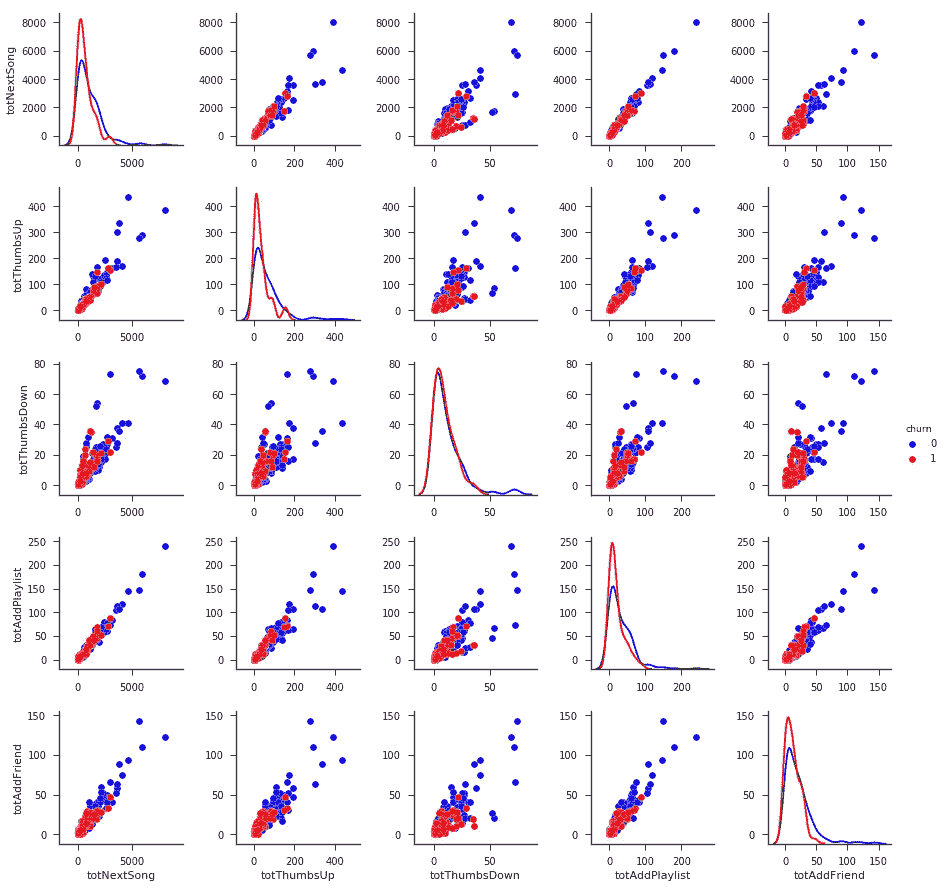

*【totNextSong】:播放下一首歌曲的数量*
’*tottumbsup】:竖起大拇指的数量*
’*tottumbsdown”:竖起大拇指的数量*
’*totAddPlaylist”:添加播放列表的数量*
’*totaddlifend”:添加好友的数量*

一些变量可以用来测试用户对系统的“容忍度”。

*   一个会话中最多发生的错误数。用户在一次会话中最多收听一次的广告数量。— > *流失和非流失之间没有明显的区别，但是，如果我们看一下降级用户，它似乎向我们展示了一些提示*

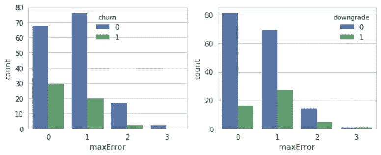

*'maxError ':在一个会话中遇到的最大错误数*
' *maxAdvert ':在一个会话中播放的最大断言数*

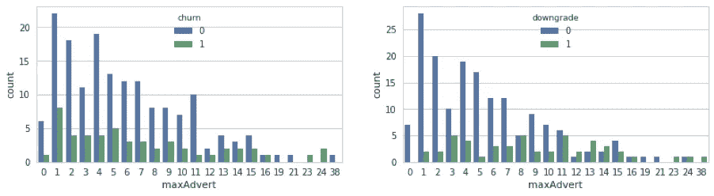

与上面的变量相同，但是是为曾经降级或没有降级的用户绘制的

> *【用户资料】:*

我们对用户的性别、位置、用于游戏的设备很好奇。一些观察结果:

*   男性用户比女性用户多一点。这与流失的情况相同，但总体而言，这种差异仍在统计不确定性范围内(1σ~条目的平方根)。也就是说，该数据在性别方面没有大的偏差(104 名女性用户& 121 名男性用户)，而观察到的女性流失率为 19%，男性流失率为 26%。男性流失率似乎更高。

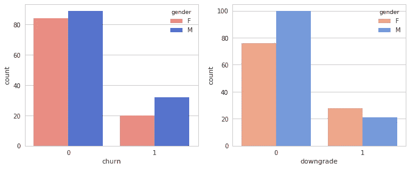

流失和非流失用户(左图)以及降级和非降级用户(右图)的性别分布。

*   *加州、纽约州和德克萨斯州是用户数量最多的前三个州。似乎在加州，更大比例的用户继续使用降级计划，然而在其他州，大多数降级用户最终倾向于取消服务。然而，当这个小数据集被划分成不同的类别(状态)时，对于许多状态来说，统计数据不足以得出结论。当用户数据增长时，划分为状态的比较会更有用。*

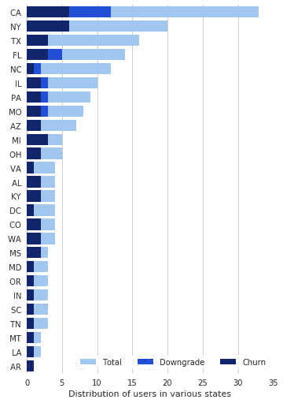

各州的用户分布。

*   *大部分用户是在 Windows 系统上，然后下一个是在 Mac 上，然后是便携系统(iPhone 和 iPad)。X11 和其他兼容系统上的用户最少。*

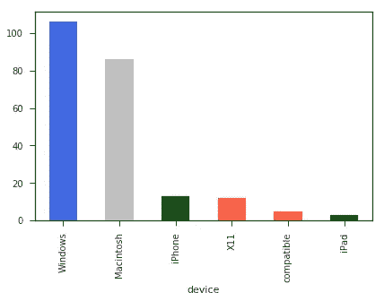

播放设备上的用户分布。

*   *这里定义了一个量化指标，看每个用户的“付费日志”与“全部日志”的比例是否会影响该客户离开服务的意愿。有些影响，但不是主要原因。*

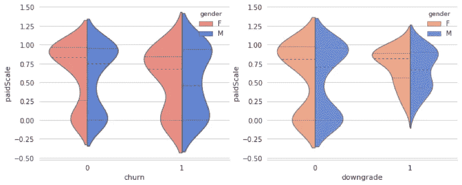

*“计酬木材”与“计酬木材”的数量比例。*流失和非流失用户的分布(左图)以及降级和非降级用户的分布(右图)。

# 建模

我在上面选择了 8 个变量，这些变量在客户流失和非客户流失之间更容易区分。下图显示了变量之间的相关性。

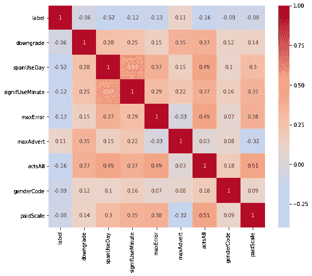

8 个选定变量之间的相关性度量。*(“acts all”是变量的求和:totThumbsUp，totThumbsDown，totAddPlaylist，totAddFriend。我们做这个求和是因为这些变量高度相关。)*

在模型中，变量被标准化以将平均值缩放为 0，将方差缩放为 1(虽然这在基于树的模型中不是必需的，但是对于其他算法是必需的)。

作为第一次尝试，选择了 5 个特征:'*降级'*，' *spanUseDay '，' actsAll '，' maxError '，' maxAdvert':*

*   *“降级”:*客户是否降级过服务的标签。
*   s*panUseDay”:*第一次和最后一次听音乐之间的天数。
*   *acts all ':*thumbs up、ThumbsDown、添加到播放列表的歌曲和添加的朋友的数量总和。
*   *'maxError':* 会话中遇到的最大错误数。
*   *'maxAdvert':* 一次游戏中的最大游戏次数。

测试了三种算法:逻辑回归、随机森林和梯度推进树。

数据集分为 60%/20%/20%，用于训练、超参数调整和测试。当更大的数据集到达时，这一分配比例可能会变化。大数据分析的设置可能是 98%/1%/1%。

## 评估指标

在这个二元分类问题中，我们将使用 F1-score 来优化模型。正如我们在“业务理解”一节中所讨论的，我们需要一个能够有效减少假阳性和假阴性，同时增加真阳性的指标。因为流失群体相对较少的部分，F1-score 就在发挥这样的功能。这是一种调和方法，在精确度和召回率之间进行权衡。它给不平衡数据中较小的类以权重。

## 模型评估和验证

为了降低每个预测模型的方差，在估计性能时采用了 k 倍交叉验证(k=3)。我发现，就构建一个仅应用了 5 个特征的健壮模型而言，这已经足够了(模型本身并不复杂)。验证性能没有观察到明显的波动，应该是稳定的。

我计算了花费在每个建模算法上的时间。梯度增强树的运行时间几乎是逻辑回归的两倍，而随机森林只多花了 20%的时间，所以我在超参数调整中只使用了逻辑回归和随机森林。

在逻辑回归中， *regParam=[0.05，0.1，0.2]* 和 *maxIter=[5，10，15]* 被网格扫描。在随机森林中，在*max depth =【5，10，15】*和*num trees =【20，30，40，50】*内扫描。下表总结了列车组和测试试验中最佳参数设置的结果。

如果有更多的计算资源来支持，应该可以为所有算法准备一个详尽的超参数扫描。

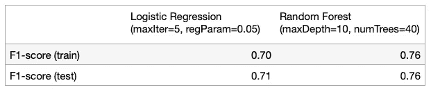

表 1:执行超参数调整后的结果总结。

对于这个数据集，我们可以使用随机森林作为分类器，它在建模中用 5 个特征获得了 0.76 的 F1 分数。

## *潜在改进*

下一步我们应该做的是看看错误标记的部分，即。假阳性和假阴性，看是否达到了一种自然的‘天花板’。并且看看所达到的预测能力是否足够满足我们的问题设置。我们可能需要多次迭代，直到我们最终采用当时状态下的操作模型。然后，随着数据数量的增加，需要不时地更新模型。

它在下一次迭代中也有一些改进的空间:

1.  向模型中添加更多功能。我们已经在 EAD 部分看到了其中的一些特性，我们还可以进一步探索一些时间特性，例如:每个用户在过去 n 天的使用情况。
2.  尝试其他算法(例如:XGBoost 和 LightGBM)。有时，只有当模型中包含更多的特征时，一些算法才会执行得更好。当然，随着变量越来越多，建模所需的时间会明显变长。
3.  将预测模型组合成一个定制的集合模型。
4.  将分析重新定义为多类分类问题，如图 3 所示的类别。这只适用于更大的数据，当最小的组也有足够的统计数据时。

# 业务成果:

有了预测模型，就可以用来辅助商业决策。例如，考虑到模型的准确性，我们可以进一步讨论向可能离开的客户提供的折扣范围。比如 10%的折扣，20%的折扣，甚至 30%的折扣？一般来说，折扣越大，建模越准确。我们可以找到一个贴现率，在已知精度的情况下使总收入最大化。还应考虑发送折扣的成本(如果有)。

这是一个有趣的话题，是有了客户流失预测结果后的商业应用场景。

# 摘要

我们使用客户数据的子集进行流失研究，通过 pySpark 进行功能工程和建模，这也为我们提供了将框架扩展到大数据分析的灵活性。然后我们检查这个数据是否能代表大部分用户。

后来，我们查看了许多特征(也制作了一些)，并选择了一些用于建模。通过对每个算法应用交叉验证和超参数扫描，当使用随机森林方法预测客户流失时，F1 得分为 0.76。这是基线预测，可以通过在模型中实现更多功能或使用更大的数据集进行分析来提高预测能力。

代码分析的更多细节可以在[这里](https://github.com/yduh/Churn-Prediction)访问。它是以可重用和可扩展的方式组织的。

我们还讨论了为什么它对业务很重要，it 如何理解业务中的 it，应用场景是什么，或者它如何帮助决策。我希望你觉得这很有趣。