# 基于 BG-NBD 和 Gamma-Gamma 模型的客户生命周期价值预测及 Python 应用实例

> 原文：<https://medium.com/analytics-vidhya/customer-life-time-value-prediction-by-using-bg-nbd-gamma-gamma-models-and-applied-example-in-997a5ee481ad?source=collection_archive---------0----------------------->

大家好。在这个故事中，我将尝试解释什么是 BG-NBD 模型，什么是伽马-伽马子模型，以及我们如何使用这些统计方法来计算客户的生命周期价值。在这个故事的最后，我们将看到一个 Python 中的应用示例。我将在这里解释代码的含义，我也将在 Kaggle 笔记本上分享代码。你可以从[这里](https://www.kaggle.com/enesbaysan/customer-life-time-value-prediction-by-using-bg-nb)进入笔记本。

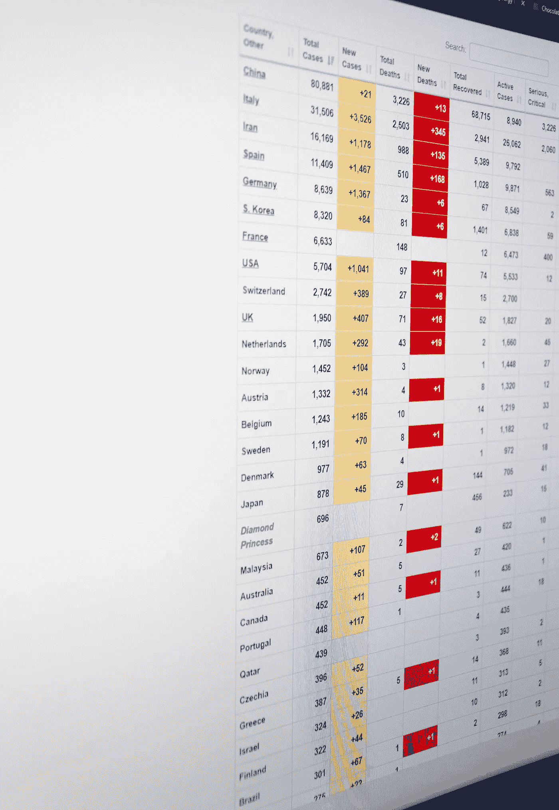

[克里斯汀·三都](https://unsplash.com/@lenscapewithme?utm_source=unsplash&utm_medium=referral&utm_content=creditCopyText)在 [Unsplash](https://unsplash.com/s/photos/statistics?utm_source=unsplash&utm_medium=referral&utm_content=creditCopyText) 上的照片

通过使用这些技术，我们可以预测以下事情

*   哪个客户会在下一期购买？
*   预计下一阶段前 N 名客户的购买量最大
*   客户会为我们的企业创造什么价值？

BG-NBD 模型将模拟每个客户的购买行为分布，并预测每个客户的预期交易数量。

Gamma-Gamma 子模型将模拟预期平均利润分布，并预测每个客户的预期平均利润。

# BG-NBD 模型

贝塔几何/负二项分布被称为 BG-NBD 模型。有时它也会出现为“买到死”。它给出了下一个周期的条件预期交易数。该模型可以回答以下问题

*   下周会有多少交易？
*   未来 3 个月内会有多少笔交易？
*   在接下来的 2 周内，哪些顾客会购买最多？

该模型通过使用概率来预测预期的交易数量，从而对两个流程进行建模

*   交易流程(购买)
*   辍学过程(直到你死)

## 交易流程(购买)

*   我们用这个来表示购买过程
*   在客户存活期间，将由客户产生的数量，将由交易率参数分配毒药
*   在客户存在期间，他们将按照自己的交易率进行购买
*   每个客户的交易率将会改变，并且它们将被分布为 gamma (r，α)

## 辍学过程(直到你死)

*   这意味着放弃购买
*   每个顾客都有自己的 p 概率辍学率
*   顾客将会以 p 的概率退出
*   对于每个客户，退出率会有所不同，对于大众，退出率将分布为 beta (a，b)

## 贝格-NBD 公式

我们在下面看到了 BG-NBD 模型的公式。

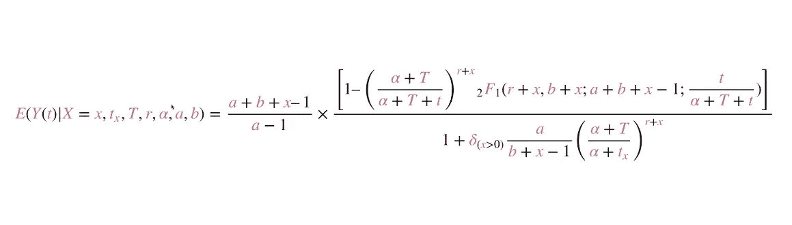

我将解释等式左边的参数。

*   `E`指预期值
*   `|`是指这个概率是有条件的(有条件的预期交易数)
*   `x`指每位顾客至少购买 2 次的频率。
*   `tx`指每个客户的新近度。在这种情况下，我们将假设新近性是基于周的。从最后一个采购日期到第一个采购日期的时间(周)。
*   `T`是指从今天到最后一个购买日期的时间(周)。
*   `r,α`来自伽马分布(购买过程)。**批量交易费率。**
*   `a,b`来自贝塔分布(直到你死的过程)。**群众的辍学率。**
*   `Y(t)`指每个客户的预期交易次数。

# 伽马-伽马子模型

我们使用这个模型来预测我们可以为每个客户赚取多少平均利润。在对大众的平均利润建模后，它给出了每个客户的预期平均利润。

*   客户的货币价值(客户交易金额的总和)将围绕其交易价值的平均值随机分布
*   客户之间的平均交易值可能会在不同时期发生变化，但对于客户来说不会发生变化
*   平均交易值将在所有客户之间分配

## 伽马-伽马子模型公式

我们看到下面的伽玛-伽玛子模型的公式。

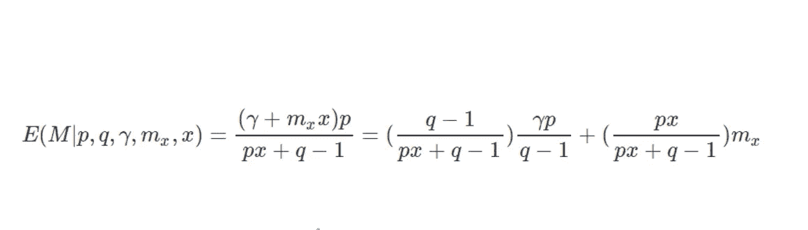

我将再次解释等式左边的参数。

*   `E`指预期值
*   `x`指每个客户的频率
*   `mx`指每个客户的货币
*   `M`指交易的预期价值(预期平均利润)
*   `p,q,γ`来自伽马分布

现在我们可以进入“应用示例”部分。

# Python 中的一个应用实例

在本节中，我们将使用[这个](https://www.kaggle.com/nathaniel/uci-online-retail-ii-data-set)数据集。还有，你可以从[这里](https://archive.ics.uci.edu/ml/datasets/Online+Retail+II)得到。正如我之前所说，我将在这里解释代码的含义，并将在 [Kaggle](https://www.kaggle.com/enesbaysan/customer-life-time-value-prediction-by-using-bg-nb) 上分享代码。

## 我们开始吧

我将导入下面的包。我们将使用`datetime`来创建`today_date`变量。该数据集包含 2009 年至 2011 年的数据。我将使用 2010-2011 年的表单。

```
import pandas as pd
import datetime as dt
from lifetimes import BetaGeoFitter
from lifetimes import GammaGammaFitter
```

我们将使用`lifetimes`包来使用统计模型。您可以在您的工作区中安装软件包，如下所示:

```
!pip install lifetimes
!pip install openpyxl
```

另外，我已经安装了用于读取 excel 文件的`openpyxl`包。

## 正在加载数据集

我已经把数据集上传到我的 Kaggle 工作空间了。

```
raw_data = pd.read_excel('../input/uci-online-retail-ii-data-set/online_retail_II.xlsx',sheet_name='Year 2010-2011')df = raw_data.copy()df.head()
```

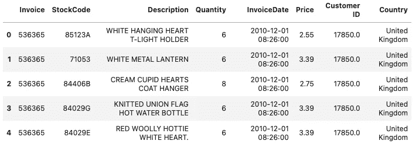

你可以学习下面的可变含义。

*   发票:发票编号。如果这个号码以“C”开头，就意味着这个交易取消了。
*   库存代码:产品代码
*   描述:产品名称
*   数量:产品数量
*   发票日期:交易日期
*   价格:单个产品价格
*   CustomerID:唯一的客户号
*   国家:客户的国家名称

## 数据准备

我将排除行中有`na`值的条目。之后，我将对数据集应用另一个过滤器。我还会选择发票列不是以“C”开头的数据。因为如果以‘C’开头，就说明这是一笔取消的交易。然后我将过滤`Quantity`列，并为每笔交易计算`TotalPrice`。

```
df.dropna(inplace=True)
df = df[~df["Invoice"].str.contains("C", na=False)]
df = df[df["Quantity"] > 0]
df['TotalPrice'] = df['Price'] * df['Quantity']
```

事实上，我们可以向数据集提出一些问题，我们可以从中获得一些见解，但我不会这样做。我想把重点放在主题上。

## 准备用于计算 CLV 的数据集

我要创造一个虚拟的约会。

```
today_date = dt.datetime(2011, 12, 11)
```

现在我需要计算统计模型的列。

```
cltv = df.groupby('Customer ID').agg({
    'InvoiceDate': [
        lambda x: (x.max() - x.min()).days,  *# recency*
        lambda x: (today_date - x.min()).days  *# T*
    ],
    'Invoice': lambda x: x.nunique(),  *# frequency*
    'TotalPrice': lambda x: x.sum()  *# monetary*
})
```

我需要修复数据集的列。Pandas 为它创建了基于级别的列，因为在`InvoiceDate`列中有 2 lambda 函数。此外，我将像统计模型使用的那样重命名列。

```
cltv.columns = cltv.columns.droplevel(0)

cltv.columns = ['recency', 'T', 'frequency', 'monetary']
```

我将计算每笔交易的平均收入。在这种情况下，我们将假设货币价值是每笔交易的平均收入。Gamma-Gamma 模型使用那样的`monetary`值。

```
cltv = cltv[cltv['monetary'] > 0]cltv['monetary'] = cltv['monetary'] / cltv['frequency']
```

我需要将基于 NG-NBD 模型的天数转换为周数。

```
*# transforming days to weeks*cltv['recency'] = cltv['recency'] / 7cltv['T'] = cltv['T'] / 7
```

我正在过滤掉大于 1 的`frequency`值。

```
cltv = cltv[(cltv['frequency'] > 1)]
```

## 创建 NG-NBD 模型

我将使用`lifetimes`包中的`BetaGeoFitter`。我将创建一个实例，并通过使用频率、新近度和 T 值来拟合它。

```
bgf = BetaGeoFitter(penalizer_coef=0.001)bgf.fit(cltv['frequency'], cltv['recency'], cltv['T'])
```

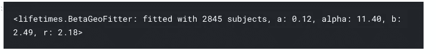

我们已经在上面创建了一个 NG-NBD 模型。现在我们可以预测一些期望值。我们将在下面看到一些问题示例。

*预计一周内购买量最大的前 10 名客户*

```
bgf.conditional_expected_number_of_purchases_up_to_time(1, *# week*
                                                        cltv['frequency'],
                                                        cltv['recency'],
                                                        cltv['T']).sort_values(ascending=False).head(10)
```

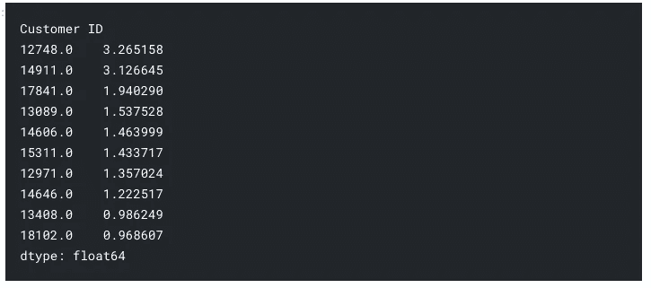

*预计一个月内购买量最多的前 10 名客户*

```
bgf.conditional_expected_number_of_purchases_up_to_time(4, 
                                                 *# 4 weeks = 1 month*
                                                        cltv['frequency'],
                                                        cltv['recency'],
                                                        cltv['T']).sort_values(ascending=False).head(10)
```

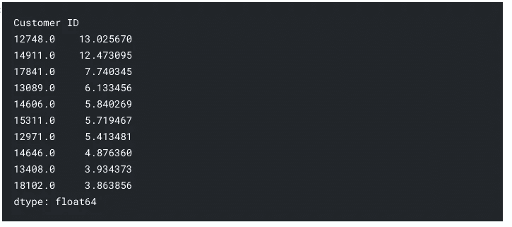

有一点很重要，我们不应该忽略。这种模式以星期为基础。因此，我们需要传递基于周的时间参数(函数中的第一个参数)。

*预计未来 6 个月购买量最大的前 10 名客户*

```
bgf.conditional_expected_number_of_purchases_up_to_time(4 * 6, 
                                           *# weeks * count = months*
                                                        cltv['frequency'],
                                                        cltv['recency'],
                                                        cltv['T']).sort_values(ascending=False).head(10)
```

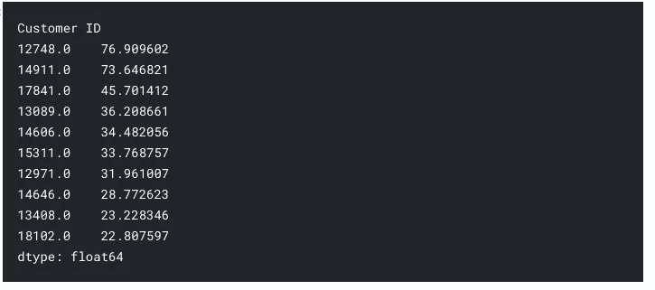

*未来 6 个月预计总交易数*

```
bgf.conditional_expected_number_of_purchases_up_to_time(4 * 6,
                                                        cltv['frequency'],
                                                        cltv['recency'],
                                                        cltv['T']).sum()
```

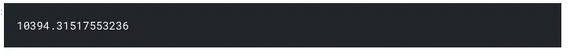

## 创建伽玛伽玛子模型

我将使用`lifetimes`包中的`GammaGammaFitter`。我将创建一个实例，并通过使用频率和货币值来拟合它。

```
ggf = GammaGammaFitter(penalizer_coef=0.01)

ggf.fit(cltv['frequency'], cltv['monetary'])
```

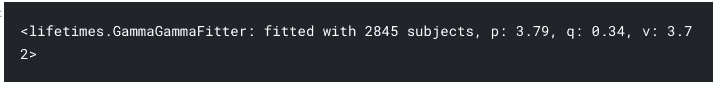

同样，我们可以通过使用如下模型来回答问题。

*预计最有价值的 10 大客户*

```
ggf.conditional_expected_average_profit(cltv['frequency'],
                               cltv['monetary']).sort_values(ascending=False).head(10)
```

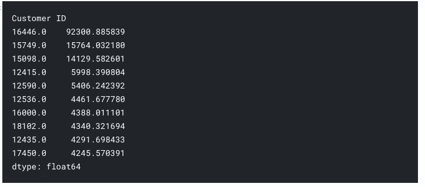

## 用 BG-NBD 和 Gamma-Gamma 模型预测 CLV

```
*# The customers' lifetime values expected to in the next 3 months*cltv['cltv_pred_3_months'] = ggf.customer_lifetime_value(bgf,
                                   cltv['frequency'],
                                   cltv['recency'],
                                   cltv['T'],
                                   cltv['monetary'],
                                   time=3,  *# 3 months*
                                   freq="W",  
*# frequency information of T. In this case we set week by using 'W'*
                                   discount_rate=0.01)cltv
```

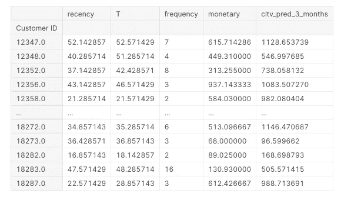

此外，如果我们愿意，我们可以利用客户的 CLV 价值观对他们进行细分。使用这些数据有助于采取行动。你可以在下面看到一个例子。

```
cltv['segment'] = pd.qcut(cltv['cltv_pred_3_months'],4,['D','C','B','A'])

cltv
```

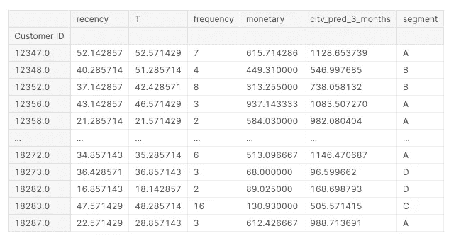

# 最后的想法

希望这是有帮助的，你喜欢它。我没有深究更复杂的统计数据。老实说，有时候对于一些没有数学基础的人来说，这可能太复杂了。然而，对于理解输入的人来说更容易。有一点很重要。我们学习了每个模型的输入。现在，我们可以区分 BG-NBD 模型和 Gamma-Gamma 模型之间的差异，并可以将这些模型用于我们的业务。

亲切的问候。