# 客户细分

> 原文：<https://medium.com/analytics-vidhya/customer-segmentation-23cb8dddb298?source=collection_archive---------17----------------------->

开发一个预测客户行为的模型，并将其应用于其他客户群。幸运的是，该模型将允许公司精心挑选最有可能购买该产品的客户，排除无响应者，从而使下一次活动利润丰厚。

该数据集包含约 2，240 名联系过的客户的社会人口统计和公司地理特征。此外，它还包含一个针对那些通过购买产品来响应活动的客户的标志。

*   在这个项目中，进行 RFM 计算是为了理解应该如何对客户进行分类。
*   然后使用朴素贝叶斯算法建立预测分类模型。

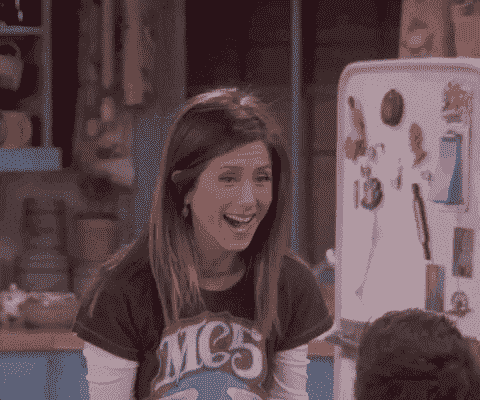

是的，我们将使用 RFM 分析和机器学习！

# 首先要做的是建立 RFM 代码

```
# value spent on products
dados$mont <- dados$MntFishProducts+dados$MntFruits+
              dados$MntGoldProds+dados$MntMeatProducts+
              dados$MntSweetProducts+dados$MntWines
# amount of purchases
dados$num <- dados$NumCatalogPurchases+dados$NumDealsPurchases+
             dados$NumStorePurchases+dados$NumWebPurchases
customers_RFM = sqldf(
    "SELECT ID,
            MIN(Recency) AS 'Recency',
            Sum(num) AS 'Frequency',
            SUM(mont) AS 'Monetary'
        FROM dados
        GROUP BY 1"
)
customers_RFM %>% 
  head(10) %>% 
      formattable::formattable()
```

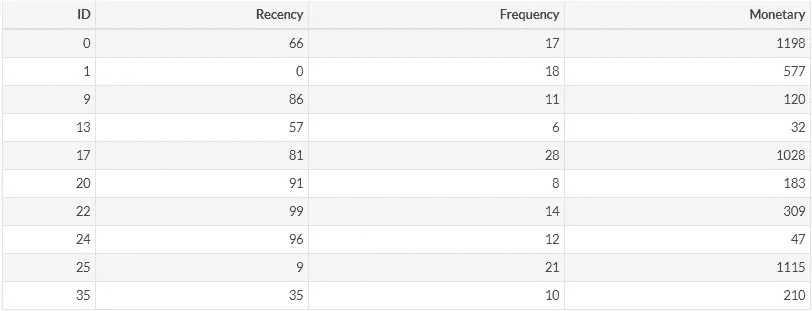

输出将是这样的

# 为了评估 RFM 参数的分布，我们可以使用直方图

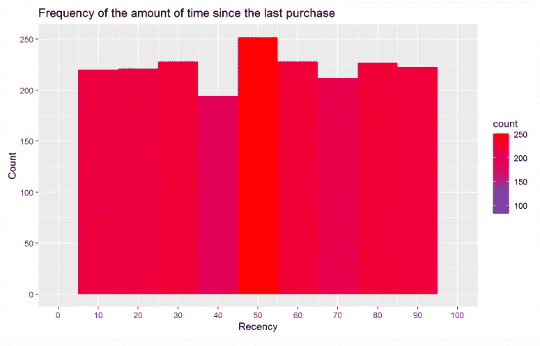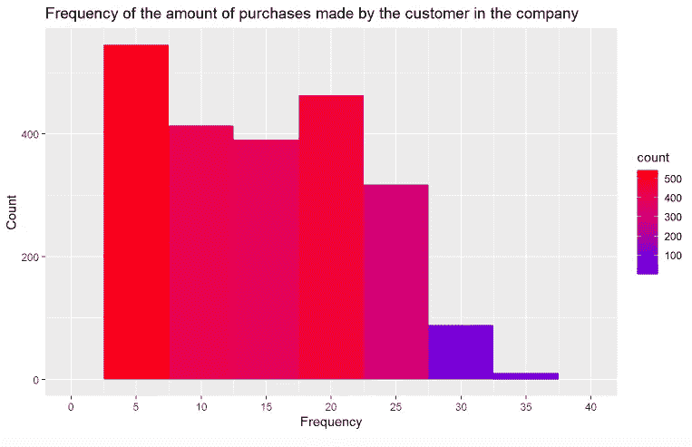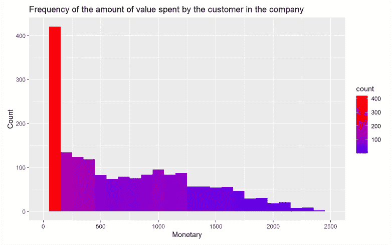

# 现在让我们看看百分位数

分析客户最后一次购买是多少天，我们可以看到:

*   过去 19 天购买的前 20 名客户；
*   接下来的 20%的客户购买时间在 19 到 39 天之间；
*   而最后 20%的顾客在超过 79 天的时间里没有进行任何购买。

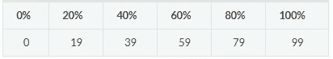

至于他们购买的频率，我们可以看到:

*   在审查期间，前 20 名客户购买次数超过 22 次；
*   以下 20%的客户购买次数在 17-22 次之间；
*   最后 20%的顾客在审查期间购买了 7 次。

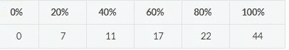

至于客户花费的金额，我们可以看到:

*   前 20 名客户平均消费超过 1174.00 美元(货币单位)；
*   接下来的 20%的顾客花费在 635.4 到 1174.00 美元之间，而最后的 20%的顾客平均花费不到 55.00 美元。

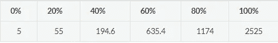

# RFM 分数

```
rfm_data <- customers_RFM
rfm_data <- rfm_data %>%
    mutate(
        R = ntile(desc(Recency), 5),
        F = ntile(Frequency, 5),
        M = ntile(Monetary, 5)
    )
rfm_data$RFM <- rfm_data$R * 100 + rfm_data$F * 10 + rfm_data$M
rfm_data %>% 
  head(10) %>% 
      formattable::formattable()
```

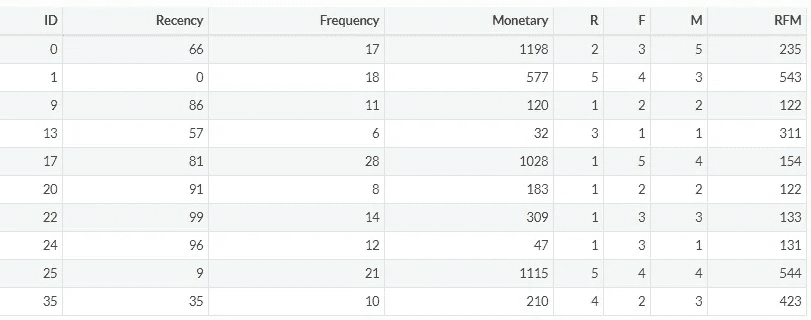

请注意，具有高 RFM 分数的客户对变量 Recency 的值较低，对变量 Frequency 和 Monetary 的值较高，例如 ID = 25，而具有低 RFM 分数的客户对变量 Recency 的值较高，对变量 Frequency 的值较高，例如 ID = 17。因此，对于具有中等 RFM 分值的客户，他们需要更仔细的分析。如下文将会看到的。

# 客户细分

```
rfm_data$segment <- NA
rfm_data$segment[which(rfm_data$RFM == 111)] <- 'Lost'
rfm_data$segment[which(rfm_data$RFM > 111)] <- 'Hibernating'
rfm_data$segment[which(rfm_data$RFM >= 222)] <- 'About to sleep'
rfm_data$segment[which(rfm_data$RFM >= 333)] <- 'Potential loyalist'
rfm_data$segment[which(rfm_data$RFM >= 444)] <- 'Champion'
# 2nd round
rfm_data$segment[which(rfm_data$segment == 'Potential loyalist' &
                           (rfm_data$F >= 4))] <- 'Loyal customer'
rfm_data$segment[which(rfm_data$segment == 'About to sleep' &
                           (rfm_data$M >= 4))] <-'Needing attention'
rfm_data$segment[which(rfm_data$segment == 'Hibernating' &
                           (rfm_data$F >= 4 & rfm_data$M >= 4))] <-'Can not lose them'
rfm_data[, -c(5, 6,7)] %>% 
    head(10) %>% 
    formattable::formattable()
```

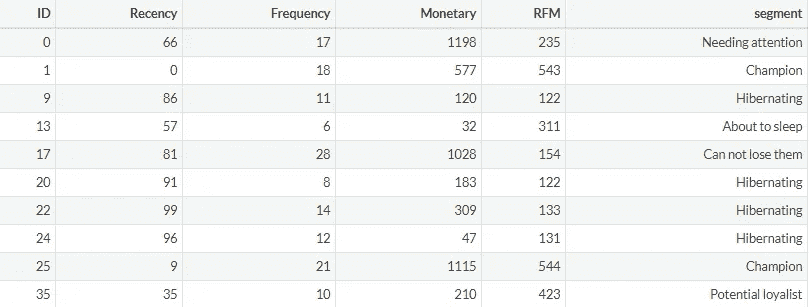

起作用了！！

# 客户的细分分布

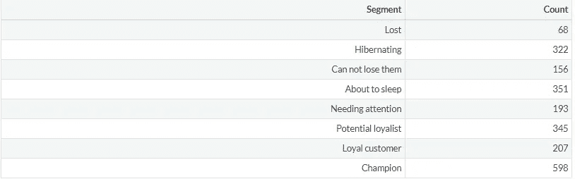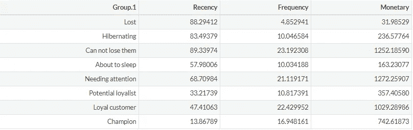

结果表明:

*   冠军客户(598)被认为是最有价值的客户，平均消费 743.00 美元，购买次数超过 17 次，平均最后一次购买是在 14 天前；
*   而丢失的情况是 88 天没有购买的最坏情况；
*   重点是需要关注的细分市场，因为他们的消费很高，但上次活动是在 2 个多月前。

# 数据可视化

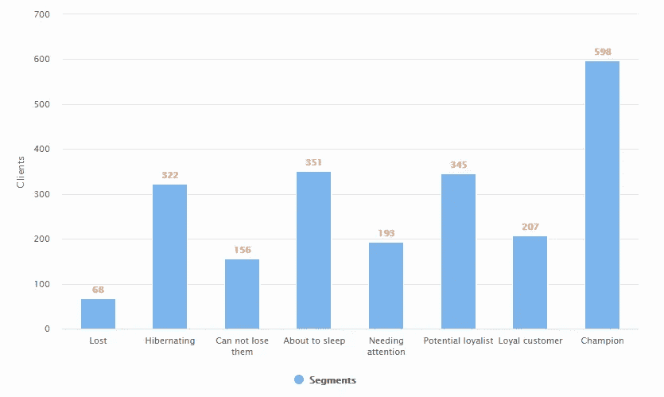

冠军细分市场中的客户被认为是最有价值的，即将入睡，需要关注，需要一些特殊的关注来拯救他们。

# 应用朴素贝叶斯算法

我选择了朴素贝叶斯算法，因为它忽略了变量之间的相关性，独立地对待每个变量。该算法实现起来也比例如 SVM 算法更快，并且不需要大量数据来进行分类。

```
# transforming categorical attributes, to be able to use the 
# machine learning algorithm

table(dados$Education)
unique(dados$Education)

dados$Education <- factor(dados$Education,
levels = c('2n Cycle','Basic', 'Graduation', 'Master', 'PhD'), 
labels = c(1,2,3,4,5))

dados[is.na(dados$Education)]
table(dados$Marital_Status)
unique(dados$Marital_Status)

dados$Marital_Status <- factor(dados$Marital_Status, 
levels = c('Single','Together', 'Married', 'Divorced', 'Widow', 
'Alone', 'Absurd', 'YOLO'), 
labels = c(1,2,3,4,5,6,7,8))

dados[is.na(dados$Marital_Status)]

# transforming the variable of interest into a factor
dados$Response <- as.factor(as.numeric(dados$Response))

# scaling numeric attributes
dados [ , 2] = scale(dados [ , 2])
dados [ , 5:25] = scale(dados[ , 5:25])

#train and test
set.seed(1)

# 75% because the database is not that big
divisao = sample.split(dados$Response, SplitRatio = 0.75)
base_treinamento = subset(dados[-1], divisao == TRUE) 
base_teste = subset(dados[-1], divisao == FALSE)
```

# 混淆矩阵

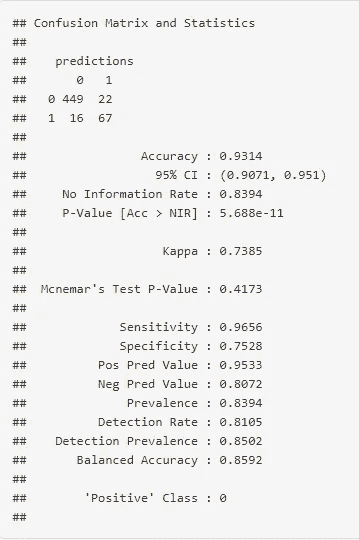

通过分析混淆矩阵，该模型正确地预测出 449 个客户没有购买该报价，67 个客户购买了该报价，结果准确率为 93.14%。

做预测

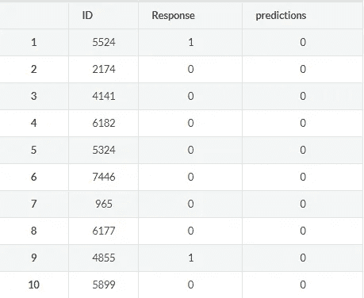

在前 10 个 id(客户)中，8 个分类正确，2 个分类不正确。

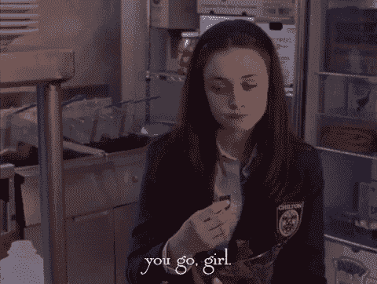

您可以在这里查看完整的代码:

[](https://github.com/rachderossi/data-analysis-R) [## GitHub-rachderossi/data-analysis-R:用 R 做的项目。

### 该数据集包含约 2，240 名联系过的客户的社会人口统计和公司地理特征…

github.com](https://github.com/rachderossi/data-analysis-R) 

再见，伙计们！