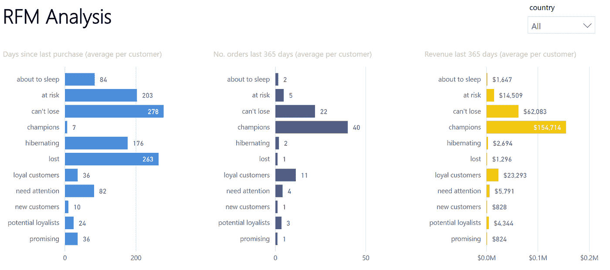
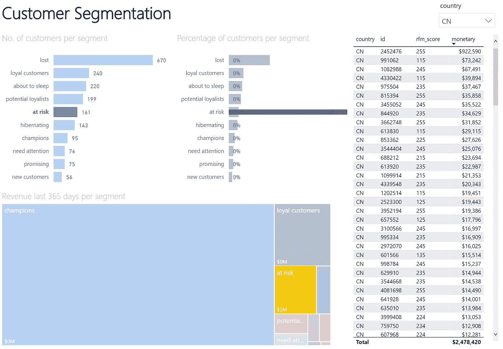

# 使用 Python 和 Power BI，通过 RFM 分析进行客户细分

> 原文：<https://medium.com/analytics-vidhya/customer-segmentation-analysis-with-rfm-using-python-and-power-bi-1a93e7938053?source=collection_archive---------1----------------------->


插图由 [vectorjuice / Freepik](http://www.freepik.com) 提供

这个项目的 Github 库可以在[这里](https://github.com/daniel-isidro/customer_segmentation)找到。

# 目录

*   介绍
*   方法学
*   要求
*   执行指南
*   数据采集
*   数据准备
*   原始数据描述
*   数据探索
*   建模
*   摘要
*   前端
*   结论
*   参考
*   关于我

# 介绍

在一家为几个国家成千上万的客户提供商品的公司工作时，我想**创造一个工具**，通过快速展示下一个要联系的客户，对这些国家的销售经理有用，以便**增加销售**和**客户保持**。这就是我对 RFM 分析的了解。

**RFM** 是一种用于分析客户价值的方法。它通常用于数据库营销和直接营销，在零售和专业服务行业受到特别关注。

这个项目的重点是对公司销售进行 RFM 分析，并创建一个**数据可视化仪表板**，展示**客户细分**，我可以与各国的同事分享。


# 方法学

使用包含一段时间内的**销售订单**的数据集，我们将使用 **Python** 来获取每个客户在过去 365 天内的**频率、最近度**和**货币**值。稍后，我们将根据这些值为每个客户给出 **R、F 和 M 分数**，这将允许我们将他们聚集在不同的**细分领域**。

# 要求

我们将使用[谷歌联合实验室](https://colab.research.google.com/) Jupyter 笔记本环境(免费)，Python 3.7 或更高版本，以及[微软 Power BI 桌面](https://powerbi.microsoft.com/en-us/downloads/)应用程序(免费下载，仅限 Windows)。

## Python 包

*   numpy
*   熊猫
*   数学
*   日期时间
*   数据准备
*   matplotlib

# 执行指南

要复制项目，请按顺序执行以下步骤:

1.  [**Jupyter 笔记本**](https://github.com/daniel-isidro/customer_segmentation/blob/main/code/customer_segmentation_asia.ipynb) 。运行此笔记本，将探索、准备数据，并执行 RFM 细分。输出将是一个 [CSV 文件](https://github.com/daniel-isidro/customer_segmentation/blob/main/output/rfm_asia.csv)。
2.  [**动力匕档**](https://github.com/daniel-isidro/customer_segmentation/blob/main/output/customer_segmentation.pbix) 。这是一个文件，它处理在上一步中获得的 CSV 文件，并将其显示为一个仪表板，以便可以在国家/地区的业务活动中加以利用。

# 数据采集

数据来源于大约两年时间内在 18 个国家的**实际销售订单**。为了保护隐私，一些功能(国家名称、客户 id 和收入)已被修改。订单数量、单位和日期未被修改。它被采集为一个 [CSV 文件](https://raw.githubusercontent.com/daniel-isidro/customer_segmentation/main/data/sales_asia.csv)。

# 数据准备

我们导入 CSV，并将其放入有熊猫的数据框中。根据领域知识，我们知道数据集的每一行都是不同的顺序。

`df1.head()`

此外，我们注意到日期被表示为一年中的第**周**，因此为了更好地分析，我们用 datetime 包将其转换为**年-月-日**格式。此外，根据 RFM 分析中的惯例，我们将“收入”重命名为“货币”。

`df2.head()`

# 原始数据描述

`df2.info()`

```
class 'pandas.core.frame.DataFrame';
RangeIndex: 235574 entries, 0 to 235573
Data columns (total 5 columns):
 #   Column    Non-Null Count   Dtype         
---  ------    --------------   -----         
 0   country   235574 non-null  object        
 1   id        235574 non-null  int64         
 2   monetary  235574 non-null  float64       
 3   units     235574 non-null  int64         
 4   date      235574 non-null  datetime64[ns]
dtypes: datetime64[ns](1), float64(1), int64(2), object(1)
memory usage: 9.0+ MB
```

`df2.describe()`

我们看到，在数据集中包含的时间段内，我们有 235，574 个交易和 5 列。最大成交 15 万台。但似乎也有同样数量的退货-150，000 件。最贵的一次购买是 241 万。

让我们查看数据集中包含的时间段:

`df2['date'].min()`

```
Timestamp('2019-01-07 00:00:00')
```

`df2['date'].max()`

```
Timestamp('2020-11-30 00:00:00')
```

让我们来看看这段时间我们在多少不同的国家有销售:

`df2['country'].unique()`

```
array(['KR', 'PK', 'MM', 'VN', 'IN', 'SA', 'PH', 'AF', 'CN', 'BD', 'ID', 'TH', 'IQ', 'MY', 'JP', 'IR', 'TR', 'UZ'], dtype=object)
```

使用 dataprep.clean 包，我们可以获得完整的国家名称:

`clean_country(df2, "country")['country_clean'].unique()`

```
array(['South Korea', 'Pakistan', 'Myanmar', 'Vietnam', 'India', 'Saudi Arabia', 'Philippines', 'Afghanistan', 'China', 'Bangladesh', 'Indonesia', 'Thailand', 'Iraq', 'Malaysia', 'Japan', 'Iran', 'Turkey', 'Uzbekistan'], dtype=object)
```

所有国家的客户总数:

`df2['id'].nunique()`

```
21837
```

# 数据探索

为了提高图中的可见性，我们将日期转换为月周期:

`df2c = df2b.to_period("M")`

`df2c.head()`

我们合计同期的单位和收入。

单位图表:

`df2c['units'].groupby('date').agg(sum).plot(figsize=(20,5));`


收入图表:

`df2c['monetary'].groupby('date').agg(sum).plot(figsize=(20,5));`


# 建模

## **转换数据以获得 RFM 值**

我们将转换数据，根据每位顾客的购买行为给他们打分。在此之前，我们将创建一些新的功能'新近'，'频率'，只要先前创建的'货币'功能。

**最近度**将是每个客户的最小“自上次购买以来的天数”。

**频率**将是每个客户在此期间的订单总数。

**货币**，将是每个客户在该期间的购买总值。

我们将关注最近 365 天以来的销售额。

**提示:**在几个国家/地区有相同“id”的客户。这导致货币价值的错误。我们将通过创建一个新特性来解决这个问题:一个结合了国家代码和客户 id 的唯一的“id+”标识符。

`df3['id+'] = df3['country'].map(str) + df3['id'].map(str)`

`df3.head()`

结果将是包含两个新列的 data frame:“recency”和“frequency”。

`rfm.head()`

# 计算 R、F 和 M 分数

不，我们将根据近期、货币和频率参数指定一个介于 1 和 5 之间的比率。我们将使用五分法，将每个要素分成包含 20 %样本的组。

较高的值更适合频率和货币，而较低的值更适合最近。这些将是分配给每个客户的 R、F 和 M 分数。

然后，我们连接 R、F 和 M 值，以获得每个客户的综合 RFM 得分。

`rfm.head()`

有了这个 rfm 分数，我们将拥有 **125 个客户群**，这对任何实际分析来说都太多了。为了获得更简单的分割，我们选择创建一个新的特征“fm ”,它是“f”和“m”分数的下舍入平均值。

`def truncate(x): return math.trunc(x)`

`rfm['fm'] = ((rfm['f'] + rfm['m'])/2).apply(lambda x: truncate(x))`

然后，我们仅基于两个分数“r”和“fm”创建一个仅包含 **11 个片段**的片段图。我们为每个客户分配不同的细分市场。

# 摘要

在合计每个客户的销售额、频率和最近值，并根据这些值分配“r”、“f”和“m”分数后，我们给每个客户一个不同的细分标签。让我们来看看这些片段是什么意思。

## **分段描述**

*   **冠军**最近买的，经常买，花的最多
*   **忠诚的顾客**定期购买。对促销有反应。
*   **潜在忠诚客户**平均频率的近期客户。
*   **最近客户**最近购买，但不经常购买。
*   **前途光明**最近的购物者，但还没花多少钱。
*   **需要关注的客户**高于平均近期、频率和货币价值。可能不是最近才买的。
*   **即将入睡**低于平均新近度和频率。如果不重新激活，将会丢失它们。
*   **有风险**经常购买，但时间久远。需要把他们带回来！
*   **不能丢**以前经常购买但很久没回过。
*   **冬眠**上次采购是长退，订单数量少。
*   **丢失了很久以前购买的**再也没有回来。

## 探索客户群

我们可以在数据框中显示一些客户群。

**不能输**

`rfm[rfm['segment']=="can't lose"].sort_values(by='monetary', ascending=False).head()`

**忠实客户**

`rfm[rfm['segment']=='loyal customers'].sort_values(by='monetary', ascending=False).head()`

**冠军**

`rfm[rfm['segment']=='champions'].sort_values(by='monetary', ascending=False).head()`

**需要关注的货币超过平均值的客户**

`rfm[(rfm['monetary']>rfm['monetary'].mean()) & (rfm['segment']=='need attention')].sort_values(by='monetary', ascending=False).head()`

让我们做一个散点图来探索客户的分布，x 轴是“最近”, y 轴是“频率”。使用“货币”值作为积分的大小，我们看到大多数花费最多的顾客最近也购买了**和**。****

********

****最后，我们将数据帧导出到一个 CSV 文件，以便稍后在 Power BI 中进行处理。****

****`rfm.to_csv('rfm_asia.csv', encoding='utf-8', index=False, float_format='%.2f')`****

# ****前端****

****这个项目的前端由一个 **Power BI 仪表板**组成，它处理执行前面的 Python 代码产生的 CSV，并在一个令人满意的仪表板中可视化结果。然后，该仪表板可以作为 web 应用程序与公司不同国家的同事共享。你可以在这里访问文件[来探索它。](https://github.com/daniel-isidro/customer_segmentation/blob/main/output/customer_segmentation.pbix)****

****************

****我们观察到，我们的许多客户(32 %)是**失去**或**冬眠**(他们有一些很久以前的订单)。然而，我们 28 %的客户要么是**冠军**要么是**忠实客户**，这意味着他们花钱最多、最频繁。需要注意的一个细分市场是**不能失去**，这是收入最高的第二个细分市场，由过去花费很多但有一段时间没有回来的客户组成。****

# ****用户手册****

****我们可以与我们的国家销售经理共享仪表板，这样他们就可以在不同的细分市场上找到客户 id，并对其采取特定的行动。让我们来看一个例子:我的中国同事需要有人指导他接下来应该联系哪些客户，以**提高客户保持率**或**增加销售额**。他们只需打开这个控制面板，点击国家(右上方)，然后点击客户群**需要关注**或**风险**的**，就可以获得一个特定的客户列表，按过去 365 天的收入支出排序。(未经编辑的数据集还将包括客户姓名和联系方式，出于隐私原因，此处省略了这些内容)。******

****************

****仪表板的最后一个选项卡中包含了 11 个细分市场的**参考指南**和每个细分市场的建议行动。****

********

# ****结论****

******在销售中使用 **RFM** 方法的客户细分**是帮助员工集中精力的有效方法，通过**优先锁定客户**并对他们采取不同的行动。****

**这种项目**灵活**因为分段的数量可以适应业务需要，并且分析中的时间段也可以延长或缩短。**

**对于已经在微软生态系统中工作的公司来说，使用 Power BI 在企业环境中将仪表板作为 web 应用程序与同事共享非常方便。**

# **参考**

**[**纪尧姆·马丁** — RFM 用 Python 分段](https://guillaume-martin.github.io/rfm-segmentation-with-python.html)**

**[**谷歌云** —用 AI 平台预测客户终身价值](https://cloud.google.com/architecture/clv-prediction-with-offline-training-intro#overview)**

# **关于我**

**在[领英](https://www.linkedin.com/in/daniel-isidro/)更了解我。**