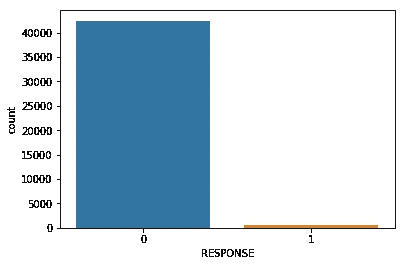

# Arvato 金融服务的客户细分和分类

> 原文：<https://medium.com/analytics-vidhya/customer-segmentation-and-classification-for-arvato-financial-services-30568b3e8b9c?source=collection_archive---------7----------------------->

在 Udacity 数据科学家 Nanodegree 的框架下，我选择了最终的顶点项目，在这个项目中，我需要使用德国贝塔斯曼 Arvato Analytics 公司提供的真实数据。包含所有分析步骤的 github repo 可以在[这里](https://github.com/voskresenskiy/arvato_capstone)找到。

图片来源:[https://medium . com/@ mbektas/customer-segmentation-with-clustering-algorithms-in-python-be2e 021035 a](/@mbektas/customer-segmentation-with-clustering-algorithms-in-python-be2e021035a)

该项目包括三个主要挑战:

1.  使用 Arvato 的数据和德国人口统计数据，并采用无监督学习的方法，我需要识别 Arvato 客户数据库的细分，并描述德国人口的哪些部分在 Aravato 数据集中得到了很好的代表，哪些部分没有得到充分代表。
2.  我需要制作一个分类模型，预测哪些客户会对 Arvato 发起的邮寄活动做出回应。
3.  最后，我被期望向 Kaggle 提交我的预测，并与 Udacity 的其他学生竞争。

正如我在文章开头提到的，我得到了真实的原始数据。因此，在应用无监督和有监督模型之前，我需要清理这些数据，并彻底记录一些特征。

# 预处理

## **识别和记录缺失值**

所有预处理步骤都应用于两个数据集:包含客户数据的数据集和德国人口数据集。两者的特征数量几乎相同(第一个中有 369 个，第二个中有 366 个)，而观察数量却有很大差异(客户数据包含 191652 行，人口统计数据包含 891221 行)。我还获得了两个数据集，这两个数据集为我提供了有关要素代表什么(数据集“属性”)以及这些要素中缺失的值如何编码(数据集“值”)的信息。在调查数据集的“属性”后，我发现它并不包含我的主数据集中所有要素的信息。因为我的项目的第一个任务是描述客户的细分，所以我不能使用没有描述的功能。因此，我从客户和人口统计数据中删除了所有未描述的特征。去掉它们后，我有 272 个特征。

下一步，我需要识别数据集中所有缺失的值。主要问题是要素之间缺失值的编码方式不同。例如，图 1 显示，在变量“阿格 _TYP”中，缺失值可以标记为“-1”，而“0”代表变量“ALTER_HH”中的缺失值。因此，我需要找到每个变量的缺失值，然后将它们重新编码到 NaN 中，以便进行进一步的分析。

图一。数据集“值”中不同要素的值的编码

为了简化数据集“值”的工作，我确定了所有具有“未知”或“不可检测”含义的值，并为每个特征连接它们。图 2 显示了分组和连接过程后缺失值的信息。

图二。对每个要素的缺失值进行分组和连接

之后，我可以识别每个变量中所有缺失的值，并将它们重新编码为 nan。

## **删除有许多缺失值的行和列**

记录缺失值后，我可以找到那些应该从数据集中删除的列和行，因为它们有太多的缺失值。首先，我计算了两个数据集中有多少列缺少值。根据图 3 和图 4(其中 X 轴代表缺失值的百分比，Y 轴显示列数)，我们可以看到包含客户数据的数据集中的列缺失值更多。

图 3。人口统计数据中缺少值的列的分布

图 4。客户数据中缺少值的列的分布

我选取了缺失 30%客户数据和 20%人口统计数据的列。然后，我比较了这两个集合中的列，发现它们几乎完全相同；对于这些集合，只有三列是独特的。我从两个集合中选择了重叠的列，并将它们从人口统计数据和客户数据中删除。之后，我有 229 个特征供进一步分析。

对行进行了类似的分析。图 5 和图 6 显示了两个数据集中缺失值的分布(X 轴表示缺失值的数量，Y 轴表示行数)。

图 5。人口统计数据中行缺失值的分布

图 6。客户数据中缺失值行的分布

根据这些图表，大多数行都很好，但是有些行遗漏了很大一部分值。我认为 50 个缺失值应该是删除行的合理阈值。为了决定删除行(基于选择的阈值)是否是一个好主意，我将每个数据集分成两组:第一组只包含那些丢失值少于定义的阈值的行，第二组包含其他行。然后，我比较了一些列(没有缺失值的列)中的值在这两组之间的分布情况。如果分布差别不大，我可以随意删除那些超过阈值的行。在相反的情况下，删除这些行将是危险的，因为我将丢失数据中的一些重要信息。

图 7 展示了一个比较人口统计数据中某一列的值分布的示例；左图显示了没有缺失值的组，右图显示了缺失值的分布。

图 7。删除了行的数据集中的列(左图)和只删除了行的数据集中的列(右图)的观察值分布

正如我们从图表中看到的，各组的值的分布差异很大，所以放弃所有这些值是很危险的。

## **记录分类变量**

在下一步的数据准备中，我需要重新编码一些变量，并删除多余的变量。我在这里描述我的主要行动:

*   二进制分类变量“OST_WEST_KZ”代表客户居住的德国地区，它被转换为虚拟变量。
*   混合变量“PRAEGENDE _ JUGENDJAHRE”包含客户出生的十年信息，并显示客户是否参与了任何政治运动。因此，这个变量被转换成两个新的变量:序数数字变量“decade”(具有以下代表十进制的值:40、50、60、70、80、90)和二进制数字变量“movement”(其中 1 代表参与运动，0 表示没有这种经历)。
*   我发现数据集包含相似的变量，但粒度不同。粒度较小的变量标记为“GROB”，粒度较大的变量标记为“FEIN”。FEIN 的变量被移除了。

# 客户细分

## **降维**

为了在最终报告中对用户进行细分，我需要对数据集应用聚类算法。但是，我有太多的特征，为了使聚类更加健壮，我决定在此之前应用一个维度算法 PCA。在使用主成分分析之前，我用标准缩放器重新缩放了所有特征，并用每个特征的最频繁值来估算缺失值。

对 PCA(图 8)输出的分析表明，80 个前成分解释了人口统计学数据中 80%的数据差异。通常，80%的方差对于进一步的分析是绰绰有余的。

图 8。按主成分分析的累计解释差异

因此，我创建了一个 PCA 模型，将原始数据转换成 80 个主成分，并将其应用于人口统计数据。由于分析的主要目标是了解哪些德国公民群体在客户群中代表过多和代表不足，我需要解释主成分抓住了哪些确切的人口统计特征。为此，我采用了前三个组成部分，并探索了哪些特征与这些组成部分中的每一个正相关或负相关。

**第一个组件**

图 9。与第一个组件具有最大正相关和最大负相关的特征

根据图 9，我可以说第一部分代表了生活在良好社区的高收入人群。他们是有房一族或高收入者(LP_STATUS_GROB)，拥有相对昂贵的汽车(相当于 Gelendwagen 或宝马)。这些人的另一个重要特征是他们不容易流动，而是定居在他们的所在地(MOBI 地区)。与特征 plz 8 _ ant G1(plz 8 中 1-2 个家庭住宅的数量)的高度相关性告诉我们，这些人居住在城市之外，并拥有 1 或 2 个家庭的私人住宅。

**第二个组件**

图 10。与第二个组件具有最大正相关和最大负相关的特征

第二个组成部分(图 10)也代表来自上层阶级的人，但是，与第一个组成部分相比，他们生活在大城市(我是基于与 PLZ8_ANTG1 的负相关性和与 EWDICHTE(每平方公里的居民密度)的高度正相关性得出这个结论的)。此外，该分量与 INNENSTADT 特征的负相关性告诉我们，这些人在某种程度上生活在大城市的中心。与 KBA13_HERST_BMW_BENZ 和 KBA13 _ SEG _ OBEREMITTELKLASSE 的高度相关性告诉我们，人们拥有相当昂贵的汽车，并且与上层阶级有关。

**第三个组件**

图 11。与第三个组件具有最大正相关和最大负相关的特征

第三个组成部分(图 11)代表老年人(altersketoporie _ GROB)，他们有经济困难(FINANZ_VORSORGER)，不倾向于参加不同的活动(SEMIO_ERL)，没有自我意识(SEMIO_LUST)，而是传统意识(SEMIO_PFLICHT)，宗教(SEMIO_REL)。

## **聚类**

在将原始特征转换成 80 个组件之后，我转到了最重要的分割分析部分——聚类。我选择了 K-means 聚类算法，因为它可以很好地处理具有许多特征的数据集。在应用该算法之前，我在 t-SNE 的帮助下可视化了数据，这是允许可视化高维数据的最佳算法之一。由于我的机器的计算能力有限，我将 t-SNE 应用于随机选择的 50000 份人口统计数据。

图 12。从人口统计学数据中随机选择 50000 个观察值的 t-SNE(应用 PCA 后)

图 12 显示了数据不是很集中:我们有一个巨大的集群，另一个集群是两倍甚至三倍小，还有一个非常小的集群。

我还计算了不同数量的聚类的 K 均值得分(肘方法)和轮廓系数(图 13 和 14)，基于它们(尤其是基于轮廓系数)，很明显数据由三个主要聚类组成。

图 13。确定聚类数的肘方法

图 14。确定聚类数的剪影系数法

PCA 和 K-means 也应用于客户数据，我最终可以比较与确定的聚类相关的用户比例在 Demogpaphics 和客户数据集之间有何不同。通过将数据与前三个组件和聚类结果结合起来，我可以解释这些用户组。

图 15。与人口统计学和客户数据集中确定的聚类相关的用户比例

图 15 中的图表显示，在客户的数据集中，有两个聚类几乎相等，甚至过多:第一个和第三个聚类-第一个聚类代表居住在高度城市化地区的上层阶级市民。第三类代表住在城市之外的上层阶级，他们的特点是流动性低。同时，第二个集群在客户数据中的代表性相对不足。这一群人大多是有宗教信仰的，没有自我意识的老年人，他们有经济困难，也不愿意参加不同的文化活动。

因此，这种无监督的学习方法使我能够识别 Arvato 客户的主要细分市场，并根据人口统计数据集的数据，描述哪些客户群体的代表性过高或过低。

# 反应的预测

在分析的最后一部分，我面临的任务是建立一个分类模型，预测客户是否会对邮寄活动做出回应。我得到了 train 数据集，它与我在本文前面部分中使用的数据集具有相同的列。这个数据集有一个新的变量——响应；这个是我需要预测的因变量。测试数据集没有这个变量，是为 Kaggle 上的进一步竞争准备的。

## 韵律学

首先，我需要定义一个度量标准，基于这个标准我可以评估我的模型的质量。我调查了变量响应，发现它非常不平衡；它几乎没有积极的回应(图 16)。这就是为什么使用准确性度量来评估最终模型的质量没有多大意义。准确性总是会给出一个很好的分数(不管模型的质量如何)，因为它预测了过度代表的类。为了评估，我采用了 AUC 分数，它代表了对于随机选择的观察正确区分一个类别的概率。

图 16。变量响应的两个值之间的观测值分布

## 预处理

在预处理方面，我重复了与分析的前一部分相同的步骤。唯一的变化与删除具有许多缺失值的列有关。由于分类任务不需要关于变量的所有信息，所以我使用了所有变量，不管它们是否在附加文件中有描述。因此，我需要稍微重写用 nan 替换缺失值的函数。如果变量在值数据集中，新函数的作用与旧函数相同。如果某个变量不在数据集中，该函数会将所有字符串值重新编码为 nan。这是一种非常粗略的重新编码方式，我假设不是所有丢失的值都被重新编码，但这是我在这种情况下唯一能做的事情。最后，我有 323 个特征用于进一步分类。

## 模型评估和验证

对于这个任务，我试验了五种分类算法:随机森林、逻辑回归、自适应增强、梯度增强和 LGBM。首先，我用默认参数实现了这些算法。这样做是为了确定进一步调优的最佳算法。梯度增强给出了最好的 ROC AUC 分数:0.75。

选择梯度推进算法进行预测。然后，我在 GridSearchCV 的帮助下对模型的参数进行了一些调整。我检查了不同学习率(0.001，0.005，0.01，0.1)和不同估计数(200，300，400)下 ROC AUC 分数的变化。对于有 300 个估计器和学习率等于 0.01 的模型，我得到了最好的结果(0.76)。

尝试更多的参数可以帮助我找到一个更健壮的模型。尽管如此，由于网格搜索的高计算复杂度和我的机器的计算能力的限制，我被迫使用相当有限的一组参数。同时，我们可以看到，最佳参数并不是学习率和估计量列表中的边界参数。因此，我假设这些列表的扩展不会导致模型有更好的性能。

我还试图借助名为 SMOTE 的过采样方法来解决不平衡的问题。SMOTE 的思想是，这种方法人为地向代表性不足的类合成新的例子。过采样后，参数最优的梯度推进模型达到了 0.98 的分数。

这两个模型(具有最佳参数的“正常”模型和具有最佳参数的过采样模型)用于 Kaggle 上的最终比赛。“正常”模型得分为 0.79666，而过采样模型得分为 0.67(图 17)。与训练数据集的预测相比，此结果要差得多。我假设这种差异是由于过度拟合而产生的。

图 17。我在卡格尔比赛中的最终得分

# 理由和结束语

这是一个令人兴奋和具有挑战性的项目。我可以在对数据分析师来说非常重要的所有领域练习我的技能:原始数据清理和重新编码、无监督学习方法的应用、有监督学习算法帮助下的二进制分类。

在当前项目中，我需要应对两个主要挑战:客户的细分(与描述客户区别于德国一般人群的主要特征相关)和分类模型的开发，该模型预测哪些客户会对邮件活动做出响应。我相信我能解决这两项任务。首先，通过使用无监督的机器学习方法，我可以有效地识别客户的主要聚类，并在客户数据和一般人群数据之间进行比较分析。根据我的研究，Arvato Analytics 可以调整其营销策略，以改善与其数据库中代表性不足的人的沟通。第二，我应用了一些特征工程和清理技术，这使我能够开发一个非常好的分类模型，Arvato 可以用它来预测更倾向于对邮件活动做出响应的客户。

毫无疑问，分析的某些部分可以改进。如果我继续从事这个项目，我将做以下事情:

1.  设计新功能。我创造了一些新功能，但我确信数据为不同变量的实验提供了更多的可能性。有了新功能，我可以在 Kaggle 排行榜上获得更好的位置。
2.  改进对集群的解释。当然，PCA 是一种非常有用的技术，它允许对高维数据进行聚类，但是，同时，它使得对聚类的解释更加困难。到目前为止，我是基于三个主要组件来解释集群的，但是我认为可以有更好的方法来做到这一点。
3.  尝试其他聚类算法。如分析所示，K-means 在识别这种数据的正确聚类数方面存在问题。至少，流行的肘法很难解释。在进一步的工作中，我将检查其他聚类算法是如何工作的。
4.  尝试更多不同的分类算法，并尝试调整除估计器数量和学习速率之外的其他参数。不幸的是，我没有足够强大的机器来组织更有效的 GridSearchCV 工作，但这听起来像是对未来工作的一个很好的挑战。
5.  使用其他方法“平衡”不平衡的数据集。SMOTE 不是修复不平衡的唯一方法，尝试替代方法会有所帮助。这可能会带来更好的预测结果。

# 有用的来源

[在 Python 中使用 PCA 和 t-SNE 可视化高维数据集](https://towardsdatascience.com/visualising-high-dimensional-datasets-using-pca-and-t-sne-in-python-8ef87e7915b)

[从零开始实现 K-means 聚类——在 Python 中](https://mmuratarat.github.io/2019-07-23/kmeans_from_scratch)

[机器学习中处理不平衡类的 10 个技巧](https://www.analyticsvidhya.com/blog/2020/07/10-techniques-to-deal-with-class-imbalance-in-machine-learning/)