# 金融服务的客户细分

> 原文：<https://medium.com/analytics-vidhya/customer-segmentation-for-financial-services-58fbfc417669?source=collection_archive---------2----------------------->

这是一篇面向技术受众的博客文章，总结了我在 Udacity 的数据科学家 Nanodegree 的最终顶点项目上的工作。

客户细分是根据共同特征将客户分成不同群体的过程，这样公司就可以有效而恰当地向每个群体进行营销。根据客户在行为和习惯上的相似性对他们进行细分。

在这个项目中，我将分析德国一家邮购销售公司客户的人口统计数据，并将其与普通人群的人口统计信息进行比较。我将使用无监督学习技术来执行客户细分，确定最能描述公司核心客户群的人群部分。然后，我会将您在第三个数据集上所学的知识应用于公司营销活动目标的人口统计信息，并使用一个模型来预测哪些人最有可能转化为公司的客户。

博客部分:

*   商业案例
*   数据探索和预处理
*   无监督模型
*   监督模型
*   结果-结论
*   参考

# 1-商业案例

每个公司的主要目标是找到合适的客户。找到合适的客户群可以让公司在营销费用和销售回报方面实现盈利。在这个项目中，我的目标是通过比较现有客户和德国人的人口统计数据来找到合适的客户群。

# 2-数据探索和预处理

## 数据文件

*   Udacity_AZDIAS_052018.csv:德国一般人口的人口统计数据；891 211 人(行)x 366 个特征(列)。
*   Udacity_CUSTOMERS_052018.csv:邮购公司客户的人口统计数据；191 652 人(行)x 369 个特征(列)。

除了数据，还提供了描述数据的两个文件:

*   DIAS Attributes-Values 2017 . xlsx:列的数据字典，包括描述、可能的值以及这些值的含义。
*   DIAS 信息级别— Attributes 2017.xlsx:表示每一列的信息级别(个人、家庭、建筑等)

在数据预处理阶段处理缺失数据和分析模型结果时，我们都将使用这两个文件。

## 数据类型警告

两个数据集中的列' CAMEO_DEUG_2015 '，' CAMEO_DEUINTL_2015 '包含字符串和整数值。此外，应该为 nan 的值被定义为“X”。我去掉了这些，使这两列没有错误。

## 漏测值

当我们检查数据集时，我们发现没有丢失数据的列号如下:

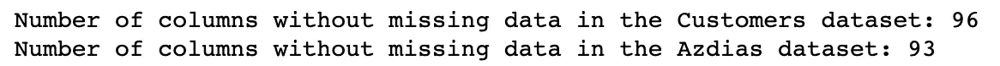

只有 25%的数据集填充了所有列。您可以从下图中检查剩余 75%的一部分。我们可以清楚地看到，ALTER 列中几乎没有数据。但是在缺失的数据中我们还需要解决一个步骤。

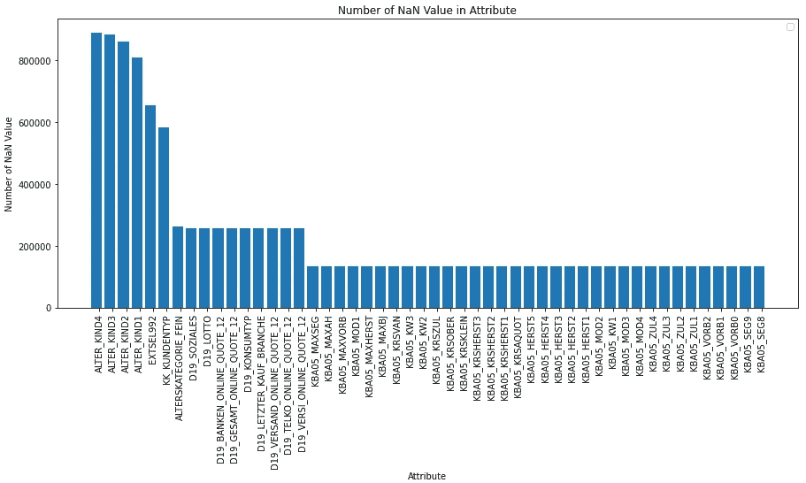

通过检查属性文件，我们发现哪些列包含未知值，并用 NaN 值替换这些列。

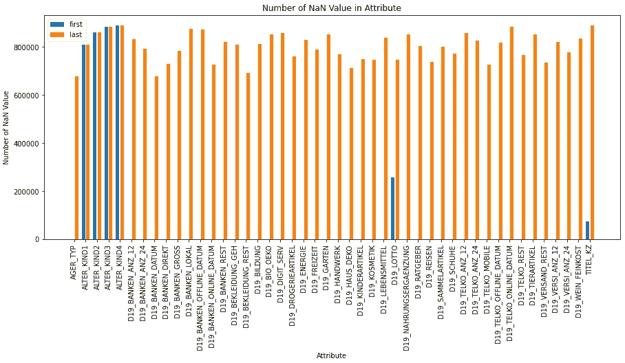

从图中可以看出，与原始状态相比，丢失数据的实际数量相当高。

现在我们已经找到了记录的实际数量，我们可以检查每一列的缺失数据率:

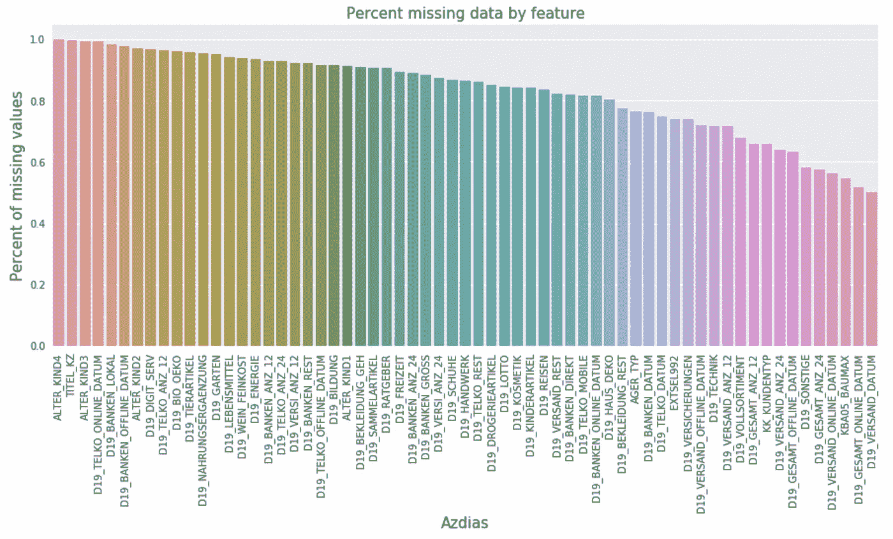

我们删除数据集中缺失数据超过 75%的列。在文献中，这个比例是 2/3。

大多数行缺少的值少于 50 个。所以 50 是个不错的门槛。

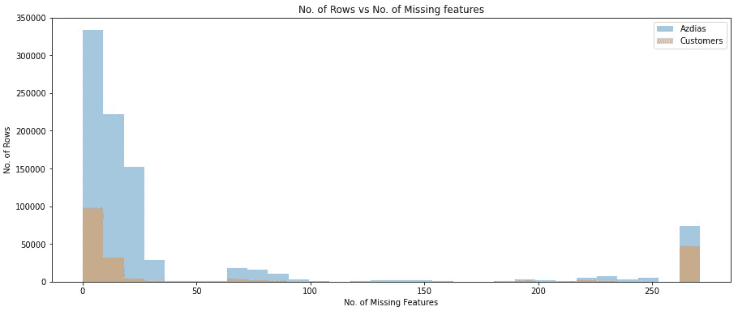

因此，如果一行中缺少的列数少于 50，我就删除该行。

## 分类数据

我们有包含 4 个分类数据的列:

*   D19_LETZTER_KAUF_BRANCHE —表示最后一个采购部门。
*   CAMEO_DEU_2015 —表示它所属的特殊组。
*   EINGEFUEGT_AM —数据插入日期。
*   OST_WEST_KZ —表示前民主 FRG 的旗帜。

由于 CAMEO_DEU_2015 和 D19_LETZTER_KAUF_BRANCHE 列包含非常详细的信息，我们将放弃这些列以简化我们的模型。

在 EINGEFUEGT_AM 列中只使用 year 列是简化模型的一个好方法。

OST_WEST_KZ 列似乎很适合编码。

## 输入数据

直到我们到了这个阶段，我们删除了许多列，丢失了数据。但是仍然有缺失的数据，如上图所示。现在该填这个数据了。缺失数据通常用平均值或最常见的值来填充。

我们通过分配最常见的数据来填充缺失的数据，这是最适合人口统计数据的方法。

现在我们不再有任何缺失值。

## 标准化数据

还剩下最后一步来完成数据预处理步骤。为了使我们的模型不受不同值的影响，我们用标准化方法压缩了[-1，1]之间的所有值。因此，该模型将不会受到非常大或非常小的数据值的影响。

# 3-无监督模型

我们使用无监督学习技术来描述公司当前客户的人口统计数据与德国一般人口之间的关系。

## 维度缩减

进行主成分分析(PCA)是因为大量的特征以及其中许多特征提供几乎相同的信息的事实。对于客户细分任务，将使用聚类算法，但这些算法在具有大量特征的情况下运行非常缓慢。

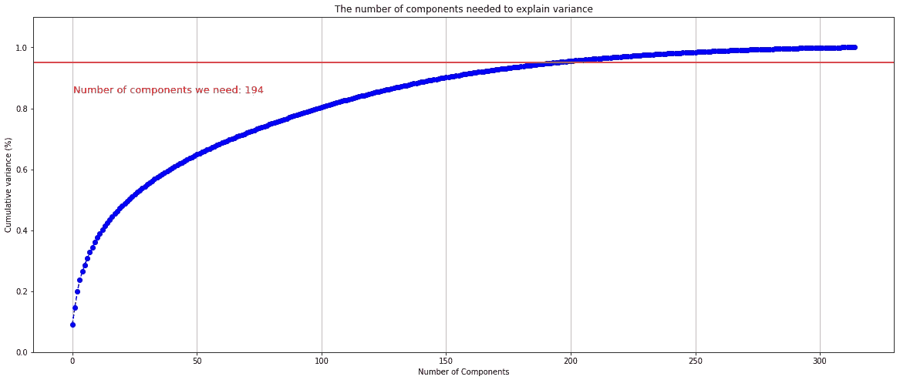

根据累积方差解释图，确定在 95%时，解释方差的增益稳定。这发生在 194 个主成分上。

## PCA 解释

**第一主成分**

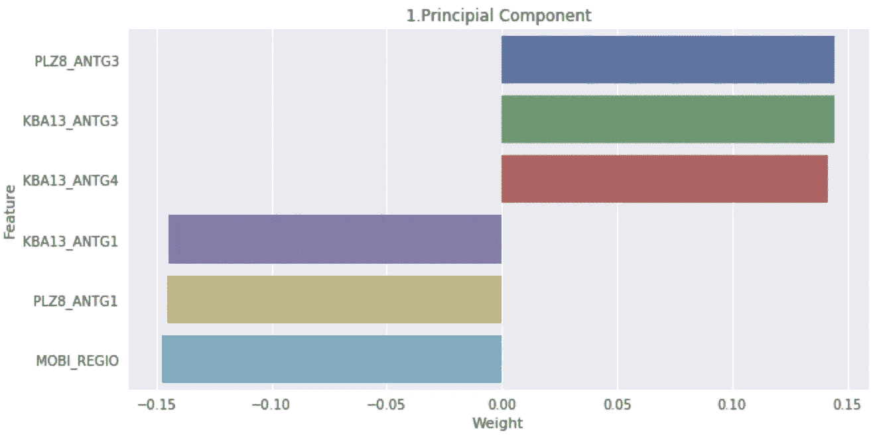

最高:

*   PLZ8_ANTG3 是 PLZ8 中 6-10 户家庭住宅的数量(3 =高份额)
*   KBA13_ANTG3 是小区中 6-10 户家庭住宅的数量(3 = 6-10 户家庭住宅的高份额)
*   KBA13_ANTG4 是小区中> 10 户家庭住宅的数量(2 = > 10 户家庭住宅的高份额)

最低:

*   KBA13_ANTG1 是小区中 1-2 户家庭住宅的数量(4 = 1-2 户家庭住宅的比例非常高)
*   PLZ8_ANTG1 是 PLZ8 中 1-2 户家庭住宅的数量(1 =非常高)
*   MOBI 地区是流动模式(1 =非常高)

**1。主成分是房屋中共有家庭数量的指标。**

**第二主成分**

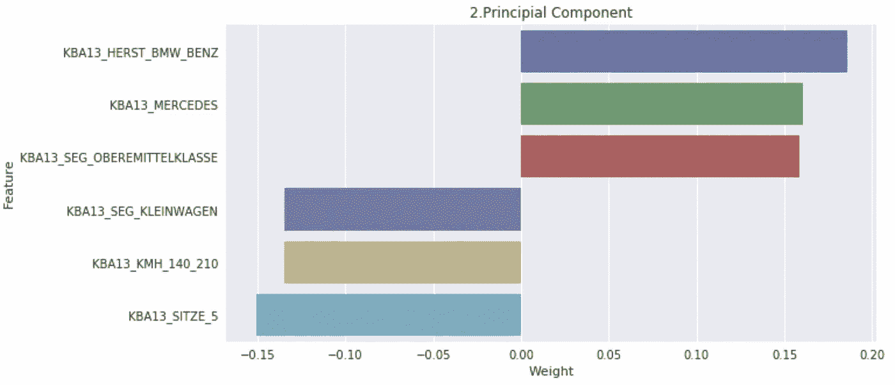

最高:

*   KBA13_HERST_BMW_BENZ 是宝马和奔驰在 PLZ8 中的份额(5 =非常高)
*   KBA13_MERCEDES 是 MERCEDES 在 PLZ8 中的份额(5 =非常高)
*   KBA13 _ SEG _ OBEREMITTELKLASSE 是中上档次车和上档次车(BMW5er，BMW7er 等)的份额。)(5 =非常高)

最低:

*   KBA13_SEG_KLEINWAGEN 是小型和超小型汽车(福特嘉年华、福特 Ka 等)的份额。)在 PLZ8 中(5 =非常高)
*   KBA13_KMH_140_210 是 PLZ8 内最大速度在 140 和 210 km/h 之间的车辆份额(5 =非常高)
*   KBA13_SITZE_5 是 PLZ8 中 5 座汽车的数量(5 =非常高)

**2。主成分显然是汽车相关性能的指标。**

## k-均值算法

K-means 是一种基于质心的算法，或基于距离的算法，其中我们计算距离以将一个点分配给一个聚类。在 K-Means 中，每个聚类都与一个质心相关联。

K-Means 算法的主要目标是最小化点和它们各自的聚类质心之间的距离之和。

**集群数量**

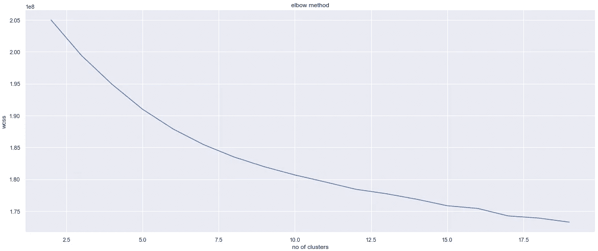

为了确定最佳聚类数，使用了肘方法。计算并绘制了跨方差 k 个聚类的平均聚类内距离。确定 7 个集群将是一个好的起点。

**聚类比较**

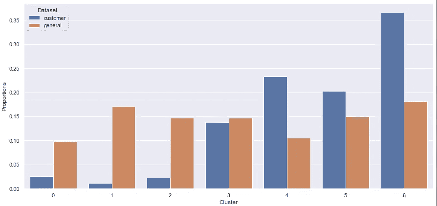

如图所示，聚类 0、1 和 2 是代表性不足的聚类。换句话说，他们是未来最没有潜力成为客户的集群。聚类 3、4、5 和 6 是多代表集合。这些集群最有可能成为未来的客户。

群组 3 的前 3 个组件:

[ 3.39913675, 0.24727438, -3.84673168]

根据我们从前两个部分获得的信息，第三组代表拥有大量家庭住宅和豪华汽车的细分市场。此外，根据我们从第三部分获得的信息，我们可以看到有一个老年群体。

集群 5 的前 3 个组件:

[-5.50107478, -0.98508396, 3.804263 ]

根据我们从前 2 个部分获得的信息，第 5 个聚类代表家庭住宅数量较少的细分市场，并且谁在较低的细分市场中乘车。此外，当我们看第三个组成部分时，我们可以看到它主要是一个年轻的集群，他们没有做好财务准备。

# 4-无监督模型

## 评价模型

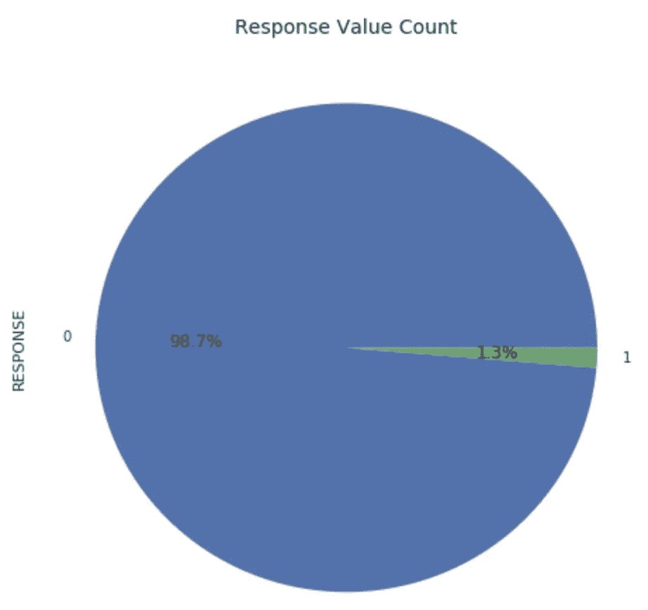

类别标签分布非常不平衡，在这个特定的二进制分类问题中，有 42，430 个标签为“0”的观察值，而只有 532 个标签为“1”的观察值。对于这个问题，我们需要能够判断一个人是否会成为未来可能的客户。考虑真阳性率和假阳性率的 AUROC 指标似乎是解决该问题的一个好选择，因为我们希望能够正确预测这两种情况，即一个人是否会成为客户。因为，这两个预测对我们都很重要。

因此，受试者工作特性面积(AUROC)被选为评估指标。AUROC 给出了关于模型总体性能的想法，其中通过绘制不同阈值设置下的真阳性率和假阳性率来创建曲线。一个好的性能模型将有 1 的 AUROC。因此，AUROC 越高，模型的性能越好。

## 选择模型

设置评估模型后，数据已使用标准定标器进行了定标，并分为训练和验证两部分。不同的算法已经在训练分割上被训练，并且已经在验证分割上被评估。为该步骤选择的算法有:

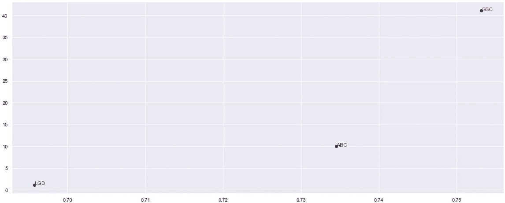

如图所示，当我们查看时间-成功值时，我们可以看到最佳模型是梯度增强。时间值的差异在可接受的范围内。

在梯度推进中，每个预测器都试图通过减少误差来改进其前任。但是梯度推进背后的有趣想法是，它不是在每次迭代中对数据拟合预测器，而是实际上对前一个预测器产生的残差拟合一个新的预测器。

## 超参数调谐

梯度推进分类器在网格搜索的帮助下进行了调整。已经选择了一组超参数用于调整，并且已经执行了网格搜索以确定最佳执行模型。

最佳分类器具有以下超参数和分数:

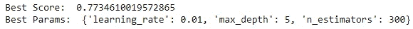

使用参数化模型在训练集上计算的分数明显高于默认模型(0.773 比 0.758)。

特征重要度图表明，最重要的特征是 D19_SOZIALES，遗憾的是没有关于它的描述。下一个重要特征与消耗类型(EINGEFUEGT_AM_YEAR)和运动年份 EXTSEL992(信息不可用)有关。

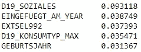

# 5-结果-结论

*   第一部分进行数据评估和数据预处理。正如在每个数据科学项目中一样，我们在数据预处理阶段经历了一段艰难的时间。我们努力的一些原因:有太多的特征和观察，一些特征无法解释，一些特征缺少的数据比它们应该有的少。
*   在无监督的部分，使用 PCA 对描述 95%的解释方差的 194 个潜在特征进行降维。主成分分析是有用的，很高兴看到前三个关键成分能够有效地区分七类。
*   最后，选择梯度推进分类器并进行参数化，建立监督模型，并在 KAGGLE 上的测试数据集上进行预测。监督学习算法的最终性能为 77.3%。

该分析的代码可以在其 [Github repo](https://github.com/hakanatesli/Customer-Segmentation-Report-for-Arvato-Financial-Services) 中找到。

# 6 人卡格尔竞赛

最佳性能模型(梯度推进分类器)用于预测响应变量。这些概率随后被提交给 Kaggle，在我写这篇文章的时候，我的分数是 161。地点。

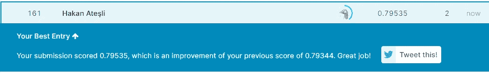

# 7-参考文献

*   [https://pub . toward sai . net/principal-component-analysis-PCA-with-python-examples-tutorial-67a 917 BAE 9 aa](https://pub.towardsai.net/principal-component-analysis-pca-with-python-examples-tutorial-67a917bae9aa)
*   [https://github . com/pranaymudukuru/Bertelsmann-Arvato-customer-segmentation](https://github.com/pranaymodukuru/Bertelsmann-Arvato-customer-segmentation)
*   [https://sci kit-learn . org/stable/modules/generated/sk learn . cluster . k means . html](https://scikit-learn.org/stable/modules/generated/sklearn.cluster.KMeans.html)
*   [https://github.com/mkeisenbach/arvato](https://github.com/mkeisenbach/arvato)