# 客户细分:k 均值聚类

> 原文：<https://medium.com/analytics-vidhya/customer-segmentation-kmeans-clustering-7670e317b54c?source=collection_archive---------3----------------------->

使用公共在线零售商数据集，通过 K-means 聚类，基于购买和频率对客户进行细分。

**简介**

*什么是客户细分？*

顾名思义，根据购买次数、购买频率、购买的产品类型将客户划分到特定的组，再划分到同质的组。在任何一家[企业](/analytics-vidhya/customer-segmentation-with-rfm-analysis-kmeans-clustering-32c387d04dfe)，分析和留住现有客户以及开发和吸引新客户都很重要。

在一定程度上，人们发现，与开发新客户相比，留住客户会导致更多的努力。因为现有客户更有可能在产品上花费更多。满足这些[客户](https://www.business2community.com/customer-experience/why-your-existing-customers-are-your-best-customers-02199165#:~:text=for%20your%20business.-,Your%20existing%20customers%20are%20more%20likely%20to%20spend%20more%20on,to%20buy%20from%20you%20again)将有助于建立庞大、强大、可靠的客户群，也有助于你产品的重复购买。


图片来自 [Unsplash](https://images.unsplash.com/photo-1521790797524-b2497295b8a0?ixid=MnwxMjA3fDB8MHxwaG90by1wYWdlfHx8fGVufDB8fHx8&ixlib=rb-1.2.1&auto=format&fit=crop&w=1049&q=80)

*用什么特征来区分顾客？*

根据各自业务中使用的用例来划分客户。许多企业/组织使用客户细分来优化向 myraid 客户群销售产品的能力。

*   [在线广告](https://en.wikipedia.org/wiki/Targeted_advertising):广告的类型，其中广告商使用来自社交媒体档案和使用、搜索引擎使用和习惯(烦人的 cookies！)和网络浏览习惯，并据此对客户进行细分。有时，甚至社会经济条件、位置和行为也被用来为广告服务。
*   医疗保健: [Delloite](https://www2.deloitte.com/us/en/insights/industry/health-care/healthcare-consumer-patient-segmentation.html) 对 10，000 多名美国消费者进行了调查，以分析他们对医疗保健、健康保险和福祉的态度、行为和优先事项。每个消费者对医疗保健计划都有不同的方法和偏好，delloite 将消费者分为 4 组。这种方法有助于医疗保健利益相关者了解和分析不同类型的消费者，并向期望的消费者提供合适的建议。
*   汽车公司:在这个用例中，汽车不是细分的，而是客户根据他们的需求细分的，汽车的类型是满足客户需求的设计方案。有些群体是越野、环境意识、家庭需求、质量问题、突出人群等。这是一篇很好的[文章](https://www.stephenzoeller.com/targetmarket-segment-porsche/),其中保时捷使用细分技术来锁定客户，销售他们独特的汽车。
*   还有各种其他行业，如银行和金融服务、护肤和美容产品制造商、电视和移动网络。等。

如上所述，客户细分有助于发展业务和满足客户需求。

*现实中客户是如何细分的？*

现在要了解客户是如何细分的，技术上来说，有很多无监督的算法来解决。这些机器学习算法中的许多可以帮助公司识别他们的用户/客户群，并创建所需的客户群。

一种这样的算法是 K-均值聚类算法。该算法有助于分析未标记的客户数据，并将每个数据点/客户分配到聚类中。

**K-均值聚类**

我们将使用从英国在线零售店获得的在线零售客户数据。我们将帮助他们选择最好的顾客群，他们将从商店购买独特的节日礼物。数据可在 [kaggle](https://www.kaggle.com/hellbuoy/online-retail-customer-clustering) 中获得。

**所需库**

确保在分析数据之前安装了以下库:pandas、scikit-learn、matplotlib、seaborn。安装完成后，让我们来构建模型！

**读取数据帧**

使用以下代码导入所需的库:

```
import pandas as pd
from sklearn.cluster import KMeans
from sklearn.preprocessing import StandardScaler
import matplotlib.pyplot as plt
import seaborn as sns
from sklearn.decomposition import PCA
```

运行下面一行来读取[数据集](https://www.kaggle.com/hellbuoy/online-retail-customer-clustering)，然后让我们看看数据框:

```
data = pd.read_csv('OnlineRetail.csv',
                   encoding = 'unicode_escape')data.head()
```

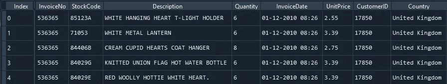

作者图片

数据集中有 8 个变量。

*   InvoiceNo:客户完成的交易的唯一标识符
*   StockCode:因为它是一家批发零售商店，所以它对每种商品的库存都有唯一的标识符。
*   描述和数量不言自明(项目和项目数量)
*   InnvoiceDate:客户完成付款的日期和时间
*   单价:项目的单位价格
*   CustomerId:数据集中每个客户的唯一标识符

**数据预处理**

让我们删除丢失的值，因为它对我们没有帮助。然而，并不总是要删除丢失的值。基于应用和用例，您需要做出相应的决定。

```
data.info()
```

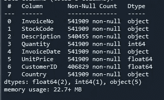

作者图片

正如我们看到的，缺少客户的值，没有 CustomerId，我们就无法使用其他信息，所以我们可以删除它。

```
data.dropna(inplace = True)
data.isna().sum()
data.info()
```

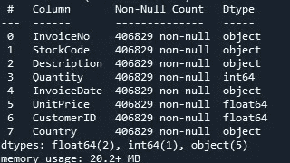

作者图片

让我们创建 total_amount 列，因为您将理解我们为什么在您进行此项目时创建此列。

```
data['Total_Amount'] = data['Quantity']*data['UnitPrice']
```

在继续之前，让我们了解如何分析这个数据集。有许多方法来分析这个数据集，但我们将看到 RFM 分析。这种分析很久以前就被采纳并付诸实践了。它在营销工作中起着至关重要的作用。该分析中的三个主要变量:

*   **R** (recency):它存储相对于数据集中最后一个日期，客户最后一次购买的天数。它只是查找特定顾客从商店购买的最后一件商品。
*   **F** (频率):它是通过计算每个顾客被看到购物的唯一 innovice 日期来计算每个顾客购物的次数。
*   **M** (货币):是每位顾客消费的总金额。

让我们来计算 RFM 值。

最简单的方法是计算 M 的货币价值。我们将使用之前创建的 Total_Amount 列。

```
m = data.groupby('CustomerID')['Total_Amount'].sum()
m = pd.DataFrame(m).reset_index()
m.head()
```

查看新数据框架的前几行，我们可以看到我们计算了每个客户的货币价值！

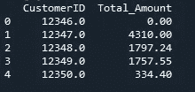

作者图片

现在，让我们计算一下每位顾客从商店购买的次数。我们将使用 CustomerID 和 InvoiceDate 列。

```
f = data.groupby('CustomerID')['InvoiceNo'].count()
f =f.reset_index()
f.columns = ['CustomerID','Frequency']
f.head()
```

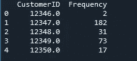

作者图片

我们能够计算每个顾客从商店购买的总次数。

最后，让我们计算每个客户的最近价值。

首先，我们需要找到数据集中最后一次购买的时间。

```
data['InvoiceDate'] = pd.to_datetime(data['InvoiceDate'],
                                     format = '%d-%m-%Y %H:%M')
last_day = max(data['InvoiceDate'])
```

最初，我们将给定 InvoiceDate 的格式和数据类型更改为指定的格式，然后计算最后的购买日期。

为了找出每个顾客的最后购买日期

```
data['difference'] = last_day - data['InvoiceDate']
data.head()
```

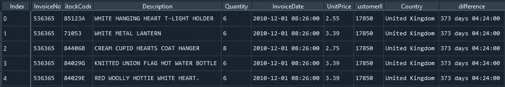

作者图片

现在我们只需要天数，而不是时间和天数，只需要整数。这样，以后就可以更容易地根据每个客户进行分组。

所以我们可以用一个独立的函数来给出整数。

```
def get_days(x):
    y = str(x).split()[0]
    return int(y)data['difference'] = data['difference'].apply(get_days)
```

现在，我们可以使用 CustomerId 和 difference 列对每个客户进行分组。

```
r = data.groupby('CustomerID')['difference'].min()
r = r.reset_index()
r.columns = ['CustomerID','Recency']
r.head()
```

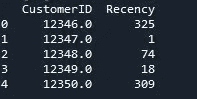

作者图片

现在我们已经为最近(r)、频率(f)和货币(m)创建了三个独立的数据框架。让我们将这些数据帧分组。

```
grouped_df = pd.merge(m, f, on = 'CustomerID',how = 'inner')
RFM_df = pd.merge(grouped_df, r, on ='CustomerID', how = 'inner')
RFM_df.columns = ['CustomerID','Monetary','Frequency','Recency']
```

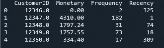

作者图片

在这里，我们正在做内部连接，以分组 3 个数据帧。

由于 K-means 聚类访问每个数据点以形成一个聚类，因此离群值会影响检测聚类的过程，所以首先让我们丢弃离群值，以便我们可以在以后获得更好的聚类。

我们来看每一列的箱线图。

```
plt.boxplot(RFM_df['Monetary'])
plt.xlabel('Monetary')
plt.show()
```

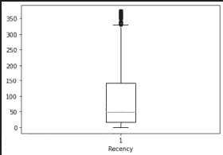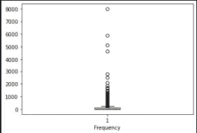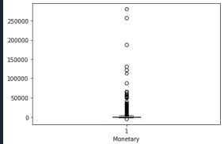

因为每个变量都是离群值，所以让我们去掉它们。

```
outlier_vars = ['Monetary','Recency','Frequency']for column in outlier_vars:

    lower_quartile = RFM_df[column].quantile(0.25)
    upper_quartile = RFM_df[column].quantile(0.75)
    iqr = upper_quartile - lower_quartile
    iqr_extended = iqr * 1.5
    min_border = lower_quartile - iqr_extended
    max_border = upper_quartile + iqr_extended

    outliers = RFM_df[(RFM_df[column] < min_border) |     (RFM_df[column] > max_border)].index
    print(f"{len(outliers)} outliers detected in column {column}")

    RFM_df.drop(outliers, inplace = True)
```

**标准化**

现在我们需要标准化数据，因为有更大的值可以支配定义的集群。

由于聚类算法基于数据点之间的距离，因此我们需要调整数据，使其符合均值为 0、标准差为 1 的正态分布。

```
scaled_df = RFM_df[['Monetary','Frequency','Recency']]
scale_standardisation = StandardScaler()rfm_df_scaled = scale_standardisation.fit_transform(scaled_df)rfm_df_scaled = pd.DataFrame(rfm_df_scaled)
rfm_df_scaled.columns = ['monetary','frequency','recency']
```

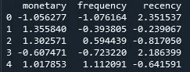

作者图片

**K-均值聚类**

首先，让我们用[肘法](https://en.wikipedia.org/wiki/Elbow_method_(clustering)#:~:text=In%20cluster%20analysis%2C%20the%20elbow,number%20of%20clusters%20to%20use.)找出星团的数量。肘方法或者由误差平方和(sse)使用，或者由误差聚类和(wcss)使用。我们将使用 [WCSS](https://www.linkedin.com/pulse/finding-optimal-number-clusters-k-means-through-elbow-asanka-perera/) 来寻找最佳的集群数量。

```
k_values = list(range(1,10))
wcss_list = []for k in k_values:
    kmeans = KMeans(n_clusters = k)
    kmeans.fit_transform(rfm_df_scaled)
    wcss_list.append(kmeans.inertia_)plt.plot(k_values,wcss_list)
plt.xlabel("k")
plt.ylabel("WCSS Score")
plt.title("Within Cluster Sum of Squares - by k")
plt.tight_layout()
plt.show()
```

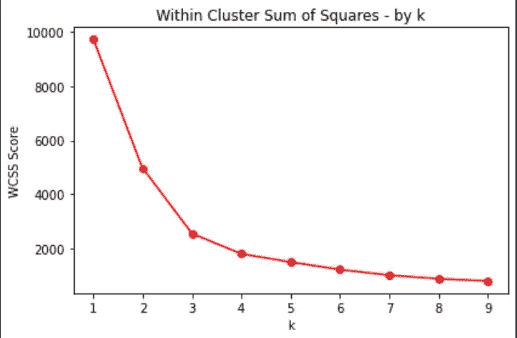

作者图片

从上图我们可以清楚的看到，当 x 轴在 3 上时，graph 明显有一个弯头。因此，我们将选择集群或客户群的数量为 3。

```
kmeans = KMeans(n_clusters = 3)
kmeans.fit(rfm_df_scaled)
```

让我们来想象一下星团。

```
clusters = kmeans.labels_RFM = rfm_df_scaled 
RFM['labels'] = clustersfig = plt.figure(figsize=(21,10))
ax = fig.add_subplot(111, projection='3d')
ax.scatter(RFM["monetary"][RFM.labels == 0], RFM["frequency"][RFM.labels == 0], RFM["recency"][RFM.labels == 0], c='blue', s=60)
ax.scatter(RFM["monetary"][RFM.labels == 1],RFM["frequency"][RFM.labels == 1], RFM["recency"][RFM.labels == 1], c='red', s=60)
ax.scatter(RFM["monetary"][RFM.labels == 2], RFM["frequency"][RFM.labels == 2], RFM["recency"][RFM.labels == 2], c='yellow', s=60)
ax.view_init(30, 185)
plt.show()
```

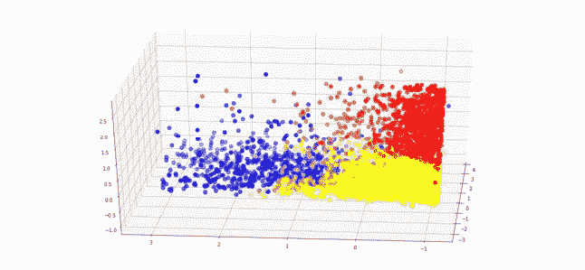

作者图片

让我们看看 RFM 数据框架的分析。

```
rfm_df['Clusters'] = k_model.labels_analysis = rfm_df.groupby('Clusters').agg({
    'Recency':['mean','max','min'],
    'Frequency':['mean','max','min'],
    'Monetary':['mean','max','min','count']})
```

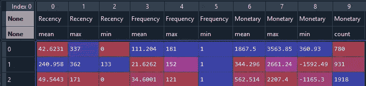

作者图片

从上面的分析，我们可以解释如下。

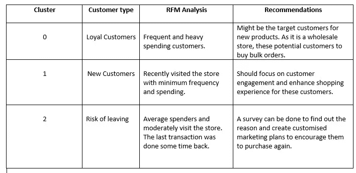

解读 RFM 分析

因此，我们可以向在线商店推荐聚类“0”中的客户。

进一步的工作…

*   您可以通过使用 RFM 评分(1-5)来扩展这种分析，然后对客户进行分组。一定要看看这篇[文章](/@jackiekhuu.work/customer-segmentation-rfm-analysis-8007d62101cc)。
*   由于 Kmeans 对异常值很敏感，您可以使用对异常值很健壮的 [DBSCAN](/mlearning-ai/demonstrating-customers-segmentation-with-dbscan-clustering-using-python-8a2ba0db2a2e) 集群来尝试相同的数据。
*   您可以使用 country 列进一步分析，找出大多数客户来自哪里。