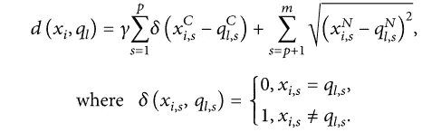
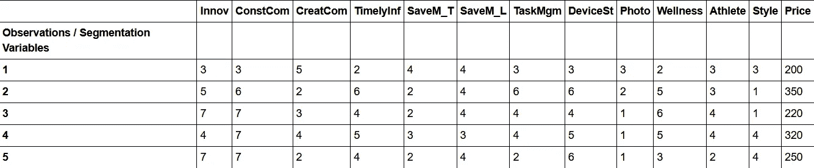
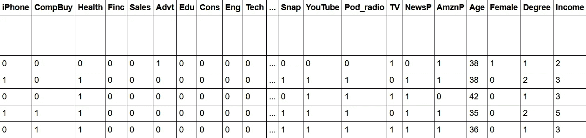
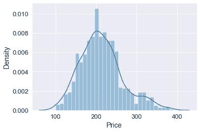
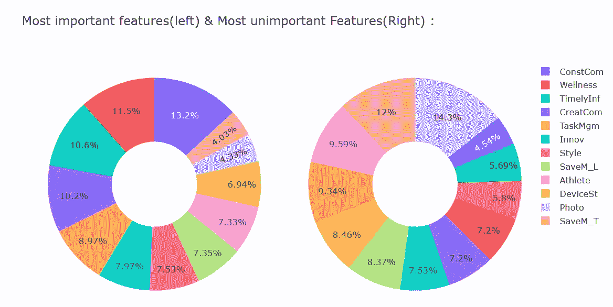
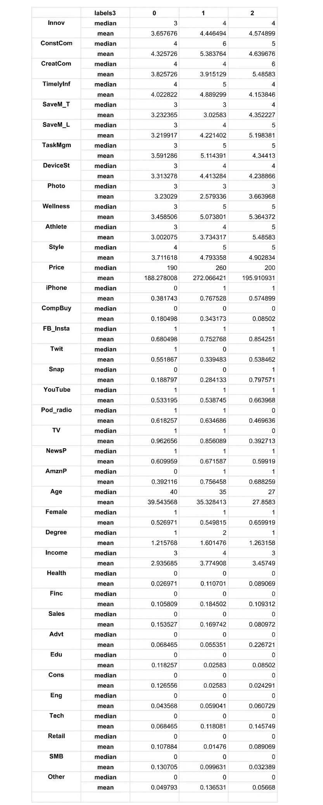

# 基于 Python 中 k 原型算法的客户细分

> 原文：<https://medium.com/analytics-vidhya/customer-segmentation-using-k-prototypes-algorithm-in-python-aad4acbaaede?source=collection_archive---------0----------------------->

## Python 中智能手表调查数据的 k-prototypes 算法聚类分析。


照片由 [Unsplash](https://unsplash.com?utm_source=medium&utm_medium=referral) 上的 [Onur Binay](https://unsplash.com/@onurbinay?utm_source=medium&utm_medium=referral) 拍摄

# 为什么我们需要细分市场？

无论是真实的还是感知的，客户都有广泛的需求和偏好，这是一个基本假设。在购买任何产品之前，考虑一下你经历了多少研究、反复试验和同行评审。这是因为每个人都有独特的需求、欲望、欲望、偏好等。企业必须考虑和管理这种顾客异质性，以满足顾客的需求和偏好。因此，根据帕尔马提埃和斯里达尔的说法，2017 年这为我们提供了第一个基本营销原则，即


照片由[色谱仪](https://unsplash.com/@chromatograph?utm_source=medium&utm_medium=referral)在 [Unsplash](https://unsplash.com?utm_source=medium&utm_medium=referral) 上拍摄

> MP#1 ->所有客户都不同

顾客异质性是所有公司在制定成功的营销计划时都必须考虑的一个基本“问题”,因为顾客对产品和服务的偏好自然会在许多方面有所不同。假设所有的消费者都是一样的，只能适用于垄断或公用事业这样的例外情况；否则，其他公司将不可避免地继续分一杯羹，也就是说，以更合适的报价瞄准利基市场。

为了管理客户异质性，我们有几种方法， **STP** 分析是其中之一。 **STP** 代表**分段**、**瞄准**、**定位**。

这里我们只讨论如何对客户进行细分。细分是将整个市场分成不同群体的过程，每个群体都有相似的需求和偏好。同样，细分客户的方法有很多，但我们将重点关注数据驱动的方法，特别是**聚类分析**来细分客户。

我假设你已经熟悉这种无监督的机器学习技术- **聚类分析**。如果还没有，你可以继续，但是我强烈建议你浏览一遍这些概念。

# 数据

接下来，我们来谈谈数据。因为我认为这是分析中最有趣的部分。我从《营销策略:基于第一原则和帕尔马提埃和斯里达尔的数据分析》这本书的配套网站的资源部分挑选了这些数据。有一点我想提一下，这本书给了我很大的启发。如果你对数据驱动的营销策略感兴趣，我强烈推荐这本书。

你可以从下面买到这本书。

*   [2017 版](https://amzn.to/3ykgsQ2)
*   [2021 版](https://amzn.to/3hc8NO7)

我们有一份对奥雷甘大学伦德奎斯特商学院 1000 名校友的调查数据，内容是他们对智能手表功能的偏好，以及一些人口统计信息。

好的，在继续之前，你必须详细阅读背景、问题陈述和数据信息[这里](https://github.com/ShivamSoliya/Intel_Smartwatch_Market_Segmentation/blob/main/SmartwatchSegmentation_Case.pdf)。而你可以在这里找到 excel 表格[。](https://github.com/ShivamSoliya/Intel_Smartwatch_Market_Segmentation/blob/main/Smartwatch_Market_Segmentation.xlsx)

为了让你更容易理解，这些是调查中问受试者的问题。所有这些问题和特点将构成我们的专题专栏。

# 关于 k 原型算法

我们考虑了 k 原型算法，你可以说它是 k 均值和 k 模式的混合。使用 **k-prototypes** 算法的原因是它可以同时处理数字和分类特征，并且数据的大部分列都是分类的。

贾和宋在他们的文章[1。]声明 k-prototypes 算法结合了数字部分的"**手段**和分类部分的"**模式**"来构建新的混合聚类中心"**原型**"。在“原型”的基础上，建立了适用于混合型数据的相异系数公式和代价函数。

引入参数 **γ** 来控制类别特征和数值特征对聚类过程的影响。假设混合型数据集具有 ***p*** 数值特征和 ***m-p*** 类别特征。对于任一 ***、* ∈ *D*** ，k 原型的**相异系数的定义如下式所示:**



来源:贾与宋[1]

这只是理论上的，实际上你只需要:

*   安装 kmodes 包。
*   从 kmodes.kprototypes 包中导入 KPrototype 类。
*   将数值列的数据类型转换为浮点型。
*   给出数组作为输入数据，而不是数据帧。
*   在拟合数据时，明确给出分类列的列表。

# 履行

## 导入库

```
import os
import numpy as np
import pandas as pdimport matplotlib.pyplot as plt
import seaborn as sns
%matplotlib inlineimport warnings
warnings.filterwarnings('ignore')
```

## 加载数据

数据以 2 张 excel 表格的形式给出。所以我们把它分别加载为分割和区分。如果你想进行另一种叫做判别分析的市场分析，这种划分会很有帮助。但是对于聚类分析，我们最终将不得不连接数据，我们在执行一些 EDA 和预处理步骤后做了同样的事情。

```
# Setting base directory
BASE_DIR = os.getcwd()# Creating path to the segmentation dataset excel file
SEG_PATH = os.path.join(BASE_DIR, 'Smartwatch_Market_Segmentation.xlsx')# Loading both the datasets
segmentation = pd.read_excel(SEG_PATH, index_col=1, header=3, sheet_name='Segmentation Data')discrimination = pd.read_excel(SEG_PATH, index_col=1, header=3, sheet_name='Discrimination Data')
```

## EDA 和数据预处理

```
# Creating copies of our datasets
df_seg = segmentation.copy()
df_dis = discrimination.copy()#There was an entire column of null values on both of the Dataframes.  So we have to drop it.
df_seg.dropna(axis=1, how='all', inplace=True)
df_dis.dropna(axis=1, how='all', inplace=True)
```

这是我们细分数据的标题。



分段数据的头文件

这是我们歧视数据的标题。



鉴别数据的头文件

让我们看看价格、年龄和收入分布。



*   价格分布看起来有点偏右。
*   年龄分布从 24 岁到 47 岁看起来呈双峰型。
*   超过 38%的受试者在 71𝑘−100k 之间有收入

现在，让我们分析并想象一下智能手表最重要和最不重要的特征，这些特征由参与者决定。



最重要和最不重要数据的圆环图

从这个总结中我们可以得出几个结论:

*   受试者最不重视照片& SaveM_L(分别有 14.3%和 12%的受试者将其评为 1、2 或 3)。
*   受试者认为 ConstCom & Wellness 最为重要(分别有 13.2%和 11.5%的受试者将其评为 5、6 或 7)。

## 连接数据以提取更多细节的时间

```
#Concatinating segmentation and discrimination data to fit into the model.df_new = pd.concat([df_seg, df_dis], axis=1, join='inner')
```

稍微调整一下新的数据框架，我们就可以继续前进了。

寻找属性之间的相关性。

```
corr = df_new.corr()
corr_list=[]
for i in range(0, len(corr.index)):
    for j in range(0, len(corr.columns)):
        if ((corr.iloc[i,j] > 0.5 or corr.iloc[i,j] < -0.5) and corr.iloc[i,j] != 1):
            corr_list.append(str(corr.index[i] + ' and ' + corr.columns[j] + ' : ' + str(round(corr.iloc[i,j], 2))))corr_list = '\n'.join(corr_list)
print(corr_list)# OuputCreatCom and SaveM_T : 0.6
CreatCom and Athlete : 0.51
SaveM_T and CreatCom : 0.6
SaveM_L and DeviceSt : 0.54
SaveM_L and Wellness : 0.54
SaveM_L and Athlete : 0.65
SaveM_L and Age : -0.53
DeviceSt and SaveM_L : 0.54
Wellness and SaveM_L : 0.54
Wellness and Athlete : 0.66
Wellness and Style : 0.63
Wellness and Age : -0.52
Athlete and CreatCom : 0.51
Athlete and SaveM_L : 0.65
Athlete and Wellness : 0.66
Athlete and Age : -0.69
Style and Wellness : 0.63
TV and Age : 0.51
Age and SaveM_L : -0.53
Age and Wellness : -0.52
Age and Athlete : -0.69
Age and TV : 0.51
```

年龄与运动员呈负相关。(显然！)

为实验目的复制我们的新数据。

```
X = df_new.copy()
```

缩放数字列。

```
from sklearn.preprocessing import StandardScalerscaled_X = StandardScaler().fit_transform(X[['Price', 'Age']])
X[['Price', 'Age']] = scaled_X
```

## 使数据符合模型

导入 KPrototypes 类，将数字列数据类型转换为 float，并创建分类列的索引列表(适合 k prototypes 的要求)。

```
from kmodes.kprototypes import KPrototypes#dataframe to an array
smart_array = X.values#converting numerical columns datatype as floatsmart_array[:, 12] = smart_array[:,12].astype(float)
smart_array[:, 23] = smart_array[:,23].astype(float)#index of categorical columns
categorical_index = list(range(0,12)) + list(range(13,23)) + list(range(24, 38))
```

绘制肘形曲线以找到最佳聚类数。


2 到 10 个集群的肘形曲线

通过观察肘部，3 个集群看起来更好。因此，我们再次用 3、4 和 5 作为聚类数来训练模型。最终用 3 个集群找到满意的结果。

```
model_3 = KPrototypes(n_clusters=3, init='Huang', random_state=42, n_jobs=-1)
model_3.fit_predict(smart_array, categorical=categorical_index)
print(model_3.cost_)#new column for cluster labels associated with each subject
X['labels3'] = model_3.labels_
```

现在，没有更好的方法来可视化多维数据中的聚类。我们尝试了主成分分析和 t-SNE，但我觉得这些是基于欧氏距离的方法，而数据中的大多数特征都是分类的。所以他们没有很好地展示集群。

这就是我们如何借助 *groupby* function *从聚类中得出结论。*

```
pd.set_option('max_rows',None)
df_new['labels3'] = model_3.labels_
df_new.groupby('labels3').agg(['median' ,'mean']).T
```

## 结果



## 结论

通过查看结果表，我们可以获得每个集群(现在称为细分市场)的偏好、行为和需求信息。

*   第 0 部分受试者希望智能手表的所有功能适中，愿意支付更低的价格，是最少的 iPhone 用户，收入中值最低，年龄较大，等等…
*   第 1 部分受试者想要更多特定功能，愿意支付高价，是最多的 iPhone 用户，收入中值最高，年龄中等，等等…
*   细分市场 2 的受试者想要更多特定功能，愿意支付中等价格，是中等 iPhone 用户，收入中值略低于细分市场 1，年龄较低，等等…

我想感谢我的朋友 Harsh Panchal 对这个项目的帮助和支持，也感谢你一直读到最后。作为礼物，这里有一个笔记本的链接。

[](https://github.com/ShivamSoliya/Intel_Smartwatch_Market_Segmentation/blob/main/smartwatch%20_market_seg.ipynb) [## ShivamSoliya/英特尔 _ 智能手表 _ 市场 _ 细分

### 在 GitHub 上创建一个帐户，为 ShivamSoliya/Intel _ smart watch _ Market _ Segmentation 的发展做出贡献。

github.com](https://github.com/ShivamSoliya/Intel_Smartwatch_Market_Segmentation/blob/main/smartwatch%20_market_seg.ipynb) 

请看看，如果你认为我做错了什么，或者你认为这个项目可以改进，请随时联系我。

# 参考

1.  **贾**和**宋陵**，“基于混合相异系数的加权 k-Prototypes 聚类算法”，印度工程中的数学问题，第 2020 卷，文章编号 5143797
2.  **罗伯特·w·帕尔马提耶**和**什里哈里·斯里达尔**，《营销战略:基于基本原则和数据分析》，2017 年，第 35–44 页
3.  **康纳·亨德森、什里哈里·斯里达尔**和**亚历杭德罗·勒扎·杜兰特**，《营销战略:基于第一原则和数据分析，数据分析案例 1》，2017 年

最初发布于 [vocal.media](https://vocal.media/journal/customer-segmentation-using-k-prototypes-algorithm)