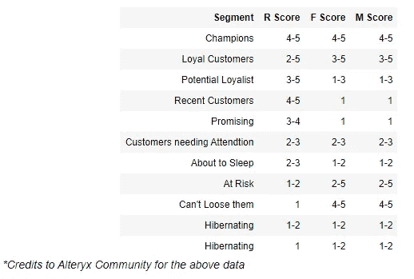
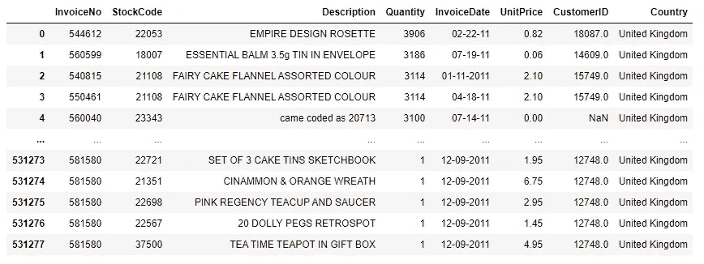
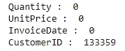
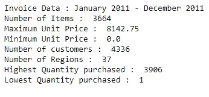
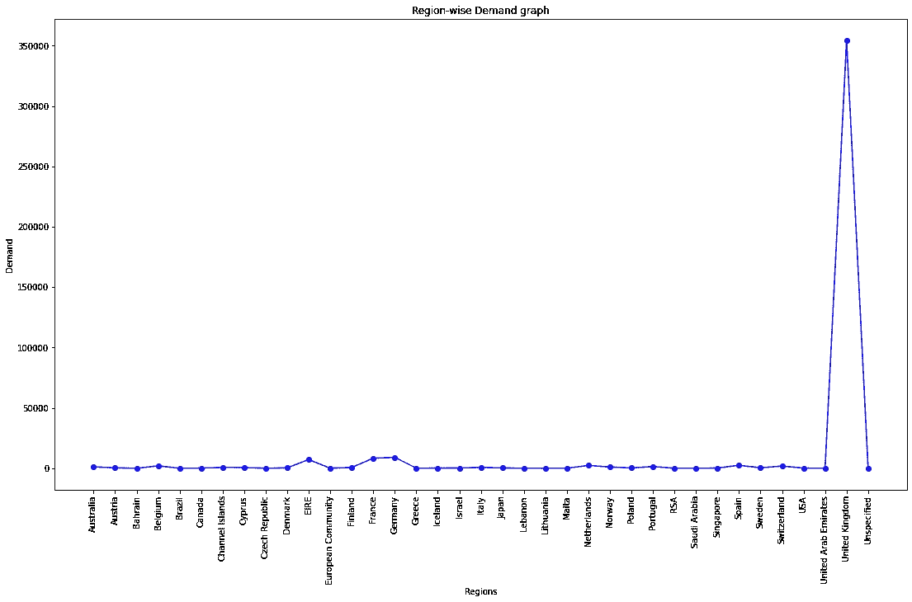
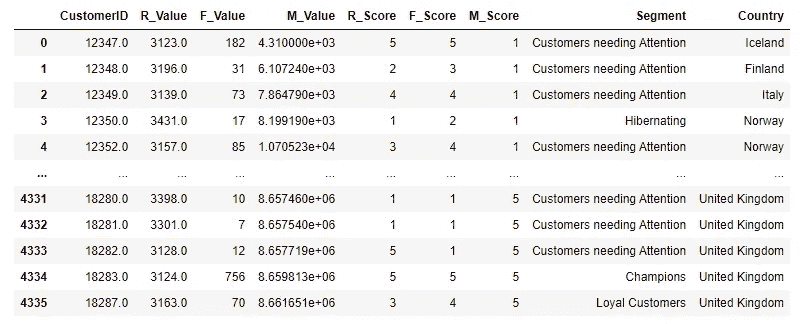
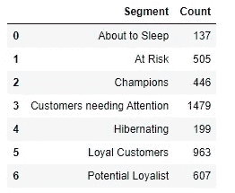
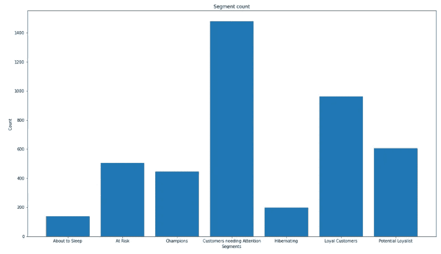
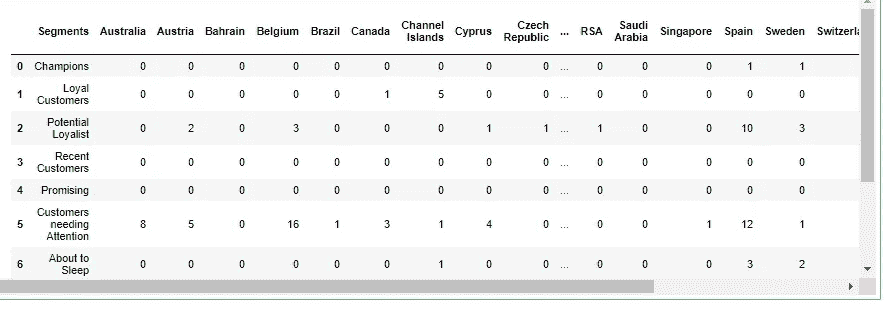

# 使用 RFM 分析进行客户细分

> 原文：<https://medium.com/analytics-vidhya/customer-segmentation-using-rfm-analysis-7efe079f0dac?source=collection_archive---------10----------------------->

客户细分是根据共同特征将客户划分为不同群体或细分市场的过程。这有助于锁定每一组客户，提高他们对业务的贡献，甚至为他们提供更好的客户体验。企业利用这一点来瞄准对其业务贡献较小的客户，并通过提供优惠或折扣来提高他们的贡献。

你不再从购物网站上买东西。然后开始发送优惠或折扣券。这将让你回到他们的业务中，并让你留在那里，因为你以更低的价格获得同样的产品。

在本文中，我们将介绍一个项目，在这个项目中，我们使用 **RFM 分析**使用销售数据集对客户进行细分。RFM 分析扩展为近期、频率和货币分析。它考虑了顾客的新近性(他/她购买的时间)、顾客的频率(他/她从该商店/企业购买的频率)和金钱(他/她为企业贡献了多少钱)。这三个因素有助于我们将客户分为以下几类。

细分客户的类别和 RFM 值

# 准备笔记本

在这次活动中，我将使用 Jupyter 笔记本。启动一个 Jupyter notebook 实例并导入以下 python 库。

用于 RFM 分析的 Python 导入

# 资料组

这里使用的数据集是作为[营销和零售分析](https://www.greatlearning.in/academy/learn-for-free/courses/marketing-and-retail-analytics)课程[大学习](https://www.greatlearning.in/)的一部分获得的销售数据集。将数据集保存在根文件夹中，并使用 Pandas 将它读入内存。对于此数据集，编码设置为“unicode_escape”。

数据集概述

**了解数据集**

让我们花一点时间来了解数据集，了解每一列的含义。

**发票号:**一般用于备查的票据号。

**库存代码:**用于识别每个库存项目。

**描述:**库存项目或产品的描述。

**数量:**客户购买产品的数量。

**发票日期:**购买日期。

**单价:**产品的单位价格。

**客户 ID:** 客户的唯一 ID。用于识别每个客户。

**国家:**在全球业务中，这用于标识销售发生在哪个国家。

在上面的列中，我们感兴趣的列是 Quantity 和 UnitPrice(都用于计算货币价值)、InvoiceDate(用于计算最近)和 CustomerID(用于通过计算每个客户的数量来计算频率)。

# 清理数据

通常，真实世界的销售数据集将近乎完美，因为每条信息都将由用户正确输入，并且不能跳过。但是在这里，数据集中很少有丢失的值。

显示我们感兴趣的每一列中缺失值的数量

数据集中空值的数量

在这种情况下，我们通常会尝试使用平均值或通过回归预测来填充该列。这里，客户 ID 是唯一无法预测的缺失值。因此，唯一的选择是删除它们。

发票日期的格式是 MM-DD-YYYY，但是有一些异常值是 MM-DD-YY 格式。为了一致性和便于计算，将所有格式改为 MM-DD-YYYY。这将在后面用于 R 分数计算。

# 数据探索

对数据进行描述性和探索性分析，并生成可视化结果。这有助于更好地理解数据，并在需要时生成报告。

数据集的基本概述

国别销售分析

# 新近性、频率和货币分数计算

现在让我们继续计算 RFM 分数。RFM 得分范围在 1-5 之间，每个顾客根据其个人 R、F 和 M 得分进行分类。导言部分的表格也显示了同样的情况。

最近值(R) =当前日期-发票日期
频率值(F) =每个客户 ID 的计数(客户 id)
货币值(M) =单价*数量

为了将值转换成分数，将这些值分入 5 个箱中。

较高的 R 分值意味着客户最近没有从该企业购买，而较高的频率分值和货币分值意味着客户非常频繁，并且为该企业贡献了大量的金钱。

使用生成的 R、F 和 M 值，将所有值以及客户 id 和它们各自的国家放在一个新的数据帧中。在后面的部分中，我们将把它保存为。csv 文件，可进一步用于执行分析或供企业使用。

RFM 分析的最终结果

## 分段计数

让我们创建一个数据帧来存储数据段名称及其总数。这有助于以后的分析。

段计数数据帧

让我们对上面的数据集进行可视化，以便更好地理解它。

上述代码生成了以下可视化效果。X 轴表示细分市场名称，Y 轴表示数量，下图更好地展示了哪类客户更多，哪类客户更少。

段计数数据帧的可视化

## 每个客户群的地理位置计数

由于这一特定业务遍布许多国家，让我们按地理位置统计每个客户群。这有助于组织了解每个业务地点的绩效。

上述代码生成了以下数据框，其中客户细分为行，地理位置为列。每个条目代表特定位置的特定类别的计数。

客户细分的地理计数

# 保存和最终确定

随着 RFM 分析流程的完成，让我们保存上面生成的所有数据集，以供将来参考和业务使用。将保存以下三个 CSV 文件。

*   RFM.csv —包括客户 id、RFM 分数和价值以及他们的国家。
*   segment_count.csv —每个细分市场中的客户数量。
*   Region_count.csv —每个细分市场中的区域客户计数。

感谢您的阅读！

# 有用的链接

在 GitHub 上找到这个项目:[https://GitHub . com/Vishnu-u/Customer-Segmentation-using-RFM-Analytics](https://github.com/vishnu-u/Customer-Segmentation-using-RFM-Analytics)

更多地了解我:https://bit.ly/vishnu-u

在 LinkedIn 上找我:【https://www.linkedin.com/in/vishnuu0399/ 