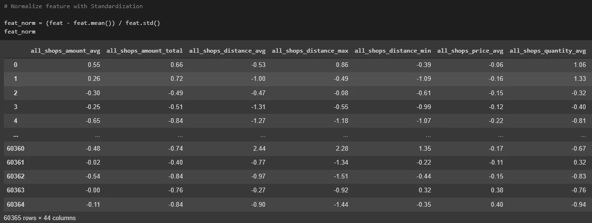
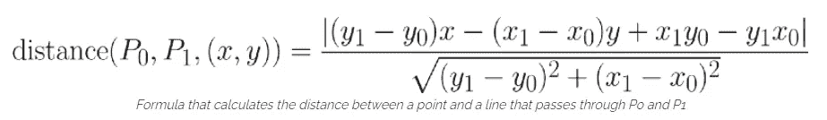
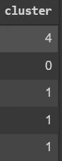
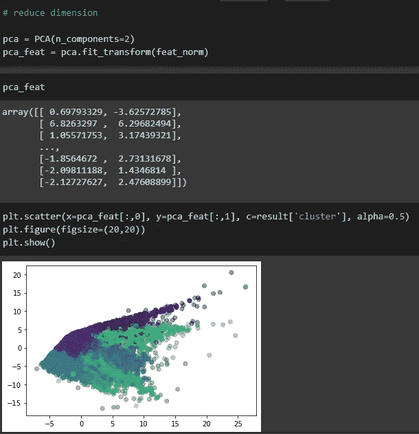
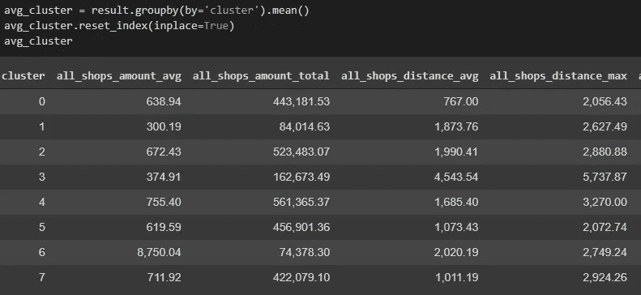

# 基于 K 均值聚类的客户细分

> 原文：<https://medium.com/analytics-vidhya/customer-segmentation-with-k-mean-clustering-852203e18ab7?source=collection_archive---------4----------------------->

[https://www . data camp . com/community/tutorials/cluster-analysis-in-tableau](https://www.datacamp.com/community/tutorials/cluster-analysis-in-tableau)

本文总结了 BOTNOI 关于客户细分主题的数据科学基础课程的内容。我们将研究来自 michelecoscia.com 的超市数据集，并使用无监督的机器学习技术:K 均值聚类

> **无监督学习**是一种机器学习技术，其中用户不需要监督模型。相反，它允许模型自己发现以前未被发现的模式和信息。它主要处理未标记的数据。

在开始之前，让我们回顾一下 K-means 算法。

K-均值算法的工作原理。

**第 1 步**—选择聚类数 k

**步骤 2**——从数据中选择 K 个随机点作为质心。

在这种情况下，K = 3

**步骤 3**—接下来是集群分配步骤。将每个数据点分配给它们最接近的聚类质心。

分配步骤

**步骤 4**—质心被移动到与其相关的数据的平均位置。

质心移动到新位置

**步骤 5**——重复步骤 3 和 4，直到

*   新形成的簇的质心不会改变
*   点保持在同一个群集中
*   达到最大迭代次数

摘自吴恩达的机器学习教程

现在，我们将进入数据集

我们的机器学习管道:

1.  检索数据
2.  数据预处理
3.  特征工程
4.  建模
5.  形象化
6.  解释

# **1。获取数据**

首先，我们需要从 michelecoscia.com 下载数据集。在这种情况下，我们可以使用命令！在 google colab 下载数据集。

# 2.数据预处理

> **数据预处理**是一种**数据**挖掘技术，包括将原始**数据**转换成可理解的格式。真实世界的**数据**通常是不完整的、不一致的和/或缺少某些行为或趋势，并且可能包含许多错误。**数据预处理**是解决此类问题的有效方法。

导入必要的库，然后读泡菜。

我们来看看数据集！选择 5 个样品进行检验。

*   df_purchases 根据 product_id(他们买了什么)、shop_id(哪个商店)和数量记录了每个客户的交易
*   df_distances 记录了购买者和商店 id 之间的距离
*   df_prices 记录了每种产品的价格

然后我们检查他们每个人的信息。

正如我们所看到的，这个数据集非常有组织，准备充分，并且没有空值，所以我们不需要应用太多的数据预处理步骤。

我们也可以看到这个数据集是巨大的。df_purchases 数据帧有 24，638，724 个条目。

现在，让我们将所有三个数据帧合并在一起，以进行后续步骤。

我们还为总价添加了新的列“amount”和“cnt_txn ”,以跟踪交易的数量。

让我们检查一下新的数据框。

并且，检查基本的统计数据。

现在，我们检查独特客户、产品和商店的数量。

# 3.特征工程

在我们理解了数据集，将它们合并在一起，并创建了新的列之后，是时候进行特性工程了。

> 特征工程的目标仅仅是让你的数据更好地适应手头的问题。
> 
> 考虑“表观温度”的措施，如热指数和风寒指数。这些量试图根据空气温度、湿度和风速来测量人类感知的温度，这些都是我们可以直接测量的。你可以认为表观温度是一种特征工程的结果，这种工程试图使观察到的数据与我们真正关心的事情更相关:外面的实际感觉如何！
> 
> 您可以执行特征工程来:
> 
> -提高模型的预测性能
> 
> -减少计算或数据需求
> 
> -提高结果的可解释性

> *你使用的功能比其他任何东西都更能影响结果。没有哪种算法单独，据我所知，可以补充正确的* ***特征工程*** *给出的信息增益。*
> 
> *—卢卡·马萨隆*

我们将使用数据透视表创建一个新功能，并查看每个顾客为每个商店支付的金额。

而且，为了简单起见，我们将更改列的名称，以便更容易读取和合并到其他数据帧。

我们将把 nan 值替换为 0，以便能够创建其他重要的特性。

创建另一个功能来计算每个客户为所有商店支付的平均金额。

现在，我们可以像这样继续添加一个新特性，但最好是为此创建一个函数。

创建新的相关要素。

我们现在可以调用函数并检查是否有空值。

让我们检查数据帧的一些列。

最初，有 6 个功能。现在，总共有 44 个功能，足以提高机器学习模型的性能。下一步是标准化数据，因为数字的范围相当大。

*标准化:缩放特征，使分布以 0 为中心，标准偏差为 1 (-1，1)*

*new _ data =(data—data . mean())/data . STD()*

# 4.建模

我们的数据集现在可以用于机器学习技术了。在这种情况下，我们将使用 K-Means 算法。问题是我们如何决定使用多少个集群？

在 K 均值聚类中，我们可以应用[肘法](https://en.wikipedia.org/wiki/Elbow_method_(clustering)#:~:text=In%20cluster%20analysis%2C%20the%20elbow,number%20of%20clusters%20to%20use.)来选择 K 个数的聚类。

以下代码运行从 k=2 到 k=16 的循环，并附加惯性得分或类内平方和(WCSS)。然后画出惯性对簇数的曲线图

> WCSS 或惯性是所有聚类中的每个数据点到它们各自质心的距离的平方和。

我们可以通过查看或使用下面的方法来估计图形的最大转折点，从而选择群集的数量。

这个公式可以计算到直线的最长距离的距离

另一种方法是计算[的剪影分数](https://dzone.com/articles/kmeans-silhouette-score-explained-with-python-exam)

绘制侧影得分图。

关于剪影配乐的一些事实

*   轮廓分数为 1 意味着簇非常密集并且很好地分离。分数为 0 意味着聚类是重叠的。分数小于 0 意味着属于聚类的数据可能是错误的/不正确的。

因此，6 到 9 之间的集群数是我们的最佳选择！

是时候运行 K 均值算法了！

看看结果！

现在，我们的数据帧中每行又多了一列预测聚类

示例分类预测列

绘制条形图以找出每个分类中的客户数量。

结果是大多数客户都在第一个集群中。接下来，我们将进行数据可视化流程。

# 5.数据可视化

由于我们的数据框架有 44 个特征，人类不可能看到 44 维的数据，所以我们需要应用 [PCA](https://en.wikipedia.org/wiki/Principal_component_analysis) (主成分分析)，这是一种降低维数的技术。

> PCA 用于[探索性数据分析](https://en.wikipedia.org/wiki/Exploratory_data_analysis)和制作[预测模型](https://en.wikipedia.org/wiki/Predictive_modeling)。它通常用于[维度缩减](https://en.wikipedia.org/wiki/Dimensionality_reduction)，通过将每个数据点仅投影到前几个主成分上来获得低维数据，同时尽可能多地保留数据的变化。第一主分量可以等效地定义为使投影数据的方差最大化的方向。

下一步，我们将计算所有分类中每个列的平均值，以查看每个分类中的差异。

然后，如果我们能看到顾客在每个独特的商店和距离的货币使用的差异，我们也许能看到顾客行为的差异。

堆叠集群、商店 id 和总金额以进行可视化

从这个图表中我们知道了什么？

*   聚类 0:大多数客户从 shop _ id5 > shop _ id1 > shop _ id2 > shop _ ID3 > shop _ id4 购买产品
*   聚类 1:该组客户中没有多少金钱交易
*   聚类 2:大多数顾客从 shop _ id1 > shop _ id2 > shop _ ID3 > shop _ id5 > shop _ id4 购买产品
*   聚类 3:大多数客户从 shop_id1 和 shop_id2 购买产品
*   聚类 4:大多数客户从 shop_id2 和 shop_id1 购买产品
*   聚类 5:大多数顾客从 shop _ ID3 > shop _ id1 > shop _ id2 > shop _ id5 > shop _ id4 购买产品
*   第 6 类:该类客户中没有多少金钱交易。
*   聚类 7:大多数顾客从 shop_id4 > shop_id1 > shop_id2 购买产品

绘制雷达图以获得更详细的可视化效果

完整详细的代码将在谷歌 colab 链接:)

## 结论

K-Mean 算法用于无标记数据的无监督学习。该算法适用于小数据集到大数据集的聚类。

我们能够通过对不同的客户群进行聚类来深入了解数据，并看到每个聚类的消费行为。如果我们计划增加一家新商店或者将我们从数据集学到的东西应用于商业目的，这是非常有价值的。

## 参考链接

*[*https://www . guru 99 . com/unsupervised-machine-learning . html #:~:text = Summary，two % 20 types % 20 of % 20 unsupervised % 20 learning*](https://www.guru99.com/unsupervised-machine-learning.html#:~:text=Summary,two%20types%20of%20Unsupervised%20learning)*。**

**【2】*[*https://www . ka ggle . com/ryanholbrook/what-is-feature-engineering*](https://www.kaggle.com/ryanholbrook/what-is-feature-engineering)*

*[*https://dzone . com/articles/k means-silhouette-score-explained-with-python-exam*](https://dzone.com/articles/kmeans-silhouette-score-explained-with-python-exam)*

 *[## 可视化 K-均值聚类

### 均方点-质心距离:尚未计算$k$-means 算法是一种用于聚类和分析的迭代方法

stanford.edu](https://stanford.edu/class/engr108/visualizations/kmeans/kmeans.html)* 

***谷歌 Colab 链接***

* [## 谷歌联合实验室

### 编辑描述

colab.research.google.com](https://colab.research.google.com/drive/1gjt-lGijLWtYLSUCy49rlTQkNs7bkq6U?usp=sharing) 

在 Github 上关注我

[*https://github.com/R1SE23*](https://github.com/R1SE23/)*