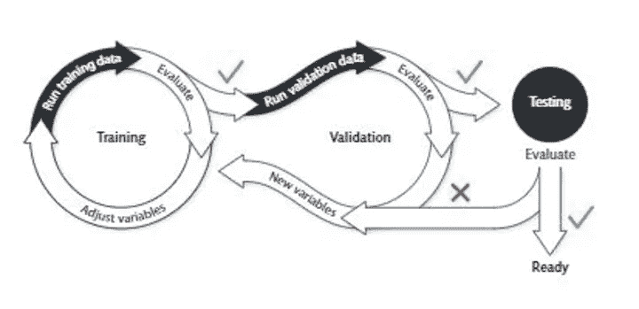

# KERAS 中的定制数据生成器

> 原文：<https://medium.com/analytics-vidhya/customized-data-generator-in-keras-29a8912760ac?source=collection_archive---------27----------------------->

数据生成器已经成为任何基于深度学习的方法的强制性代码模块。过去，我们曾经一次将整个数据集加载到 RAM 中，并多次训练我们的分类器，即使在 CPU 上工作也不会出现任何 OOM(内存不足)错误。数据生成器旨在从您的硬盘中检索小批量的数据，并将其提供给每次迭代的训练、测试和验证功能。这有助于避免 OOM 错误以及系统的突然关闭。Keras 的[教程](https://keras.io/api/preprocessing/image/)提供了不同的函数来制作你的数据生成器，例如从数据帧读取( [flow_from_dataframe 方法](https://keras.io/api/preprocessing/image/#flowfromdataframe-method))，从目录读取( [flow_from_directory 方法](https://keras.io/api/preprocessing/image/#flowfromdirectory-method))。然而，我们都需要一个可以根据我们的需求定制的数据生成器模块。

**动机**

自定义数据生成器有两个主要方面

1.  数据处理-如何存储您的数据，以便使用数据生成器轻松检索
2.  数据发生器功能

在设计我自己的第一个 data gen 时，我不得不按照我的要求努力匹配这两个方面。我正在研究一个医学领域的分类问题，其中我想针对 r.t 主题建立训练集、测试集和验证集。浏览了许多教程，我最终设计了自己的数据生成器，记住了上面的两个关键需求，使用了斯坦福的教程和博客

所以让我们开始吧...

1.  **数据处理:**

*   以您要求的文件格式分别保存每个受试者/样本/即时/观察结果。例:如果我有 100 个正常类的实例和 100 个异常类的实例。mat 文件，保存为

1_NOR.mat，2_NOR.mat，100 _ NOR.mat，1_AB.mat，…..，100_AB.mat。

*   对于分类来说，在用于训练、测试和验证之前预先定义瞬间是无害的。
*   所以形成一个字典，有关键字*‘训练’【测试】*和*‘验证’*。在每个键中，保存相应时刻的列表。
*   以下代码将帮助您做到这一点

2.**数据发生器模块**:

下一步是创建一个名为*‘label _ data’*的字典，这个字典的关键字将是实例的名称，它们的值将是它们的类标签。下面的代码做同样的事情。

最后是数据生成模块

*   我更喜欢单独的数据生成器用于训练、测试和验证。原因是，对于训练数据生成器，希望生成训练瞬间的随机序列(以便更好地训练模型)，而在验证和测试中没有这样的要求。
*   *get_input( )* 和 *get_output()* 函数将为训练、测试和验证的数据生成器所共用。这些函数将分别从你的硬盘和相关标签中载入每一个瞬间

验证生成器将与测试生成器相同。对于这个任务，这个代码还可以有其他的即兴创作。例如，在受试者具有多个瞬间的情况下，有必要将受试者的所有瞬间限于训练/测试/验证。在这种情况下，你需要修改'*分区'*字典。另一个例子是交叉验证的多次迭代。我希望它能达到目的。通过你的评论让我知道