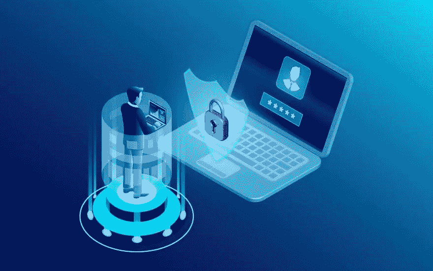
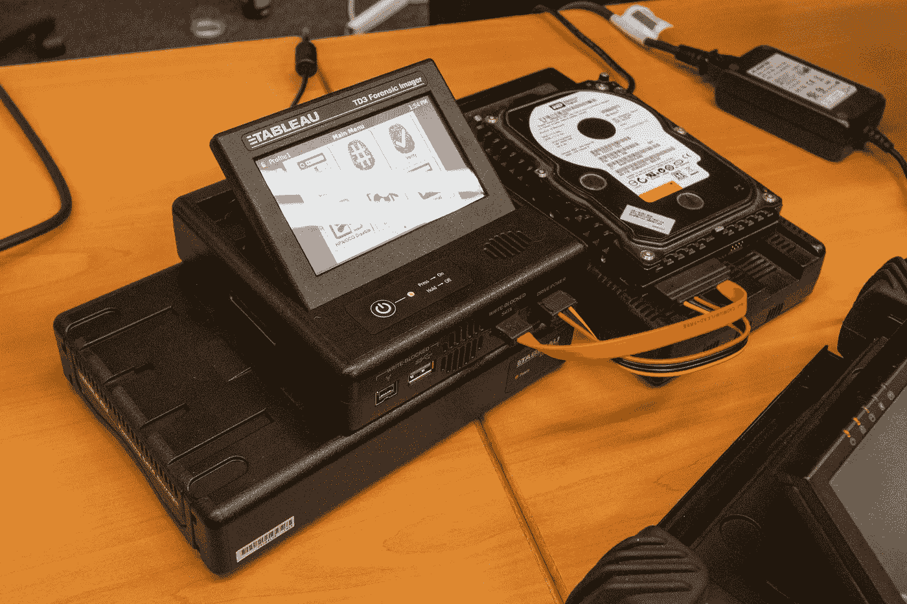

# 网络取证—时间表

> 原文：<https://medium.com/analytics-vidhya/cyber-forensics-timeline-c890609c9aa7?source=collection_archive---------11----------------------->

网络取证是网络安全的一个分支，负责收集、保存、处理和分析与计算机相关的证据，这些证据随后可能会在法庭上针对已发生的犯罪提出。他们的主要工作是通过同意法律条款来分析里面的信息，并将其作为可以证明犯罪者的证据。

网络取证的范围非常广泛，并不仅限于证据处理。这些技能可用于许多领域，如道德黑客、分析师角色、取证专家、SOC 分析师、CISO 等等

**网络取证证据处理是如何工作的？**

基本上有两个团队参与 ***现场取证团队和内部取证团队*** 。现场取证团队前往犯罪现场收集所有与硬盘、笔式驱动器、光盘驱动器、笔记本电脑、手机等系统相关的证据，并将其交付给内部取证团队。然后，该小组检查细节，并通过法医实验室将它们作为证据归档。

***所涉及的步骤***

*   该小组前往犯罪现场，现场取证小组正确获取证据，并将其交给取证实验室进行取证小组内部分析
*   然后，内部团队分析证据的状态，例如，笔记本电脑是处于关闭还是打开状态，如果处于打开状态，所有信息都将被记录下来，如果处于打开状态，则保持不变，详细信息通过实时采集照片和 RAM 中的数据获得。如果证据处于休眠状态，采集的证据将被正确地*克隆/成像，并存储在另一个系统/HDD(硬盘)中以供进一步分析*
*   *非常重要，除非有必要 ***否则不要打开或改变系统。*** 其背后的原因是，只有我们证明了原始和克隆的散列值，法庭才会接受证据。如果有一个比特发生变化，证据也会失效。*
*   *通过 Forensics Tool Kit 等工具对磁盘中的数据进行映像。*
*   *使用解剖氧气等工具或通过侦察/信息收集技术彻底分析磁盘映像、系统数据，以获得有关受害者的信息。除此之外，专注于包含登录信息、外部媒体、网络、浏览器历史的系统工件，以了解 ***数字足迹。****
*   *详细的法医报告随后提交给法院*

*从犯罪现场找到的硬盘或 u 盘连接到法医工作站和法医工具包软件，因为这是有线连接，可能会有一些数据从我们使用的系统传输到硬盘。为了根除这些因素，专家们使用 ***写拦截器来阻止数据的传输。*** 软件写拦截器—安全拦截器和硬件写拦截器— Tableau WB。*

**

*这些是网络取证专家遵循的协议或程序。探索愉快！！*