# MRI 图像的循环 GAN(生成式广告串行网络)

> 原文：<https://medium.com/analytics-vidhya/cycle-gan-generative-adveserial-network-for-mri-images-349f0cb3e67e?source=collection_archive---------8----------------------->

# 涵盖的主题

*   磁共振图像及其类型
*   什么是氮化镓及其应用
*   循环 GAN 及其体系结构
*   结论

# 磁共振图像及其类型

磁共振成像(MRI)是一种医学成像技术，用于在放射学中捕捉解剖结构的照片。MRI 扫描仪使用强磁场、磁场梯度和无线电波来生成身体器官的图像。

有各种类型的 MRI 能够捕捉不同类型的异常。因此，使用另一种类型的 MRI 可以提高诊断的准确性，从而可以对患者进行更好的治疗。

两种类型的 MRI 图像是:

*   T1 加权 MRI 图像(T1 图像)
*   T2 加权磁共振成像(T2 图像)

钛和 T2 加权磁共振成像突出不同的组成部分，如水，脂肪，肌肉和肿瘤。下表给出了比较结果

T1 和 T2 加权图像的比较

然而，创建不同类型的 MRI 图像既困难又昂贵。

医生经常一次开出一种类型的 MRI，但是如果你可以从我们已经有的一种 MRI 图像创建另一种类型的 MRI 图像，而不需要投入同样多的时间、精力和金钱，会怎么样呢？

生成对抗网络(GANs)提供了从现有的 MRI 创建另一种类型的 MRI 的可能性。在这篇博客中，我们将讨论 GAN 的一种特殊变体，称为**周期 GAN** 。

# 甘是什么？

**甘**代表生成对抗网络，这是一种算法架构，使用两个神经网络相互对抗，以生成看起来像真实数据的新的合成数据实例。蒙特利尔大学的 Ian Goodfellow 和其他研究人员在他们的[论文](https://arxiv.org/abs/1406.2661)中介绍了 gan。这个想法是如此的受欢迎，以至于脸书的人工智能研究主任 Yann LeCun 称对抗性训练是“过去 10 年中最有趣的想法”。

GANs 具有模仿任何数据分布的潜力，因此对善和恶都有巨大的潜力。甘人可以被教会在任何领域创造与我们相似的世界，比如图像、音乐、语音等等。

现在我们来了解为什么叫甘，

**生成:**在 GAN 中，网络学习生成模型，该模型根据概率模型描述数据是如何生成的。

**对抗:**使用[高级辅助设置](https://en.wikipedia.org/wiki/Adversarial_machine_learning)训练模型。

**网络:**使用深度神经网络进行训练。

gan 有两个网络**生成器**和**鉴别器**，它们以敌对关系**耦合。**生成器的任务是生成假样本数据并试图欺骗鉴别器。另一方面，鉴别器试图区分真假样品。生成器和鉴别器都是神经网络，它们在训练阶段相互竞争。更新生成器以更好地欺骗鉴别器，其中鉴别器(分类器)试图检测生成的(假的)图像，即将图像分类为假的或真实的。生成器和鉴别器互相推动，成为自己更好的版本。

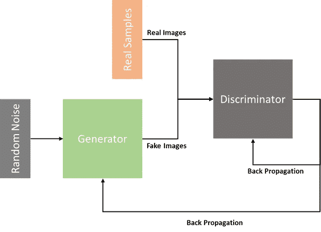

GANs 中发生器和鉴别器的优势关系

**训练阿甘:**

最初，生成器和鉴别器都是新手，不熟练。因此，来自输入噪声的发生器将产生随机哑图像。那时，鉴别者(也不是那么熟练)可以很容易地将哑图像分类为假的。因此，发生器未能降低鉴别器的误差率。这是发生器更好地产生新图像的信号。随着我们继续深入训练，生成器将产生更好的新图像，与鉴别器无法区分。现在 discriminator 被迫学习和改进。这个过程在训练过程中继续，使得生成器和鉴别器都变得更好。

**甘损失:**

*   ***鉴别器损失(分类器损失)***

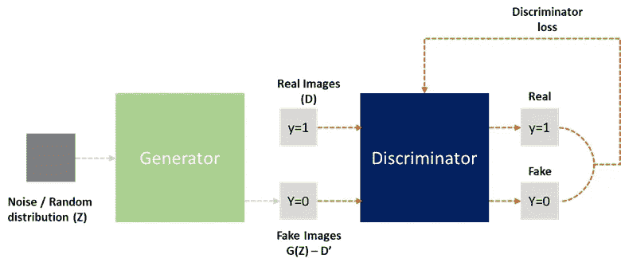

鉴频器损耗

有两个与鉴别器相关的损失函数。鉴别器对生成器生成的真实和虚假数据进行分类。鉴别器损失惩罚将真实实例误分类为假实例或将假实例误分类为真实实例的鉴别器。鉴别器的权重通过来自鉴别器网络的反向传播来更新。

在训练鉴别器时，来自真实集合的数据的标签是 y=1，而来自生成器的数据的标签是 y=0

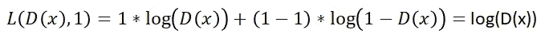

真实图像的鉴频器损耗方程

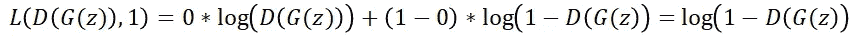

伪图像的鉴别器损耗方程

由于鉴别器的目标是正确地对假数据集和真数据集进行分类，因此应该最大化上述两个等式，并且鉴别器的最终损失函数如下所示:

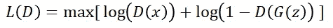

最终鉴频器损耗方程

*   ***发电机损耗***

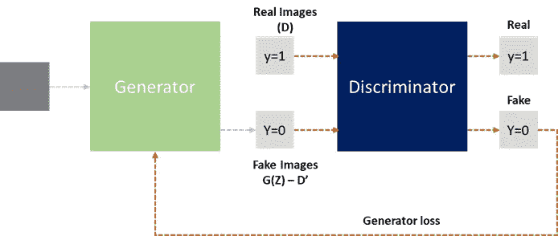

发电机损耗

发生器损耗仅取决于伪图像(由发生器网络产生)的鉴别器输出。训练发生器时，鉴别器保持固定(不训练鉴别器的权重和偏差)。这背后的原因是，鉴别器不应该变得太强，以至于将发生器的所有输出都归类为假的。从通过鉴别器和发生器的反向传播获得的梯度仅用于改变发生器的权重。

发生器的目的是欺骗鉴频器，使其尽量减少鉴频器的损耗。因为鉴别器在训练期间被冻结，所以发生器和 y=1(真实数据)不用于损失计算。因此，发电机的最终损耗函数如下所示

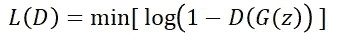

鉴频器损耗方程

**注:** 鉴别器对于真假图像都会有相似的二值交叉熵损失。

# 循环 GAN

在 GANs 中，数据是从噪声中生成的，但是如果我们想要将一种类型(风格/领域)的图像转换成另一种类型(风格/领域)的图像，该怎么办呢？在这里，普通的 GAN 网络是没有用的。我们将不得不做类似于**图像到图像**的翻译。

基于所使用的数据类型，图像到图像的转换有两种类型

*   **成对的**
    这里，你对每个输入图像都有精确的映射输出图像。对于这种翻译，使用了 pix2pix 架构
*   **不成对**
    在这里，输入和输出图像之间没有唯一的关系。不成对数据也称为**独立数据**。对于不成对方法，我们可以使用 **CycleGAN、DualGAN 和 DiscoGAN**

**不成对方法的优点是您不需要输入图像的标签。**

循环 GAN 用于从一个域生成另一个域的图像。这之所以成为可能，是因为一种叫做 U-net 的架构(下图)

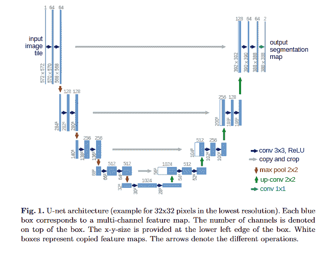

U-net 架构

在 U-net 架构中，我们首先将图像压缩到低维，然后将其扩展以实现输出图像。第一个压缩步骤称为**下采样**，第二个步骤称为**上采样**。上采样层和下采样层之间也有直接连接，称为**跳过连接**。

# **cycle gan 的架构**

循环 GAN 是 GAN 架构的扩展，涉及两个发生器模型和两个鉴别器模型的同时训练。一个生成器将来自第一域的图像作为输入并输出第二域的图像，另一个生成器将来自第二域的图像作为输入并生成第一域的图像。

现在考虑使用生成器将图像从第一域转换到第二域，然后使用另一个生成器将相同的第二域图像转换回第一域，这完成了一个循环，这就是为什么命名为循环 GAN。

但是我们为什么需要鉴别器呢？就一个 U 网不行吗？让我们试着不带偏见地理解这个问题。在没有鉴别器的情况下，我们将不得不使用 L1 或 L2 损失进行训练，这将会失败，因为它们依赖于通过逐个像素地进行差分来对输入图像进行自然映射，这并不发展领域理解。因此，当我们使用鉴别器来计算损耗时，我们的生成器被迫学习域的特征，这导致更好的结果。

**歧视者是一个新发现！！！**

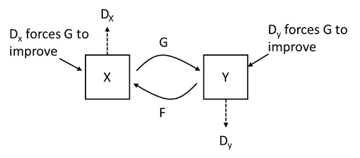

具有两个发生器和两个鉴别器的循环 GAN 架构

所以我们看到，循环 GAN 只不过是两个 GAN 一起工作，其中每个 GAN 都有自己的生成器和鉴别器。

**甘周期亏损:**

即使在周期 GAN 中，我们也会有类似于 GAN 的损耗，即鉴别器和发生器的二进制交叉熵损耗。鉴别器将计算真实和虚假数据的损失，而生成器将只计算虚假数据的损失，如前所述。除了这些损耗，GAN 循环还有额外的损耗，这些损耗仅用于发电机培训。分别是**周期一致性丢失**和**同一性丢失。**让我们详细了解一下。

**周期一致性丢失:**

由于有两个生成器，因此可以在同一域中背靠背地使用它们来生成图像。假设，生成器 **F** 从**域 Y** 转换为**域 X** ，生成器 **G** 从**域 X** 转换为**域 Y**，直观上，该图像应该等同于作为输入发送给生成器 **F** 的原始图像。因此，可以计算两幅图像(原始图像和循环生成的图像)之间的 L1(平均绝对差)损失。这种损失被认为是**循环一致性损失。**

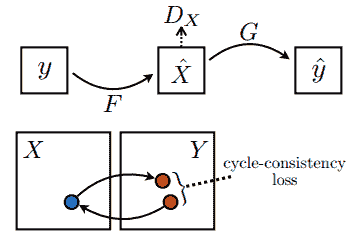

循环一致性损失

**身份丧失:**

如前所述，假设**生成器 F** 将图像从**域 X** 转换到**域 Y**，现在，如果我们将**域 Y** 的输入给**生成器 F，**预计不会改变任何东西。产生的任何差异都可以用来改进发电机。这种损耗被称为**身份损耗**，它被计算为输入和生成输出之间的 L1 损耗。

# **应用循环 GAN 在 T1 和 T2 MRI 图像之间进行转换**

本次活动使用的数据可以从[这里](https://github.com/BharathSD/CycleGAN-For-MRI/blob/main/MRI%2BT1_T2%2BDataset.RAR)下载。

**数据集由 43 幅 T1 加权图像和 46 幅 T2 加权图像组成，它们是不成对的。**

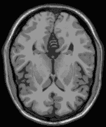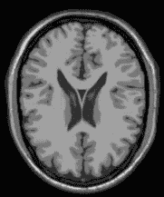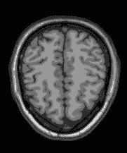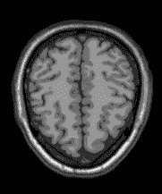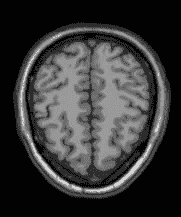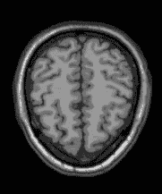

T1 加权 MRI 图像

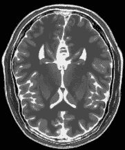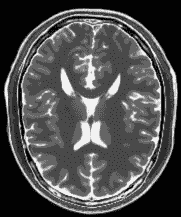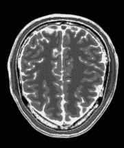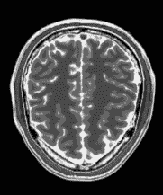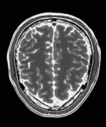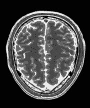

T2 加权磁共振成像图像

该应用程序是使用 Tensorflow 开发的，代码可以在 [github 存储库](https://github.com/BharathSD/CycleGAN-For-MRI.git)中找到。这依赖于下面的 python 包

*   数字-1 . 19 . 2
*   tensorflow — 2.4.1(如果您有 GPU，请使用 GPU 版本)
*   matplotlib — 3.3.2
*   撇除— 0.17.2

**应用程序遵循下面提到的管道。**

1.  导入库
2.  数据加载和可视化
3.  数据预处理
4.  模型结构
5.  模特培训

**数据预处理**步骤包括归一化-1 到+1 之间的像素值，必要时调整图像大小，并转换为 tensorflow 所需的通道最后格式。在预处理步骤之后，数据将采用(batch_size，rows，columns，channels)格式。

**模型构建**步骤包括创建发生器和鉴别器网络。代码示例如下所示。

**发电机网络:**

如前所述，发电机网络具有 U-net 类型的架构。为此，我们首先定义一个代码来构建一个 **resnet** 块

该函数将过滤器的数量作为输入，并为给定的输入层创建一个 resnet 块。现在让我们看看利用上面定义的 resnet_block 创建发电机网络的函数。

**鉴别器网络:**

在生成器和鉴别器网络中，我们都使用了一个**实例规范化层**，它极大地促进了 GANs like 架构中模块的有效学习。

**实例规范化:**

实例标准化类似于对每个图像单独应用的批量标准化。假设你有一个有 3 个通道的图像，那么对于每个图像，你会有一个平均值和方差，正如你在下面的图片中看到的，并且你对每个图像的每个通道进行归一化。

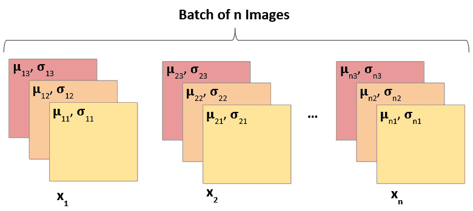

实例规范化。

要执行实例规范化，首先 u 必须调用 axes=[1，2]的 [tf.nn.moments](https://www.tensorflow.org/api_docs/python/tf/nn/moments) 来计算平均值和方差。 [tf.math.rsqrt](https://www.tensorflow.org/api_docs/python/tf/math/rsqrt) 函数可用于求方差(inv_sqrt_var)的平方根倒数，归一化值可计算为***(x—mean)* inv _ sqrt _ var***，与 ***1/stddev*** 相乘相同。

更多信息，参见[标准化](https://www.tensorflow.org/addons/tutorials/layers_normalizations)。

**实例规范化层**的代码如下所示:

将所有这些结合在一起，并在英伟达 GTX 1080 Ti GPU 上用批量大小 4 训练网络超过 800 个时期，我们在 T1 和 T2 加权图像之间的转换上获得了非常好的结果。下面的 Gif 展示了网络如何随着时间的推移学习生成图像。

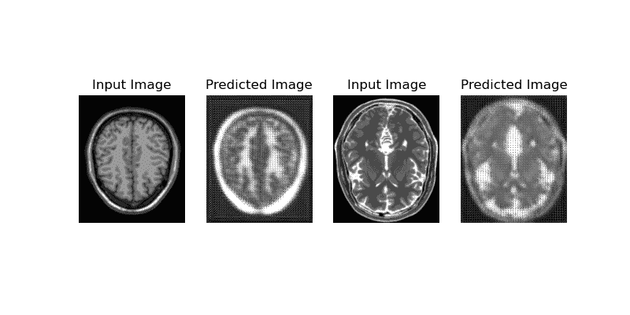

可以看出，两个生成器最初都产生垃圾结果，并且随着时间的推移(具有更多的纪元)学会在域之间转换图像。

**所有用于训练和被训练模型的代码都可以在 github**[**cycle gan-For-MRI**](https://github.com/BharathSD/CycleGAN-For-MRI)**中找到。**