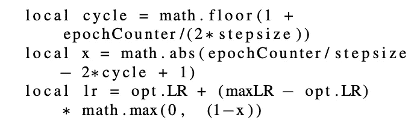

# 周期性学习率

> 原文：<https://medium.com/analytics-vidhya/cyclical-learning-rates-a922a60e8c04?source=collection_archive---------10----------------------->

以更少的迭代次数实现机器学习模型的更高精度。

学习速率影响训练时间和模型效率。学习率取决于损失函数景观，损失函数景观取决于模型架构和数据集。为了更快地收敛模型，需要一个最优的学习速率。

## 最佳学习率是多少？

导致损失急剧下降的学习率称为最佳学习率。损失减少得越快，学习率就越理想。

## 如何找到最优的学习率？

如果损失在慢慢减少，我们可以提高学习速度。如果损失在波动并增加，则学习率过高，因此需要降低它。损失函数图可以检查学习率是否足够好。

图片鸣谢:[https://cs 231n . github . io/neural-networks-3/# annealing-the-learning-rate](https://cs231n.github.io/neural-networks-3/#annealing-the-learning-rate)

从图中，我们可以看到，非常高的学习率会使损失函数发散，而高的学习率会卡在次优点。低学习率导致线性收敛，但需要更多的迭代，而高学习率导致更快的收敛。因此，找到一个好的学习率可以使我们的模型更快地收敛。

## 设定学习率的不同方法

1.  恒定学习率——在这种情况下，我们将学习率设置为某个值，该值在整个培训过程中保持不变。
2.  自适应学习率-在这种情况下，模型使用各种优化算法来改变学习率，同时训练模型。训练以较大的学习率开始，学习率逐渐降低，并且在最终模型收敛时变得太小。要了解更多这方面的内容，你可以在这里阅读。
3.  循环学习率——在这种情况下，学习率在学习率范围内波动。它从最小学习速率向最大学习速率增加，然后降低到最小学习速率。它被证明是更有效的，并导致一些模型更快的收敛。

# 循环学习率

类似于自适应学习率，学习率变化是循环的，总是返回到学习率的初始值。非常高的学习率会导致模型波动更大或偏离最小值，而较低的学习率会导致模型收敛非常慢或收敛到局部最小值。循环学习率(CLR)允许保持高和低的学习率，使得模型不会随着从局部最小值的跳跃而发散。

在 CLR 中，学习率在基本学习率和最大学习率之间波动。学习率的振荡可以基于各种函数——三角函数(线性)、韦尔奇窗(抛物线)或汉恩窗(正弦)。三角窗口是改变学习率的一种更简单的方式。

## CLR 为什么管用？

根据 [Dauphin 2014，](https://arxiv.org/pdf/1406.2572.pdf)局部极小不是优化大型深度神经网络的主要障碍，[鞍点](https://en.wikipedia.org/wiki/Saddle_point#:~:text=In%20mathematics%2C%20a%20saddle%20point,local%20extremum%20of%20the%20function.)是优化路径的关键点。

鞍点处的梯度太小，会减慢学习过程。然而，增加学习速率允许快速遍历鞍点平台。

## CLR 的变化

因为我们需要改变学习率值，所以变化是基于变化的逻辑。它可以是线性、指数或任何其他函数。

## 三角形窗户

在这种情况下，学习率改变逻辑是线性的，即我们将以某个常数从最小学习率到最大学习率增加学习率，并且将以相同的常数从最大学习率到最小学习率降低学习率。

三角窗|图片来源:【https://arxiv.org/pdf/1506.01186.pdf 

## 抛物线窗口

学习率使用抛物线函数增加或减少。

## 正弦窗

学习率使用正弦函数增加或减少。

我们将会看到一个三角形的窗户。

# LR 更新逻辑

**选择。LR** —学习率的下限

**maxLR** —最大学习率边界

**迭代** —在一个小批量上训练的网络

**epochCounter** —完成的迭代次数

**周期长度** —学习率返回初始值之前的迭代次数。

**步长** —从 opt 移动学习率所需的迭代次数。Lr 至 maxLR(周期长度的一半)。

LR 计算逻辑|图像信用:[https://arxiv.org/pdf/1506.01186.pdf](https://arxiv.org/pdf/1506.01186.pdf)

本地循环定义了当前正在进行的循环。该周期将总是恒定的，并且直到历元计数器是周期长度的倍数，该周期才改变，因此使用 math.floor。

## 估计周期长度的正确值

根据[论文](https://arxiv.org/pdf/1506.01186.pdf)，步长应该等于一个历元中迭代次数的 2-10 倍。我们可以使用数据集大小和批量大小来计算一个时期中出现的迭代。如果数据集包含 50，000 个数据条目，并且批量大小为 100，则一个时期中的迭代次数将为 500 (50，000/100)。

## 估计最小和最大学习率边界

本文提到了确定学习率边界值的简单方法。这种方法被称为“LR 范围测试”。在这种方法中，我们通过增加多个时期的学习率来运行模型。步长值保持等于您希望模型运行的所有时段中的迭代次数，以便学习率线性增加。绘制模型的图形映射精度和学习率值。当精度增加时，以及当精度下降或变得不均匀时，记录学习率值。

## 参考

1.  关于 CLR 的论文—【https://arxiv.org/pdf/1506.01186.pdf 
2.  【https://github.com/bckenstler/CLR 
3.  [https://www.jeremyjordan.me/nn-learning-rate/](https://www.jeremyjordan.me/nn-learning-rate/)