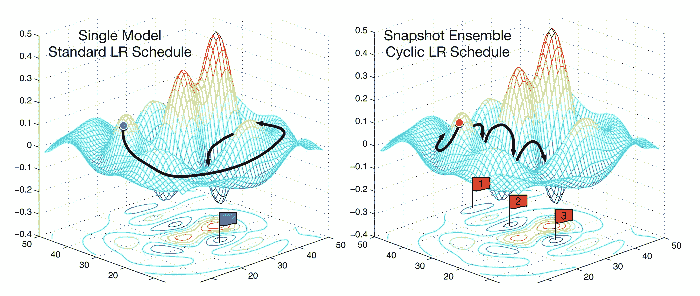
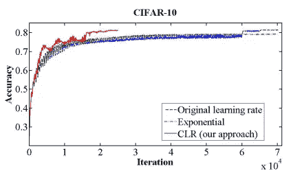
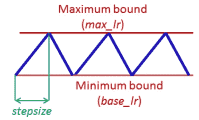
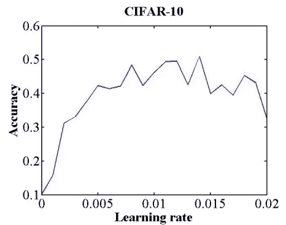
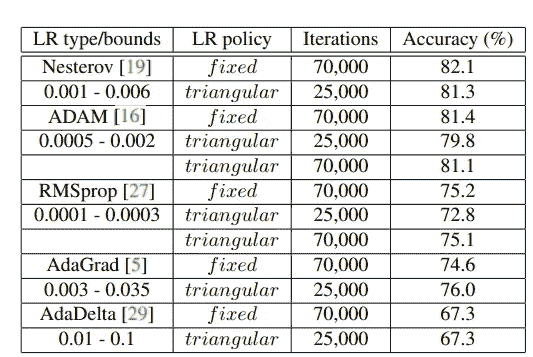
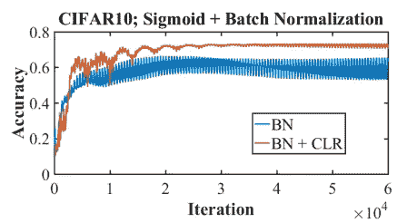

# 训练神经网络的循环学习率-论文摘要

> 原文：<https://medium.com/analytics-vidhya/cyclical-learning-rates-for-training-neural-networks-paper-summarization-744661cf6dcf?source=collection_archive---------12----------------------->

图片来自纸质快照集(https://arxiv.org/abs/1704.00109)

听从知识随着我们的分享而增加的建议，我开始了一个新的系列，在那里我将努力抓住容易实现的论文的要点。

第一行是用于训练神经网络的****——les lie n . Smith 的循环学习率。****

**本文讨论了一种调整学习速率的方法，这种方法消除了寻找最佳值和全局学习时间表的使用。这种方法不是单调地降低学习率，而是让学习率在合理的边界值之间循环变化。用循环学习率而不是固定值进行训练可以提高分类精度，而不需要调整，并且通常迭代次数更少。**

**本文在 CIFAR-10 和 CIFAR-100 数据集上验证了循环学习率的性能。在 CIFAR-10 和 CIFAR-100 数据集上，以及在具有两个众所周知的架构的 ImageNet 上，使用 ResNets、随机深度网络和 DenseNets 演示了循环学习率。结果请参考[论文](https://arxiv.org/pdf/1506.01186.pdf)。我想用这个博客来解释周期性学习率背后的直觉。**

****

**图 2 显示了 CLR 在分类准确性方面的潜在优势**

1.  **循环学习率(CLR)方法实际上消除了调整学习率的需要，但仍达到接近最佳的分类精度。此外，与自适应学习率不同，CLR 方法基本上不需要额外的计算。**

**2.**

****

**三角学习率政策。蓝线表示学习率值在界限之间变化。输入参数 stepsize 是半个周期内的迭代次数。**

**学习率在一个值的范围内变化，而不是采用逐步固定的或指数递减的值。也就是说，设置最小和最大边界，学习率在这些边界之间循环变化。使用多种函数形式的实验，如**三角形窗口(线性)、韦尔奇窗口(抛物线)和汉恩窗口(正弦曲线)**都产生了相同的结果。这导致采用三角形窗口(线性增加然后线性减少),因为它是包含这种思想的最简单的函数。**

**3.对 CLR 方法工作原理的直观理解来自于对损失函数拓扑的考虑。 [*Dauphin 等人*](https://arxiv.org/abs/1502.04390) 认为最小化损失的困难源于鞍点而不是糟糕的局部极小值。鞍点具有小的梯度，这减缓了学习过程。然而，增加学习速率允许更快地穿越鞍点平台。**

> **因此，与固定 LR 方法相比，CLR 方法中 LR 的循环增加有助于快速克服鞍点**

**4.关于 CLR 为什么工作的一个更实际的原因是，最佳学习速率可能在界限之间，并且在整个训练中将使用接近最佳的学习速率。*(当我们查看第 6 部分中选择的 CLR 范围时，这一点得到了证明)***

**5.**如何估计周期长度的合适值？****

**通过将训练图像的数量除以所使用的批次大小来计算时期。例如，CIFAR-10 有 50，000 个训练图像，批次大小为 100，因此一个时期= 50，000/100 = 500 次迭代。最终精度结果实际上对周期长度相当稳健，但实验表明，通常最好将步长设置为一个历元中迭代次数的 2-10 倍。**

**6.如何估计合理的最小和最大边界值？**

****

**分类准确度作为 8 个时期学习率增加的函数(LR 范围测试)**

**无论何时开始一个新的架构或数据集，单个 **LR 范围测试**都会提供良好的 LR 值和范围。**

**在让学习率在低 LR 值和高 LR 值之间线性增加的同时，运行您的模型几个时期。在这种情况下，学习率将在短时间内从最小值线性增加到最大值。接下来，绘制准确度与学习率的关系图(如上图所示)。当精度开始增加时，以及当精度降低、变得粗糙或开始下降时，记录学习率值。这两个学习率是边界的好选择；也就是说，将 base lr 设置为第一个值，将 max lr 设置为后一个值。**

**或者，可以使用经验法则，即最佳学习速率通常在最大学习速率的两倍之内，该最大学习速率收敛并将基 lr 设置为最大 lr 的 1/3 或 1/4。**

**7.可以推测，三角策略的好处来自于降低学习率，因为这是准确性攀升最多的时候。作为测试，实施了衰减策略，其中学习速率从最大 lr 值开始，然后线性降低到基本 lr 值，以步长迭代次数。之后，学习率固定为基数 lr。但是这种方法仅实现了 78.5%的最终准确度，这提供了证据，即增加和降低学习速率对于 CLR 方法的益处是必不可少的。*(详见 4.1.1 节论文)***

> **“提高和降低学习率对于 CLR 方法的优势至关重要”**

**8.**部分结果快照****

****

**CLR(三角形)有助于在更少的迭代中实现与固定 LR 相同的精度**

****

**批量标准化 CIFAR-10 示例**

# ****遗言****

**我希望这个博客能简单介绍一下循环学习及其优势。CLR 背后的主要动机是它能够轻松克服鞍点，并在明显更少的时期内实现更好的准确性。该方法非常容易在任何框架中实现。我在我的一个专业项目中尝试了这种方法，用于在生物医学图像分类中对预训练的 GoogleNet 进行分层微调。这帮助我用非常少的计算能力实现了更好的拟合模型。**

# ****参考文献****

**训练神经网络的循环学习率— [链接](https://arxiv.org/pdf/1506.01186.pdf)**

**非凸优化的均衡自适应学习率— [链接](https://arxiv.org/abs/1502.04390)**

**快照集— [链接](https://arxiv.org/abs/1704.00109)**