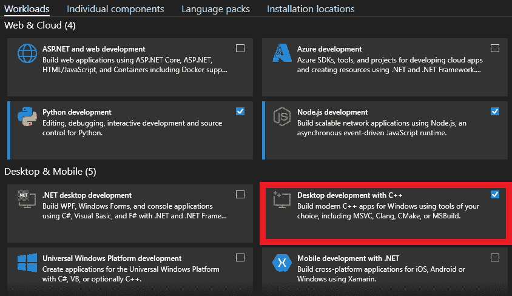
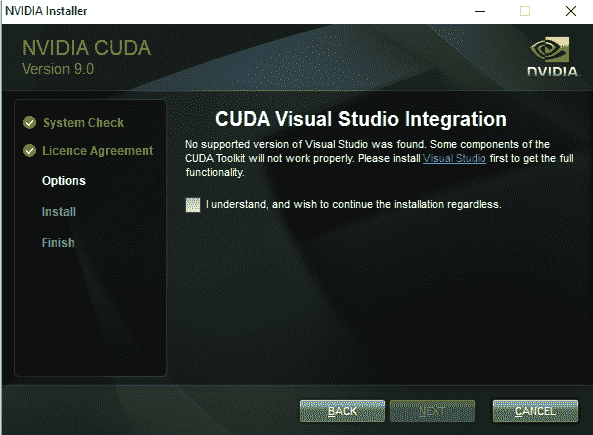
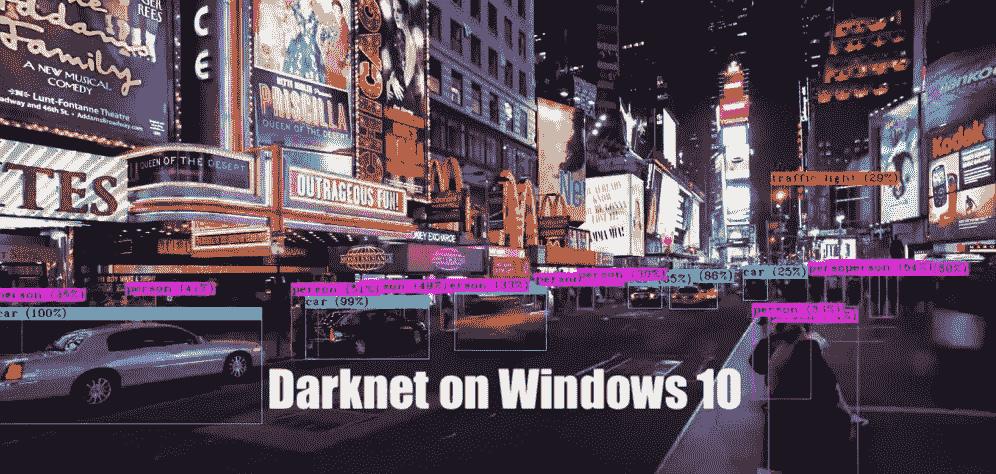

# Windows 10 上的暗网安装

> 原文：<https://medium.com/analytics-vidhya/darknet-installation-on-windows-10-fa7af9c5fd23?source=collection_archive---------1----------------------->

我们准备在 Windows 10(64 位版本)上安装 darknet。我们需要什么？

1.  Windows 10
2.  Github(桌面/Bash)
3.  蟒蛇
4.  OpenCV
5.  张量流(非强制)
6.  可视化工作室
7.  库达
8.  cuDNN
9.  黑暗网络

[ **请** **按照**给定的顺序执行指令。]

# Github:

我们需要 [github](https://git-scm.com/downloads) 。安装 github 桌面或 bash。从这里的[安装](https://desktop.github.com/)。

# 蟒蛇/迷你蟒蛇:

我们用了 [Miniconda](https://docs.conda.io/en/latest/miniconda.html) 。因为我们有 Windows 10，所以我们安装了 x64 版本。[下载](https://repo.anaconda.com/miniconda/Miniconda3-latest-Windows-x86_64.exe)并安装。或者，我们用 Python 3.8 安装了 [Miniconda。请注意。当安装程序提示输入'*时，安装为:1。只有我 2。所有用户*，请按照建议选择“只有我”。](https://repo.anaconda.com/miniconda/Miniconda3-py38_4.10.3-Windows-x86_64.exe)

# OpenCV:

打开*蟒蛇提示*【启动>蟒蛇提示】。首先，让我们为我们的安装创建一个环境。

```
$ conda create — name <ENV_NAME>
```

然后我们激活它

```
$ conda activate <ENV_NAME>
```

然后我们安装 OpenCV

```
$ conda install -c conda-forge opencv
```

为了检查它是否安装正确以及我们安装了哪个版本，让我们在 terminal/anacondapromp 上运行

```
$ python>>> import cv2>>> print(cv2.__version__)
```

如果一切顺利，我们现在有了 OpenCV。

我们的 OpenCV 建立在以下路径上:

*C:\opencv_3\opencv\*

让我们为 OpenCV 创建一个环境变量。转到`‘Start> (type) Environment Variable (on search box)’ > (Choose) Edit the Environment Variable`。

在接收窗口中，转到'`Advanced > Environment Variables’`。

在标签页中，`User Variables for <Username>:’ click on ‘New`。

现在，让我们设置**变量名**为 *OpenCV_DIR* 和**变量值**为

```
*C:\opencv_3\opencv\build**C:\opencv_3\opencv\build\x64\vc14\lib**C:\opencv_3\opencv\build\x64\vc14\bin**C:\opencv_3\opencv\build\include*
```

# CUDA:

首先，找到你的机器配置。转到“`Start > Device Manager`”。检查您的“显示适配器”的名称(如果有的话)。进入 [CUDA Wiki](https://en.wikipedia.org/wiki/CUDA) 页面，找到适合你机器的 CUDA 版本。要安装 CUDA，我们需要两样东西**首先**。 [Visual Studio](https://visualstudio.microsoft.com/vs/) 和[你的 GPU 的图形驱动](https://www.nvidia.com/en-us/geforce/drivers/)。

*例如，我们有一个 8GB 的 NVIDIA GeForce RTX 3070 Ti，具有 6144 个 CUDA 内核和多个张量内核。我们将从* [*这里*](https://www.nvidia.com/en-us/geforce/drivers/) *安装驱动程序。只需找到您系统的驱动程序，选择“Studio 版本”并下载。或者，我们可以下载“*[*GeForce Experience*](https://www.nvidia.com/en-us/geforce/geforce-experience/)*”，他们可以为我们做这些事情。*

通过面对不同的障碍，我们为我们的 Tensorflow 2.5 选择了 CUDA 11.2 和 cuDNN 8.1.0(支持 CUDA 11.2)。

# Visual Studio 社区版 2019

L et 的下载安装 [Visual Studio 社区版 2019](https://visualstudio.microsoft.com/downloads/) 先。我们在以下位置安装了 Visual Studio[C:\ Program Files(x86)\ Microsoft Visual Studio]。

**请注意**，安装 Visual Studio 时，请在“工作负载”中勾选“使用 C++进行桌面开发”。否则以后无论是用 *CMAKE* 还是 *vcpkg* 都无法编译 darknet。



# CUDA 11.2

母鸡，让我们安装 CUDA 和 cuDNN。登录您的 NVIDIA 开发者帐户。然后下载 [CUDA 11.2](https://developer.nvidia.com/cuda-11.2.0-download-archive) 。

> 操作系统:Windows
> 
> 架构:x86_64
> 
> 版本:10
> 
> 安装类型:exe(本地)[因为我们没有稳定的互联网]

我们安装了没有任何补丁的基础安装程序。

**请注意**，在安装过程中，如果你面对这个屏幕，你就完了。不要继续安装。首先，*先修复*你的 Visual Studio 安装。或者**重新安装**吧。

安装完成后，我们在下面的路径中有一个文件夹。



`*C:\Program Files\NVIDIA GPU Computing Toolkit\CUDA\v11.2*`

# cuDNN 8.0.1

我们为我们的 CUDA 11.2 安装了 cuDNN 8.0.1。你可以在他们的[实现](https://developer.nvidia.com/rdp/cudnn-archive)中找到所有与你的系统兼容的 cuDNN 版本。我们下载了[这个版本](https://developer.nvidia.com/compute/machine-learning/cudnn/secure/8.1.0.77/11.2_20210127/cudnn-11.2-windows-x64-v8.1.0.77.zip)。接下来，我们解压并复制所有文件。**然后我们将所有文件粘贴/合并到下面的路径中。**

*C:\Program Files\NVIDIA GPU 计算工具包\CUDA\v11.2*

我们的下一个任务是从

```
*C:\Program Files\NVIDIA GPU Computing Toolkit\CUDA\v11.2\extras\visual_studio_integration\MSBuildExtensions*
```

到此路径的路径

```
C:\Program Files (x86)\Microsoft Visual Studio\2019\Community\MSBuild\Microsoft\VC\v160
```

让我们为 CUDA 创建环境变量

如上所述，打开环境变量选项卡，让我们检查是否一切都在正确的位置。

在**系统变量**中:

1.  变量名:CUDA_PATH:
    变量值:C:\Program Files\NVIDIA GPU 计算工具包\CUDA\v11.2
2.  变量名:CUDA_PATH_V11_2
    变量值:C:\Program Files\NVIDIA GPU 计算工具包\CUDA\v11.2
3.  变量名:CUDA_TOOLKIT_ROOT_DIR
    变量值:C:\ Program Files \ NVIDIA GPU Computing TOOLKIT \ CUDA \ v 11.4

现在，在*系统变量*中，找到“**路径**”。现在选择它并点击“编辑”。

如果以下路径不存在，请添加它们:

```
C:\Program Files\NVIDIA GPU Computing Toolkit\CUDA\v11.2\binC:\Program Files\NVIDIA GPU Computing Toolkit\CUDA\v11.2\libnvvpC:\Program Files\NVIDIA Corporation\NVSMI
```

# 黑暗网络



我们将安装来自阿列克谢耶布的[叉子，它支持 Windows。我们将遵循这里提到的这个](https://github.com/AlexeyAB/darknet)[指令](https://github.com/AlexeyAB/darknet#how-to-compile-on-windows-using-vcpkg)，使用 vcpkg 进行安装。

首先，让我们打开“Powershell”并运行:

```
$ Set-ExecutionPolicy unrestricted -Scope CurrentUser -Force
```

那么让我们克隆它:

```
$ git clone [https://github.com/AlexeyAB/darknet](https://github.com/AlexeyAB/darknet)
```

然后，让我们转到我们克隆的目录:

```
$ cd darknet
```

在这个目录中，我们有一个' **Makefile'** 。让我们编辑它:在文件的开始，我们有-

```
GPU=0CUDNN=0CUDNN_HALF=0OPENCV=0AVX=0OPENMP=0LIBSO=0ZED_CAMERA=0ZED_CAMERA_v2_8=0
```

我们可以在 powershell 中切换这些参数。或者**编辑 GPU 的值。CUDNN，CUDNN_HALF 和 OPENCV 到 1** 。让我们取消特定图形适配器的注释行。

```
# For Tesla GA10x cards, RTX 3090, RTX 3080, RTX 3070, RTX A6000, RTX # A40 uncomment:ARCH= -gencode arch=compute_86,code=[sm_86,compute_86]
```

现在，让我们在 Powershell 中运行以下代码。

```
./build.ps1 -UseVCPKG -InstallDARKNETthroughVCPKG -EnableOPENCV -EnableCUDA -EnableCUDNN -EnableOPENCV_CUDA -InstallDARKNETdependenciesThroughVCPKGManifest
```

这是一个耗时的缓慢过程。但是如果它运行时没有任何错误，你就会在你的机器上安装**‘Darknet’**。