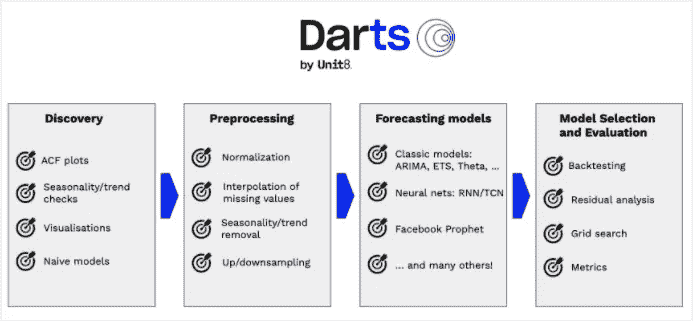
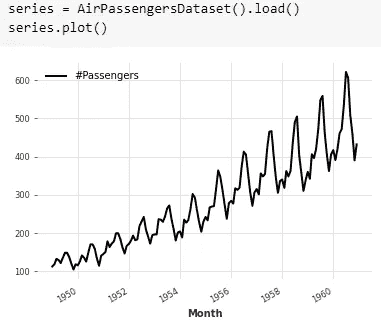
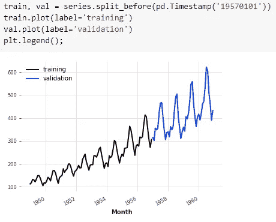
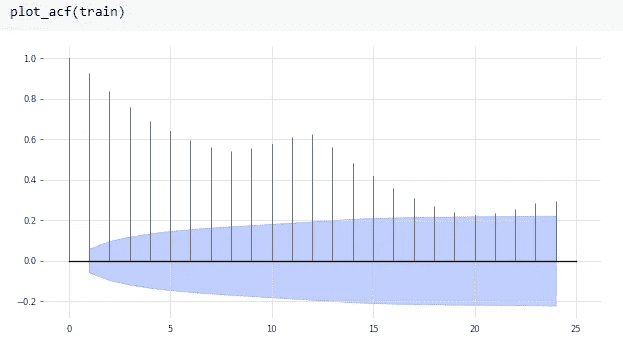
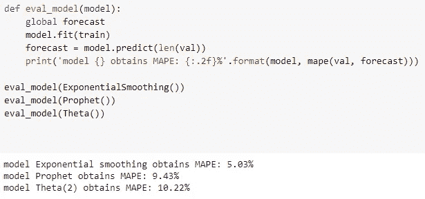
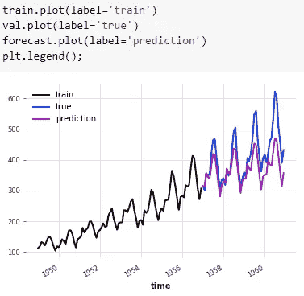
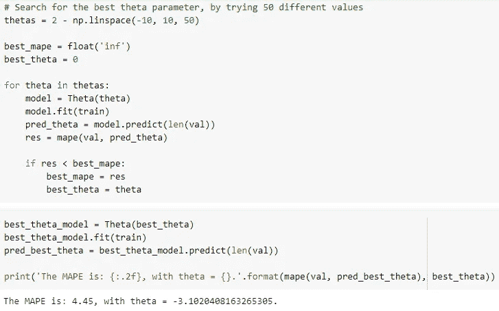
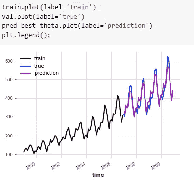

# Darts:机器学习中简化时间序列分析和预测的新方法

> 原文：<https://medium.com/analytics-vidhya/darts-a-new-approach-simplifying-time-series-analysis-and-forecasting-in-machine-learning-8edcc177ad89?source=collection_archive---------0----------------------->


D arts 是由 [Unit8](https://unit8.co/casestudies/darts-time-series-forecasting/) 开发的开源 Python 库，用于时间序列的轻松处理、预处理和预测。它包含一系列模型，从 ARIMA 等标准统计模型到深度神经网络。Darts 利用`*fit()*`和`*predict()*`函数，类似于 scikit-learn。事实上，darts 类似于 scikit-learn，但是具有专用于时间序列数据的附加功能。该库还提供对模型的回测，并结合几个模型的预测，同时分析多个模型。Darts 支持单变量和多变量统计和模型。此外，所有神经网络以及回归模型都可以在多个时间序列上进行训练。

# 为什么是飞镖？

对于非时间序列数据，您通常可以使用 [scikit-learn](https://scikit-learn.org/) 来完成大多数 ML 工作——从预处理到预测和模型选择。但是对于时间序列，我们必须使用专门的库，如 pandas 来预处理数据， [statsmodels](https://www.statsmodels.org/) 来检查季节性、趋势性、平稳性、自相关性等..和[脸书预言家](https://facebook.github.io/prophet/)作为预测模型，我们需要实现我们自己的回溯测试和模型选择例程。

**sci kit-learn——一个具有一致 API 的开源库，包含一套优秀的端到端机器学习工具。Darts 试图成为一个针对时间序列的 scikit-learn，其首要目标是简化整个时间序列机器学习体验。**

没有很多文章解释 darts 的意义，这篇博客对不知道这个库的机器学习工程师/开发人员会有帮助。因此，在这篇博客的结尾，你会学到什么是飞镖，包括技术和模型。



Unit8 通过提供示例笔记本、API 参考(如 scikit-learn ),让首次接触飞镖的人更容易清楚地了解飞镖。它预先加载了一些流行的时间序列数据集，从经典到深度学习模型的模型列表，用于测量准确性的指标，还有更多我在这篇博客中没有涉及的内容，因为 unit8 已经通过下面提到的链接中的例子清楚地解释了一切。

此外，该库还包含回测预测和回归模型、执行网格搜索、预处理时间序列、评估残差，甚至执行自动模型选择的功能，这是一件有趣的事情。

# 飞镖入门

虽然我提到，unit8 已经用例子清楚地解释了飞镖，但我还是附上我编写的学习飞镖的基本代码片段。

## **安装**

有些模型严重依赖于很少的库，如 prophet、torch 等。因此，我建议创建一个单独的 conda 环境，以确保无错误安装。

为 Python 创建一个 conda 环境(在安装 [conda](https://docs.conda.io/en/latest/miniconda.html) 之后):

```
conda create **--**name **<**env**-**name**>** python**=3.7**
```

激活您创建的虚拟环境

```
conda activate **<**env**-**name**>**
```

在所有可用型号上安装省道:

`pip install darts`

如果这在您的平台上失败，请遵循 [prophet](https://facebook.github.io/prophet/docs/installation.html#python) 和 [torch](https://pytorch.org/get-started/locally/) 的官方安装指南，然后再次尝试安装飞镖。

如果上述所有型号的安装都失败，我们也可以使用由`u8darts`包提供的如下较轻的安装。

*   仅安装核心(没有神经网络、Prophet 或 AutoARIMA): `pip install u8darts`
*   安装核心+神经网络(PyTorch): `pip install 'u8darts[torch]'`
*   安装核心+脸书先知:`pip install 'u8darts[prophet]'`
*   安装核心+ AutoARIMA: `pip install 'u8darts[pmdarima]'`

现在让我们开始编码吧！！

出于一个简单的演示目的，我使用 darts 中预加载的数据集，名为“航空乘客数据集”。



testing.ipynb

让我们将时间序列分成训练和验证序列。我在考虑训练系列到 1957 年，其余的是验证系列。



testing.ipynb

我们还可以使用 ACF 和 PACF 图来理解时间序列中的观测值与先前时间步(即平稳时间步)的观测值之间的关系强度，以及季节性，如下所示:



正如我们所看到的，随着滞后值的增加有所下降，所以我们的序列是稳定的。

现在，让我们将不同的模型拟合到我们的系列中，并从其他模型中选择一个具有较高 MAPE 的模型，如果可能的话，通过调整参数来减少误差，以增强预测。



在这些模型中，θ模型具有更高的 MAPE。让我们看看它是如何预测验证系列的。



当然，预测并不好。因此，让我们尝试用 50 个不同的值来调整 theta 参数，并再次输入数据以拟合()和预测()具有最佳 theta 值的函数。



瞧啊。:)我们可以观察到误差已经大大减小，并且预测也接近验证数据。

本文中使用的完整代码附后

testing.ipynb

我们不仅可以使用模型并调整它们，还可以对预测进行回溯测试，集成多个模型，等等。

> **注**:我安装了最新的 torch，当我尝试安装“u8darts[all]”时，弹出以下错误:
> **错误:找不到满足要求的版本 torch==1.5.1** 目前 darts 支持 torch 版本 1.5.1，为了安装 darts 不出错，建议为 darts 创建一个单独的 conda 环境并安装所需的版本，以避免此类问题。

了解更多关于飞镖的知识—[https://unit8co.github.io/darts/index.html#](https://unit8co.github.io/darts/index.html#)

# 结论

对于任何大型组织来说，时间序列分析都是数据分析最重要的方面之一，因为它有助于了解销售和分销中的季节性、趋势、周期性和随机性以及其他属性。我觉得在 Python 中使用 scikit-learn 或任何其他时间序列包的体验并不顺畅。

因此，Darts 是一个专用于时间序列的库，它使 python 中的预测变得容易，并帮助我们加快这个过程，以便-
1。降低成本。
2。提高准确性。
3。减少人工。

感谢您的阅读！希望有帮助:)