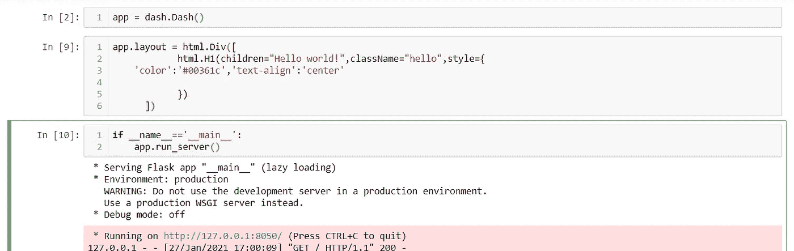
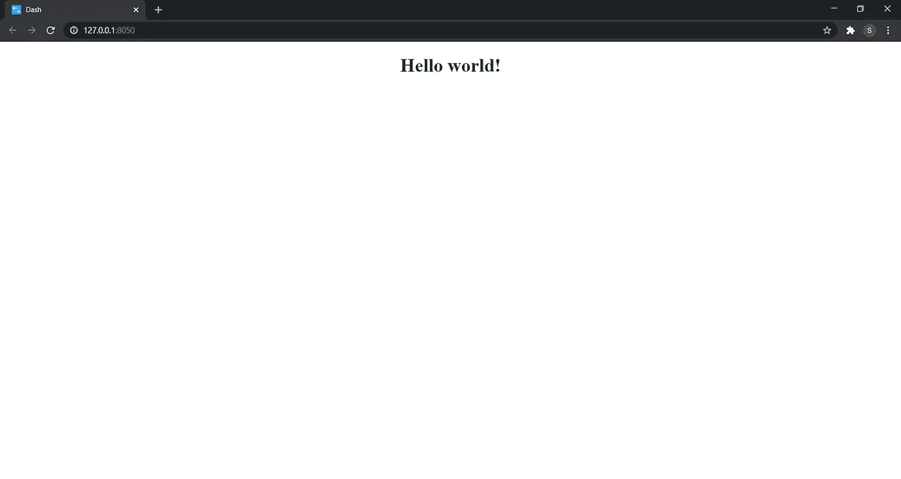
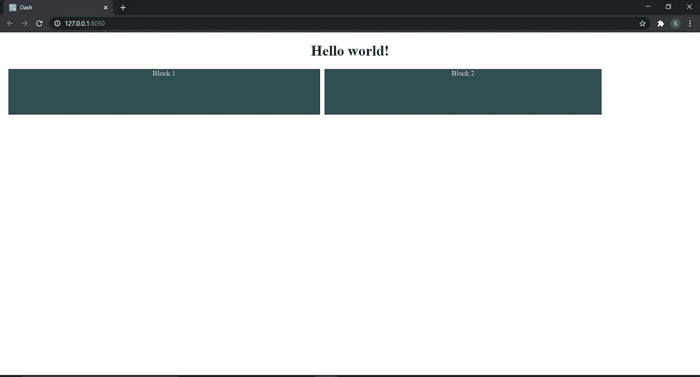

# 新手突进！[破折号-plotly-python]

> 原文：<https://medium.com/analytics-vidhya/dash-for-beginners-dash-plotly-python-fcd1fe02b749?source=collection_archive---------2----------------------->

当我在 Dash 开始一个项目时，我几乎没有资源来解决我的疑问。我不得不借助 dash 文档和其他几个网站来解决这个问题。因此，这是为了帮助你的初学者从 dash 开始，并创建自己的仪表板。

**什么是破折号？**

如果你正在寻找一种方法来在一个简单漂亮的仪表板上表现你的分析和预测，那么 Dash 就是你的答案。Dash 是一个 python 框架，主要用于构建数据可视化应用。写在 Flask，Plotly.js 和 React 上面。现在，如果您不知道所有这些是如何工作的，您不必担心，因为 Dash 实现起来非常简单和直接，您将会看到！

Dash 应用程序在 web 浏览器中呈现，并且是跨平台的。您可以将您的应用程序部署到服务器，并通过 URL 共享它们。

Dash 非常容易学习、理解和实现。如果你懂 HTML 和 CSS，dash 对你来说是小菜一碟。现在你只需要知道语法。

1.  首先，安装必要的库。

```
pip install dash
pip install dash_core_components
pip install dash_html_components
```

2.导入必要的库。

```
import dash
import dash_core_components as dcc
import dash_html_components as html
```

“仪表板”包含将在浏览器上运行的应用程序，并涉及应用程序的布局(仪表板)。
‘dash _ core _ components’包含更高级别的组件，如图表、下拉菜单、选项卡等。“dcc”使仪表盘更具互动性。
并且所有的 html 组件如 div、img、h1、h2 等都包含在‘dash _ html _ components’中。“html”可以让你定制你的仪表板，使其美观易懂。
我们用‘as’来给出一个更短更简单的别名。

3.下一步是通过创建实例来初始化应用程序。您的 dash 应用程序现在可以开始设计了。

```
app = dash.Dash()
```

4.现在我们必须创建布局。这是我们对齐仪表板的地方。这和设计一个 HTML 网站很相似。您可以在一个父 div 中嵌入一大堆 div，并随意对齐它们。让我们看一个例子

```
app.layout = html.Div([
            html.H1(children="Hello world!",className="hello",
    style={'color':'#00361c','text-align':'center'
          })
      ])
```

app.layout 存储您的仪表板的整个布局。这是您传递包含不同 div 的父 div 的地方，我们在前一节中讨论过。
html。Div()有许多参数，如“id”、“className”、“style”、“children”以及其他可能会相应变化的参数。因此有 3 种不同的方式来应用 css。这是一种方法，称为内联 css。您也可以使用外部 css 文件。您需要创建一个名为“资产”的文件夹，并在其中创建一个. css 文件，该文件将应用于您的应用程序。您可以用任何想要的名称来命名 css 文件。当您使用外部 css 时，类名帮助您定制您的仪表板。

5.运行你的应用。

```
if __name__=='__main__':
    app.run_server()
```



执行此命令后，您的应用程序现在正在运行，您可以通过提供的本地主机链接看到您的仪表板。

输出:



现在，您已经创建了第一个 Dash 应用程序，让我们来探索其他组件。dash 文档[在这里找到](https://dash.plotly.com/)非常简洁地解释了每个组件。这里有一些你可能会觉得有帮助的东西。

**如何并排显示 div？**

所以您希望在同一行中显示 div？这是如何做到的。

```
app.layout = html.Div([
            html.H1(children="Hello world!",className="hello",style={
    'color':'#00361c','text-align':'center'}),

               html.Div([
           html.Div(children="Block 1",className="box1",
                        style={
                        'backgroundColor':'darkslategray',
                        'color':'lightsteelblue',
                        'height':'100px',
                        'margin-left':'10px',
                        'width':'45%',
                        'text-align':'center',
                        'display':'inline-block'
                        }),

            html.Div(children="Block 2",className="box2",
               style={
                        'backgroundColor':'darkslategray',
                        'color':'lightsteelblue',
                        'height':'100px',
                        'margin-left':'10px',
                        'text-align':'center',
                        'width':'40%',
                        'display':'inline-block'
               })
                        ])

      ])
```

“display”:“inline-block”将父 div 内的 div 视为同一行(父 div)的列。您可以通过调整“宽度”参数来更改大小，使其总和达到 100%。或者，如果您想使用像素指定宽度，您可以使用“宽度”:“100 像素”。只要确保您添加的边距长度和填充也包含在 100%中。其他参数是不言自明的，还有很多。



输出

**试镜**

当您从仪表板传递一个值时，预期会相应地显示一个输出，这时回调就开始起作用了。它们有助于使仪表板更具交互性和代表性。现在这些值可以通过下拉菜单、输入字段、按钮等来传递。
回调的语法如下:

```
app.layout = html.Div([
html.H6("Enter a value to see the changes."),
html.Div(["Input: ",
               dcc.Input(id='my-input', value='initial value',  type='text')]),
     html.Br(),
     html.Div(id='my-output'),  ])
@app.callback(
    Output(component_id='my-output',component_property='children'),
    Input(component_id='my-input', component_property='value') )

def update_output_div(input_value):
    return 'Output: {}'.format(input_value)
```

app.callback()有两个参数 Output 和 Input。对于“输出”,您必须指定想要显示输出的 div 的 id 和输出的类型。而‘Input’指定要从其接收输入值的组件的 id，而‘value’存储从仪表板传递的值。id 为‘my _ output’的 div 是输出将在仪表板上显示的地方。每个回调都有一个将为给定回调执行的函数。它应该返回一个孩子，div 或图形的数字。

如果你需要增加空间或水平线，这里有一个小技巧可能会派上用场。

```
#dash layout code
html.Div(className='gap'),
html.Div(className='gap'),
html.Div(className='li'),
html.Div(className='gap'),
html.Div(className='li'),
```

在 assets 文件夹中创建一个 css 文件，并使用类名来定义其功能。

```
.li{
    border-bottom:thin black solid;

}
.gap{
    height:10px;
}
```

你也可以使用传统的 html。这正是我所喜欢的。这里有一些其他的方法可以修改你的水平分隔线。

这是关于如何开始使用 Dash 的简单介绍。在下一篇文章中，我将分享如何用下拉菜单选项创建图表。
希望这对您有所帮助，谢谢！下一集见。

下面是带下拉菜单的图形的链接:
[https://shraddhashkhar . medium . com/Graphs-with-drop-down-menu-in-dash-plotly-bb6cd 4295009](https://shraddhashekhar.medium.com/graphs-with-dropdown-menu-in-dash-plotly-bb6cd4295009)