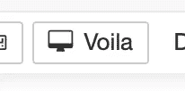
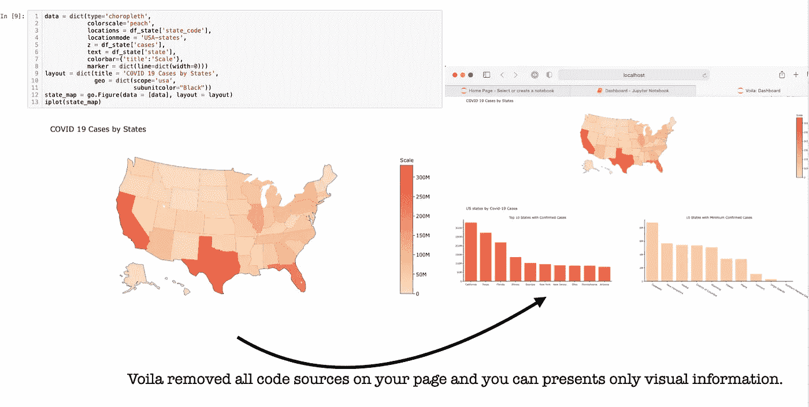
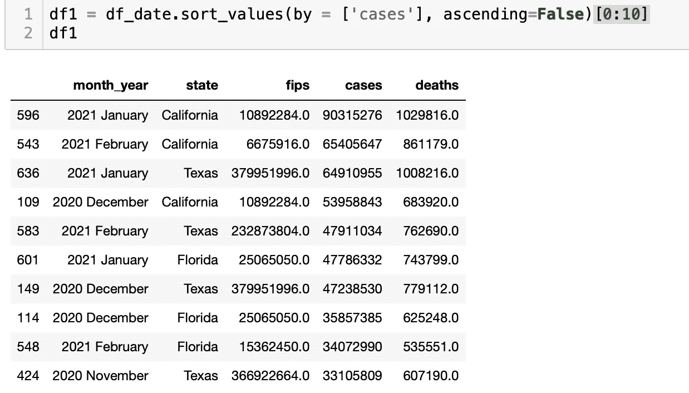
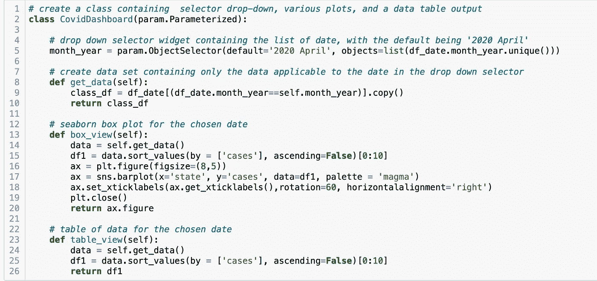
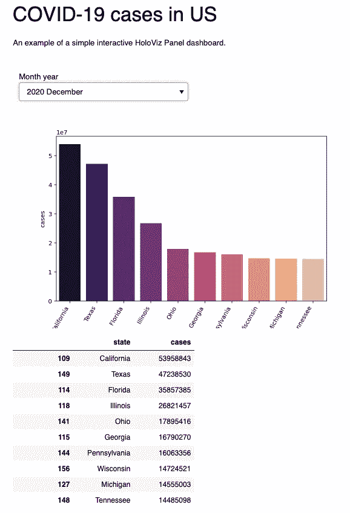

# 使用 Python 为数据科学家提供小型仪表板。

> 原文：<https://medium.com/analytics-vidhya/dashboards-for-data-scientist-with-python-f173dbb63277?source=collection_archive---------17----------------------->

日常数据科学家创建数以千计的图表和表格来代表他们的工作。共享分析结果有时会成为一大挑战。向人们传递信息的方法之一是使用仪表板。通常，所有教程听起来都像即插即用。当你试图深入这个主题时，你发现你需要知道更多一点。例如，CSS 有助于设计样式和页面布局。在这篇博客中，我想分享我创建仪表板的经验。


阿尔瓦罗·雷耶斯在 [Unsplash](https://unsplash.com?utm_source=medium&utm_medium=referral) 上拍摄的照片

## **如何开始？**

对于工作，我使用 Python。因此，我决定查看一些用于创建仪表板的库。很快，我找到了两种达到目标的方法。一种方法对我来说很简单，第二种有点复杂。

## **瞧，仪表盘**

我经常使用 Jupyter Notebook，并经常思考他的表示函数。我如何让它对项目之外的人更友好？哪些图形和情节更好地显示了我的想法？通常，该项目的演示方式是用简单的句子和良好的图像向我们展示科学。听起来耳熟吗？听起来我们在谈论仪表板。我为 Jupyter Notebook 找到了一个工具，它创建了一个可读的可视化来展示你的作品，而不需要在页面上写代码。这就是所谓的瞧。


Voila 可以用交互式小工具帮助您渲染实时 Jupyter 笔记本。只需安装一行代码，您的 Jupyter 笔记本就有了新的扩展。你可以在 [GitHub Viola](https://github.com/voila-dashboards) 找到很多关于这个扩展的信息。一行代码，Jupyter 笔记本有了新的扩展:

```
***# for*** ***conda package manager***
conda install -c conda-forge voila
```

或者

```
***# for*** ***pypi***
pip install voila
```

现在，当您运行 Jupyter 笔记本时，您可以在工具栏上看到一个新按钮:



瞧，仪表板工具栏上的新项目

如果我们在浏览器中点击这个按钮，它会打开一个名为*的新标签，瞧:仪表板*。您可以看到一个基于所有布局的仪表板示例，包括表格、图表、地图、所有类型的小部件和图形。



点击按钮后我看到的是“瞧”。

这个仪表板有一个缺点— ***用 Voila 构建的仪表板只能在您的本地计算机上本地运行*** 。所以，如果你想分享它，你需要在云上部署你的仪表盘，比如 AWS，GCP，Azure，或者 Heroku。

## HoloViz 的面板

面板是来自 [HoloViz](https://holoviz.org/index.html) 的库(之前叫 PyViz)。它有助于在 Python stay with Jupyter Notebook 中创建一个交互式绘图仪表板。**首先**，你应该安装并导入两个特定的库:

```
import param
import panel as pn
```

为交互式仪表板添加新元素:

```
pn.extension()
```

**第二个**，我们需要为探索和表现准备数据集。我仍然拥有来自 Kaggle 的数据集。我决定按月显示病例数。



我的仪表板数据集

在这里，我将日期转换为另一种格式，然后将所有信息按州和更新周期分组，并按最大案例数排序。

**第三个**，我们应该创建一个包含日期选择器下拉框和各种绘图的类，并输出一个数据表。



你的班级会是什么样子

在这里我们做到了:

*   为仪表板创建类
*   为周期创建下拉选择器
*   创建仅包含适用于下拉选择器中日期的数据的数据集

```
***# this row for applicable data***
class_df = df_date[(df_date.month_year==self.month_year)].copy()
```

*   我只添加了两个元素来显示:表格和绘图

**第四个**，我们创建该类的一个实例。我把它叫做 **db** 。它帮助我们访问在上一步中定义的与数据相关的元素。

```
***# create an instance of the class***
db = CovidDashboard(name='')
```

此外，我们在这里定义仪表板布局和内容。

```
dashboard = pn.Column(dashboard_title,**# dashboard title**
                      dashboard_desc, ***# text to describe dasboard***
                      db.param,       ***# our drop-down selector***
                      db.box_view,    ***# box plot***
                      db.table_view   ***# data table***
                     )
```

这里的 ***仪表板 _ 标题*** 和 ***仪表板 _desc*** 都是简单的字符串值。

```
***# create a title for the dashboard***
dashboard_title = '# COVID-19 cases in US'
```

**最后一步！！！！**显示仪表盘！我们使用**和*仪表盘。*** 【嵌入()】将日期嵌入仪表板。



我的仪表板

## **总结**

看起来仪表板是分享分析结果的有用工具。首先，看代码可能会吓到你，但是稍微了解一下如何阅读这些东西，一切都会变得清晰易懂。下一步，创建一个在线仪表板！=)

感谢阅读！