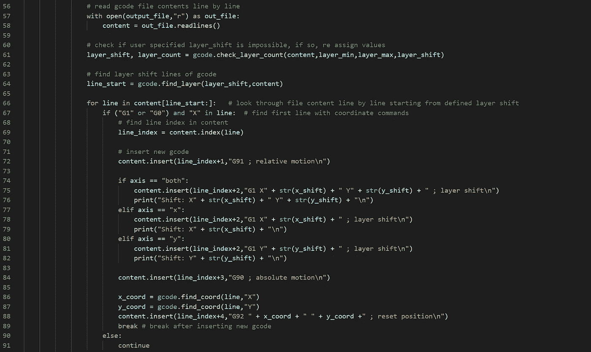
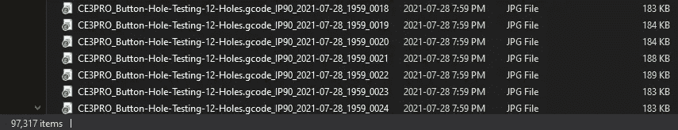

# 数据采集:故障设计

> 原文：<https://medium.com/analytics-vidhya/data-acquisition-design-for-failure-903693b0b4cb?source=collection_archive---------22----------------------->

## 我明白为什么说数据现在是世界上最有价值的资源…

来自 spaghetti.py 失败 g 代码自动化的示例代码片段

# 世界上最宝贵的资源

这不是我第一次尝试为 3D 打印创建一个基于计算机视觉的监控系统。去年夏天，当我第一次开始深入研究机器学习时，我实际上试图做与个人项目基本相同的事情。作为这个领域的新手，我在前进的道路上遇到了许多问题，包括几乎被谷歌云收取了 900 美元，因为不知不觉地使用了他们的服务。当然，作为一个一文不名的大学生，900 美元的账单很可怕，但这是我可以相对快速解决的问题，我很容易就找到了新的开源平台，可以作为更好的替代方案。我最大的问题实际上是找到一个好的数据源，因为还没有收集打印失败的图片。这让我通过各种谷歌图片搜索来寻找图片，甚至在 subreddit [r/FixMyPrint](https://www.reddit.com/r/FixMyPrint/) 中梳理失败的照片。最初几天的搜索只产生了大约 300 个例子，前景越来越糟糕。问题是，大多数人似乎不想给自己的失败拍照——谁会想到呢？有了这次经历，我明白了为什么说数据现在是世界上最有价值的资源。由于这一切，我需要设计一个更好的方法来收集高质量的数据。

# quinly——海量数据收集的完美工具

在我第一次尝试这个项目时，我还没有接触到配备了[quilly](https://www.3dque.com/)自动化的 3D 打印机。使用配备了 Quinly 系统的打印机被证明对这个项目至关重要，因为它允许我连续打印并记录不同打印故障的时间间隔，而不会遇到任何版权问题。在一台普通的 3D 打印机上尝试自己收集数据会非常耗时和乏味，这就是为什么我第一次甚至没有想到要尝试这样做。

# 机器学习需要大量数据

正如你可能猜到的那样，机器学习严重依赖于大量数据。一般来说，好的机器学习模型需要数百个(如果不是数千个的话)有代表性的图像用于每一类物体。对于我们的特定模型，我们可能需要更多，因为每个打印的模型看起来都不一样。在大多数情况下，同一类中的对象会有所不同，但没有 3D 打印那么多。我们希望建立一个健壮的通用对象检测模型，以便它能够可靠地识别故障，而不管人们选择打印什么。这就是为什么我们必须不断努力，用新的数据集来改进我们的模型，以推动模型向前发展。

# 对象检测模型的数据考虑

猫可以有不同的大小或颜色，但一般来说，他们的主要特征使他们很容易辨认。3D 打印可以有非常不同的外观，这使得制作这个模型的任务更加困难。为了获得各种各样的数据，我们试图用一系列不同的参数来改变我们所获得的图像数据。当然，我们已经改变了不同类型的故障模式。一些额外的考虑包括图像背景和照明条件，以及打印尺寸、形状、颜色和在打印故障上的位置。

# 自动化数据收集

由于 3DQue 已经实现了 3D 打印作业的自动化，我们认为也应该通过自动化来进一步优化我们的数据收集流程。为了做到这一点，我创建了多个不同的脚本，这些脚本会在 g 代码中创建特定的故障，将文件上传到 Quinly，并为每个打印作业创建一个延时。关于这些脚本如何工作的进一步解释可以在下面看到。

# 故障脚本设计

为了自动化 3D 打印失败的创建，我创建了五个 Python 脚本，这些脚本将接收输入 g 代码文件并对其进行修改，以便输出具有特定失败类型的 g 代码。每个脚本针对一种特定类型的故障，如下所示:spaghetti.py、layer_shift.py、extrusion.py、detach.py 和 clog.py。我还创建了一个名为 gcode.py 的 Python 模型来存储和导入一些有用的函数，我将在每个主故障脚本中使用这些函数。

每个脚本的一般结构有四个主要部分:定义一个参数解析器、多个文件路径循环、一个故障层定位器以及插入或更改 g 代码。所有部分一起工作，允许脚本一次输入多个 g 代码文件，并指定或随机选择失败参数，如插入失败代码的位置和输出 g 代码的失败大小。

参数解析器允许脚本用户在运行程序时在命令行中为特定的打印失败定义特定的参数。通常，所有脚本都有目标、移除、层、最小层、最大层和迭代标志。根据特定的故障类型，还有更多特定的标志。

每个脚本中有三个主要循环，以便能够运行多个输入 g 代码文件，并多次迭代每个文件。这允许在一次执行中转换大量的 g 代码，并且单个 g 代码文件具有每种类型故障的多种变化。这是通过使用最外层循环中的迭代标志定义一个范围来多次遍历文件来实现的。接下来，它输入一个“with”语句，该语句循环遍历输入目录中的文件，以定义那里有哪些文件。最后，它进入每个已定义的文件，并且只为带有。gcode 作为它们的扩展。

我创建了几个函数来定位一个随机或指定的层，以插入修改后的 g 代码。这些在 gcode.py 文件中定义，并导入到每个特定的失败脚本中，因为每个脚本中都需要它。两个主要函数是 check_layer_count()和 find_layer()。

check_layer_count()逐行查看输入 g 代码文件内容，以找到最大层数，并通过与最大层数进行比较来捕获和修复用户定义的参数错误。

已知层数，find_layer()将在 g 代码内容中查找行号。稍后，该行号可用作起始点，以确定何时插入下面的 g 代码。

每个特定脚本中的具体步骤可能会有所不同，但本质上，使用 find_layer()获取的起始行作为“for”循环中范围的开始，可以找到特定的 g 代码行。然后使用“if-else”语句来查找关键信息或插入 g 代码行。

# 自动上传 GCODE 脚本

为了自动上传“失败 g 代码”组，我创建了一个 Bash 脚本，它能够从 Google Drive 上传 g 代码文件到 Quinly，并在 Quinly 上排队打印。这是通过使用一个名为 rclone 的程序和 Quinly 的 API 来完成的。本质上，rclone 允许您将云服务连接到 Raspberry Pi，然后可以使用它在云服务之间上传和下载文件。在这个脚本中，我使用 rclone 将这组 GCODE 文件从 Google Drive 下载到 Raspberry Pi。一旦文件存储在本地，我就可以将它们上传到 Quinly，然后使用两个 Quinly 函数分两步将它们排队。

# 自动延时脚本

就数据收集而言，最重要的脚本是我编写的 timelapse.sh Bash 脚本。该脚本在 Raspberry Pi 的后台持续运行，并在重新启动时启动，因为它被设置为 cron 作业(cron 是一个调度程序，可以根据您设置的运行时间在后台执行脚本)。为了拍摄每次打印的延时，该脚本监控打印机的不同状态，以执行某些命令来启动、停止和上传延时。它还会给每组图片和视频一个特定的名称，包括 g 代码文件的名称，打印机的 IP 地址和日期/时间，这样你就可以获得同一文件的时间间隔，而不会覆盖任何以前的时间间隔。

# 当前数据收集

统一使用这些脚本可以让我们在更短的时间内获得更多的数据。在这一点上，数据收集不再是瓶颈；现在大概是数据标注。因为我们从每一个时间推移中获得了如此多的数据，我们需要在能够进行注释之前筛选和清理这些数据。

# 然后

要更多地谈论我们使用注释的经验，本系列的下一篇文章是“注释:教导机器”。尽管机器变得越来越智能，但人工数据注释仍然用于训练大多数对象检测模型。与图像分类不同，在图像分类中，通常只需要通过将图像放入命名的文件夹中或添加到图像本身的名称中来完成标记，而对象检测注释需要额外的步骤。对于对象检测，每个图像必须具有对象的边界框和标签，并且每个图像可以具有多个框和标签。这当然使得该过程更加复杂和耗时。我们目前正在处理这一部分，同时我们对已经标注的图像进行训练，但我们正在寻找更好的方法来加快这个过程。在本文中，我将定义注释的一些重要方面，展示我用来注释的软件，并探索我们将来可能会用到的注释方法。

# TL；博士:

本文是一个五部分系列的第三部分，描述了我创建一个对象检测机器学习模型的旅程，该模型将用于 [3DQue](https://www.3dque.com/) 的 Quinly 软件。在这里，我解释一下我们如何通过使用几个 Python 脚本来创建“失败”g 代码，并将这些文件上传到 Quinly，让另一个 Bash 脚本自动记录每次打印的时间间隔，从而实现数据收集过程的自动化。如果你想帮助我们收集更多的数据，一定要给我们发一些你的 3D 打印失败的图片！

# 如果您错过了本系列的前两篇文章:

 [## 自主 3D 打印之路

### 如果 3D 打印机可以通过使用计算机视觉识别抽象的 3D 打印故障来监督自己，会怎么样？

medium.com](/analytics-vidhya/the-path-to-autonomous-3d-printing-c1c0f40b461a)  [## 分类:印刷失败的方式有几种？

### 通过机器学习，Quinly 不仅可以控制你的 3D 打印机，还可以监督它。

medium.com](/analytics-vidhya/classification-how-many-ways-can-a-print-fail-80e5715edff5)