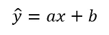
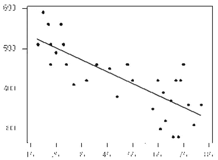
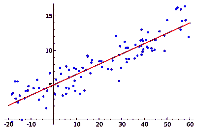
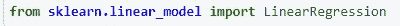
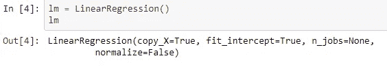
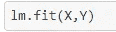
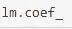

# 数据分析和线性回归

> 原文：<https://medium.com/analytics-vidhya/data-analysis-and-linear-regression-567da388c2a1?source=collection_archive---------18----------------------->

阿迪蒂·高塔姆在 [Unsplash](https://unsplash.com?utm_source=medium&utm_medium=referral) 上拍摄的照片

统计学的目的是根据样本中包含的信息对总体进行推断。总体由参数来表征，如平均值、中值或标准差。模型将帮助我们理解不同变量之间的确切关系，以及如何使用它们来预测结果。

世界上最常用的统计技术之一是回归。回归分析是对响应变量和一组解释变量之间的关系进行建模。它是所有统计技术中应用较为广泛的一种。

## 回归模型

回归模型为用户提供了目标变量和解释变量之间的函数关系，允许用户确定哪个预测变量对响应有影响。回归模型允许用户探索预测变量的特定变化对目标变量的影响。

这方面的一个例子是，找出作为目标变量的员工在公司的效率与解释变量(如类似工作经验、教育背景和以前的培训)之间的关系。

回归分析的基本思想是获得**响应(目标)变量**(有时称为因变量)和一个或多个**解释(预测)变量**(有时称为自变量)之间函数关系的模型。

回归模型的一些特征是:

*   模型提供了数据集特征的描述。
*   将响应变量与回归分析产生的解释变量相关联的方程提供了研究中未观察到的解释变量的响应变量的估计值。

回归模型最简单的形式是简单线性回归。简单线性回归是一种有助于理解两个变量之间关系的方法:

*   预测值/自变量(X)
*   响应/因变量(我们想要预测的那个)(Y)

线性回归的结果是一个线性函数，它根据预测变量(非独立变量)预测响应变量(非独立变量)。

基本上，它是一条直线的方程。常数项称为线性回归的**截距**，解释为 x = 0 时 y 的预测值。x 的系数是直线的**斜率**。换句话说，y 的预测变化是当 x 有一个单位的变化时。

斜率量化了预测值和结果之间的关系。关系可以是积极的，也可以是消极的。如果模型的斜率为正，则表示正相关，而斜率为负的线表示负相关。

负面关系

积极的关系

简单线性回归是拟合单个因变量 *y* 和单个自变量 *x* 之间预测线的直接方法。在简单回归中，基本假设是关系是线性的。

有一个术语叫做**线性假设，**它告诉我们，方程的斜率不会随着 x 的变化而变化。

## Scikit-Learn 库上的线性回归

在 Python 中，可以通过从 scikit-learn 模型导入线性回归模型来使用它。

要使用线性回归模型，我们需要创建一个对象，如下所示:

您可以将数据框中的一列用作预测变量(X)，将另一列用作响应变量(Y)。为了使用模型，我们使用拟合方法。

然后你可以做一个预测:

您还可以使用以下公式找到截距值:

斜率(或梯度)的值为:

有了这些值，你就可以找到模型的方程。

## 结论

这是一个简单的线性回归模型及其工作原理的介绍。此外，我们可以使用带有几个预测的线性模型，这可以给我们一个更复杂(不是真正)的方程。也存在多项式回归，但这将是另一篇文章的主题。

这是 IBM 关于 Python 数据分析课程的一个笔记本中的一个主题。你可以点击下一个链接查看该课程的一些主题和笔记(西班牙语)。

 [## 约瑟夫列娃/阿纳利西斯-德-达托斯-孔-Python

### Jupyter 图书馆。为 JosephLeyva/Analisis-De-Datos-Con-Python 开发做出贡献，创建一个…

github.com](https://github.com/JosephLeyva/Analisis-De-Datos-Con-Python)