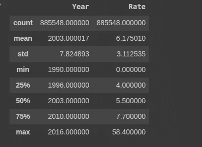
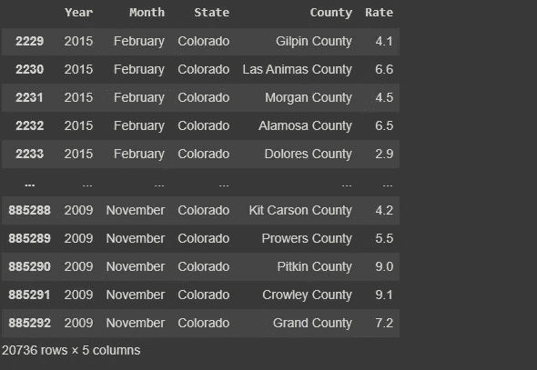
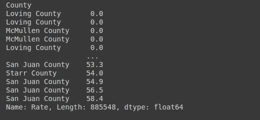

# 美国失业率数据集的数据分析与可视化

> 原文：<https://medium.com/analytics-vidhya/data-analysis-and-visualization-of-us-unemployment-rate-dataset-723df8ba96d3?source=collection_archive---------5----------------------->


可视化(照片由 [rishi](https://unsplash.com/@beingabstrac?utm_source=unsplash&utm_medium=referral&utm_content=creditCopyText) 在 [Unsplash](/s/photos/machine-learning?utm_source=unsplash&utm_medium=referral&utm_content=creditCopyText) 上拍摄)

在本文中，我将解释如何可视化和分析美国失业率数据集。分析中使用的工具包括 Python、Numpy、Pandas、Matplotlib 和 Seaborn。从这个数据集中可以得出有趣的观察结果。

## 什么是失业？

根据[公司金融机构](https://corporatefinanceinstitute.com/resources/knowledge/economics/unemployment/)的说法，失业是指那些有工作能力并积极寻找工作却找不到工作的人。这个群体包括那些有工作但没有合适工作的人。失业率是一个国家经济状况的指标之一。


一个拿着标语牌找工作的失业人员。

为了开始分析我们的数据集，我们将从从 google drive 导入数据集开始。数据集可以从 [kaggle](https://www.kaggle.com/jayrav13/unemployment-by-county-us) 下载。

```
from google.colab import drivedrive.mount('/content/drive')path = '/content/drive/MyDrive/SCA Dataset/output.csv'
```

接下来，我们将使用熊猫来读取我们的 csv 文件

```
import pandas as pd
df = pd.read_csv(path)
```

使用下面的代码，我们将看到我们的数据集是什么样子。这将显示我们的数据帧的第一行和最后一行。

```
df
```

我们的代码将输出


我们的数据集有 5 个特征—年、月、州、[县](https://www.vocabulary.com/dictionary/county#:~:text=A%20county%20is%20a%20specific,that%20manages%20each%20individual%20country.)和失业率。在数据科学中，列被称为特征。要查看数据集的前五行，请运行下面的代码

```
df.head()
```

这段代码输出


查看数据集的最后五行

```
df.tail()
```


为了查看数据集的特征，下面的代码只显示了数字列的值

```
df.describe()
```



来检查我们数据帧的形状

```
df.shape
```

代码输出


这意味着我们的数据帧包含 885548 行和 5 列。

接下来，下面的代码输出关于我们拥有的列的信息。

```
df.info()
```

这段代码输出


下面的代码检查我们的数据集中是否有任何列缺少值。

```
#Checking for missing values in our datasetdf.isnull().sum()
```

这段代码输出


上面的代码意味着我们的数据集中没有任何缺失值。

下面的代码检查数据集中有多少个县。这将输出 1752。

```
 #checking for the number of unique values in county columndf[‘County’].nunique()
```

为了检查数据集中存在的状态数，我们使用

```
#checking for the number of unique values in state columndf['State'].nunique()
```

并且这输出 47。美国有五十个主要州，这意味着我们的数据集中缺少三个州。为了让我们知道缺失州的名称，将运行下面的代码

```
states = ['Alabama', 'Alaska', 'Arizona', 'Arkansas', 'California', 'Colorado', 'Connecticut', 'Delaware', 'Florida', 'Georgia', 'Idaho', 'Hawaii', 'Illinois', 'Indiana', 'Iowa', 'Kansas', 'Kentucky', 'Louisiana', 'Maine', 'Maryland', 'Massachusetts', 'Michigan', 'Minnesota', 'Mississippi', 'Missouri','Montana', 'Nebraska', 'Nevada', 'New Hampshire', 'New Jersey', 'New Mexico', 'New York', 'North Carolina', 'North Dakota', 'Ohio', 'Oklahoma', 'Oregon', 'Pennsylvania', 'Rhode Island', 'South Carolina', 'South Dakota', 'Tennessee', 'Texas', 'Utah', 'Vermont', 'Virginia', 'Washington', 'West Virginia', 'Wisconsin', 'Wyoming']for i in states:print(i in df['State'].unique())
```

这将输出

```
True False True True True True True True False False True True True True True True True True True True True True True True True True True True True True True True True True True True True True True True True True True True True True True True True True
```

我们遗漏的三个州是阿拉斯加、佛罗里达和佐治亚。

要导入我们将用于分析的库:

```
import numpy as npimport seaborn as snsimport matplotlib.pyplot as plt
```

查找失业率最高的县

```
#Let us check for the county with the highest unemployment rateExp = df.groupby('Rate').max()Exp
```

这段代码输出


圣胡安的失业率最高，1992 年 1 月为 58.4%。圣胡安是科罗拉多州人口最少的县，截至 2010 年人口普查，人口为 699 人。人口数量少可能是导致高失业率的一个因素，20 世纪 90 年代的经济衰退也可能导致当时的高失业率，再加上 1992 年 1 月是新年，因此公司可能在上一年解雇了大量工人。

在我们继续之前，衰退是一个暂时的经济衰退时期，在此期间，贸易和工业活动减少，通常表现为连续两个季度的 GDP 下降。

让我们分析一下 20 世纪 90 年代经济衰退前后圣胡安的失业率。我们将从包含圣胡安县的行开始

```
#Getting rows of San Juan County Colorado onlyc = df.loc[(df['County']=='San Juan County') & (df['State']=='Colorado')]print(c)
```

这段代码输出


```
#Plotting San Juan unemployment rate around the years surrounding 1990s Recessionfig, (ax1, ax2, ax3) = plt.subplots(1, 3,figsize=(30,8))group = c.loc[c['Year']==1990]sns.pointplot(group['Month'], group['Rate'], alpha=0.8, ax=ax1)gp = c.loc[c['Year']==1991]sns.pointplot(gp['Month'], gp['Rate'], alpha=0.8, ax=ax2)ax2.set_ylabel("")gop = c.loc[c['Year']==1992]sns.pointplot(gop['Month'], gop['Rate'], alpha=0.8, ax=ax3)ax3.set_ylabel("")plt.show()fig, (ax1, ax2, ax3) = plt.subplots(1, 3,figsize=(30,8))group_2 = c.loc[c['Year']==1993]sns.pointplot(group_2['Month'], group_2['Rate'], alpha=0.8, ax=ax1)gp_2 = c.loc[c['Year']==1994]sns.pointplot(gp_2['Month'], gp_2['Rate'], alpha=0.8, ax=ax2)ax2.set_ylabel("")gop_2 = c.loc[c['Year']==1995]sns.pointplot(gop_2['Month'], gop_2['Rate'], alpha=0.8, ax=ax3)ax3.set_ylabel("")plt.show()
```

上面代码的输出可以在下面找到，图表是按照我们代码中输入的年份的时间顺序绘制的。


在上图中，我们将会看到在 20 世纪 90 年代的经济衰退期间，失业率是如何逐月上升和下降的。1990 年 1 月开始时失业率为 15.0，12 月结束时失业率为 12.5，衰退从 1990 年 7 月开始，到 1991 年 3 月结束。1991 年 3 月以后，失业率开始呈指数增长。影响从 1991 年 8 月开始真正感受到，并在 1992 年 1 月达到历史最高点。似乎经济衰退的影响直到几个月后才在失业率中感觉到。我们可以观察到的另一件事是，Jan 的失业率保持不变，这支持了我们的论点，即这可能是因为公司在今年第四季度裁员。

```
#How many times a state appeared in our datasetstate_count = df.groupby('State').count()print(state_count['Year'])
```

这段代码输出


为了可视化上面的输出，将运行以下代码

```
#Let us visualize how many times a state appeared in our datasetcolor = sns.color_palette()cnt_st = df.State.value_counts()plt.figure(figsize=(12,8))sns.barplot(cnt_st.index, cnt_st.values, alpha=0.8, color=color[4])plt.ylabel('Appearance counts', fontsize=12)plt.xlabel('States', fontsize=12)plt.title('State Counts', fontsize=15)plt.xticks(rotation='vertical')plt.show()
```

这段代码输出


德克萨斯州在我们的数据集中出现最多的原因是因为它是人口第二多的州，也是县最多的州。德克萨斯州有 254 个县。

```
#Highest Unemployment rate by stategroup = df.groupby(['State'])['Rate'].max()group
```

这段代码输出


要可视化上面的输出:

```
group = df.groupby(["State"])["Rate"].aggregate("max").reset_index()plt.figure(figsize=(12,8))sns.pointplot(group['State'].values, group['Rate'].values, alpha=0.8, color=color[2])plt.ylabel('Max rate', fontsize=12)plt.xlabel('States', fontsize=12)plt.title("Highest Rates of Unemployment by States", fontsize=15)plt.xticks(rotation='vertical')plt.show()
```

这段代码输出


科罗拉多州失业率最高可能是由于以下因素

1.  圣胡安县的影响力。
2.  地理位置-干旱沙漠、河流峡谷和白雪覆盖的落基山的多样化景观，部分受到落基山国家公园的保护。许多公司可能不想在这里立足。

```
#Let us analyze colorado and texas in comparison to recession years#the reason why we would be focusing on this two states is because they are the state with the highest unemployment rateh= df.loc[df['State']=='Texas']h #texas has no value for 2008 and 2009
```

此代码输出:


```
#the recession years were 1990-1991, 2001, 2007-2009fig, (ax1, ax2, ax3) = plt.subplots(1, 3,figsize=(30,8))Tx = h.loc[h['Year']==1990]#the recession started july of 1990 and ended march 1991sns.pointplot(Tx['Month'], Tx['Rate'], alpha=0.8, ax=ax1)Tx2 = h.loc[h['Year']==1991]sns.pointplot(Tx2['Month'], Tx2['Rate'], alpha=0.8, ax=ax2)ax2.set_ylabel("")Tx3 = h.loc[h['Year']==2001]sns.pointplot(Tx3['Month'], Tx3['Rate'], alpha=0.8, ax=ax3)ax3.set_ylabel("")plt.show()fig, (ax1, ax2, ax3) = plt.subplots(1, 3,figsize=(30,8))Tx_2 = h.loc[h['Year']==2007]sns.pointplot(Tx_2['Month'], Tx_2['Rate'], alpha=0.8, ax=ax1)Tx2_2 = h.loc[h['Year']==2010]sns.pointplot(Tx2_2['Month'], Tx2_2['Rate'], alpha=0.8, ax=ax2)ax2.set_ylabel("")Tx3_2 = h.loc[h['Year']==2011]sns.pointplot(Tx3_2['Month'], Tx3_2['Rate'], alpha=0.8, ax=ax3)ax3.set_ylabel("")plt.show()
```

此代码输出:


上面的图表非常有趣，因为我们将逐月用我们的失业数据来分析衰退年份。德克萨斯州下面有很多县，所以我们的图表显示了所有县每月的峰值、中点和低点。衰退始于 1990 年 7 月，但我们没有那个月的数据，所以让我们看看 1990 年有数据的月份。直到 1991 年 1 月，失业率才开始呈指数增长，失业率在 1991 年 2 月达到顶峰。衰退于 1991 年 3 月结束。

第二次衰退(9/11)始于 2001 年 3 月至 11 月，失业率在 2001 年 5 月后开始显著上升。经济衰退的影响似乎是在失业开始几个月后才显现，而不是立即显现。

第三次衰退(大衰退)从 2007 年 12 月持续到 2009 年 6 月。遗憾的是，我们的数据集没有德克萨斯州 2008 年和 2009 年失业率的数据，所以我可能无法建立我想要建立的联系，但让我们看看 2007 年 12 月，12 月的失业率是否高于之前的几个月？遗憾的是，我们的数据集不包含 2007 年 12 月的数据。

```
#Getting colorado rows onlyz= df.loc[df['State']=='Colorado']z
```

此代码输出:



可视化衰退年代的科罗拉多州:

```
fig, (ax1, ax2, ax3) = plt.subplots(1, 3,figsize=(30,8))zx = z.loc[z['Year']==1990]sns.pointplot(zx['Month'], zx['Rate'], alpha=0.8, ax=ax1)zx2 = z.loc[z['Year']==1991]sns.pointplot(zx2['Month'], zx2['Rate'], alpha=0.8, ax=ax2)ax2.set_ylabel("")zx3 = z.loc[z['Year']==2001]sns.pointplot(zx3['Month'], zx3['Rate'], alpha=0.8, ax=ax3)ax3.set_ylabel("")plt.show()fig, (ax1, ax2, ax3) = plt.subplots(1, 3,figsize=(30,8))zx_2 = z.loc[z['Year']==2007]sns.pointplot(zx_2['Month'], zx_2['Rate'], alpha=0.8, ax=ax1)zx2_2 = z.loc[z['Year']==2008]sns.pointplot(zx2_2['Month'], zx2_2['Rate'], alpha=0.8, ax=ax2)ax2.set_ylabel("")zx3_2 = z.loc[z['Year']==2009]sns.pointplot(zx3_2['Month'], zx3_2['Rate'], alpha=0.8, ax=ax3)ax3.set_ylabel("")plt.show()
```

这将输出:


1990 年最后一个季度，失业率似乎大大低于第一、第二和第三季度，尽管第二季度末开始出现衰退。

1991 年，失业率开始大幅上升。所有这些都支持我们的论点，即失业率在衰退开始几个月后才会受到显著影响。实际上，当衰退处于中期、即将结束或已经结束时，它就开始受到影响。

2001 年的衰退是从 3 月到 11 月，直到当年第三季度后才出现指数增长。这支持了我们在上一段中的陈述。

2007 年，失业率较低，最高为 4.6%，这是在衰退(2007 年 12 月至 2009 年 6 月的大衰退)开始之前的一月份。然后在 2008 年 1 月，失业率开始稳步攀升，最高失业率从 4.9 开始，到 12 月超过 5.5，2009 年没有下降。

经济衰退不会立即影响失业率，但它的影响会在开始后的几个月里显现出来。

```
#Unemployment rate by countygroup = df.groupby(['County'])['Rate'].max()print(group)
```

这段代码输出


```
#Sorting unemployment rate from the lowest to the highestindex = df.set_index('County')Sort = index.sort_values(by=['Rate'])Sort['Rate']
```

这段代码输出



```
#Counties with low unemployment rate are Loving County and McMullen CountySort['Rate'].head(20)
```

这段代码输出


德克萨斯州麦克马伦县经济雇用 230 人。德克萨斯州麦克马伦县最大的行业是农业、林业、渔业和狩猎(56 人)、公共管理(27 人)和制造业(21 人)。麦克马伦县的平均年龄为 40 岁，圣胡安县为 51 岁，洛夫县的平均年龄为 55 岁。截至 2017 年，麦克马伦县人口为 600 人，爱县人口为 74 人，2017 年圣胡安县人口为 569 人。

圣胡安县的经济公司雇用 310 人。在圣胡安县，最大的行业是零售贸易(56 人)、住宿和餐饮服务(41 人)以及专业、科学和技术服务(34 人)。

德克萨斯州爱县经济雇用 36 人。德克萨斯州 Loving County 最大的行业是批发贸易(11 人)、采矿、采石、石油和天然气开采(10 人)以及房地产和租赁(6 人)。

有趣的是，圣胡安的房产价值中值最高，为 286，700 美元。让我们来比较一下麦克马伦和乐文县的人口，麦克马伦是 106600 人，乐文是 224466 人

所有这些数据说明了什么？经济衰退后圣胡安人失业率最高的原因可能是因为以下因素:

1.  高房产价值——当许多人将大部分收入用于抵押贷款时，他们将没有能力购买其他东西(汽车、购物等)—这意味着他们不会在他们认为对他们来说不必要的东西上花费，当他们不花费这些时，会影响提供这些服务的公司，他们将没有能力雇用更多的员工，或者他们将不得不解雇已经拥有的员工。这可以直接推断出来，因为圣胡安雇佣最多人的行业是零售业。
2.  年龄中位数-圣胡安最大的行业是 51 岁，这是一个老年人群，他们可能没有能力在圣胡安最大的行业工作。

```
#Unemployment rate by Yeargroup = df.groupby(["Year"])["Rate"].aggregate("max").reset_index()plt.figure(figsize=(12,8))sns.pointplot(group['Year'].values, group['Rate'].values, alpha=0.8, color=color[8])plt.ylabel('Max rate', fontsize=12)plt.xlabel('Year', fontsize=12)plt.title("Highest Rates of Unemployment by Year", fontsize=15)plt.xticks(rotation='vertical')plt.show()
```

此代码输出


让我们研究一下上面的图表。1992 年，失业率创下了长达 8 个月的海湾战争衰退(1990-1991)后的历史新高，这次衰退是由伊拉克入侵科威特引起的。这导致 1990 年油价飙升，导致制造业贸易销售额下降。此外，随着北美自由贸易协定(NAFTA)条款的生效，制造业转移到了海外。此外，联合航空的杠杆收购引发了股市崩盘。所有这些导致了许多裁员和招聘冻结，因为 1992 年美国国内生产总值增长和就业创造疲软(衰退期间约有 162.1 万个工作岗位被裁减)。

1995 年，我们可以看到失业率低于其他年份，这是因为 1994 年春季国内生产总值增长迅猛，创造的就业机会数量(385 万个)创下了截至 2015 年仍未被超越的记录。但 1995 年经济增长将出现停顿，主要是因为美联储从 1994 年底开始将利率从 3%提高到 6%，以防止在如此快速的增长以及两次政府关闭导致经济放缓后通货膨胀率上升。然而，这种停顿是短暂的，因为经济进行了调整，对网络泡沫的投资激增将从 1995 年底开始推动经济。1996 年恢复了稳定增长，1997 年 5 月失业率略有上升，但 1998 年有所下降，因为美国多年来第一次出现 692 亿美元的盈余，而不是上一年的赤字。美国经济的繁荣，加上 1990 年的综合预算调节法和 1993 年的综合预算调节法(增加税收和限制支出)，使联邦政府从 1992 年的 2900 亿美元赤字增加到 2000 年创纪录的 2364 亿美元盈余。政府借款的减少为企业和消费者释放了市场资本，导致贷款利率下降，形成了一个只会加速增长的循环。政府债务从 1990 年的 5.02 万亿美元增加到 1997 年的 5.413 万亿美元，2000 年持平，仅增加到 5.674 万亿美元。

2001 年，由于互联网泡沫破裂导致的 9/11 衰退(2001 年 3 月至 2001 年 11 月)，失业率上升，9/11 袭击以及美国大公司的一系列会计丑闻导致美国经济相对温和的收缩。在接下来的几个月里，国内生产总值恢复到以前的水平，失业率稳步下降。

2005 年失业率急剧上升，这是由于 1995 年的住房危机导致紧缩开支，因为利率上升和房屋销售停滞削弱了消费者支出。这种情况一直持续到大萧条时期(2007 年 12 月至 2009 年 6 月)，大萧条是本世纪头十年房地产泡沫的破裂，导致了创纪录的止赎和金融危机，使全球市场陷入混乱。2008 年年中，油价飙升至创纪录高位，随后暴跌，重创了美国石油行业。

2012 年失业率下降，这可能是由于经济好转，因为

首先，美联储以更多货币刺激的形式不断推波助澜。美联储依靠各种形式的量化宽松政策，于 2012 年 9 月和 12 月分别宣布了 QE 3 和 QE 4。这使得利率保持在低位。

其次，在联邦法院就机器人签名指控与银行达成和解后，止赎开始减少。因此，住房市场有所改善。

第三，消费者还清了债务，恢复了购物。尽管信用卡使用率较低。但美联储的货币刺激导致消费者贷款利率下降。这使得人们可以申请汽车、家具和教育贷款。2012 年，经济创造了 243 万个就业机会，就业人数从 2011 年 12 月的 1.409 亿增加到 2012 年 12 月的 1.4333 亿。失业状况确实有所改善，失业率从 8.5%降至 7.9%。失业人数从 1309 万下降到 1230 万。总之，影响失业的因素有经济衰退、住房危机、金融危机等。

```
#Unemployment rate by monthgroup = df.groupby(["Month"])["Rate"].aggregate("max").reset_index()plt.figure(figsize=(12,8))sns.pointplot(group['Month'].values, group['Rate'].values, alpha=0.8, color=color[5])plt.ylabel('Max rate', fontsize=12)plt.xlabel('Month', fontsize=12)plt.title("Highest Rates of Unemployment by Month", fontsize=15)plt.xticks(rotation='vertical')plt.show()
```

这段代码输出


一月份的失业率最高，因为公司会在新年开始前的 12 月份裁员。

总之，很多因素影响失业，但我们可以看到，经济衰退和住房危机是最重要的因素之一。因此，为了降低这些州的失业率，需要考虑这些因素。感谢您的阅读。如果你有任何问题，请在评论区留言。

用于此分析的 Colab 笔记本的链接可以在[这里](https://colab.research.google.com/drive/17O2QTzLG9H4cF8TH3pdHI9z-lS1bynYE?usp=sharing#scrollTo=cuSs_d2ma8uf)找到。这篇文章的作者可以通过 minaomobonike@gmail.com 的*联系到。*