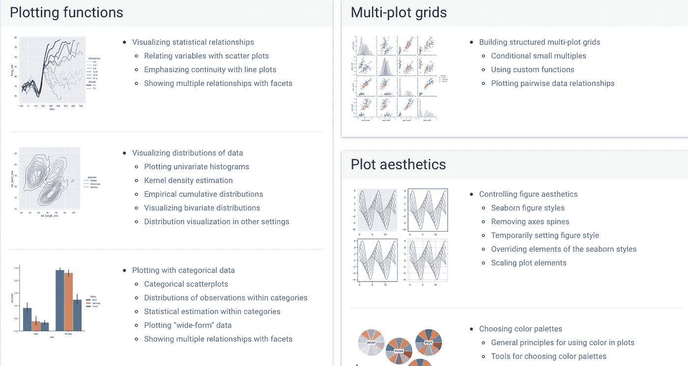
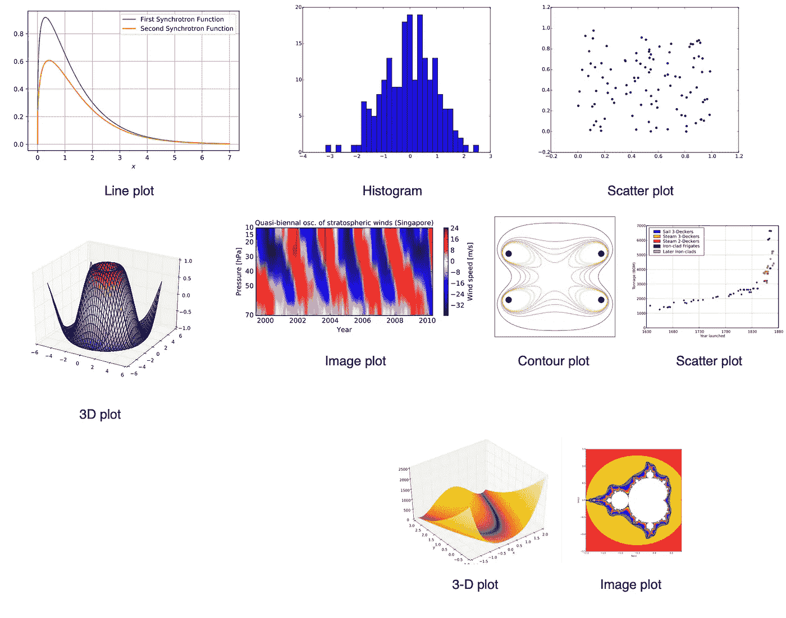
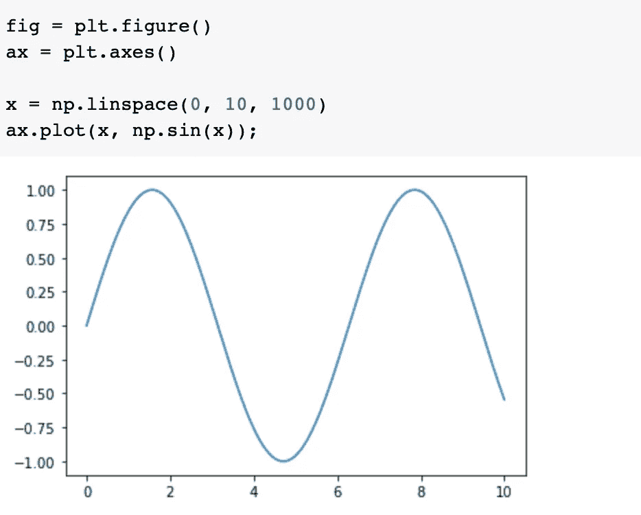
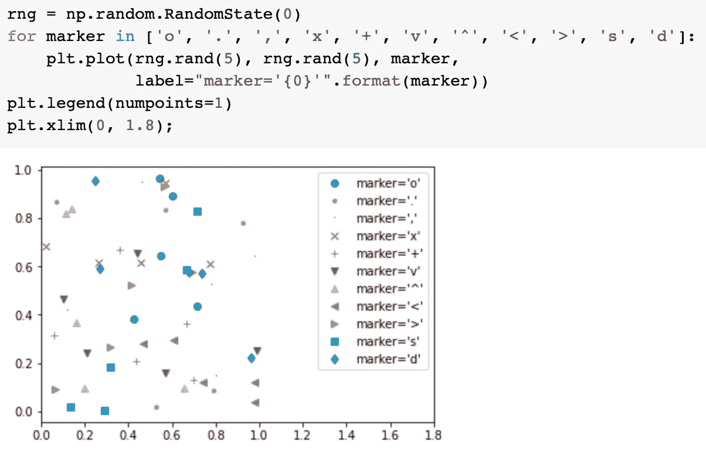
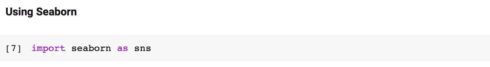
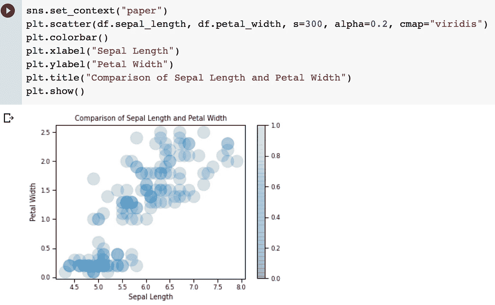

# 使用 Python 进行数据分析和可视化— 2

> 原文：<https://medium.com/analytics-vidhya/data-analysis-and-visualization-with-python-2-584428dbc16a?source=collection_archive---------24----------------------->

我们继续对我在上一篇文章中使用的 Iris 数据集进行可视化。有两个最常用的库用于数据可视化。在这些库中，matplotlib 被很多人知道，就像我知道的一样。此外，我们的第二个图书馆是 seaborn。在本文中，我们将在库的帮助下见证数据的可视化。

🔐你需要输入我使用的 Colab 链接的链接。

## 数据可视化库

1.Seaborn:统计数据可视化库

Seaborn 是一个基于 Matplotlib 的 Python 数据可视化库。它提供了一个高级界面来绘制有吸引力和信息丰富的统计图。请访问设置页面，了解如何下载软件包并开始使用它。

我们可以说与 Matplotlib 相比的区别在于它有更多的定制选项。

在我上面给出的图片中，我们看到了如何通过 Seaborn 来可视化数据。可以用许多不同的图形和形式显示我们的数据。

2.Matplotlib:用 Python 可视化

Matplotlib 这是一个用于在 Python 中创建静态、动画和交互式可视化的综合库。

Matplotlib 最初是由 [John D. Hunter](https://en.wikipedia.org/wiki/John_D._Hunter) 编写的，从那以后就有了一个活跃的开发社区。

同样，在我这里给出的可视化中，也有可以用 Matplotlib 制作的可视化表单。

🧷点击[链接](https://matplotlib.org/3.3.3/tutorials/introductory/sample_plots.html)查看 Matplotlib 库中的绘图或图形。

*   **线图:**以直线显示两个变量之间的关系。

*   **散点图:**顾名思义，两个变量之间的这种关系表现为分布的点。

✨:我想使用 seaborn 库来测量 Iris 数据集中变量之间的关系。

在我们的项目中包含了 Seaborn 库之后，我们通过输入各种参数来提供图表。这里，我们比较了数据帧中 sepal_length 和 petal_width 属性之间的关系。cmap 变量是决定我们在图表中使用的调色板的变量。它可以根据要求进行更改。变量表示散点图中点的大小，这里以点的形式给出。

我们已经到了另一篇文章的结尾。保持健康✨

# 参考

1.  [https://seaborn.pydata.org。](https://seaborn.pydata.org./)
2.  [https://matplotlib.org。](https://matplotlib.org/)
3.  机器学习日| Merve Noyan |数据可视化| Study Jams 2 |，[https://www.youtube.com/watch?v=JL35pUrth4g&t = 640s。](https://www.youtube.com/watch?v=JL35pUrth4g&t=640s)
4.  Matplotlib，维基百科，自由百科，【https://en.wikipedia.org/wiki/Matplotlib】T2。
5.  [https://jakevdp . github . io/python datascience handbook/04.02-simple-scatter-plots . html](https://jakevdp.github.io/PythonDataScienceHandbook/04.02-simple-scatter-plots.html)。
6.  [https://jakevdp . github . io/python datascience handbook/04.01-simple-line-plots . html](https://jakevdp.github.io/PythonDataScienceHandbook/04.01-simple-line-plots.html)。
7.  [https://matplotlib . org/3 . 1 . 1/tutorials/colors/colormaps . html](https://matplotlib.org/3.1.1/tutorials/colors/colormaps.html)。