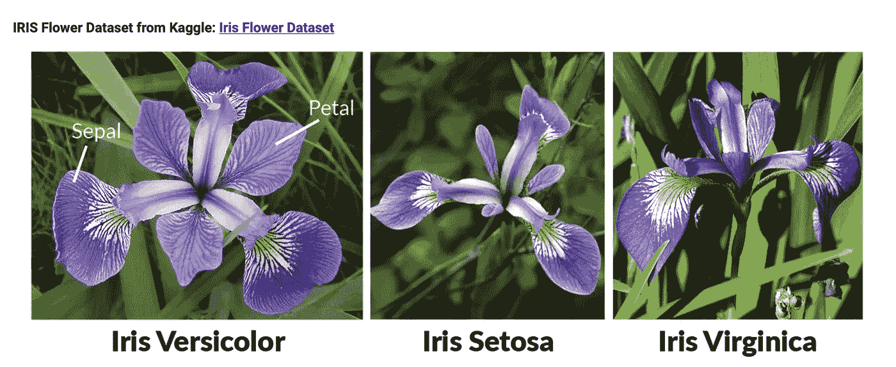
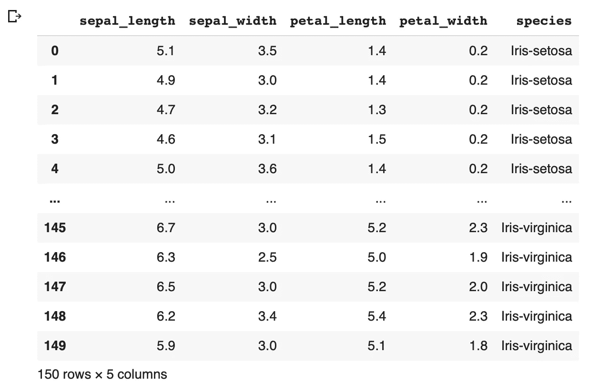
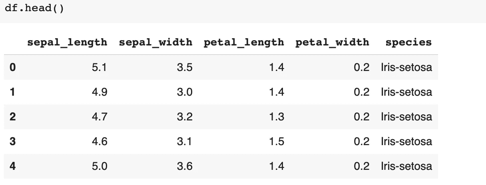
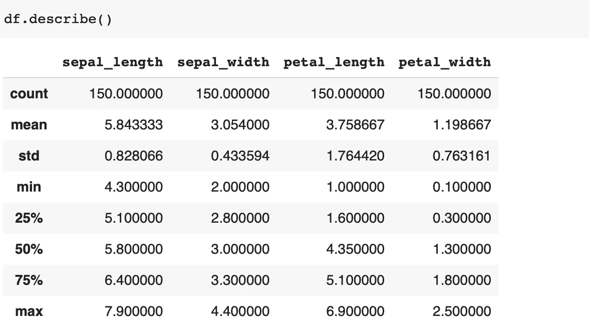
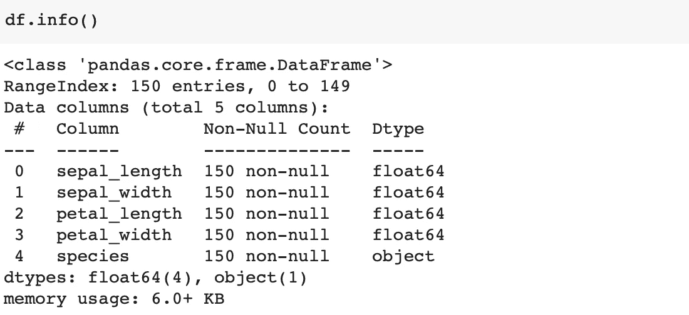
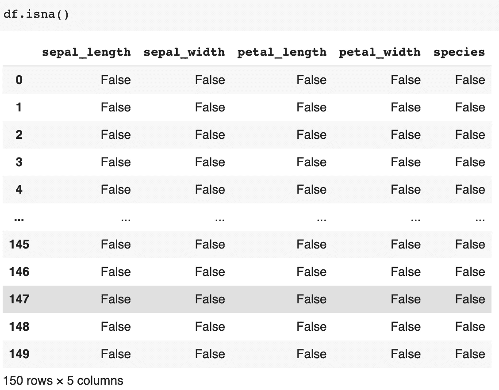
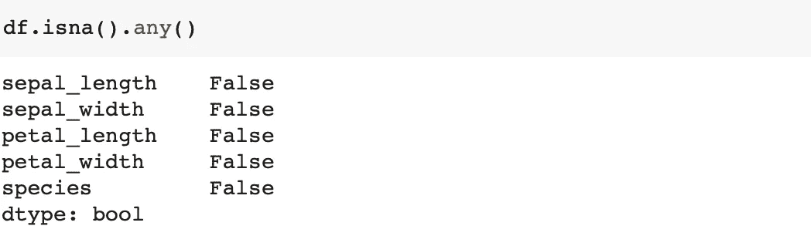

# 使用 Python 进行数据分析和可视化

> 原文：<https://medium.com/analytics-vidhya/data-analysis-and-visualization-with-python-c0dc8b301cec?source=collection_archive---------14----------------------->

你好，又是美好的一天！在本文中，我们将继续与您一起编写 Python 代码。我们今天要做什么？我们将谈论我最喜欢的话题之一，数据分析。你可以从诸如 Kaggle 或 UCI 这样的数据网站获取数据集。除了这些，我还对[鸢尾花数据集](https://www.kaggle.com/arshid/iris-flower-dataset)做了研究，给你选了。

> *Iris flower 数据集是一个多元数据集，由英国统计学家和生物学家罗纳德·费雪在其 1936 年的文章中提出，该文章讨论了分类问题中多种度量的使用。它有时被称为安德森鸢尾数据集，因为埃德加·安德森收集数据来测量三个相关物种的鸢尾花的形态变化。数据集由来自三种鸢尾物种* ***(刚毛鸢尾、海滨鸢尾和杂色鸢尾)*** *的每一种的 50 个样本组成。*

从每个样品中提取了四种性质:

1.  萼片的长度以厘米为单位
2.  萼片的宽度以厘米为单位
3.  以厘米为单位的花瓣长度
4.  花瓣的宽度，以厘米为单位

> *该数据集成为机器学习中许多统计分类技术的典型测试用例，如支持向量机。*

你在上面看到的视觉也包含在我在 Colab 中创建的笔记本中。在这个视频中，我们看到了来自数据集的例子。您可以通过本文末尾的 Colab 链接访问它。在文献中，它已经是数据科学领域中最常用和最基本的数据集之一。

# 步伐

✨必须在 Colab 中引入必要的库，然后必须指定文件夹中数据集的路径。然后，您可以打印 df 变量来查看数据集内容，或者使用 **df.head( )** 命令来访问前 5 行。

✨:如果你愿意，让我们运行 **df.head( )** 命令，看看我们将如何得到一个输出。

✨我们在上面的数据集中包括了特性的值。像 ***萼片 _ 长度*** 和 ***花瓣 _ 宽度*** 这样的变量就是**数值型**变量。此外，被称为物种的花类型的特征被称为**分类**变量。首先，知道这些数据属于哪种类型的变量是很有用的。

⚠️如果希望估计分类数据，即来自数值变量(萼片长度和花瓣宽度之间的特征)的花的类型，这是一个**分类**问题。

## 描述统计学

✨描述性统计是用熊猫的描述方法打印的。如果想关注，可以访问熊猫的[文档](https://pandas.pydata.org/pandas-docs/stable/reference/api/pandas.DataFrame.describe.html)原文。这样，每个要素包含多少数据(有可能看到丢失的数据)就被告知了。可以看到属性的标准偏差、平均值、最小值和最大值。

例如，在这些数据中，sepal_length 特征被指定为总共 150000 行，并且这些值的标准偏差约为 0.83。

⏳25%和 75%的范围被称为四分位数。通过控制这些值，可以分析数据。

✨要获得关于数据集的信息，应该运行 **df.info( )** 命令。

根据该信息，我们看到没有值为空的行。除了这些，我们还知道数字上存在的特征有浮点类型。

✨**df . ISNA()**命令检查数据集中是否有缺失数据(不是数字)。我们希望丢失数据的行是**‘True’**。然而，正如我们在上面看到的，我们没有丢失任何数据。

✨的 **df.isna()。在检查丢失数据时，如果数据集甚至包含 1 个丢失数据，any( )** 命令将返回 True。

🖇 **注意:**点击[链接](https://colab.research.google.com/drive/1_D0zT2h4Qsvke_yJ7heupIL4-hY7TBZO?usp=sharing)获得我上面提到的 Colab 链接。

在本系列的第二篇文章中，我将提到数据分析和可视化领域中的小点。保持健康✨

# 参考

1.  [https://pandas.pydata.org/pandas-docs/stable/index.html.](https://pandas.pydata.org/pandas-docs/stable/index.html)
2.  [https://www.kaggle.com/arshid/iris-flower-dataset.](https://www.kaggle.com/arshid/iris-flower-dataset)
3.  机器学习日| Merve Noyan |数据可视化|学习堵塞 2 |，[https://www.youtube.com/watch?v=JL35pUrth4g.](https://www.youtube.com/watch?v=JL35pUrth4g)
4.  https://www . ka ggle . com/Peter Chang 77/explorative-data-analysis。