# 数据分析:使用 NLP 的反病毒软件

> 原文：<https://medium.com/analytics-vidhya/data-analysis-anti-vaxxers-using-nlp-e1038cc40875?source=collection_archive---------23----------------------->

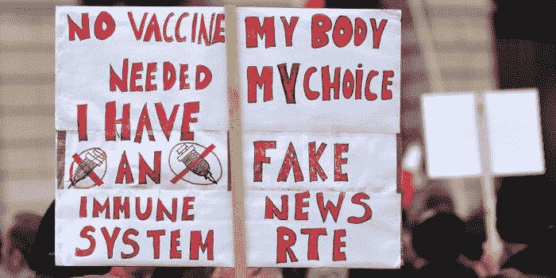

鉴于世界各地普遍存在的疫苗犹豫，我想研究一下流传的阴谋论。还有什么地方比 Reddit 更适合查找数据呢？

从这里下载数据。

[](https://www.kaggle.com/gpreda/reddit-vaccine-myths) [## Reddit 疫苗神话

### 疫苗神话子编辑帖子和评论

www.kaggle.com](https://www.kaggle.com/gpreda/reddit-vaccine-myths) 

> 本文主要是代码，我试图涵盖文本数据分析所需的最重要的库，这些代码可以用于多种文本相关的分析。

我进行分析的主要动机是找出反暴力者常用的阴谋论，以便提高一些意识。可以通过使用自然语言处理和其他 python 库来完成。

```
import pyforest
df=pd.read_csv("reddit_vm.csv")
print(df.head())
```

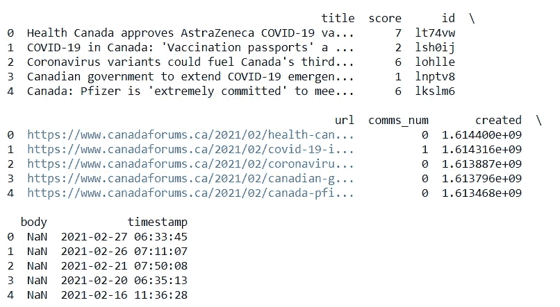

我想根据分数降序排列列表，这样我们就知道最离谱的理论了。

```
df.sort_values(by=['score'], ascending =False)
```

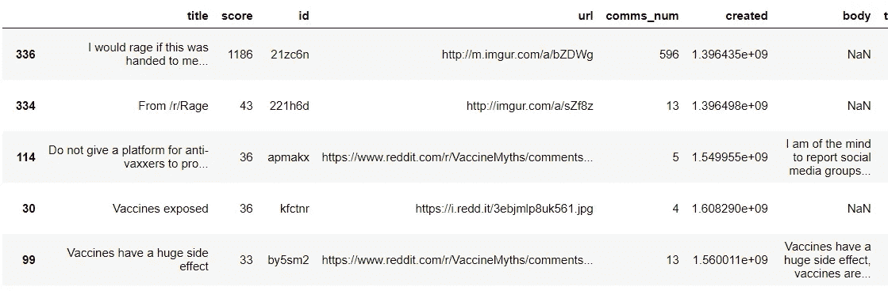

你可以看到人们在流传什么理论。通过打印大约 100 列而不是仅仅 5 列，可以知道更多。

我刚刚意识到有两个栏“标题”和“正文”将有助于我的分析。理想情况下，我只喜欢一个专栏。

```
df['body'] = df['body'].replace(np.nan, "empty")
df['tb'] = df['title'].str.cat(df['body'], sep =" ")
```

我合并了两列的文本，并创建了一个名为“bp”的新列，它将包含两列的文本。但是，在此之前，我必须将“nan”值转换为“空”文本，以便添加 2 个字符串。

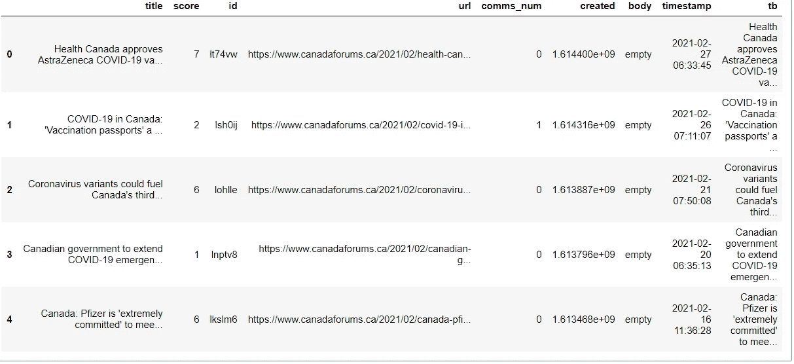

现在我已经在一个名为“tb”的列中收集了文本数据，我可以使用 NLP 工具来分析这些文本。

```
import nltk
nltk.download()
from nltk.tokenize import sent_tokenize, word_tokenizefrom nltk.corpus import stopwords
stop_words=set(stopwords.words("english"))
print(stop_words)
```

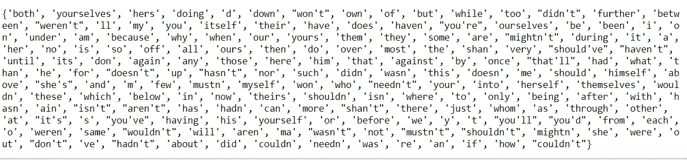

> 停用词是在英语中使用的词，但不传达任何信息，因此我们试图从我们的词表中删除它们。我们通过导入单词列表词汇表并创建单词列表词汇表中不存在的新单词列表来实现这一点，

```
df1=df['tb']
x=str(df1)word_tokenized=word_tokenize(x)
filtered_reddit_comments=[]
for w in word_tokenized:
            if w not in stop_words:
                    filtered_reddit_comments.append(w)
```

我们首先创建一个只有 1 列“tb”的新数据框，以使分析更容易。然后，我们将数据帧转换成一个字符串，以便可以与其他字符串进行比较。 **word_tokenize** 将只接受一个字符串输入。然后我们使用一个 *for* 循环来遍历整个字符串并删除所有多余的单词(称为停用词)。可以显示新的已处理的令牌化列表。

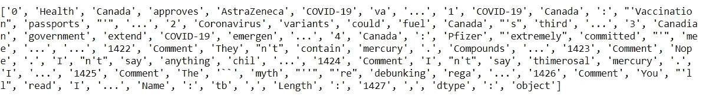

> 我可以看到一些人正在传播一个神话，即疫苗含有汞化合物。

如果您想检查列表中每个单词的词性。没有必要，但在其他情况下可能会有帮助。

```
POS=nltk.pos_tag(filtered_reddit_comments)
```

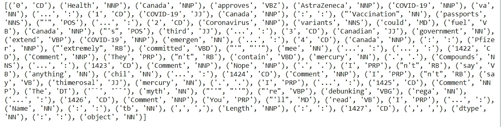

为了进一步简化 POS 的意思，我粘贴了一个缩写列表。希望这能有所帮助。

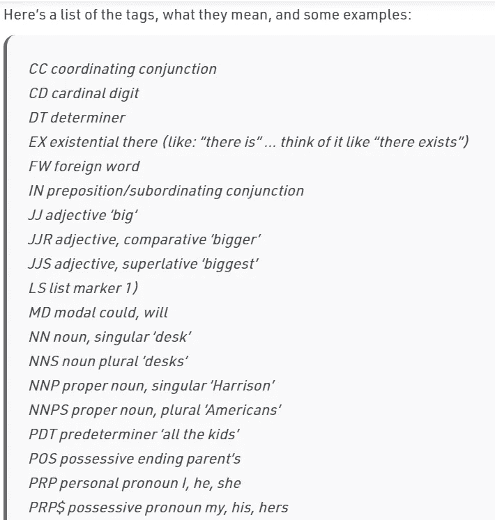

我还通过根据词类划分单词来对文本数据进行分块，这可能对分析没有帮助，但出于教育目的。在某些情况下，它对于文本数据分析非常方便。

```
chunkgram= r"""Chunk:{<RB.?>*<VB.?>*<NNP>+<NN>?}"""  
chunkParser=nltk.RegexpParser(chunkgram)
chunked=chunkParser.parse(POS)
chunked.draw()
```

我使用正则表达式找出动词、名词等单词，然后使用 draw 函数将其可视化。

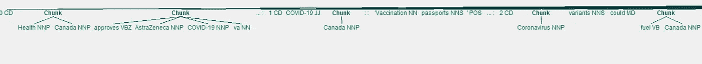

这就是 VIZ 的样子。正则表达式实际上是分析师最有力的工具。

我们还可以从数据集中找到著名的实体。例如组织，人，GPE 的地理位置。

```
namedent=nltk.ne_chunk(POS)
namedent.draw()
```

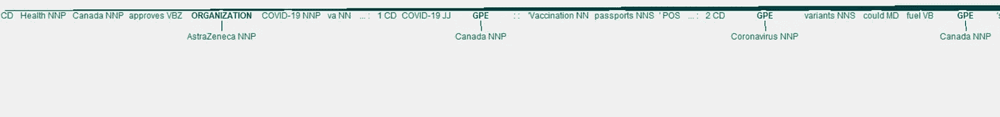

无论我们到目前为止做了什么，都不会对这个分析有帮助，但是我想涵盖 NLP 的所有重要功能，所以我决定在这里添加它们。

我们现在可以继续进行频率计算和情感分析。

```
words = nltk.FreqDist(filtered_reddit_comments)bag_of_words = pd.DataFrame(words.most_common(),
                             columns=["WORD","COUNT"])
print(bag_of_words.head())
```

对于频率计算，我使用没有停用词并且已经被过滤的列表。函数 ***most_common*** 可以用来查找词频。而 ***pd.dataframe*** 用于创建新的数据帧。

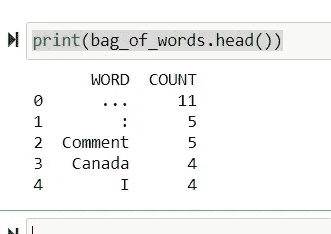

## 情感分析

这是分析中最重要的部分之一。我们将使用 ***维达*** 库进行情感分析。

```
nltk.download("vader_lexicon")
from nltk.sentiment.vader import SentimentIntensityAnalyzer
vader = SentimentIntensityAnalyzer()df["scores"] = df["tb"].apply(lambda tb: vader.polarity_scores(tb))
df["compound"]=df["scores"].apply(lambda score_dict:score_dict["compound"])
df["sentiment"]=df["compound"].apply(lambda c:"pos" if c>=0 else "neg")
df.head()
```

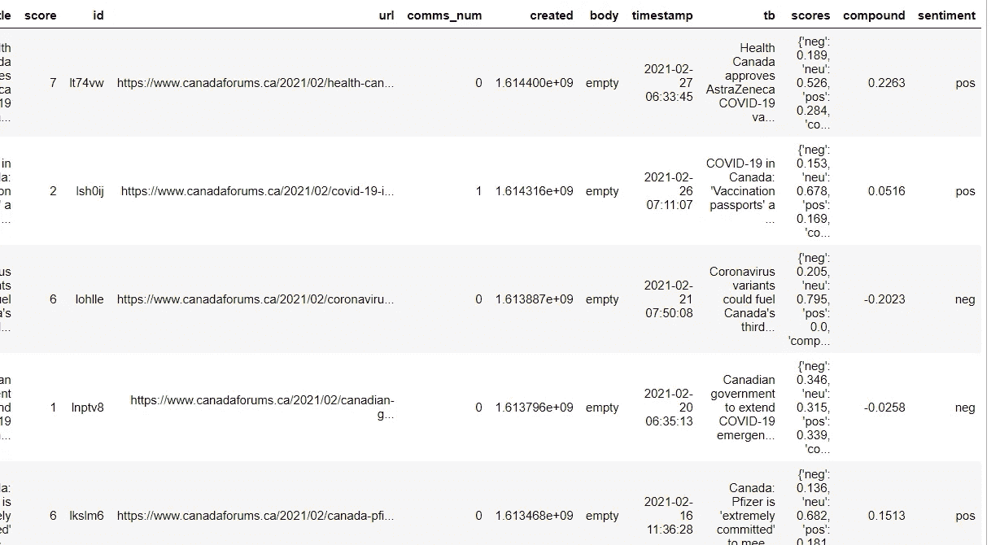

我增加了 3 个新的栏目，给出分数和观点。但是让我们看看对疫苗的负面评价。

```
count = df['sentiment'].value_counts()
print(count)
```

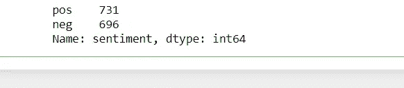

总共有 696 人传播对疫苗的负面看法。

## 结论

我知道不能从文本中分析很多东西，我保持这个博客代码重。如果你能从头到尾做好这篇文章，你就能很容易地在市场上找到一份 NLP 相关的数据分析师工作。