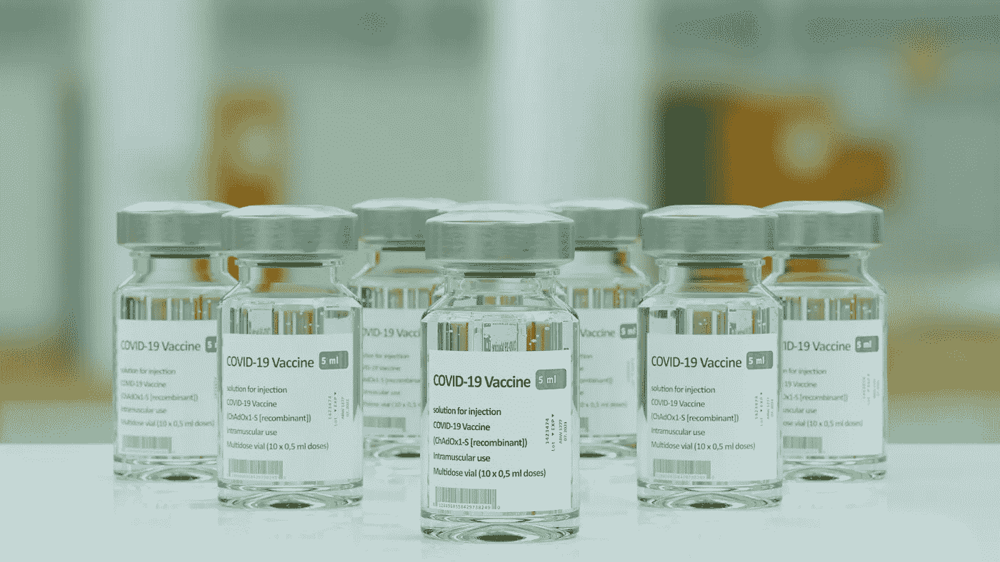

# 数据分析——幂双协疫苗接种过程的案例研究

> 原文：<https://medium.com/analytics-vidhya/data-analysis-case-study-in-power-bi-covid-vaccinization-process-a2d216980fdc?source=collection_archive---------4----------------------->

## 基于 Kaggle 数据集的 Power BI 完整指导案例研究。

[Braňo](https://unsplash.com/@3dparadise?utm_source=unsplash&utm_medium=referral&utm_content=creditCopyText) 在 [Unsplash](https://unsplash.com/s/photos/covid-vaccine?utm_source=unsplash&utm_medium=referral&utm_content=creditCopyText) 上拍照

# 介绍

在这篇博客中，我们将探索 COVID 疫苗数据，并试图找出免疫过程如何在世界范围内进行的推断。