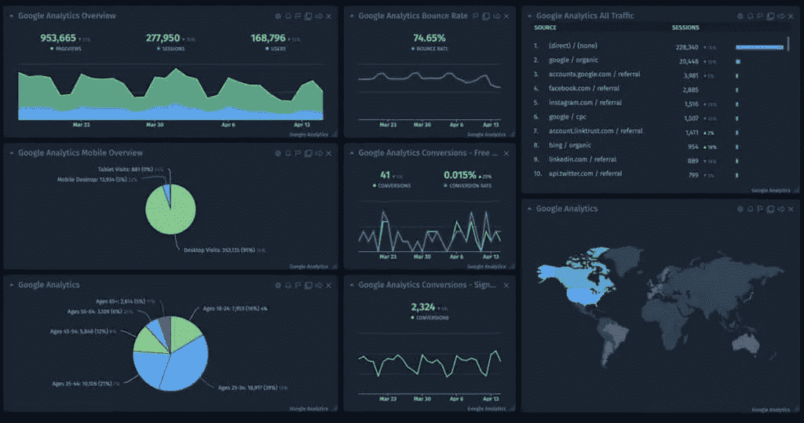
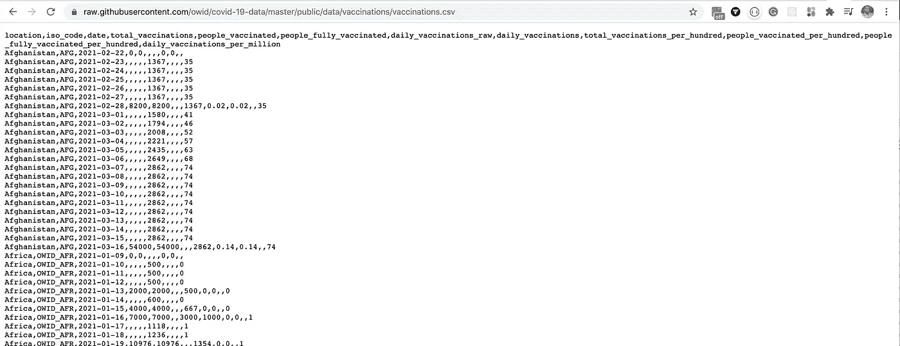
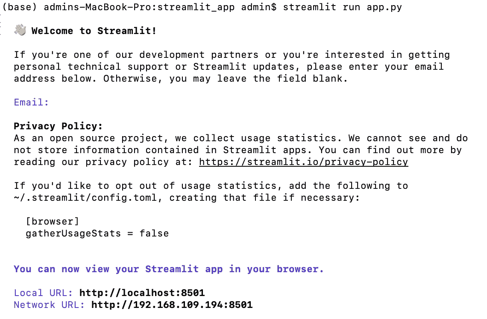
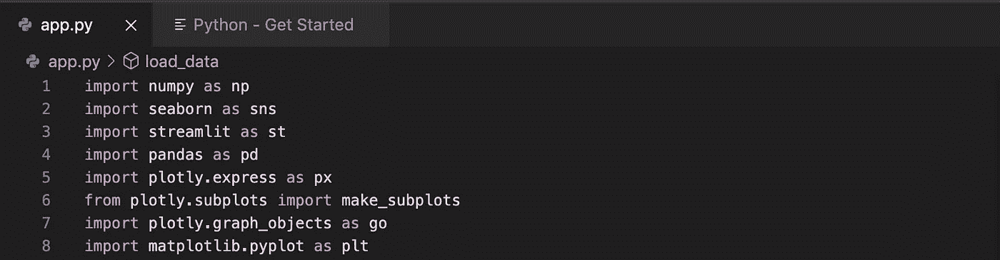
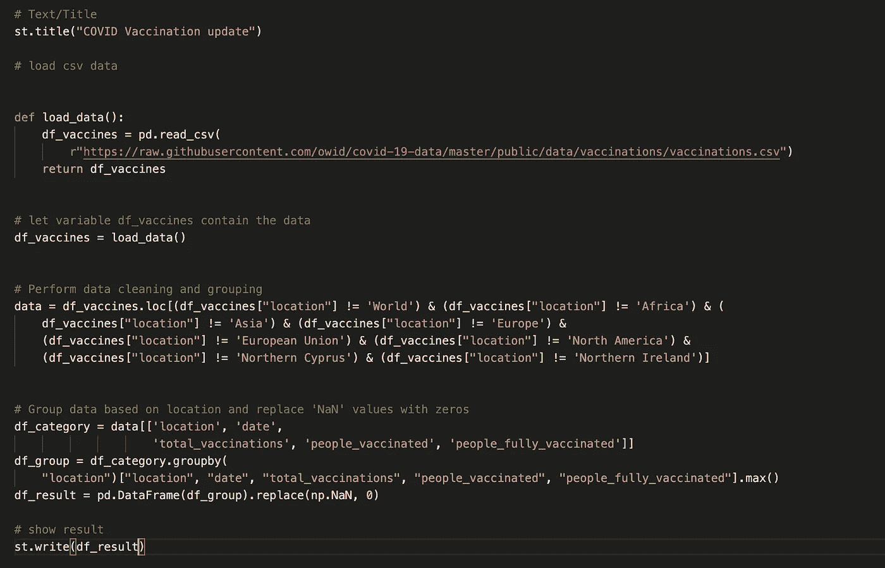
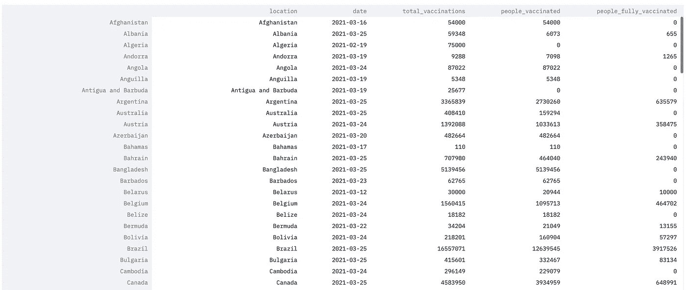
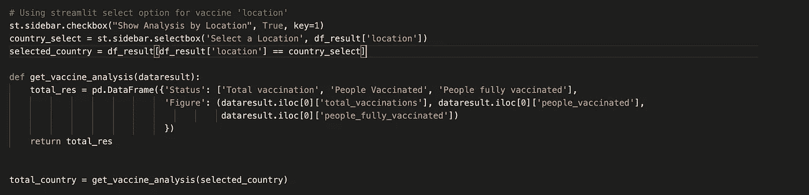
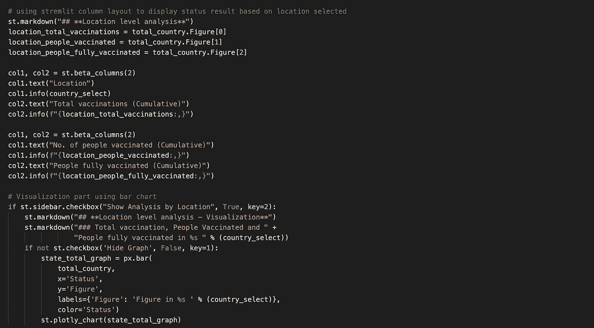
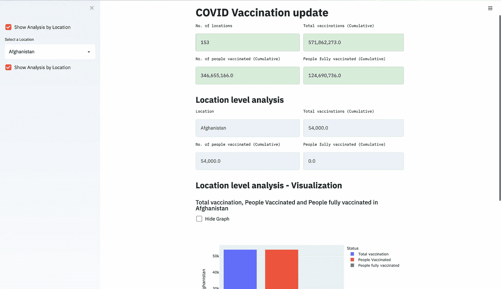

# 数据分析:我如何使用 python 和 streamlit 在一天内构建 COVID 疫苗仪表板

> 原文：<https://medium.com/analytics-vidhya/data-analysis-how-i-built-covid-vaccine-dashboard-in-a-day-using-python-and-streamlit-f492c7e0f720?source=collection_archive---------3----------------------->

信用:[www.cyfe.com](http://www.cyfe.com)

现在可以肯定地说，在几个国家有几种新冠肺炎疫苗。我很好奇改编的怎么样，幸运的是我在 [Edouard Mathieu 的 Github 账户](https://github.com/edomt)上偶然发现了这个数据集。深入探究发现数据集来源于 ourworldindata.org 的，Edouard 是其中的[贡献者](https://github.com/owid/covid-19-data)。

在对数据进行了一些研究之后，我决定对数据集进行一个小的分析。这里是简单仪表板的[链接](http://bit.ly/vaccine-dashboard)

1.  **获取源文件**

首先，我复制了 Github 上的 CSV 文件的 URL

数据的这种显示是其大尺寸的结果。

**2。选择您的 IDE**

第二步是决定使用哪个 ide。我大部分时间都在用木星笔记本。但是对于这个任务我决定使用 Visual Studio 代码，原因是我想知道和理解用 [**Streamlit**](https://streamlit.io/) 发布我的 python 代码的过程。用 python 创建 web 应用程序的快捷方式。

**注意:你也可以用 Jupyter 笔记本来做这件事**

Streamlit 是一个非常强大的框架，用于构建机器学习和数据科学工具和应用。它允许你将普通的 python 代码转换成漂亮的 UI，这非常容易，也非常具有交互性。

这是一个非常简单的库，只需要花一点时间就可以创建一个完美的仪表板。它还带有内置的 web 服务器，并允许您在 docker 容器中进行部署。

**3。设置 Streamlit**

*   确保您已经安装了 python 3.6–3.8。
*   pip 安装简化版。
*   导入 streamlit 以检查它是否已安装。

**创建一个 app.py 文件，安装后运行**

**导入库**

让我们导入用于绘图和显示信息的必要库

在 Streamlit 中，文本可以以不同的方式显示。下面的 Streamlit 函数是显示文本的方式

st.title()-设置标题
st.text()编写特定图形的描述
st.markdown()将文本显示为 markdown
st.latex()在仪表板中显示数学表达式。
st.write()有助于显示所有内容，如绘图、数据框、函数、模型等。
st.sidebar()用于在侧边栏上显示数据。
st.dataframe()显示数据框
st.map()仅用一行代码显示地图等
st.beta_columns()显示列布局

**4。加载数据，执行一些清理并显示结果**

加载数据后，我删除了一些位置，以获得准确的结果。数据集包含一些重复的位置、区域和大陆位置。我只需要与基于国家的位置。
下一步是根据基于国家/地区的位置对数据进行分组，并将所有 NaN 值替换为零(0)。下图显示了结果。函数 st.write()用于显示结果。

**5。选择选项**

st.sidebar.selectbox()函数加载了供选择的位置。get_vaccine_analysis 方法用于获取数据集以绘制所选位置的图表。

**6。数据可视化**

这里使用 st.beta_columns()来创建两列布局。状态位置名称、接种疫苗的人数(累计)、接种疫苗的人数(累计)和完全接种疫苗的人数(累计)显示在列框中。我所说的累积是指通过连续的增加而增加。

为了绘制图表，我们使用了 plotly.express 库方法。最后，使用 st.plotly_chart()显示图表。

我们的仪表板现在可以部署了😀

**7。分享你的应用**

将你的应用和 requirements.txt 文件一起放入 GitHub repo。要创建 requirements.txt，请在 anaconda 命令提示符下使用以下命令。

*pip 安装 pipreqs
pipreqs。位置*

完成上述命令后，您会发现 requirememnts.txt 文件保存在您需要的位置(例如/Users/Documents…..)
登录[share . streamlit . io](https://share.streamlit.io/)
点击“部署应用”，然后粘贴你的 GitHub 网址

*此处* 提供已部署 app 的链接

*谢谢大家！！！！🤗*

***参考文献***

* [## 使用 Streamlit 和 Python 创建交互式仪表盘

### 这篇文章作为数据科学博客的一部分发表。数据可视化简介，仪表板是…

www.analyticsvidhya.com](https://www.analyticsvidhya.com/blog/2020/10/create-interactive-dashboards-with-streamlit-and-python/) 

[https://www . analyticsvidhya . com/blog/2021/02/building-a-新冠肺炎-dashboard-using-streamlit-and-python/](https://www.analyticsvidhya.com/blog/2021/02/building-a-covid-19-dashboard-using-streamlit-and-python/)*