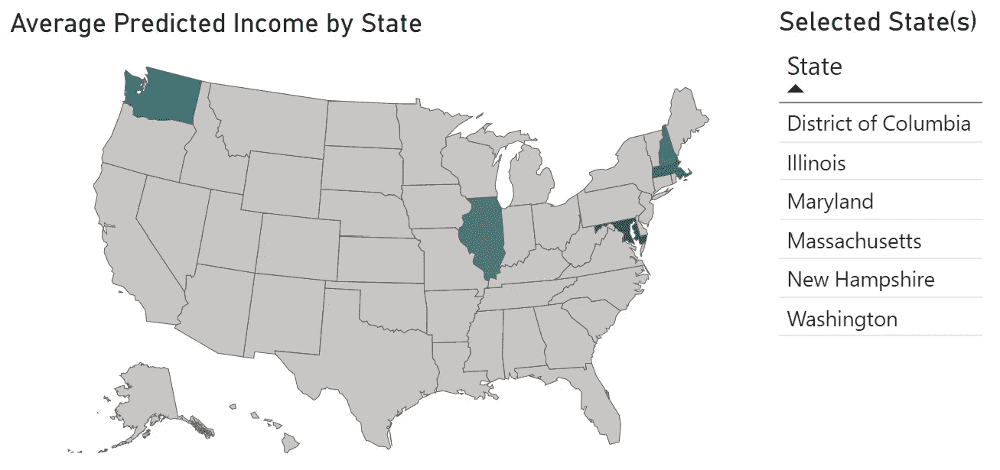
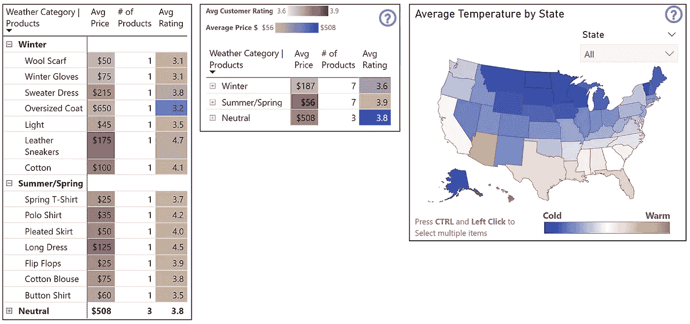
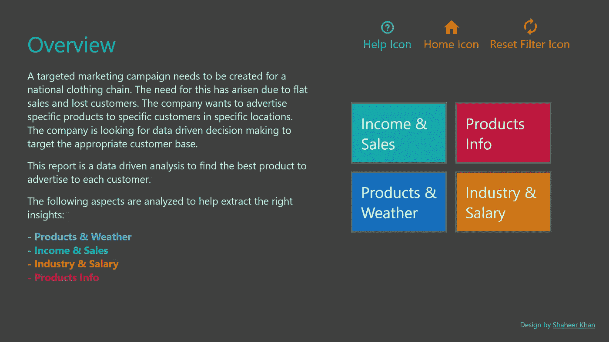

# Power BI 从头到尾的数据分析:仪表板

> 原文：<https://medium.com/analytics-vidhya/data-analysis-in-power-bi-from-start-to-finish-dashboard-aea219dd557a?source=collection_archive---------1----------------------->

Power BI 中数据分析和报告构建的逐步全面分解；为在线零售商解决营销问题。

# 介绍

## 背景故事:

需要为一个全国性的服装连锁店设计一个有针对性的营销活动。由于销售疲软和客户流失，这种需求已经出现。该公司希望在特定的位置向特定的客户宣传特定的产品。该公司正在寻找数据驱动的决策，以针对适当的客户群。他们拥有的一些产品有:

*   衬衫——25 美元
*   毛衣——100 美元
*   皮包——1000 美元

> **目标:** 进行数据驱动分析，找到向每位客户做广告的最佳产品。

# **数据来源:**

分析中使用的数据来源是:

**美国人口普查局数据
-** 平均收入
-所在地
-人口
-行业

**业务数据** -产品库存
-产品价格
-客户评分

**客户资料**
-客户 ID
-姓名
-地点
-出生日期
-购买历史

**附加数据** -天气
-人口统计(行业薪资数据)

# 额外数据收集

为了帮助更好地了解客户人口统计和市场状况，并进行更严格的分析，我们收集了额外的数据。使用了两个额外的数据源，一个是**天气数据**，另一个是**行业薪资数据**。

## 天气数据收集

使用 python 和[Visual Crossing](https://www.visualcrossing.com/resources/documentation/weather-api/timeline-weather-api/)Weather API 收集和清理天气数据。代码可以在我的 [GitHub](https://github.com/ShaheerKhan200/Weather-Data-API) 上找到。

## 行业薪资数据收集

行业薪资数据从[美国经济分析局(BEA)](https://apps.bea.gov/iTable/iTable.cfm?reqid=70&step=1&acrdn=4) 收集，并在 Power Query 中清理。

# 数据处理

***普查数据*** 经过格式化、清理和合并，使用 power query 创建一个表。

***客户数据*** 在 power query 中被格式化并清理。

***业务数据*** 有两个表:*采购清单*和*产品库存*。两者都在 power query 中被清理和格式化。具体来说，*采购清单*表的清洁是最复杂的，因此过程如下所示。*采购清单*是销售历史，这是以最不成熟的格式找到的。*采购清单*使用 unpivot 功能进行了格式化和清理，因为数据以宽格式呈现，而不是长格式。需要取消投票来分析 Power Bi 中的数据。下面是*采购清单*表的前后图像。[这里的](https://psyteachr.github.io/msc-data-skills/tidyr.html)是转换表格的表格结构的详细原因。

在取消 pivot 之前，发现数据是宽格式的。

取消透视后，数据被转换为长格式。

***附加数据*** 在电源查询中被格式化和清理。

接下来，一个名为**“回归表”**的新表被用于使用线性回归预测客户收入。虽然我们不知道客户的收入，但我们应该能够通过使用在 ***客户数据*** 中找到的他们最近 6 个月的购买历史以及来自*人口普查数据的每个州的平均收入来预测收入。这样就可以找到各个州的客户的预测收入。*

## *分类数据*

*因此，需要使用 DAX(数据分析表达式)在计算列中创建类别。首先，使用*产品库存*表，我们创建两个计算列:*

1.  ***价格类别** —该列将产品分为三个价格等级:
    - *，【25 美元-349 美元-低价*，
    - *，【350 美元-674 美元-中价*，
    - *，【675 美元-1000 美元-高价**
2.  ***防寒服** —本栏将产品分为三类:
    - *冬季*-*夏季/春季*-
    -*中性**

*然后在*回归表*中重复相同的过程，在回归表中对预测的客户收入进行分类:*

1.  ***预测收入范围** —本栏将收入分为三个等级:
    - *[$78，883 - $91，599] —低*-
    -*[$ 91，600 - $104，314] —中*-
    -*[$ 104，315 - $117，031] —高【T6**

# *数据分析/可视化*

*一旦所有需要的数据以清晰的格式呈现，就可以开始借助可视化进行分析。*

*接下来，创建基本的数据可视化，以理解手头的数据。*

*这些是所需的 ***键*** 可视化:*

*   ***散点图**用 r 值表示**客户评分**和**产品退货率**之间的关系*
*   ***散点图**使用线性回归公式和 r 值显示**各州平均家庭收入**和**各州平均 6 个月销售额**之间的关系*
*   *热图被用来可视化全美的家庭收入分布*
*   ***预测收入直方图**显示了**分类预测收入的分布和形状***

*这些是 ***的附加支持*** 可视化:*

*   ***直方图**的**预测收益***
*   ***产品价格直方图**按**价格类别**显示产品的分布和形状*
*   ***箱线图**描绘不同**状态**下**温度**的分布*
*   ***散点图**用 r 值推导出**平均温度**和**总销售额**之间的关系*
*   ***填充地图**显示**美国地图上的平均温度***
*   ***天气产品类别直方图**按**天气类别**显示产品的分布和形状*
*   ***条形图**描绘**按行业划分的平均工资***
*   ***堆积条形图**按**工资**和**状态**显示行业构成*
*   ***树形图**展示**排名前 8 的行业**按**平均工资***

*所有这些可视化都可以在 [Power Bi 报告](https://app.powerbi.com/view?r=eyJrIjoiM2U4Y2Y0ZmMtZDI1OS00ZTBkLWJjN2YtZTNlMmI2OTk1MTE5IiwidCI6IjI0YTMwOTBmLTkwMWUtNDY0NC1hMzZmLTBlNTRkZDg0YWQxZCJ9)中看到。*

# *结果*

***平均收入**和**平均销售额**之间存在**强正相关**。*

**

*图片来自 Power Bi 报告—平均收入和平均销售额散点图*

***客户评分**和**回报率**之间存在**强负相关**。*

**

*图片来自 Power Bi 报告—客户评级和退货率散点图*

*这些州/地区的客户收入最高**:***

*   ***华盛顿***
*   ***马里兰州***
*   ***马萨诸塞州***
*   ***新罕布什尔州***
*   ***伊利诺伊***
*   ***哥伦比亚特区***

******

***图片来自 Power Bi 报告——各州的收入洞察***

***接下来，属于**“$ 25-$ 349——低价”**类别的产品应该做最多的广告。这一类别的产品包括:***

******

***图片来自 Power Bi 报告——按价格类别划分的产品洞察***

## ***营销策略:***

***由于**中低收入**的客户数量较多，价格**较低的**产品应**广告最多**，因为它涵盖了大多数人口统计数据。***

***使用收集到的额外数据，天气分析显示有更多的州平均寒冷天气比温暖天气多。**夏季/春季产品**评级最高**而**冬季产品**评级最低**评级**。*****

*****均价**是**春夏产品**类别中**最低的**。因此，**夏季/春季产品**要比**冬季产品**多宣传**。*****

******

***图片来自 Power Bi 报告——按产品和州划分的天气洞察***

***接下来，使用为各州收集的行业薪资数据。我们看到，通过根据平均工资过滤**前 5 大行业**，加州****纽约州******得克萨斯州******佛罗里达州*** 平均工资最高**和**平均工资最高**因此，**营销这些领域**需要的**和**较贵的**产品是一个合理的**焦点**。********

****

**图片来自 Power Bi 报告——按行业划分的薪资洞察**

# **电源 Bi 报告**

**这是报告主页的视图:**

****

**报告的主页**

**可通过[此处](https://app.powerbi.com/view?r=eyJrIjoiM2U4Y2Y0ZmMtZDI1OS00ZTBkLWJjN2YtZTNlMmI2OTk1MTE5IiwidCI6IjI0YTMwOTBmLTkwMWUtNDY0NC1hMzZmLTBlNTRkZDg0YWQxZCJ9)访问完整的交互式 Power Bi 可视化。**

# **感谢您的阅读！**

**我非常喜欢分享我在 Power Bi 中记录创建严格营销分析的过程。我希望能够激励其他人记录并分享他们的分析旅程，这样像我这样的分析师就可以在我们的职业生涯中获得灵感并产生更有洞察力的分析。如果你正在寻找开始数据分析、数据故事和其他数据魔法，请确保在 [Medium](http://shaheerak.medium.com) 上关注我，让我们在 [LinkedIn](http://www.linkedin.com/in/shaheerkhan200) 上联系。你可以访问我的[网站](http://shaheerkhanalytics.com)查看我的作品集。**

> **如果有足够的需求，那么我可以写一个在这个项目中使用 Power Bi 进行的数据清理过程的详细分解。**

# **参考**

*   **[附加数据 1 —各州的行业工资](https://apps.bea.gov/iTable/iTable.cfm?reqid=70&step=1&acrdn=4)**
*   **[附加数据 2 —各州的天气数据](https://www.visualcrossing.com/resources/documentation/weather-api/timeline-weather-api/)**
*   **[https://www . uda city . com/course/data-analysis-and-visualization-with-power-BI-nano degree-nd 331](https://www.udacity.com/course/data-analysis-and-visualization-with-power-BI-nanodegree--nd331)**