# 印度 2019 年人民院选举数据分析

> 原文：<https://medium.com/analytics-vidhya/data-analysis-of-lok-sabha-election-2019-in-india-630ca7219551?source=collection_archive---------3----------------------->

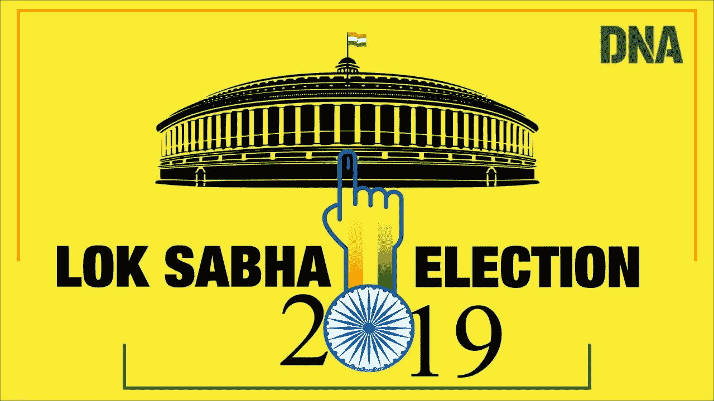

使用 [python](https://www.python.org/) ， [Numpy](https://numpy.org/) ，[熊猫](https://pandas.pydata.org/)， [Matplotlib](https://matplotlib.org/) ， [Seaborn](https://seaborn.pydata.org/)

**人民院**或**人民院**，是[印度](https://en.wikipedia.org/wiki/India)的[两院制](https://en.wikipedia.org/wiki/Bicameralism) [议会](https://en.wikipedia.org/wiki/Parliament_of_India)的[下院](https://en.wikipedia.org/wiki/Lower_house)，上院[是](https://en.wikipedia.org/wiki/Upper_house)[联邦院](https://en.wikipedia.org/wiki/Rajya_Sabha)。[人民院](https://en.wikipedia.org/wiki/Member_of_Parliament,_Lok_Sabha)成员由成年人[普选](https://en.wikipedia.org/wiki/Universal_suffrage)和[得票最多者当选](https://en.wikipedia.org/wiki/First-past-the-post)制度选举产生，代表他们各自的[选区](https://en.wikipedia.org/wiki/List_of_constituencies_of_the_Lok_Sabha)，他们任职五年或者直到[总统](https://en.wikipedia.org/wiki/President_of_India)根据[部长会议](https://en.wikipedia.org/wiki/Union_Council_of_Ministers)的建议解散该机构。众议院在新德里的人民院开会。

印度宪法规定的众议院成员上限是 552 人(最初在 1950 年是 500 人)。目前，众议院有 543 个席位，最多由 543 名当选议员选举产生。1952 年至 2020 年间，[英裔印度人](https://en.wikipedia.org/wiki/Anglo-Indian)社区的 [2 名额外成员](https://en.wikipedia.org/wiki/Anglo-Indian_reserved_seats_in_the_Lok_Sabha)也是由印度总统根据印度[政府](https://en.wikipedia.org/wiki/Government_of_India)的建议提名的，该政府于 2020 年 1 月被 2019 年第[104 次宪法修正案废除。人民院有 550 个座位。](https://en.wikipedia.org/wiki/One_Hundred_and_Fourth_Amendment_of_the_Constitution_of_India)

总共为[在册种姓(84)和在册部落(47)](https://en.wikipedia.org/wiki/Scheduled_Castes_and_Scheduled_Tribes) 的代表保留了 131 个席位(24.03%)。众议院的法定人数是全体议员的 10%。除非提前解散，否则人民院从指定召开第一次会议之日起继续运作五年。然而，当[紧急状态公告](https://en.wikipedia.org/wiki/State_of_Emergency_in_India)生效时，议会[可以通过法律或法令](https://en.wikipedia.org/wiki/Parliament_of_India)延长该期限。

个人影响政府决策的最重要方式之一是投票。我们知道在我们国家每个人都有投票权。但是很多人对政治并不了解。因此，通过这个项目，我们可以了解不同的政党，他们的背景历史以及他们最近在 2019 年印度人民院选举中的成功和失败。不幸的是，我们发现很少有候选人有犯罪史。所以通过这种数据分析，我们可以了解候选人的历史以及政党的性质。我们可以了解获胜的一方以及他们在 2019 年的成功。

我们特别要提到的是，这是一个没有偏见的分析。在这方面，我们没有支持任何特定的一方。

现在让我们开始这个项目包含什么。

# 数据集:

该数据集基于印度的 Lok Sabha 2019。这个数据集中总共有 2263 行和 19 列。通过使用这个数据集，创建了这个数据分析项目。

这里我们使用 google COLAB 来运行这些代码并分析数据集，但是您也可以使用其他平台来运行代码。

我们在这个项目中总共使用了 3 个数据集。

现在让我们开始这个项目包含什么。

# 导入库:

```
import numpy as npimport pandas as pdimport matplotlib.pyplot as pltimport seaborn as sns
```

# 加载文件:

```
import iodf2 = pd.read_csv('LS_2.0.csv')
```

# 显示数据:

```
df2.head()
```

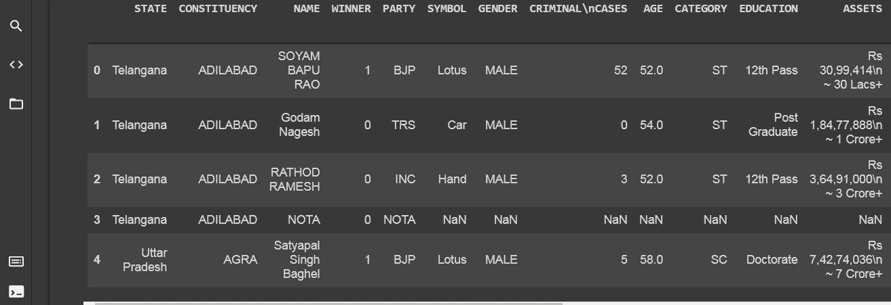

显示数据

# 数据集的形状:

```
df2.shape
(2263, 19)
```

# 关于数据集中所有列的信息:

```
df2.info()
```

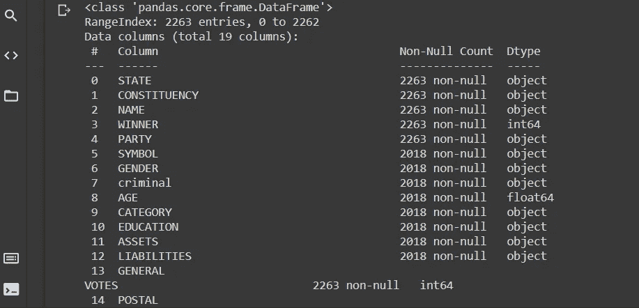

关于数据集中所有列的信息

# **数据集描述:**

```
df2.describe()
```

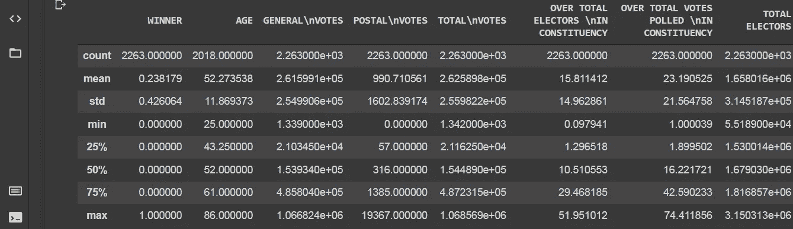

数据集的描述

# 数据之间的相关性:

```
df2.corr()
```

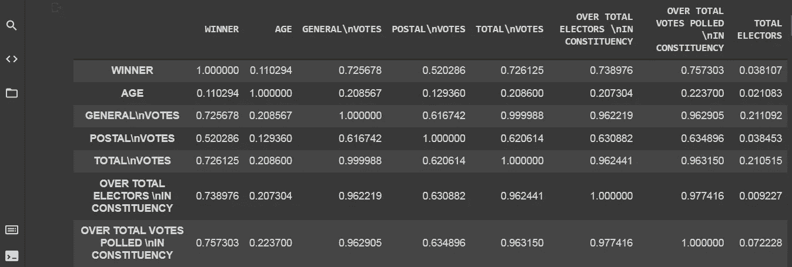

数据之间的相关性

# 检查数据集中的空值:

```
df2.isnull().values.any()
```

# 犯罪案件计数:

这里我们统计的是一名议员在印度各邦犯下的全部罪行。

```
df2['criminal'].value_counts()df2['criminal'] = df2['criminal'].replace(['Not Available'],'0')df2['criminal'] = pd.to_numeric(df2['criminal'] , errors='coerce')df2['criminal'].value_counts()df2['criminal'].isna()
```

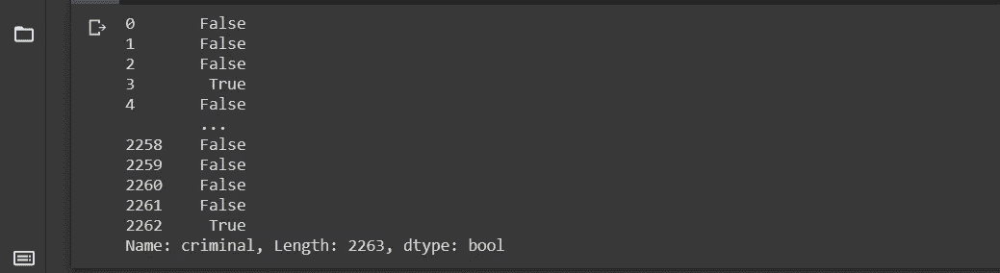

犯罪案件计数

## 这里，我们从数据集中的列 criminal 中删除空值。

```
df2['criminal'].isnull().sum().sum()
245
```

## 这里我们再次显示数据。

```
df2.head()
```

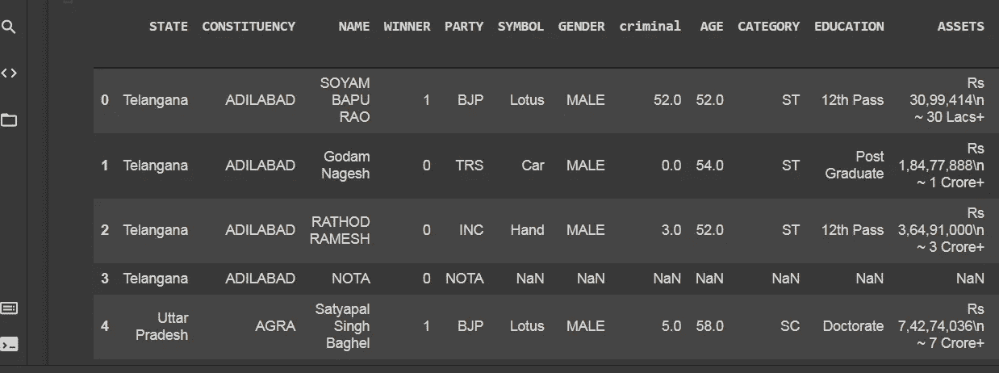

显示数据

# 不同州的犯罪数量条形图:

这里我们创建了一个印度不同邦的犯罪统计柱状图。

```
#Using Seaborn's CountPlot with figure size 10 * 6plt.figure(figsize=(18,6))sns.countplot(x='criminal',data=df2);
```

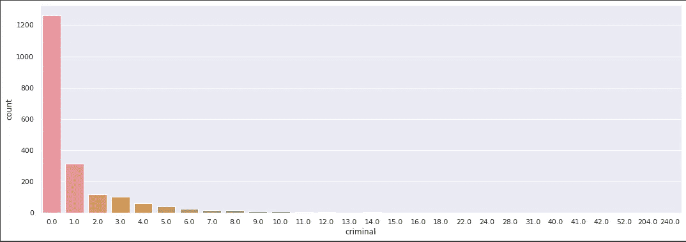

犯罪案件柱状图

从下面给出的描述中，我们可以看到，参赛者的平均犯罪率为 1.45，对于最低犯罪率，25%和 50%的参赛者没有犯罪，但可悲的是，在 75 %的候选人中，犯罪率为 1.0。更令人惊讶的是，一个人设想的最大犯罪是 240，这是一个巨大的数字。

# 州与刑事案件的折线图:

这个图表显示了候选人在不同州的犯罪情况。

```
import matplotlib.pyplot as plt#fig = plt.figure(figsize =(100, 7))df2.plot(x="STATE", y=["criminal"],figsize =(20, 7), fontsize=10)plt.xlabel("States")plt.ylabel("Criminal Case")plt.title("Distribution of Crimanal Cases")plt.show()
```

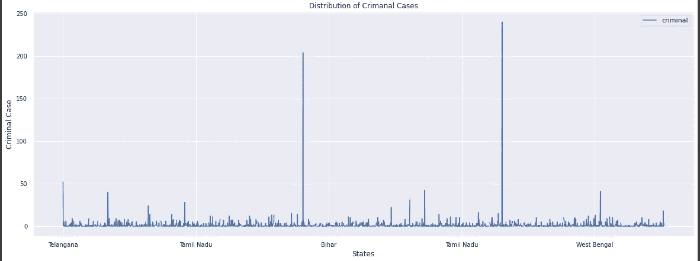

国家与刑事案件的线形图

从这个图表和下面的描述中，我们可以看到，一个人所犯的刑事案件的最大数量是 240。

# 候选人的教育资格:

```
#Using Seaborn's CountPlot with figure size 10 * 6plt.figure(figsize=(20,6))sns.countplot(x='EDUCATION',data=df2);
```

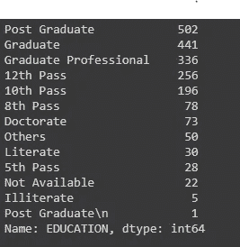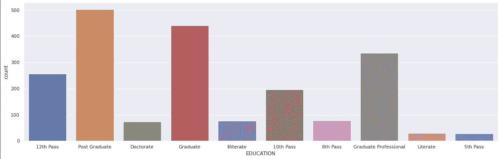

教育与计数柱状图

分析图形后，我们可以看到有两列 VIII 类通过和 V 类通过。但是我们相信被称为有文化的最低资格是 X 通过。所以我们把所有 V 通八考生都转换成文盲。

我们可以看到，印度的研究生考生数量是最大的(官方)。所以从教育的角度来看，这是一个积极的网站。

# **教育与犯罪案件柱状图:**

这张图表显示了候选人的学历和他们的犯罪记录。现在我们知道他们以前的犯罪背景和他们的学历。

```
import seaborn as snssns.set_theme(style="whitegrid")plt.figure(figsize=(20,6))ax = sns.barplot(x="EDUCATION", y="criminal", data=df2)
```

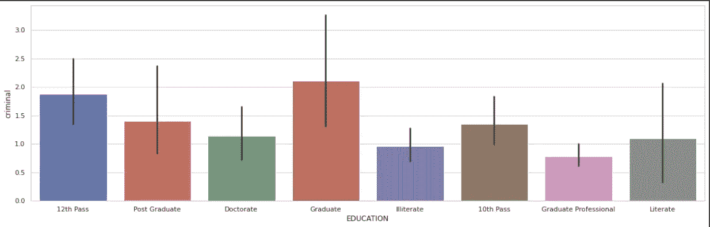

教育与犯罪案件柱状图

我们可以从图表中分析出研究生和 12 级罪犯候选人最多。特别要提一下，一个毕业的人，就干了 240 起。

# 男性和女性候选人的饼状图:

该图代表了参加 Lok Sabha 2019 的男性和女性候选人。

```
y = np.array([cn1,cn2])mylabels = ["MALE","FEMALE"]plt.pie(y, labels = mylabels, startangle = 90)plt.show()
```

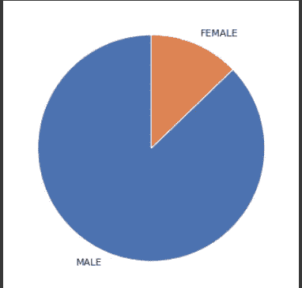

男性和女性候选人的饼状图

从这个饼状图中，我们可以看到男性候选人的数量远远大于女性候选人的数量。

# 有犯罪案件的州级候选人:

这是各州刑事案件竞争者和州刑事案件赢家的条形图。在比哈尔邦、喀拉拉邦、马哈拉施特拉邦、西孟加拉邦、北方邦，有刑事案件的候选人数量最多。

```
state_criminal = df2.groupby('STATE')[['criminal']].sum().sort_values(by=['criminal']).tail(15).sort_values(by=['STATE'])state_criminal_winner = df2[df2['WINNER']>0].groupby('STATE')[['criminal']].sum().sort_values(by=['criminal']).tail(15).sort_values(by=['STATE'])state_criminal
```

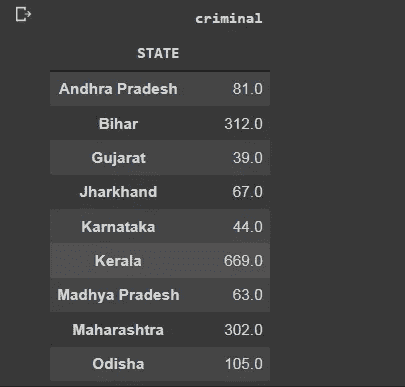

```
# 2 Barplot Side by Sidefig, axes = plt.subplots(1, 2, figsize=(20, 8))# Passing X axis and Y axis along with subplot positionsns.barplot(x = state_criminal.index , y = state_criminal['criminal'] , ax=axes[0] , palette='YlOrBr');axes[0].tick_params(axis='x' , rotation=45); #changing the X axis poition to read more clearlyaxes[0].set_title('STATE WISE CRIMINAL CASE OF CONTESTANTS');#We can also change the color of the barplots by giving different palletessns.barplot(x = state_criminal_winner.index , y = state_criminal_winner['criminal'] , ax=axes[1] , palette='viridis');axes[1].set_title('STATE WISE CRIMINAL CASE OF WINNERS');plt.xticks(rotation=45);
```

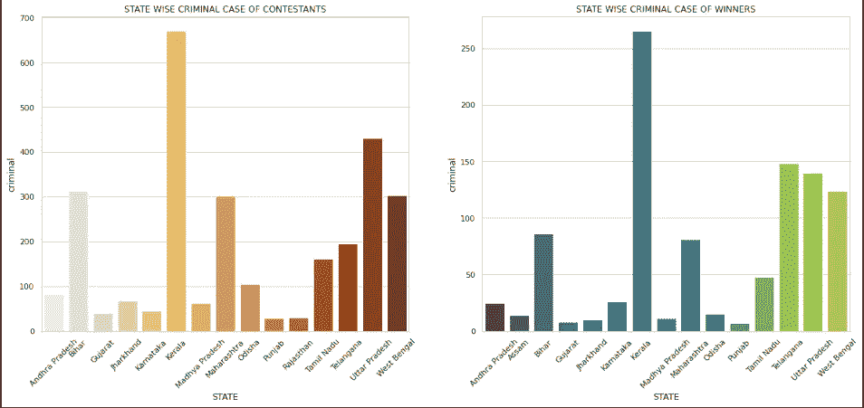

各州刑事案件的参赛者和获胜者

在这里，我们可以看到候选人和获胜者所在州的犯罪案件。这里的条形图显示了喀拉拉邦的最大高度，但西孟加拉邦、北方邦和特伦甘纳邦紧随其后。

# 类别增长条形图:

在这里，我们计算了 2019 年人民院选举中在册种姓、在册部落和普通候选人的人数。

```
consumption = ['SC','ST','GENERAL','OTHERS']growth = [cn1,cn2,cn3,cn4]# Create a pandas dataframedf = pd.DataFrame({"consumption": consumption,"growth": growth})df_sorted_desc= df.sort_values('growth',ascending=False)plt.figure(figsize=(14,10))# make bar plot with matplotlibplt.bar('consumption', 'growth',data=df_sorted_desc,color ='blue',width = 0.4)plt.xlabel("Category", size=15)plt.ylabel("growth", size=15)plt.title("Barplot of Category in the Loksabha Election Candidates", size=18)plt.savefig("bar_plot_matplotlib_Python.png") 
```

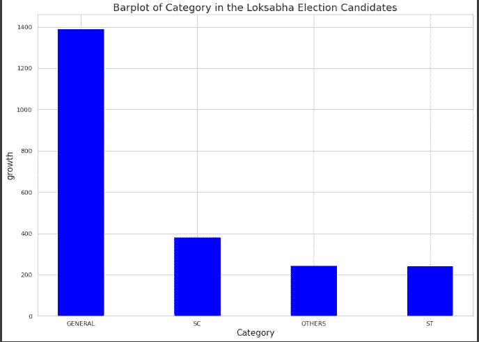

类别与增长柱状图

从图表中，我们可以看到，一般候选人的数量在印度是最大的。一般和其他类别的差别很大。

# 2019 年 Loksabha 选举候选人分配条形图:

这里我们统计了印度不同选区不同党派候选人的分配总数。

```
# Initialize dataconsumption = ['BJP','INC','NOTA','IND','BSP']growth = [cn1,cn2,cn3,cn4,cn5]# Create a pandas dataframedf = pd.DataFrame({"consumption": consumption,"growth": growth})df_sorted_desc= df.sort_values('growth',ascending=False)plt.figure(figsize=(14,10))# make bar plot with matplotlibplt.bar('consumption', 'growth',data=df_sorted_desc,color ='orange',width = 0.4)plt.xlabel("party Name", size=15)plt.ylabel("Total Candidates", size=15)plt.title("Barplot of Candidate Allocation in Loksabha Election 2019", size=18)plt.savefig("bar_plot_matplotlib_Python.png")
```

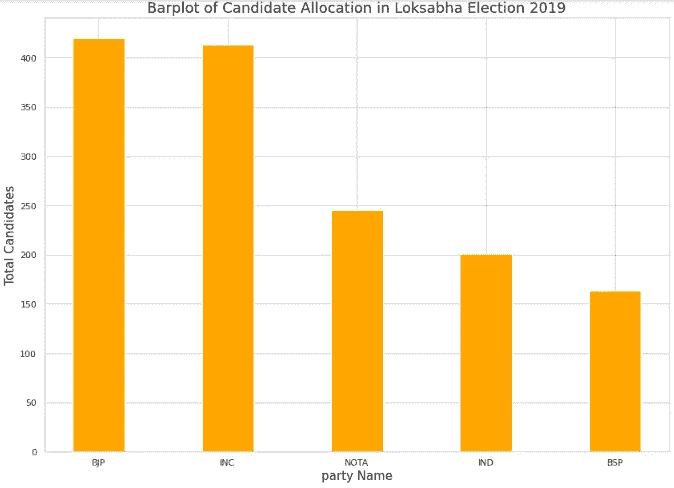

不同政党的候选人计数柱状图

# 犯罪案件中政党与候选人的条形图:

这里我们在计算不同党派的刑事案件候选人。从这些知识中，我们可以了解刑事案件的不同当事人。

```
fig, axes = plt.subplots(1, 2, figsize=(20, 8))# Passing X axis and Y axis along with subplot positionsns.barplot(x = party_criminal_winner.index , y = party_criminal_winner['criminal'] , ax=axes[0] , palette='icefire');axes[0].tick_params(axis='x' , rotation=45); #changing the X axis poition to read more clearlyaxes[0].set_title('PARTY WISE CRIMINAL CASE OF CONTESTANTS');#We can also change the color of the barplots by giving different palletes
sns.barplot(x = party_winner.index , y = party_winner['criminal'] , ax=axes[1] , palette='viridis');axes[1].set_title('PARTY WISE CRIMINAL CASE OF WINNERS');plt.xticks(rotation=45);
```

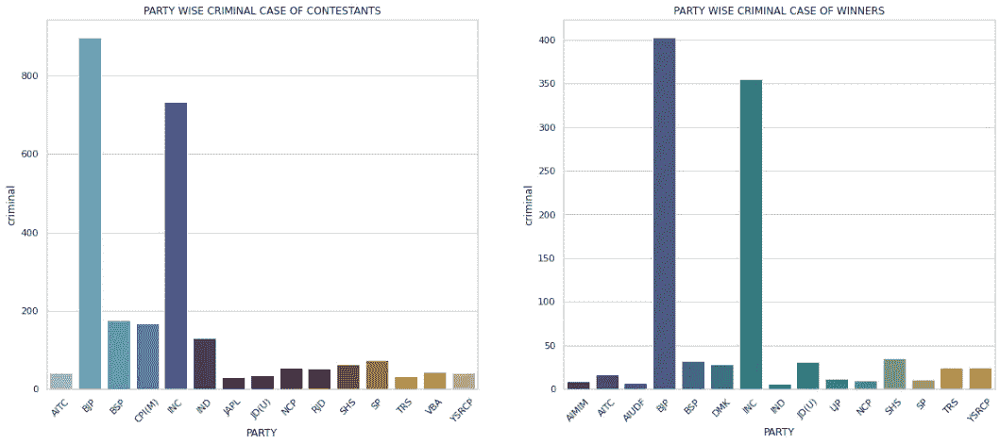

参赛选手和获胜者的党内刑事案件柱状图

从上图中，我们可以看到 BJP 和国大党在印度拥有最多的刑事案件。这是因为，这两个政党都是总部设在印度，而大多数其他政党是地区性政党。

# 印度 Loksabha 2019 年各州与总票数散点图:

```
fig = plt.figure(figsize =(500, 7))df2.plot(x="STATE", y="TOTAL\nVOTES", kind="scatter")
```

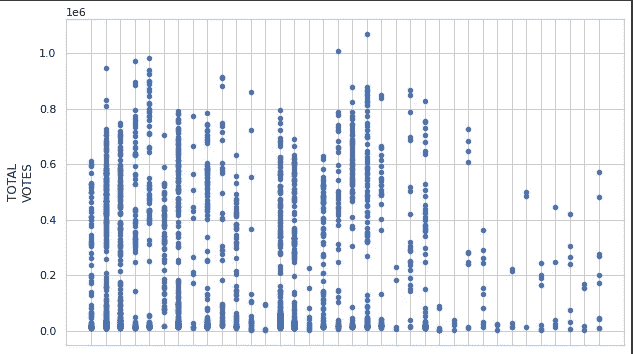

州与总票数散点图

# 年龄与犯罪案件柱状图:

从这个柱状图可以了解不同年龄组考生的犯罪情况。

```
# 2 Barplot Side by Side#fig, axes = plt.subplots(1, 2, figsize=(20, 8))plt.figure(figsize=(14,10))# Passing X axis and Y axis along with subplot positionsns.barplot(x = age_criminal.index , y = age_criminal['criminal'] , palette='icefire');#axes[0].tick_params(axis='x' , rotation=45); #changing the X axis poition to read more clearly#axes[0].set_title('AGE WISE CRIMINAL CASE OF CONTESTANTS');
```

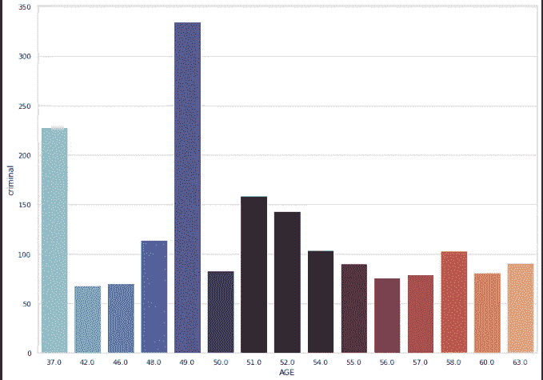

年龄与犯罪案件柱状图

从图表中，我们可以注意到，犯罪记录在 49 岁、37 岁和 51 岁时达到最大值。

# 州与总票数的条形图:

从这个柱状图中，我们可以了解到不同州的投票数。

```
# 2 Barplot Side by Side#fig, axes = plt.subplots(1, 2, figsize=(20, 8))plt.figure(figsize=(25,10))# Passing X axis and Y axis along with subplot positionsns.barplot(x = total_voter1.index , y = total_voter1['TOTAL\nVOTES'] , palette='icefire');#axes[0].tick_params(axis='x' , rotation=45); #changing the X axis poition to read more clearly#axes[0].set_title('AGE WISE CRIMINAL CASE OF CONTESTANTS');
```

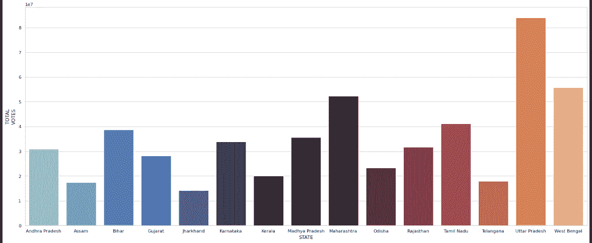

州与总票数的条形图

从柱状图中可以明显看出，马哈拉施特拉邦、北方邦和西孟加拉邦的总票数远远高于印度其他各邦，北方邦在总票数中名列第一。

# 性别与犯罪柱状图:

这是性别与犯罪的柱状图，从中我们可以知道，在印度，女性候选人的数量最多，或者男性候选人的数量最多。

```
#fig, axes = plt.subplots(1, 2, figsize=(20, 8))plt.figure(figsize=(9,4))# Passing X axis and Y axis along with subplot positionsns.barplot(x = party_winner1.index , y = party_winner1['criminal']  , palette='icefire');
```

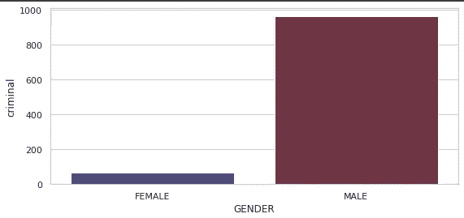

性别与犯罪柱状图

# 州与 EVM 总票数和实际总票数的折线图:

```
#EVM Vote Postal Vote Migrant Voteimport matplotlib.pyplot as plt#fig = plt.figure(figsize =(100, 7))hp.plot(x="State Name", y=["EVM Vote","Total Actual Votes"],figsize =(20, 10), fontsize=10)plt.xlabel("STATE")plt.ylabel("Growth of Postal, EVM, Migrant Vote")plt.title("Distribution of Vote Type in Different States")plt.show()
```

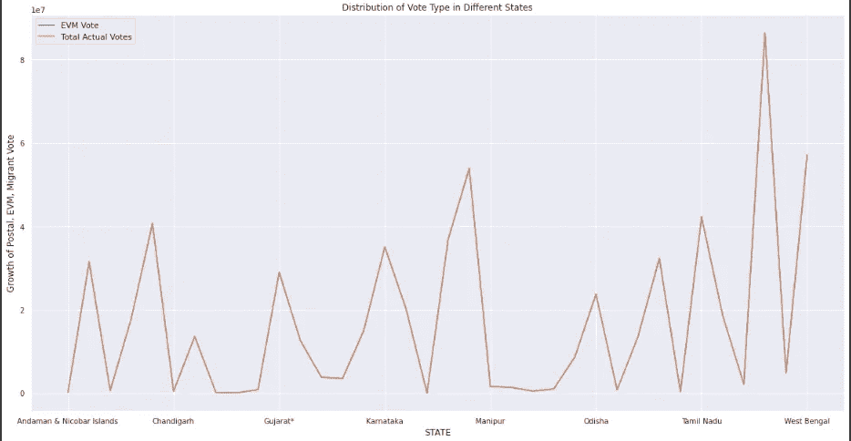

州与 EVM 总票数和实际总票数的折线图

# 印度投票百分比柱状图:

这是 2019 年人民院不同州的投票百分比柱状图。

```
# 2 Barplot Side by Side#fig, axes = plt.subplots(1, 2, figsize=(20, 8))plt.figure(figsize=(25,10))# Passing X axis and Y axis along with subplot positionplt.xticks(rotation=90)sns.barplot(x = hp['State Name'] , y = hp['ratio'] , palette='icefire');#axes[0].tick_params(axis='x' , rotation=45); #changing the X axis poition to read more clearly#axes[0].set_title('AGE WISE CRIMINAL CASE OF CONTESTANTS'); 
```

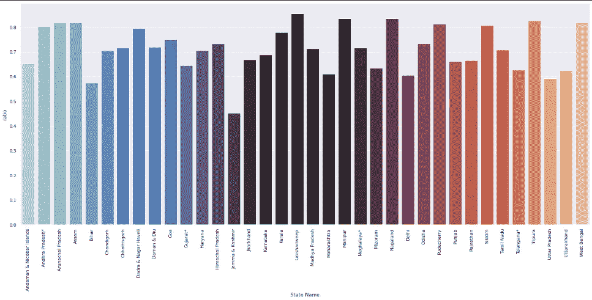

州名与投票百分比柱状图

这是代表州和投票百分比的柱状图。我们可以从柱状图中看到，喀拉拉邦、西孟加拉邦、曼尼普尔邦、马哈拉施特拉邦等地的投票率非常高。所以在印度，人们对政治非常了解。

# 最佳获奖候选人名单:

从下面给出的列表中，我们可以看到在印度 2019 年人民院选举中得票最高的候选人。

```
total_voter2 = hf[hf['Percentage']>0].groupby('Candidate')[['Percentage']].sum().sort_values(by=['Percentage']).tail(15).sort_values(by=['Candidate'])total_voter2
```

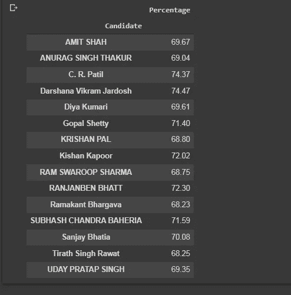

# 结论:

从以上分析，我们可以得出以下几点

1.  从这一分析中，我们发现印度人对选举制度和政党非常了解。在喀拉拉邦、西孟加拉邦、曼尼普尔邦、马哈拉施特拉邦等地，投票率非常高。
2.  BJP 候选人比其他政党更多地参与了人民院 2019。
3.  显而易见，马哈拉施特拉邦、北方邦和西孟加拉邦的总票数远远高于印度其他各邦，北方邦在总票数中名列第一。
4.  女性候选人的数量远远少于男性候选人的数量。
5.  不幸的是，我们发现喀拉拉邦的候选人有最多的刑事案件历史，西孟加拉邦、北方邦和特伦甘纳邦也紧随其后。一个人所犯的刑事案件最多为 240 起，他来自喀拉拉邦。
6.  我们注意到，候选人的刑事案件历史在 49 岁、37 岁和 51 岁时最多。

# 代码的 GitHub 链接:

[](https://github.com/pinaki1889/loksabha-2019-data-analysis.git) [## pinaki 1889/loksabha-2019-数据分析

### 通过在 GitHub 上创建帐户，为 pinaki 1889/loksabha-2019-数据分析开发做出贡献。

github.com](https://github.com/pinaki1889/loksabha-2019-data-analysis.git) 

# 未来工作:


现在，我正试图通过使用机器学习概念来预测 2019 年人民院(Lok Sabha)的获胜者。