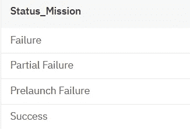

# 基于 SQL 的航天任务数据分析

> 原文：<https://medium.com/analytics-vidhya/data-analysis-of-space-missions-with-sql-8aea29d87872?source=collection_archive---------15----------------------->

## 使用 IBM Db2 for Cloud


SpaceX 在 [Unsplash](/s/photos/rocket?utm_source=unsplash&utm_medium=referral&utm_content=creditCopyText) 上拍摄的

**SQL** 是数据科学家和分析师不可或缺的工具，因为大多数真实世界的数据都存储在数据库中。它不仅是关系数据库操作的标准语言，也是分析数据并从中获得有用见解的强大工具。

让我们使用 IBM 的 Db2 for Cloud ，这是一个作为服务提供的完全托管的 SQL 数据库。*规模经济、灾难恢复*和*可访问性*是云数据库众多优势中的几个。

对于这个分析，我将使用来自 Kaggle 的[“All Space Missions from 1957”](https://www.kaggle.com/agirlcoding/all-space-missions-from-1957)数据集，我已经将它加载到 Db2 数据库并删除了冗余列。

任何数据分析的第一步都是观察数据。我们将使用 SELECT 语句来实现这一点:

```
SELECT * FROM space_missions;
```


正如你所看到的，这个数据集包含了从 1957 年第一次到 2020 年末发生的所有太空任务。它包括公司名称、发射地点、日期和时间、发射细节、火箭状态、火箭(以百万美元计的任务成本)和任务状态。

当一个人想到太空探索公司时，脑海中可能只有 NASA 和 SpaceX，但实际上有 56 家公司！

```
SELECT COUNT(DISTINCT("Company_Name")) as "Total Companies"  FROM space_missions;
```


那么，到目前为止，这 56 家公司承担了多少次太空任务？

```
SELECT COUNT(*) as "All_Space_Missions" FROM space_missions;
```


那可是很多任务啊！让我们看看对这一数字贡献最大的主导公司:

```
SELECT "Company_Name",COUNT("Company_Name") as "Total_Missions" 
FROM space_missions 
GROUP BY "Company_Name"
ORDER BY "Total_Missions" DESC;
```


RVSN 苏联有多达 1777 个任务，而所有其他公司只有不到 300 个任务。然而，如果你仔细看过数据集，大多数苏联的任务都是 2000 年以前的，而不是最近的。让我们来看看哪些公司最近推出了:

```
SELECT DISTINCT( "Company_Name") FROM space_missions 
WHERE "Datum"  LIKE '%2020%';
```


阿丽亚娜航天公司，一家欧洲公司，在 2020 年有最多的太空任务。

我们已经知道，到目前为止，已经进行了 4324 次任务，但是目前有多少次任务是实际有效的？

```
SELECT COUNT(*) as "Active Missions" FROM space_missions 
 WHERE "Status_Rocket"='StatusActive'
```


因此，目前有 790 个活跃的空间任务。大部分任务都退役了，也可能没成功？让我们看看有多少任务是真正成功的:

```
SELECT COUNT("Status_Mission") as "Successful Missions"
 FROM space_missions
 WHERE "Status_Mission" = 'Success';
```


哇，4324 次任务中有 3879 次，即大约 90%成功了，但是为什么另外 10%没有成功呢？让我们看看剩下的发生了什么:

```
SELECT DISTINCT("Status_Mission") FROM space_missions;
```



可能有完全失败、部分失败或发射前失败。

让我们来看看哪些公司遭遇了这些失败:

```
SELECT "Company_Name",COUNT("Status_Mission" ) as "Failures"
 FROM space_missions
 WHERE "Status_Mission" != 'Success'
 GROUP BY "Company_Name"
 ORDER BY "Failures" DESC;
```


RVSN 苏联有最多的失败，以及最多的太空任务，可能是因为它是这个领域的先驱。

太空任务成本极高，失败的任务对公司来说是巨大的损失。

让我们找出哪些任务是最昂贵的，如果有任何较便宜的任务:

```
SELECT MAX("Rocket") as "Most_Expensive" FROM space_missions;
SELECT MIN("Rocket") as "Least_Expensive" FROM space_missions;
```


最昂贵的太空任务耗资 4.5 亿美元，而最便宜的任务耗资 530 万美元。

这些任务属于哪些公司？

```
SELECT DISTINCT("Company_Name") FROM space_missions WHERE "Rocket" = 450.00;
SELECT DISTINCT("Company_Name") FROM space_missions WHERE "Rocket" = 5.30;
```


美国宇航局的任务最昂贵，而 CASC 的最便宜。

平均而言，航天公司在任务上的花费是多少？

```
--Let's see the average spending of companies on space missions from low to high
SELECT "Company_Name", AVG("Rocket") as "Average_Spending" FROM space_missions
GROUP BY "Company_Name"
ORDER BY  AVG("Rocket");
```


火箭实验室的平均任务支出最少，为 750 万美元。

让我们看看哪家公司的平均支出最高:

```
SELECT "Company_Name", AVG("Rocket") as "Average_Spending" FROM space_missions
GROUP BY "Company_Name"
ORDER BY  AVG("Rocket") DESC;
```


美国宇航局的平均支出最高，其次是波音和阿丽亚娜航天公司。

## 结论

SQL 查询对于数据分析来说非常棒，可以帮助回答在这个过程中可能出现的任何问题。对太空任务的分析显示，有许多公司积极致力于太空探索，而且他们的努力大多是成功的。21 世纪见证了这个行业的许多新进入者，他们有自己的使命。太空任务耗资巨大，但其发现和成果更有价值。

**注意:**你可以在这里找到所有的查询和一些附加的[。](https://github.com/ruhi-i/Medium/blob/main/space_missions_queries.txt)