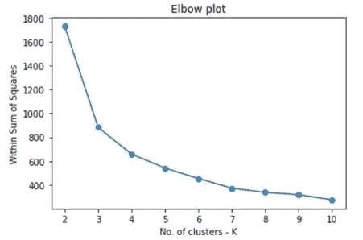

# 沉默的疫情的数据分析:自杀死亡—第一部分

> 原文：<https://medium.com/analytics-vidhya/data-analysis-of-the-silent-pandemic-deaths-by-suicide-part-1-f13c399101b8?source=collection_archive---------19----------------------->

## **使用相关性热图和 K 均值聚类深入研究印度 2019 年的自杀数据**

由[阿萨瓦·图尔西](https://unsplash.com/@atharva_tulsi?utm_source=medium&utm_medium=referral)在 [Unsplash](https://unsplash.com?utm_source=medium&utm_medium=referral) 上拍摄

自去年 1 月以来，与 Covid 相关的统计数据随处可见，和我们大多数人一样，我也一直在关注这些数据。截至 2020 年 12 月 31 日，印度报告了 150，036 例 Covid 死亡。另一个无声的疫情一直在地下肆虐，其数量每天都不在我们面前。如果仔细观察，我们可以发现它们到处都是小新闻。

如果你还没猜到，我说的是自杀。2019 年，印度报告了 139，123 例自杀死亡，这绝不是一个小数字。通过这个系列，我们将探索印度 2019 年的自杀数据，并收集见解。

我们在这里分析什么？

NCRB(印度国家犯罪记录局)公布了印度各邦的自杀数据——按原因、年龄、职业、教育、经济和社会地位分类。现有的最新数据是撰写本文时的 2019 年数据。

在本系列的这一部分，我们将探索各州的自杀人数是否与各州的任何社会经济因素相关。在后面的部分中，我们将更深入地探讨原因方面、年龄方面、教育方面的可视化和洞察力。

我已经采取了:

- 2019 年自杀数据来自 [NCRB](https://ncrb.gov.in/en/accidental-deaths-suicides-in-india?field_adsi_year_value%5Bvalue%5D%5Byear%5D=2020&field_accidental_deaths_suicides_value=2&items_per_page=All)

-各州的经济和发展指标，如其他政府调查报告和人口普查数据中的[识字率](http://mospi.nic.in/sites/default/files/reports_and_publication/statistical_publication/social_statistics/WM16Chapter3.pdf)、[总生育率](https://censusindia.gov.in/vital_statistics/SRS_Report_2017/10.%20Chap_3-Estimates%20of%20Fertility_Indicators-2017.pdf)、各州人均国内生产总值[、](http://mospi.nic.in/sites/default/files/press_releases_statements/State_wise_SDP_15_03_2021.xls)、[基尼系数](https://mpra.ub.uni-muenchen.de/101980/1/MPRA_paper_101980.pdf)(衡量经济平等的一个标准)、[失业率](https://unemploymentinindia.cmie.com/kommon/bin/sr.php?kall=wsttimeseries&index_code=050050000000&dtype=total)、[平均资产得分](https://mpra.ub.uni-muenchen.de/101980/1/MPRA_paper_101980.pdf)和贫困线以下的百分比 [BPL](https://www.prsindia.org/theprsblog/poverty-estimation-india)

-酒精消费和药物滥用数据来自社会正义和赋权部 2019 年发布的[报告](http://socialjustice.nic.in/writereaddata/UploadFile/Magnitude_Substance_Use_India_REPORT.pdf)

**探索数据**

来自 EDA 的重要信息

在进行任何清理或要素选择之前，数据集有 36 行(29 个州和 7 个联邦直辖区)和 25 列

5 列有空值

数据集信息

序列号和所有包含绝对自杀人数和州人口的列都被删除。这将列数减少到了 18 列。

自杀率是我们感兴趣的主要特征。它被定义为每 10 万人口中的自杀人数。拉克沙威的自杀率最低，为 0，安达曼&尼科巴群岛的自杀率最高，为 45.5。

对于缺少值的列，用中值估算空值。

**特征之间的相关性**

下面给出的是 seaborn 热图上显示的 18 个特征之间的相互关系。相关性非常高的要素可以显示为亮黄色或深蓝色，具体取决于相关性的方向。

相关热图

下一步，删除高度相关的特征。代表酗酒者需要帮助的前 10 个州的变量(“前 10 名酗酒者需要帮助”)与自杀率几乎没有关联，因此也被删除了。除了 10 行之外，该变量的所有行都为 0。

删除所有相关变量后的相关热图

*在本分析中，0.7 以上和-0.7 以下的相关性被认为是强相关性，0.5 至 0.7 和-0.7 至-0.5 之间的相关性被认为是中等相关性。*

观察这些社会经济和发展指标的相关性很有意思，因为我从不同的来源收集了数据，但它们确实在某种程度上融合在一起，并有意义。

嗯…几乎所有，除了自杀率。过一会儿我们会看到这一个与我的期望相反的地方以及为什么。

**强关联**

1.基尼系数是衡量人口收入分布的一个尺度。0 基尼系数意味着完全平等的收入分配，1 意味着一个居民获得了所有的收入，而其他人没有获得任何收入。

从这张热图中可以看出，基尼系数与平均资产得分、人均 NSDP 和识字率有很强的负相关关系。

2.基尼系数与 BPL 百分比(该州贫困线以下人口的百分比)有很强的正相关关系。

3.平均资产得分与 BPL 百分比负相关。

4.各种物质滥用分数彼此之间都有很强的相关性。

5.人均 GDP 和平均资产得分有很强的正相关关系。

**中度相关**

1.基尼系数和总和生育率有适度的正相关关系。

(总生育率是一名妇女一生中所生孩子的平均数。为了维持人口水平，它需要在 2.1。少一点，人口下降，多一点，人口增加)

2.总识字率与人均 NSDP 和平均资产得分呈中度正相关。

3.总和生育率与人均 NSDP 和平均资产得分呈中度负相关。

4.BPL 百分比与人均 NSDP 和识字率呈中度负相关。

**自杀率与其他变量的相关性:**

1.自杀率与总和生育率(-0.44)和基尼系数(-0.38)呈弱负相关。这意味着在生育率较高、收入不平等程度较高的州，自杀率较低。

2.与酒精总百分比(0.38)和人均 NSDP (0.4)呈弱正相关。

在整个印度，66.2%的自杀者年收入低于 100，000 卢比。那是收入最低的群体。这就是为什么自杀率与基尼系数呈负相关，与人均 NSDP 呈正相关的现象令人惊讶。

## **对该数据的聚类方法**

聚类是一种无监督的学习技术，用于根据相似性将相似的数据点分组到聚类中。在这一节中，我们将根据自杀率对各州进行分类。

由于聚类是一种基于距离的技术，我使用 Sklearn 的标准缩放器来缩放所有功能。所得到的聚类不是围绕自杀率建立的，因此聚类内的方差太高。

我希望根据自杀率来形成聚类，或者换句话说，我希望自杀率特征具有更大的权重。因此，我在缩放数据集上将该特征的权重增加了 10 倍。

在对从 2 到 10 的各种 K 值运行 K 均值算法时，获得了以下 WSS(在平方和/肘内)图。

对 k 来说，3 和 4 似乎是不错的选择。从轮廓分数来看，3 似乎更好。

在 SKLearn 的 K-means 算法中使用 K=3 并获得标签，我将数据集分组并获得所有变量的平均值。

让我们看看按自杀率递增顺序排列的 3 个集群。这些行还用绿色、橙色和红色进行了颜色编码，以给集群一个直观的感觉。

3 个聚类和每个聚类的维度均值

**集群 1**

聚类 1 的自杀率最低，为 4.39，有 15 个州。识字率、酒精消费者百分比、人均 NSDP 和平均资产得分在这一组中最低。这个集群的自杀率远低于印度每 10 万人中 10.4 人的平均水平。下面给出了属于第 1 组的各州以及相应的自杀率。

第一组国家

**集群 2**

这个集群的自杀率为 14.65，高于印度的平均自杀率 10.4，它有 16 个邦。识字率、失业率、酒精消费百分比、TFR、平均资产得分和基尼系数值介于聚类 1 和聚类 0 之间。这些州的 NSDP 几乎与自杀率最高的 NSDP 州相同(聚类 0)。就自杀率而言，其他药物滥用数字并未显示出跨组群的一致模式。下列国家属于第二组。

第二组国家

**集群 0**

这个由 5 个邦组成的集群自杀率最高(32.36)，远高于印度的平均水平。它的识字率最高，失业率最低，人均 NSDP 最高，TFR 最低，基尼系数最低。然而，它有最高的酒精消费百分比。

属于第 0 组的国家

**这些集群看起来像什么？**

下面绘制的是自杀率与几个变量的散点图，显示了一些相关性。3 个集群以不同的颜色显示。

**结论**

在这篇文章中，我们研究了印度 2019 年各邦自杀率数据如何与各邦和中央直辖区的一些社会经济和发展指标相关联。

这一分析揭示了与预期相反的见解，即较富裕的州自杀率较低。

相关热图显示了“自杀率”和“酗酒者总百分比”以及“人均 NSDP”之间微弱的正相关关系。“基尼系数”和“总和生育率”呈弱负相关。对通过 K-means 算法形成的聚类的聚类分析也显示了类似的模式。

这里要注意几件事:这些相关性很弱，相关性并不意味着因果关系。在本系列的下一部分，我们将从原因的角度研究自杀数据。