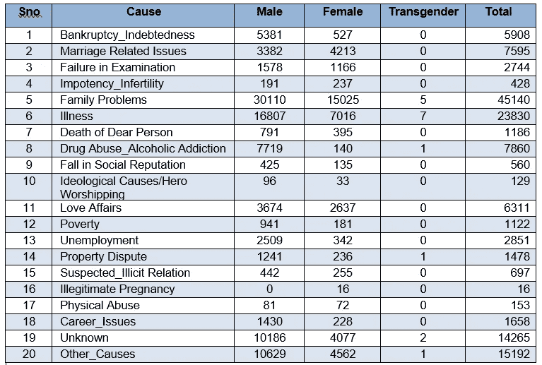
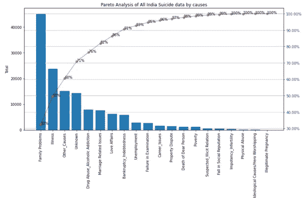
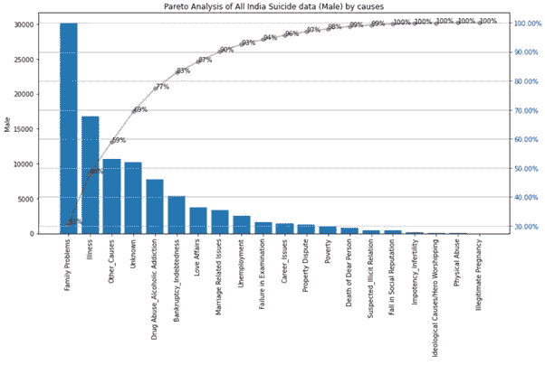
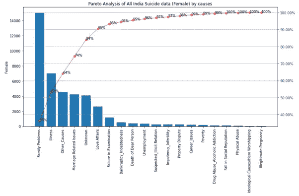
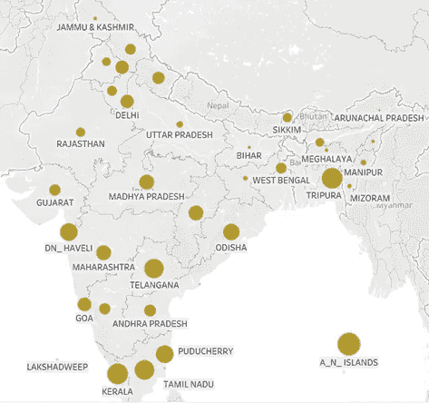
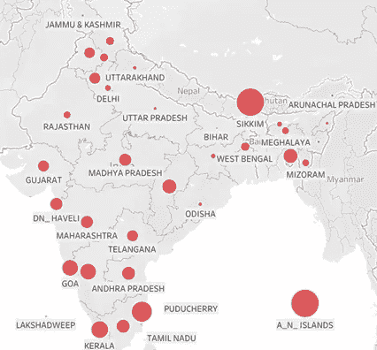
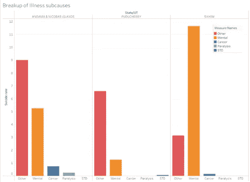
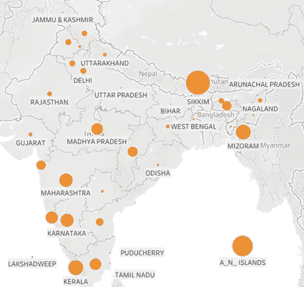
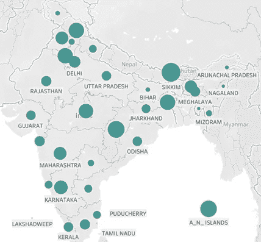
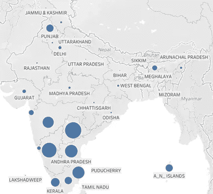

# 《沉默的疫情:自杀死亡》的数据分析(二)

> 原文：<https://medium.com/analytics-vidhya/data-analysis-of-the-silent-pandemic-deaths-by-suicide-part-2-c0277ffa398a?source=collection_archive---------10----------------------->

**利用帕累托原理分析印度 2019 年自杀死亡的原因，并对各邦的主要原因进行可视化**

由[丹·迈耶斯](https://unsplash.com/@dmey503?utm_source=medium&utm_medium=referral)在 [Unsplash](https://unsplash.com?utm_source=medium&utm_medium=referral) 上拍摄的照片

在印度 2019 年自杀分析的第一部分[中，我探索了印度各邦的自杀率，并试图将其与各邦的社会经济发展指标相关联。围绕自杀率进行的相关性分析和聚类分析显示，自杀率与识字率、总生育率、州国内生产总值等指标之间的相关性很差，而且与直觉相反。换句话说，在发展指标尺度上衡量较好的州也显示出较高的自杀率。](https://vanikgarun.medium.com/data-analysis-of-the-silent-pandemic-deaths-by-suicide-part-1-f13c399101b8)

在本系列的这一部分中，我分析了:

1.对全印度自杀原因进行帕累托分析，以获得导致 80%自杀的前 20%(大约)的原因。我已经使用 Matplotlib 和 Python 完成了这个分析

2.印度各邦各种原因自杀分布的可视化探索。这是使用 Tableau 完成的。

我们开始吧！

**什么是帕累托分析？**

从高层次上来说，帕累托原理是生活中的大多数事情都不是均匀分布的思想。根据帕累托原理(又称 80/20 法则)，20%的原因导致 80%的后果。

我广泛地使用它(在 excel 中)来分析我管理的 it 项目中的缺陷和原因。通过 pareto 分析确定并修正 20%缺陷类别的根本原因，就有可能阻止项目中 80%的缺陷。由于只有 20%的根本原因是针对分析和行动的，所以通过提高质量和花费较少的努力，它总是给项目带来显著的好处。

为了当前的分析，我使用了来自 NCRB(国家犯罪记录局)网站的全印度自杀原因数据。数据集如下所示，有 20 个原因:

2019 全印度自杀表

**构建帕累托图**

我通过关注 Tyler Marr 的博客，使用 Python 和 Matplotlib 实现了帕累托可视化。

该图由两个子图组成:

*   按自杀原因降序排列的自杀条形图
*   这些原因加起来的累积百分比的线图

读取该图的方法是从右侧 y 轴开始追踪 80%线，直到它与线图相交(红线显示累积百分比)。然后，从该点开始，在 x 轴上垂直放下一条假想线。这条假想线左边的原因就是我们所考虑的原因。举例来说，在下面给出的图表中，我们将考虑从“家庭问题”到“婚姻相关问题”的 6 大原因。如果这些原因加起来不到 80%,右侧的附加原因也可以被认为加起来达到 80%或以上。

**自杀总数的帕累托图**

全印度自杀率的帕累托图— 2019 年

现在让我们看看男性和女性自杀人数的帕累托图

全印度男性的原因帕累托图

全印度按原因分列的女性帕累托图

在男性和女性性别类别中，导致 80%自杀人数的主要原因是:

*   男性(6 种原因):家庭问题、疾病、其他原因、未知、药物滥用/酒精成瘾、破产/债务
*   女性(5 个原因):家庭问题、疾病、其他原因、婚姻相关问题和未知

我们可以看到 4 个原因在两性中是相同的。然而，男性自杀的几个主要原因并不在女性自杀原因之列，它们是吸毒/酗酒和破产/债务。同样，“婚姻相关问题”在女性自杀原因中排名第四，但在男性自杀原因中排名第八。在男性和女性中，“家庭问题”和“疾病”导致了最多的自杀死亡。

在“未知原因”和“其他原因”的解释方面，无法做太多工作。因此，我们不会看到它们的可视化。

**各州按死因分列的自杀率分布**

让我们来看看自杀原因分布的可视化，使用帕累托图来确定主要原因。NCRB 网站上的原始数据包含了所有原因和状态的绝对数字。由于各国的大小和人口密度不同，绘制绝对数字没有意义。所以，我把所有的绝对自杀数字转换成自杀率，除以各邦的人口，以 10 万卢比为单位。下图中气泡大小的比较现在变得有意义了。下面所有的图都是使用 Tableau Public 绘制的。你可以在这里访问它们[。](https://public.tableau.com/views/IndiaSuicide2019-suicidesbystatecauses/SuiciderateduetoExamFailure?:language=en-US&:display_count=n&:origin=viz_share_link)

**因家庭问题自杀**

因家庭问题而自杀

家庭问题是全印度自杀的首要原因。从上面的地图中可以看出，与北部各州相比，南部各州的自杀率更高。安达曼和尼科巴群岛的自杀率最高(每 10 万人中有 12 人)。东北部的特里普拉邦在这一类别中也比东北部的其他邦突出。由于这一原因没有进一步的细分，因此很难深入了解这一原因的确切性质，或者是什么样的文化差异导致南方各州的自杀率高于北方。

**因病自杀**

因病自杀

疾病是全印度自杀的第二大原因。在上面的图中，锡金和安达曼&尼科巴群岛很突出，因此与其他邦和中央直辖区相比，自杀率更高(约 15%)。

A&N 群岛、普杜切里岛和锡金岛按子原因分列的疾病

该数据集对疾病下的子原因进行了细分。上图显示了因病自杀率最高的前 3 个州的疾病类型。锡金邦的疾病死亡主要是由于精神疾病，而对于其他两个邦来说，一个叫做“其他”的包罗万象的桶是最大的贡献者。

**因吸毒/酗酒导致的自杀**

酗酒/吸毒导致的自杀

如上图所示，因吸毒和酗酒导致的自杀在锡金、安达曼和尼科巴群岛最为普遍。根据 T4 国家卫生研究院的一份报告，物质滥用和精神疾病之间存在联系。这可能解释了这些邦/中央直辖区在精神疾病和药物滥用两类自杀死亡中的高流行率。

**因婚姻相关问题自杀**

因婚姻问题导致的自杀

从上面的情节来看，因婚姻相关问题导致的自杀似乎在整个国家都很普遍。这是女性死亡百分比(55%)高于男性死亡百分比(45%)的一个类别。这主要是由于这个原因中的一个子类，叫做“嫁妆”，它导致了 25%的“婚姻问题”死亡。92%的嫁妆死亡是女性。

**因破产/债务导致的自杀**

因破产/债务导致的自杀

上图显示了全国各地因债务/破产而自杀死亡的情况。这是男性自杀的主要原因之一。与其他原因形成对比的是，其他原因导致的死亡在全国范围内普遍存在，并在某些邦/中央直辖区加剧，这一原因在南部各邦、马哈拉施特拉邦、旁遮普省和北部岛屿最为普遍。没有将这一原因与职业或年龄段相联系的细分或方法，因为这些原因的数据是在总体水平上可用的。一种可能是这些数字与这些州的农民自杀有关(由于高负债)，但这只是一种假设。

**结论:**

在这篇文章中，我们看到了导致 80%的自杀死亡的主要原因。我们使用可视化技术进一步探索了主要原因在全国的分布情况。我们还看到，明智自杀的原因在全国并不均匀分布。不同的邦/中央直辖区显示不同原因造成的死亡人数不同。即使只有汇总的数据(每个州/UT 一行)，我们也可以使用分析得出如此多的见解。如果使用详细的行级数据进行分析(NCRB 网站上没有详细的行级数据),可以获得导致具体行动项目的更多见解。

除了精神疾病，自杀导致的死亡大多是因为绝望而非抑郁。无论是债务、考试失败、嫁妆还是家庭问题，相关的个人一定觉得没有出路。这不仅仅是一个心理健康问题。它显示了对社会结构进行变革的更大和更迫切的需要。无论是嫁妆，强迫学生学习优秀，因为离婚是一个禁忌而感到被困在婚姻中，不知道如何处理个人财务，酒精/药物成瘾——所有这些问题都应该在集体社会层面上处理，而不是在个人层面上。

在最近一连串嫁妆死亡事件后，喀拉拉邦政府最近正考虑在学校教科书中增加反嫁妆课程。关于生活重要方面的学校教育，如选择适合个人优势的职业道路、个人理财、身心健康和性别平等，将是解决自杀问题的重要第一步。建立更多的康复中心来帮助吸毒者和酗酒者康复是另一个办法。我希望所有的州政府都能像对待其他社会经济参数一样重视州自杀率。我也希望这将导致对自杀数据的详细分析，找出原因并实施政策以减少自杀死亡。

感谢阅读！