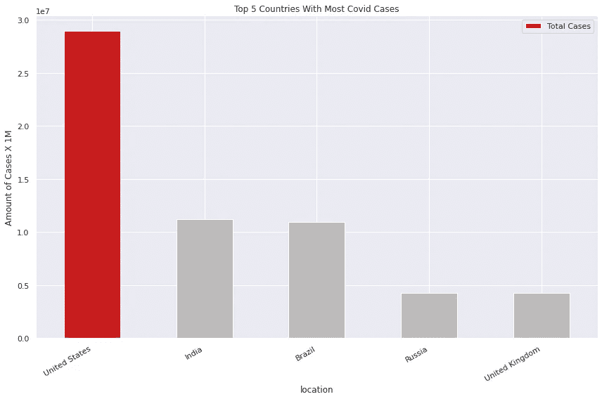
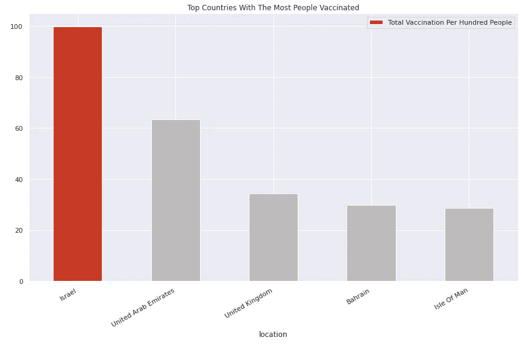

# 世界新冠肺炎数据分析

> 原文：<https://medium.com/analytics-vidhya/data-analysis-on-covid-19-in-the-world-f9f113c82424?source=collection_archive---------19----------------------->

## 从全球、加拿大和巴西的角度来看

2019 年 12 月**，全世界都听说了中国武汉发生了新的肺炎疫情。几天后，科学家发现中国没有应对肺炎。相反，它是一种冠状病毒，被命名为 Sars-Cov-2，后来被命名为新冠肺炎。**


[约翰·利博特](https://unsplash.com/@yohannlibot?utm_source=unsplash&utm_medium=referral&utm_content=creditCopyText)在 [Unsplash](https://unsplash.com/s/photos/coronavirus?utm_source=unsplash&utm_medium=referral&utm_content=creditCopyText) 上的照片

没有人预料到它会成为现在这样的问题，当我第一次听说 Covid 的时候，在一月初，我和我的家人在中美洲背包旅行，我没有想到它会成为一件事。然而，我们在这里，在一个商业不得不关闭的疫情，**超过 257 万人已经死亡**(当我写这篇文章的时候)，每个人都不得不戴上**口罩**和**反疫苗运动**变得越来越大和广泛。

不幸的是，世界变了很多。

学校停课，疫苗接种引发了一场政治战争，由于假新闻和非科学信仰，超过 40%的美国人不会接种疫苗，声称没有足够的研究。尽管科学家们确实努力确保疫苗的安全性和有效性。也有大量的投资和研究证明了它的安全性。我向所有为了拯救他人而放弃个人生命的前线工作者和科学家们致敬。

记住**我是在 2021 年 3 月 6 日**做的这个分析。因此，**数字可能已经改变了**，这取决于你什么时候读到这篇文章。

这些数据来自牛津大学拥有的“我们的世界数据”( T21 ),并且只使用来自官方来源的信息，如世界卫生组织(世卫组织)和政府。因此，我不对 CSV 表中的误导性数据负责。请务必点击查看他们的数据集[。](https://github.com/owid/covid-19-data/tree/master/public/data)


照片由 [Edwin Hooper](https://unsplash.com/@edwinhooper?utm_source=unsplash&utm_medium=referral&utm_content=creditCopyText) 在[unsprash](https://unsplash.com/s/photos/coronavirus?utm_source=unsplash&utm_medium=referral&utm_content=creditCopyText)上拍摄

# 开始之前

分析很长，但值得你去读。另外，如果你想检查所有的编码和绘图程序，请访问我的 [Google Colab 笔记本](https://colab.research.google.com/drive/1rWXVzzczljAvGEwH8cdd2kHO9VcVd77i?usp=sharing)。

# 导入数据和模块

我们只需要三个库进行分析，它们是:

*   `pandas` -操纵我们的桌子。
*   `matplotlib` -绘制图形。
*   `seaborn` -设计情节。

让我们导入它们:

```
# Importing our libraries
import pandas as pd
import matplotlib.pyplot as plt
import seaborn as sns# Settings for style and appearance
%matplotlib inline
sns.set()DATA_PATH = 'https://covid.ourworldindata.org/data/owid-covid-data.csv' # Link to our data
df = pd.read_csv(DATA_PATH) # Assigning df to our dataset
```

在查看了我们的数据、检查其大小并清理后，发现我们有 **73384 行**和 **59 列。**很大的桌子，嗯？

变量`location`包含所有国家，但是，它也包含一些大陆。我们不希望这样，因为有一个变量为他们调用，所以我把他们从位置。

然后我还设置了`date`作为我们的索引，然后将其转换为`date_time`类型。

我也再次检查了`shape`。清洗后，我们有 70973 和 59 排。

# 2021 年 3 月 6 日新发病例最多的国家

我想知道今天，2021 年 3 月 6 日，哪个国家的死亡/病例最多。

方法`.loc[]`允许我们找到给定参数内的数据。

我将通过 2021–03–06 作为参数。然后我将按照`new_cases`的数量按降序对这些值进行排序。

顺便说一下，我会跳到第二排，因为第一排是`World`，里面包含了所有国家的总和。

```
df.loc['2021-03-06'].sort_values(ascending=False, by='new_cases')[1:3]
```


巴西名列前茅，紧随其后的是美国，在 3 月 6 日这两个国家分别有 75 102 和 67 164 个新病例。

*   巴西-69609
*   美国-58062

作为一个住在巴西的人，这对我来说很有意义。人们根本不遵循隔离或社会距离。许多人甚至说疫情已经结束，但事实并非如此。可悲的是，政府也没有为人民提供有用的帮助。相反，他们一直在关闭企业，削减社会援助。

# 病例总数最多的前 5 个国家

现在想看看`total_cases`数量排名前五的国家。
我们这样做的方式与上面的例子非常相似，但是我将使用`total_cases`而不是`new_cases`。

```
# the 5 countries with highest cases numberdf.loc['2021-03-06'].sort_values(by='total_cases', ascending=False)[1:6]
```

让我们绘制一个条形图来比较这些数字:



作者的情节

美国远远领先于所有其他国家。实际上，中国的病例是印度的两倍多，而印度是世界上人口第二多的国家。

# 死亡人数最多的前五个国家

```
# Countries with highest death ratedf.loc['2021-03-06'].sort_values(by='total_deaths', ascending=False)[1:6]
```

一些研究试图将低收入与高比例的新病例直接联系起来。然而，像美国和英国这样的国家进入了前五名，尽管它们一点也不穷:

让我们也画出这个:


作者的情节

# 世界上死亡人数增加的一天

世界上哪一天死亡人数最多？
为了回答这个问题，我们将使用与上述示例相同的逻辑，但是，我们将只获得排名第一的行。

```
# Day with the most cases
df.sort_values(by='new_deaths', ascending=False)[0:1]
```


按作者

2021 年 1 月 20 日是世界上新冠肺炎单日死亡人数最多的一天。
这其实让我很惊讶。我以为是 2020 年 9-11 月左右。然而，它告诉我们，全世界的人们都没有被隔离。

*   **2021 年 1 月 20 日–17886 人死亡**

# 人类发展指数与总死亡数的关系。

现在让我们来看看哪个国家的人口/死亡率最低。为此，我将使用变量`total_deaths_per_million`，它将考虑每百万人中的死亡人数。
同样，逻辑与其他示例相同，但我们想要的不是更高的数字，而是最低的数字，因此称为`ascending=True`。我还会检查总死亡人数。

```
# Checking country's HDI
df.loc['2021-03-06'].sort_values(by='total_deaths_per_million', ascending=True)[:1]
```


按作者


布隆迪是每百万人中死亡率最低的国家，以下是该地的统计数据:

*   案件总数(`total_cases` ) - 2 299
*   死亡总数(`total_deaths` ) - 3
*   拥有洗手设施的人口比例(`handwashing_facilities` ) - 6.144%
*   人口(`population` ) - 11 890 781
*   年龄中位数(`median_age` ) - 17.5 岁
*   极端贫困(`extreme_poverty` ) - 71.7%
*   预期寿命(`life_expectancy` ) - 61.58 岁
*   人类发展指数(`human_development_index` ) - 0.433。

让我们想象一下新冠肺炎在布隆迪的发展:


作者的情节

# 施用的新冠肺炎疫苗总剂量数

现在我们来看看哪些国家接种疫苗的人最多。
我将使用最近的日期(2021–03–06)作为我的参数，然后我将按`total_vaccinations`降序排列这些值。


作者的情节

尽管各州已经为很多人接种了疫苗，但疫苗接种的成功与否取决于有多少人接种了疫苗。因此，让我们根据人口比率来分析哪些国家服用此药的人数最多。还是用`total_vaccination_per_hundred`吧。Obs:我将使用第二行作为顶部结果，因为第一行将是直布罗陀，它的所有值都为空。所以我会忽略它。

```
# top five countries by total vaccinations per one hundred peopledf.loc['2021-03-06'].sort_values(by='total_vaccinations_per_hundred'
, ascending=False)[1:6]
```



作者的情节

好了，这是一个公平的比较。当然，马尔代夫接种疫苗的人数不会比美国多，它的人口要少得多。然而，当你分析每一百人，你会发现马尔代夫实际上有更多的人接种疫苗。

# 新冠肺炎的死亡和传播

我希望看到世界上死亡人数的增加(`new_deaths`)和病毒的传播(`new_cases`)。


作者的情节

两张图都在大幅增长。然而，在 2021 年 1 月左右，它们开始减少。这是大多数国家开始接种疫苗的同一季节，它证明了疫苗是如何拯救生命的。

# 按死亡总人数分列的人均国内生产总值散点图

国家的收入和死亡人数有关系吗？


似乎最富有和最贫穷的国家是死亡人数最少的国家。布隆迪的国内生产总值很低，但尽管它有 1150 万人口，但根据 Covid，它只有 3 例死亡。

让我们看看哪个国家有世界中位数`gdp_per_capita`。


现在我们知道了世界人均收入的最高值、最低值、平均值和中值。哪些国家代表这些价值观？

首先，我们来查一下 GDP 中值:

## 世界人均国内生产总值中位数

```
# Printing country with the median GDPdf[df['gdp_per_capita'] == 12951.839].sort_values(by='total_deaths', ascending=False)[:1]
```


按作者


圣卢西亚国旗

圣卢西亚是加勒比海的一个国家。它拥有世界人均 GDP 的中位数，约为 12951 美元。

这一数值低于世界平均水平，约为 19 126 美元。
共 183 629 人，Covid 死亡 43 例，约 0.02%的 Covid 患者死亡

## 世界最高的人均 GDP

```
# Printing the highest gdp in the worlddf[df['gdp_per_capita'] == 116935.6].sort_values(by='total_deaths', ascending=False)[:1]
```


按作者


卡塔尔国旗

卡塔尔是一个亚洲国家，人均 GDP 世界领先。约合 116，935 美元。
截至目前，卡塔尔人口为 227，322 人，其中约 166，475 人患有 Covid，约占总人口的 73%。
然而，在 166 475 例 Covid 病例中，只有 262 人死亡，约占 0.16%。


## 世界上最低的人均 GDP

```
# Finding which country has the lowest gdp per capitadf[df.gdp_per_capita == 661.24].sort_values(by='total_deaths', ascending=False)[:1]
```


中非共和国国旗

中非共和国是世界上人均国内生产总值最低的国家。
人口 4 829 764 人，其中 5018 人有 Covid。
5018 例中，死亡 63 例，占 1.25%左右。

让我们想象一下如何比较这三个国家的`gdp_per_capita`:


作者的情节

这就是最高、中间和最低国家的分布。

即使在这之后，我们也不能说 GDP 和 Covid 死亡之间的关系不存在，因为它取决于大量的比例检验等。不过，还是挺有意思的。

# 加拿大


加拿大国旗

加拿大多次被认为是世界上最适合居住的地方。它是美丽的，多样的。人们很热情，总的来说，愿意帮忙。有机会就去看看。尽管我是巴西人，但我的父母中有一人是加拿大人，这使我真正接近这个国家，因为家庭，但也因为我热爱它。因此，我关注它的政治等。不幸的是，加拿大在疫情期间表现不佳。这让我很想知道它是怎么回事。正因如此，我们来分析一下。

我会将其所有相应的数据分配给`df_canada`。

```
# Assigning Canada's data to df_canadadf_canada = df[df.location == 'Canada']
```

现在让我们为`new_cases`、`new_vaccinations`和`total_deaths`绘制三个图表。


按作者

加拿大在 12 月中旬开始接种疫苗，注意在 1-2 月，随着疫苗接种的增加，死亡和新增病例数开始下降。

现在让我们检查一下加拿大的`total_deaths`和`total_cases`。
我会把今天的日期(2021 年 3 月 6 日)分配给`df_canada_today`，这样我们就只能得到最新的结果。


# 加拿大对巴西在疫情


照片由@thami__cascales 拍摄

大多数国家在疫情的表现不如纽西兰和澳洲。加拿大和巴西也不例外。然而，尽管加拿大有很多案例，因为很多人不遵守社交距离，但政府试图让他们呆在家里。加拿大甚至给予因疫情而失业的公民相当多的社会援助。
另一方面，巴西总统博尔索纳罗是一个否定主义者，在许多公开采访中声称不相信乔维德。他也没有真正合作帮助各州购买外部疫苗——像辉瑞、Moderna 和其他公司——也没有帮助巴西的生产商 butan tan——仅仅因为他们与中国品牌北京科兴生物制品有限公司合作。他也多次拒绝戴口罩。
因此，我们来比较一下这两个国家。

我将把巴西的所有数据分配给`df_brazil`。

```
# Assigning Brazil's data to df_brazildf_brazil = df[df['location'] == 'Brazil']
```

现在，让我们绘制一个对比两国`new_cases_per_million`的折线图。
这样比较就公平了，因为加拿大的人口比我所在的圣保罗少 700 万。


作者的情节

在开始的时候，我们可以看到加拿大比巴西差的一些时刻。然而，情况很快发生了变化。大约在 2021 年 1 月，加拿大的情况比巴西糟糕一两天，但后来，通过改变疫苗接种计划，这一过程变得更加稳健，因此新病例开始下降。

为了更加直观，我将下载并导入库`pywaffle`，它将为我们提供一个华夫饼图表。那是我最喜欢的图书馆之一，我强烈建议你去学习它。

```
# Installing the library
!pip install pywaffle -q# Importing
from pywaffle import Waffle
```

我将通过每个国家的`total_cases_per_million`(即每 100 万人中确诊的新冠肺炎病例总数)的取整平均值作为我们的参数。


作者的情节

如你所见，在 75 个图标中，加拿大只占据了 19 个，而巴西占据了 56 个。这显示了巴西和加拿大在处理疫情问题上的巨大差异。既然是每百万人，那他们有多少人就无所谓了。

为了让你对数字有个概念，下面是两个国家的`total_cases_per_million`的意思:


# 结论

从数据分析中可以看出，新冠肺炎的情况越来越糟，以下是我们获得的一些见解:

*   我们死亡人数更多的一天是 2021 年 1 月 20 日。
*   布隆迪是每百万人中死亡率最低的国家，尽管那里有 1150 万人。
*   卡塔尔是世界上人均 GDP 最高的国家。
*   美国是死亡率最高的国家。
*   考虑到国家的大小，以色列是接种疫苗人数最多的地方。
*   加拿大的新冠肺炎死亡率一直在上升，直到开始接种疫苗，然后死亡率急剧下降。
*   中非共和国是世界上人均 GDP 最低的国家，然而，该国 500 万人口中只有 63 人死亡。

# 与我联系

如果你喜欢这篇文章，分享它并留下评论告诉我你的想法，我能做得更好吗？别忘了在 [LinkedIn](https://www.linkedin.com/in/vin%C3%ADcius-porfirio-purgato-7891401b3/) 和 [GitHub](https://github.com/vinny380) 上加我，下次见！