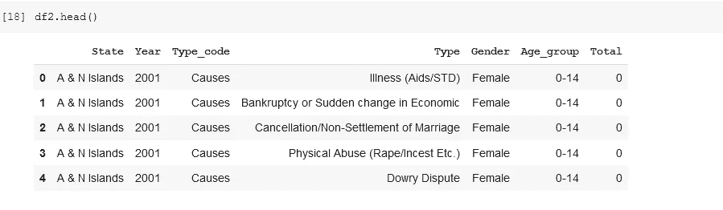

# 印度自杀率的数据分析

> 原文：<https://medium.com/analytics-vidhya/data-analysis-on-suicide-rates-in-india-be92b0fd1566?source=collection_archive---------2----------------------->


使用 [python](https://www.python.org/) ， [Numpy](https://numpy.org/) ，[熊猫](https://pandas.pydata.org/)， [Matplotlib](https://matplotlib.org/) ， [Seaborn](https://seaborn.pydata.org/) ， [Plotly](https://plotly.com/python/)

> 当你想放弃的时候，记得你坚持了这么久的原因

**自杀**是故意造成自己[死亡](https://en.wikipedia.org/wiki/Death)的行为。[【9】](https://en.wikipedia.org/wiki/Suicide#cite_note-Sted2006-9)(包括[抑郁症](https://en.wikipedia.org/wiki/Major_depressive_disorder)，[双相情感障碍](https://en.wikipedia.org/wiki/Bipolar_disorder)，[自闭症谱系障碍](https://en.wikipedia.org/wiki/Autism_spectrum_disorders)，[精神分裂症](https://en.wikipedia.org/wiki/Schizophrenia)，[人格障碍](https://en.wikipedia.org/wiki/Personality_disorder)，[焦虑症](https://en.wikipedia.org/wiki/Anxiety_disorder))，[虚无主义](https://en.wikipedia.org/wiki/Nihilism)信仰，身体障碍(如[慢性疲劳综合征](https://en.wikipedia.org/wiki/Chronic_fatigue_syndrome)，[物质使用障碍](https://en.wikipedia.org/wiki/Substance_use_disorder)(包括有些自杀是由于压力(如经济或[学业困难](https://en.wikipedia.org/wiki/Suicide_in_colleges_in_the_United_States))、关系问题(如[分手](https://en.wikipedia.org/wiki/Breakup)或至亲去世)、骚扰/欺凌而产生的冲动行为。那些曾经试图自杀的人有更高的风险再次尝试自杀。有效的[自杀预防](https://en.wikipedia.org/wiki/Suicide_prevention)努力包括限制使用自杀方法——如[枪支](https://en.wikipedia.org/wiki/Firearms)、毒品和毒药；治疗精神障碍和物质滥用；小心[媒体](https://en.wikipedia.org/wiki/Mass_media)关于自杀的报道；和改善经济状况。尽管[危机热线](https://en.wikipedia.org/wiki/Crisis_hotline)很常见，但它们并没有得到很好的研究。

# 关键事实:

*   每年有 70 多万人死于自杀。
*   每一起自杀，就有更多的人试图自杀。在一般人群中，自杀未遂是自杀的最重要的风险因素。
*   自杀是 15-19 岁青少年的第四大死因。
*   77%的全球自杀发生在中低收入国家。
*   摄入杀虫剂、绞刑和枪支是全球最常见的自杀方式。

每年有 703 000 人结束自己的生命，还有更多的人试图自杀。每一次自杀都是一场悲剧，影响到家庭、社区和整个国家，并对留下的人产生持久的影响。自杀发生在整个生命周期，是 2019 年全球 15-29 岁人群的第四大死亡原因。

自杀不仅仅发生在高收入国家，而是世界所有地区的一个全球性现象。事实上，2019 年，全球超过 77%的自杀发生在中低收入国家。

自杀是一个严重的公共健康问题；然而，自杀是可以通过及时的、基于证据的、低成本的干预措施来预防的。为使国家应对措施有效，需要一项全面的多部门自杀预防战略。

# 谁面临风险？

虽然自杀和精神障碍(特别是抑郁症和酒精使用障碍)之间的联系在高收入国家已经确立，但许多自杀是在危机时刻冲动地发生的，因为应对生活压力的能力崩溃，如财务问题、关系破裂或慢性疼痛和疾病。

此外，经历冲突、灾难、暴力、虐待或损失以及孤独感与自杀行为密切相关。难民和移民等遭受歧视的弱势群体的自杀率也很高；土著人民；女同性恋者、男同性恋者、双性恋者、变性者、双性人(LGBTI 人)；还有囚犯。到目前为止，自杀的最大风险因素是先前的自杀企图。

# 自杀方式:

据估计，全球约 20%的自杀是由于农药自我中毒，其中大多数发生在低收入和中等收入国家的农村地区。其他常见的自杀方式有上吊和枪决。

了解最常用的自杀方法对于设计已证明有效的预防策略非常重要，例如限制使用自杀手段。

# 世卫组织回应:

世卫组织认为自杀是公共卫生的重中之重。2014 年出版的第一份世卫组织世界自杀报告《预防自杀:全球当务之急》旨在提高对自杀和自杀未遂的公共卫生意义的认识，并使预防自杀成为全球公共卫生议程上的高度优先事项。它还旨在鼓励和支持各国以多部门公共卫生方式制定或加强全面的自杀预防战略。

自杀是 2008 年启动的世卫组织精神健康差距行动方案的优先条件之一，该方案提供循证技术指导，以扩大精神、神经和物质使用障碍国家的服务提供和护理。在世卫组织的《2013-2030 年世卫组织精神卫生行动计划》中，成员国承诺努力实现到 2030 年将各国自杀率降低三分之一的全球目标。

此外，自杀死亡率是可持续发展目标具体目标 3.4 的一个指标:到 2030 年，通过预防和治疗，将非传染性疾病导致的过早死亡率降低三分之一，并促进精神健康和福祉。


# 数据集:

这个数据集是基于印度的自杀率。该数据集中总共有 237519 行和 7 列。通过使用这个数据集，创建了这个数据分析项目。

这里我们使用 google COLAB 来运行这些代码并分析数据集，但是您也可以使用其他平台来运行代码。

现在让我们开始这个项目包含什么。

# **导入库:**

```
# Import python librariesimport pandas as pdimport numpy as np# Import libraries for visualizationimport matplotlibimport matplotlib.pyplot as pltimport seaborn as snsimport plotly.express as px
```

# 显示数据:



# 关于数据集的信息:


# 数据之间的相关性:


# 每年自杀案例分布:

```
fig = px.line(s, x=s.index, y=s["Total"])fig.show()
```

从上面的曲线图中，我们可以看到，截至 2011 年，自杀率一直在快速上升，但 2011 年后，该图有所下降，这是一件好事。我们希望将来自杀率会降低。


# 各州自杀案件总数分布情况:

```
fig = px.scatter(year_df1,x="State",#marginal='box',color="No. of suicides per state",title='Distribution of state')fig.update_layout(bargap=0.1)fig.show()
```

```
fig = px.bar(year_df1,x="State",#marginal='box',y="No. of suicides per state",title='No. of suicides per state')fig.update_layout(bargap=0.1)fig.show()
```

# **各州自杀人数分布:**

```
fig = px.bar(year_df1,x="State",#marginal='box',y="No. of suicides per state",color="Gender",title='No. of suicides per state')fig.update_layout(bargap=0.1)fig.show()
```

对于这个绘图，我们必须删除印度的病例总数，因为这些数据已经包含在各邦的分布中。最终完成后，我们得到了完美的条形图。我们可以看到在马哈拉施特拉邦、西孟加拉邦、泰米尔纳德邦和安德拉邦自杀率非常高。但是，由于这些州的人口相对高于其他州，所以高自杀率也与人口有一定的相关性。

# **自杀率和性别的饼状图:**

```
fig = px.pie(df2, names="Gender", title='Pie chart of Gender')fig.show()
```


这是自杀率和性别的饼状图。在这种情况下，男性和女性自杀案例没有太大区别。


# **自杀类型饼图:**

```
fig = px.pie(df2, names="Type", title='Pie chart of type of sucide')fig.show()
```


我们可以看到，破产、没有孩子和其他方式是印度自杀率最高的原因。

# 自杀的状态与原因:

```
ax = px.violin(df2, x='State',y='Type',color_discrete_sequence=['blue'],hover_data=["Gender"] ,title = ('state vs types of suicidce')ax.show()
```


这是国家对自杀原因的小提琴情节。自杀的主要原因是未婚、服务、自营职业、退休人员、被行驶的车辆压死等。

# **自杀个案的婚姻状况:**

```
sns.catplot(x="Type", y="Total",hue="Gender", kind="bar", data=filter_social_status,height=8.27, aspect=11.7/8.27); 
```


这张图表显示了男性和女性自杀的原因。这里我们可以看到已婚男性的自杀率是最多的。

# 不同职业的自杀率:

```
filter_social_status = pd.DataFrame(df2[df2["Type_code"]=="Professional_Profile"].groupby(["Type","Gender"])["Total"].sum()).reset_index()g = sns.catplot(x="Type", y="Total",hue="Gender", kind="bar", data=filter_social_status,height=8.27, aspect=11.7/8.27);g.set_xticklabels(rotation=90)
```


# 预防和控制:

自杀是可以预防的。可以在人口、亚人口和个人层面采取许多措施来预防自杀和自杀企图。世卫组织的《活出生命》是一种预防自杀的方法，它推荐了以下关键有效的循证干预措施:

*   限制使用自杀手段(如杀虫剂、火器、某些药物)；
*   与媒体互动，负责任地报道自杀事件；
*   培养青少年的社会情感生活技能；
*   及早识别、评估、管理和跟踪任何受自杀行为影响的人。,

这些需要与以下基本支柱齐头并进:情况分析、多部门合作、提高认识、能力建设、筹资、监督和监测以及评价。

自杀预防工作需要社会多个部门之间的协调与合作，包括卫生部门以及教育、劳工、农业、商业、司法、法律、国防、政治和媒体等其他部门。这些努力必须是全面和综合的，因为没有一种方法能够单独对自杀这样复杂的问题产生影响。