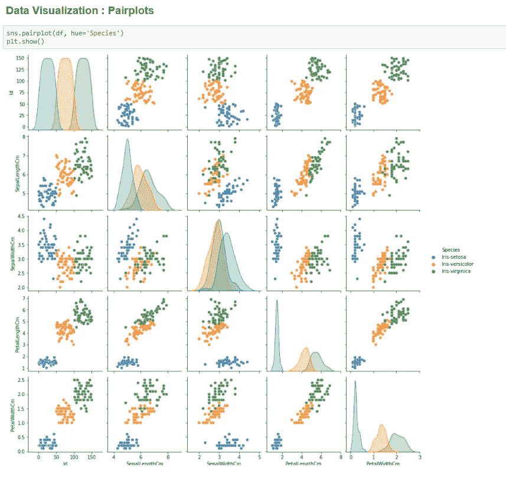

# Python 的数据分析工具

> 原文：<https://medium.com/analytics-vidhya/data-analysis-tools-for-python-354d2d16e5b5?source=collection_archive---------12----------------------->

探索性数据分析通常用于揭示数据中存在的各种模式，并从中得出结论。在开发机器学习模型时，EDA 是核心部分。这是通过对数据的分析和可视化来实现的，这些数据将被提供给**机器学习模型**。在这篇博客中，我们将了解如何开始使用 Python 进行机器学习的探索性数据分析。

作为初学者，我在探索和理解数据集中存在的不同模式时付出了很多努力，而且在创建机器学习模型时，探索性数据分析部分不能跳过，因为 ed a 是 ML 模型生成过程的基础。如果没有对数据中不同模式的正确洞察和分析，您就无法继续创建您的机器学习模型。在这个博客中，我们将看到用于 EDA 的工具及其功能。在接下来的博客中，我将通过一个例子详细介绍 EDA 的方法。

首先，从 EDA 开始的完美包是一组专门用于数据分析和可视化的 python 模块。其中包括:

*   [熊猫](https://pandas.pydata.org/)

```
import pandas as pd
```

Pandas 帮助分别操作表格和系列中的数据。一旦你开始导入数据集并处理它们，你会发现熊猫实际上有多重要。没有必要知道本库中所有的函数，但是有几个函数对操纵数据很有帮助。

*   [Numpy](https://numpy.org/)

```
import numpy as np
```

当在代码中使用 numpy 时，您可以轻松地自动化与多维数组相关的数据。Numpy 在深度学习方面帮助很大，在深度学习中，图像将以特定的方式进行转换，以便设置训练和测试/评估数据。Numpy 对数据科学和深度学习都有帮助。

*   [Matplotlib](http://matplotlib.org)

```
import matplotlib.pyplot as plt
```

Matplotlib 有助于生动地绘制数据，以便理解数据集中存在的模式。不把数据可视化，就不可能得出结论。因此，使用 Matplotlib，尝试创建条形图，直方图，散点图等。当涉及到机器学习中的数据建模和特征工程时，这将对你有很大帮助。

*   [Seaborn](https://seaborn.pydata.org/)

```
import seaborn as sns
```

Seaborn 类似于 Matplotlib，唯一的区别是前者在各自的函数中有更多更酷的参数。同样，Seaborn 和 Matplotlib 背后的主要思想是识别原始数据中存在的许多模式，并从数据集中消除不需要的数据，并将其提供给模型。这有助于提高模型的准确性和更清楚地了解数据。

没有数据，数据分析什么都不是。因此，为了在这个领域取得好成绩，唯一的关键是在代码中一起使用所有这些库。这将有助于理解这些模块所需的和必要的功能，以及在代码中需要的时候正确使用它们。我希望这有所帮助。

首先要熟悉这些库的基本功能，并自己在数据集上尝试不同的方法。

正如我前面提到的，Pandas 和 Numpy 这两个库都用于数据的操作和分析，所以我们可以快速浏览数据。

示例:

如果假设我必须创建一个包含两个特征的新数据集— f_1 和 f_2(假设这两个特征都是 DataFrame 类型),那么我们使用 pandas 库中的 concat 方法。

```
import pandas as pd
pd.concat([f_1, f_2], axis=1)
```

所以基本上 pandas，numpy 或任何其他工具都可以使用 Matplotlib 和 Seaborn 库进行可视化集成。

数据的可视化是使用 Matplotlib 和 Seaborn 完成的。通过这些模块，我们首先找出数据集的配对图。



这种配对图通常有助于识别要素和数据集目标之间的关系性质。同样，pairplot 后面是—

*   热图，
*   直方图
*   条形图
*   饼图

总而言之，EDA 实际上是一项巨大的任务，通常涉及各种模块的多种功能，这些模块相互集成，以得出我们数据集中存在的结论和模式。虽然 EDA 可能看起来很难，但它实际上很有趣。此外，我想保持这个博客简短和介绍性的，不包括任何功能，直接开始与分析和可视化。因此，在接下来的博客中，我将通过一个例子简要介绍 EDA，这个例子包括理解数据的精确可视化。