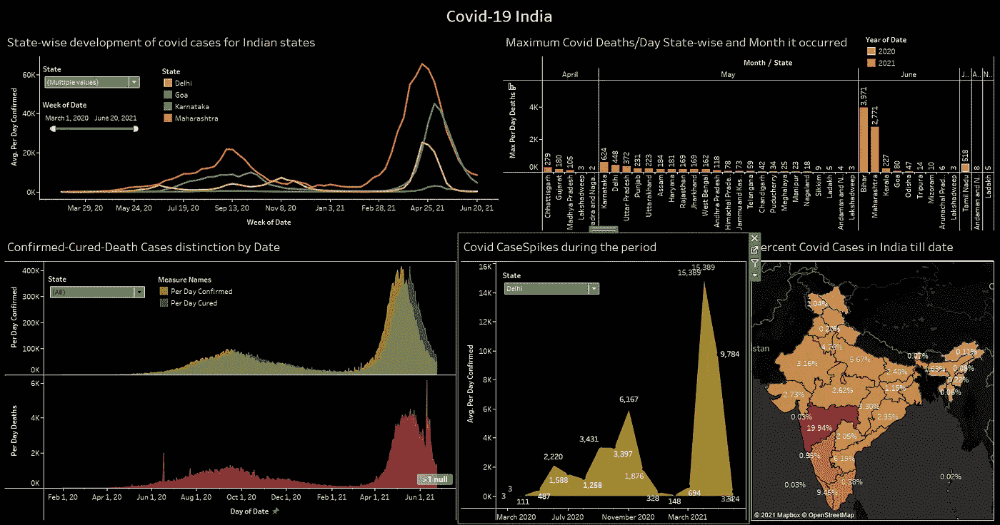

# 使用 SQL 进行数据分析:新冠肺炎印度案例背后的一瞥

> 原文：<https://medium.com/analytics-vidhya/data-analysis-using-sql-a-look-behind-covid-19-india-cases-1dfbad1dc82a?source=collection_archive---------6----------------------->

使用 SQL Server 分析 Covid 数

# 资料组

该项目的数据取自 [Kaggle](https://www.kaggle.com/sudalairajkumar/covid19-in-india) 。该数据包含 5 列—日期、状态、治愈、死亡、确认。用于分析的表格包含了从疫情开始到 2021 年 6 月 24 日的数据。

该项目包含对 Covid 案例的深入分析，使用 Excel & SQL 实现，并使用 Tableau 可视化。

SQL 分析是在 Microsoft SQL Server 上实现的。

这个表的所有数据都存储在一个名为 **covidCase** 的表中。

covidCase 表

# 清理数据:

该表包含一些不规则之处，如重复的州名、不正确的名称和无效字符的出现。所有这些情况都使用下面的 SQL 语句来处理:

清除表格中的数据

# 向表中添加额外功能:

给定数据集只有 3 个特征-治愈、死亡和确认。我们可以使用这些功能添加其他几个栏目，将我们的分析提升到一个全新的层次，帮助我们更好地获得有用的见解。这些新特征是每天**活跃病例**，以及每天**确诊病例**，每天**治愈病例**和每天**死亡病例**。

创建新功能

输出-

表格输出

# 我们开始分析吧！！

***1。全州确诊病例***
***2 例。截止日期*** 的各州最大活动案例数

有效和确诊病例总数

输出:案例总数最高的前 10 个州

确诊病例

输出:任何时候活动案例最多的前 10 个州

活动案例

***3。各州每日最大确诊病例数
4。*** 各州每日最大死亡病例数

产出:马哈拉施特拉邦(68631)在 2021 年 4 月 19 日一天内记录的病例数最高，其次是卡纳塔克邦(50112)在 2021 年 5 月 6 日，喀拉拉邦(43529)在 2021 年 5 月 13 日，而安达曼和尼科巴(149)在 2020 年 8 月 15 日记录的每日最大确诊病例数最低。

产出:2021 年 6 月 10 日，比哈尔邦(3971 人)登记的死亡人数最多，其次是马哈拉施特拉邦(2021 年 6 月 14 日，2771 人)和卡纳塔克邦(2021 年 5 月 24 日，624 人)。

***5。各州死亡率***

产出:这表明到目前为止，旁遮普省(2.68%)的病人死亡率是全国最高的，其次是北阿坎德邦(2.08%)和马哈拉施特拉邦(1.99%)，而喀拉拉邦(0.44%)和奥里萨邦(0.42%)是最低的。

***6。*** 【德里的 Covid 波】

输出:由此我们可以得出结论，在德里，第一波发生在 2020 年**6 月**，第二波发生在**11 月**，第三波发生在**4 月**，这是最严重的一次。从下面的 Tableau 报告中可以进一步了解这一分析，该报告显示了各个时间段的 4 个峰值。

德里的 Covid 波

德里的 Covid 波

# 摘要

根据以上数据分析，可以得出以下结论:

1.  马哈拉施特拉邦是全国受影响最严重的邦，确诊和活跃病例最多，死亡率也最高。
2.  该国受影响最严重的地区是南印度，南部大多数邦都受到了严重影响。
3.  Covid 浪潮袭击了该国两次，第二波大约在 2021 年 3 月到来，是最严重的一次。

新冠肺炎仪表板

要详细了解这个项目，请查看 [GitHub](https://github.com/rohanraj-9654/Covid-19-in-India-SQL-Tableau/blob/main/CovidCases/CovidIndia.sql) 资源库。

如果你对这篇文章有反馈、建议或问题，欢迎在 GitHub 上发表评论或补充，或者在 LinkedIn 上联系我。