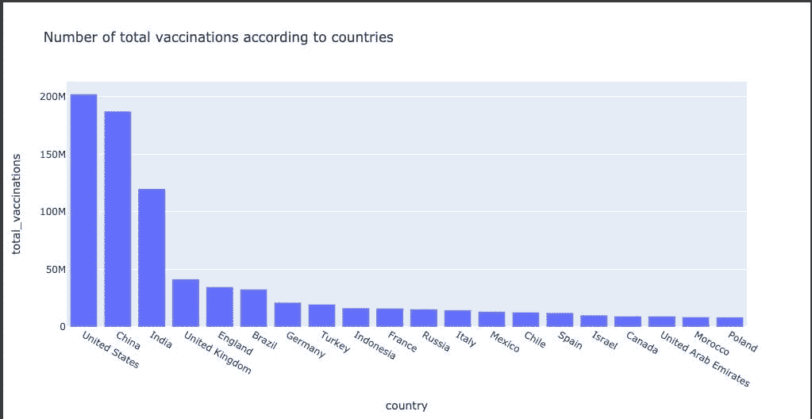
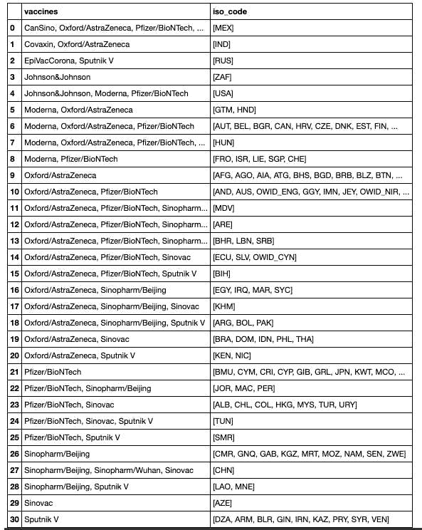
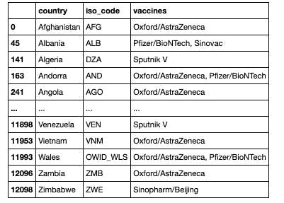
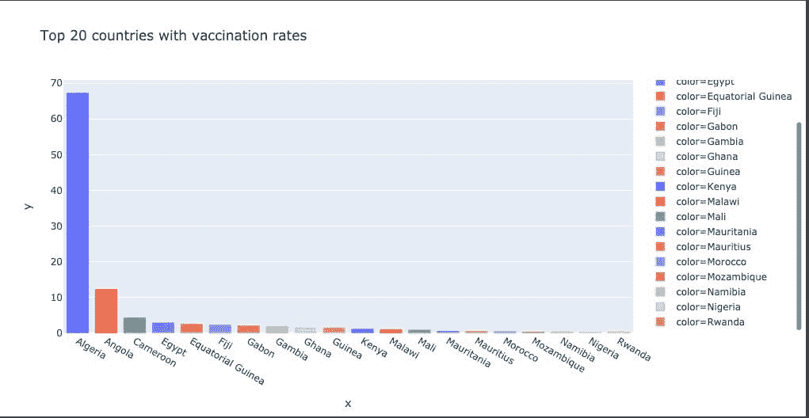
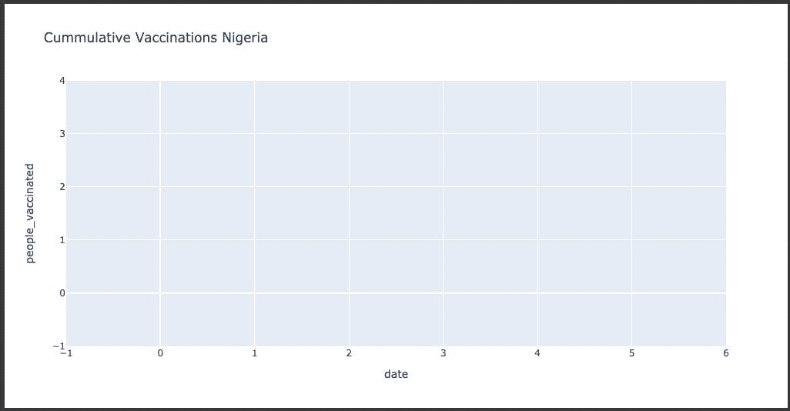

# 可视化数据分析:新冠肺炎疫苗进展

> 原文：<https://medium.com/analytics-vidhya/data-analysis-with-visualization-covid-19-vaccine-progression-84ea786d5ab4?source=collection_archive---------18----------------------->

这种新的冠状病毒疾病也被称为新冠肺炎，是一种新的 SARS-Cov-2 毒株，以其快速传播和高死亡率在全球疫情中肆虐。这使世界上从政府到学术界到研究人员和科学家的不同利益攸关方聚集在一起，通过疫苗开发和测试来遏制这种病毒。目前，在全世界不同的国家有各种各样的疫苗，这项分析旨在监测其进展。

# 问题陈述:

与非洲和世界相比，跟踪新冠肺炎疫苗在尼日利亚的进展。

# 数据:

本分析中使用的数据是从 [Kaggle](https://www.kaggle.com/gpreda/covid-world-vaccination-progress) 收集的。该数据集包含来自世界所有国家的数据，具有以下特征:

**国家** -提供疫苗接种信息的国家；

**国家 ISO 代码** —国家 ISO 代码；

**日期** —数据录入的日期；对于一些日期，我们只有每天的疫苗接种，对于其他日期，只有(累计)总数；

**接种疫苗总数** —这是该国免疫接种总数的绝对数字；

**接种疫苗的总人数** —根据免疫方案，一个人将接受一种或多种(通常为 2 种)疫苗；在某个时刻，接种疫苗的人数可能会比人数多；

**完全接种疫苗的总人数** —这是根据免疫方案接受全套免疫的人数(通常为 2)；在某一时刻，可能有一定数量的人接种了一种疫苗，而另一数量(较少)的人接种了该计划中的所有疫苗；

**每日疫苗接种(原始)** —对于某个数据条目，该日期/国家的疫苗接种数量；

**每日疫苗接种** —对于某个数据条目，该日期/国家的疫苗接种数量；

**每百人接种疫苗总数**——该国迄今为止接种疫苗人数与总人口的比率(百分比);

**每百人接种疫苗的总人数**——迄今为止该国接受免疫的人口与总人口之间的比率(百分比);

**每百人完全接种疫苗的总人数**——截止到目前，完全免疫的人口与该国总人口的比率(百分比);

**每日接种疫苗数** —当日及国家每日接种疫苗数；

**每日每百万人接种疫苗数** —该国当日接种疫苗数与总人口数的比率(ppm );

**该国使用的疫苗** —该国使用的疫苗总数(截至目前)；

**来源名称** —信息来源(国家机关、国际组织、地方组织等)。);

**来源网站** —信息来源的网站；

# 预处理:

在我导入所需的库、加载数据集并查看其中的信息之后，我创建了一个所有非洲国家的列表，并将它们存储在一个我命名为 Africa 的变量中。然后，我创建了一个新的数据框架，该数据框架按以下各列分组:国家 iso 代码疫苗总数 _ 接种人数 _ 接种人数 _ 每日全部接种人数 _ 每日全部接种人数 _ 每百人接种人数 _ 每百人接种人数 _ 每日全部接种人数 _ 每百人接种人数 _ 每百万人接种人数

# 世界焦点:

我按照前 20 个国家的排名，分析了全世界接种疫苗的总数

从上图可以看出，美国是世界上接种疫苗总数最多的国家，而孟加拉国排名最少。

我想象了疫苗供应国可用的疫苗类型

那么到目前为止全世界的总分布

# 聚焦非洲:

我分析了非洲疫苗接种率最高的 20 个国家

上图显示，阿尔及利亚的疫苗接种率最高，莫桑比克、尼日利亚、纳米比亚和卢旺达的疫苗接种率最低。

# 聚焦尼日利亚:

我试图分析尼日利亚的累计疫苗接种量，结果得到了一个空图

在尼日利亚累积疫苗接种的情况下，空白图表的原因是缺乏每日数据更新，这是一个需要纠正的问题。

# 建议:

联邦卫生部应该有一个中央数据库，每天更新准确的数字。这将大大有助于跟踪疫苗接种进展和新的病毒病例，并将为如何减缓该国的传播提供线索。

# 结论:

本分析的目的是回答以下问题。

1.  世界各地使用的疫苗
2.  非洲局势
3.  尼日利亚局势。

也是为了加强我使用可视化技术进行数据分析的技能。您可以在 [LinkedIn](https://www.linkedin.com/in/rosemary-nwosu-ihueze/) 上与我联系，代码可以在 Github 上的[我的存储库](https://github.com/Nwosu-Ihueze/vaccine_progression)中找到。感谢您的阅读。

这一分析的灵感来自于法国 EPISEN 大学的学生 Hamoye 和 RachidYZ。