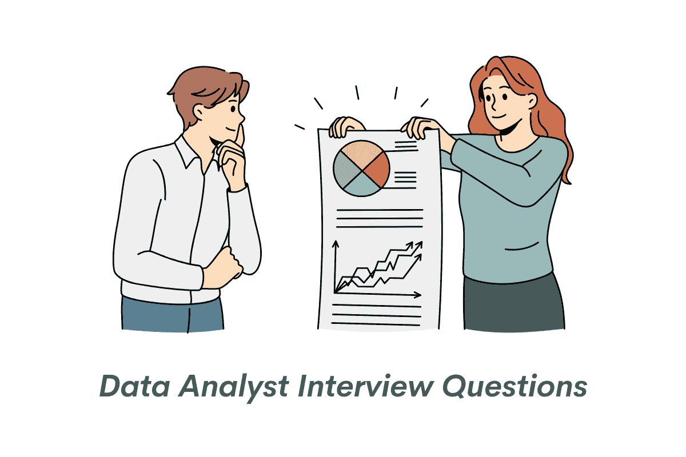
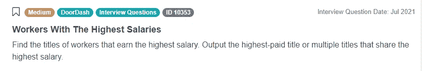
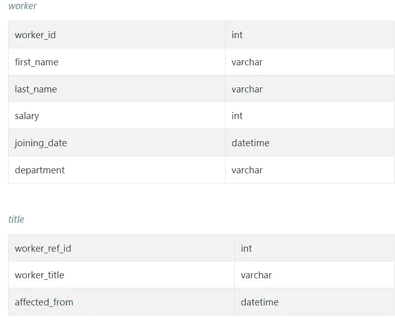
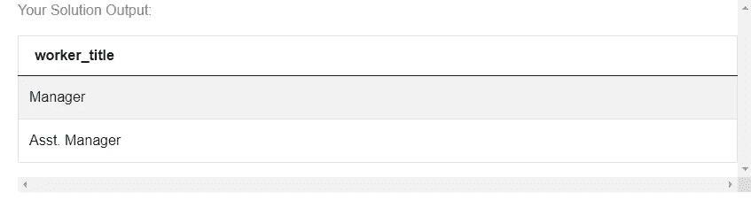
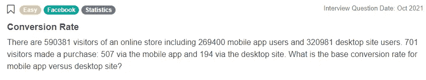
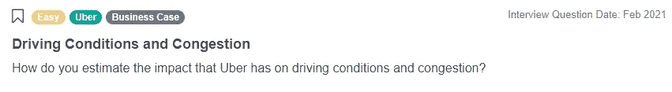
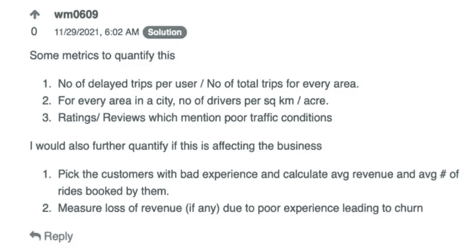
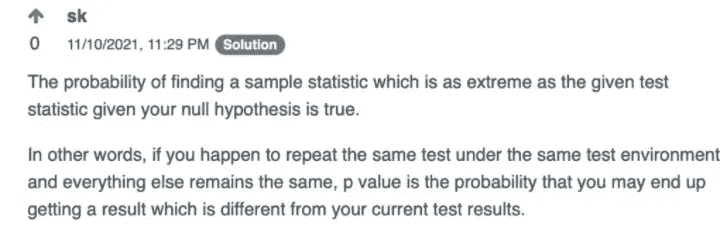

# 数据分析师面试问题

> 原文：<https://medium.com/analytics-vidhya/data-analyst-interview-questions-51995b908f20?source=collection_archive---------0----------------------->

## 在本文中，我们将讨论最近顶级公司数据分析师面试中的热门面试问题和流行概念。



作者在 [Canva](https://canva.com/) 上创建的图片

对于那些希望成为数据分析师的人来说，面试过程可能会令人望而生畏。面试涵盖广泛的内容，包括技术面试问题，统计和概率，以及实际问题的解决。尽管不同公司的数据分析师面试各不相同，但 SQL 技能是很受欢迎的，而且经常被测试。对 SQL 的精通将使你成为数据分析师职位的候选人。StrataScratch 提供了数百个面试问题和一个活跃的用户社区，帮助您准备数据分析师面试。

让我们讨论一下最近顶级公司的数据分析师采访中的顶级面试问题和流行概念。

# 数据分析师技术访谈编码问题

在数据分析师面试过程中，您很可能会遇到技术面试，在这些面试中，您需要回答 SQL 或 Python 中的问题。通过提前练习类似的问题来准备面试是至关重要的。今天，我们将参考 StrataScratch 从领先的科技公司收集的大量面试问题。

**工资最高的工人**

在最近的一次 DoorDash 面试中，应聘者被要求在使用 SQL 的数据集中找出工资最高的员工的头衔。



截图来自 [StrataScratch](https://platform.stratascratch.com/coding/10353-workers-with-the-highest-salaries?python=&utm_source=blog&utm_medium=click&utm_campaign=medium)

问题链接:[https://platform . stratascratch . com/coding/10353-工资最高的工人](https://platform.stratascratch.com/coding/10353-workers-with-the-highest-salaries?python=&utm_source=blog&utm_medium=click&utm_campaign=medium)

该数据包含两个表——一个名为“worker”的表包含有关公司员工的数据，另一个名为“title”的表包含有关员工的职称和角色生效日期的数据。



在我们看这个数据分析师面试问题的可能解决方案之前，让我们思考一下我们的问题，以及如何从逻辑上解决它。一般来说，当处理编码问题时，这是一种有用的技术，尤其是在你可能会紧张的面试中。花点时间想想你到底在问什么，并模拟出得出正确解决方案的必要步骤。

在这个数据分析师面试问题中，我们感兴趣的是找到薪水最高的职位，并且有两张表供我们使用。虽然“worker”表相当全面，但它缺少“title”表中的相关“worker_title”属性。因此，我们需要[加入表](https://www.stratascratch.com/blog/how-to-join-3-or-more-tables-in-sql/?utm_source=blog&utm_medium=click&utm_campaign=medium)。这可以通过匹配公共值来实现，在本例中为“worker_id”和“worker_ref_id”。成功连接表后，我们对薪水最高的职位感兴趣。

另一个技巧是识别相关属性，忽略其他属性。对于我们的问题，我们感兴趣的是' worker_id '、' salary '、' worker_ref_id '、' worker_title '。其他属性是不必要的复杂因素，我们可以忽略。

接下来，我们来看一个可能的解决方案。请记住，有许多方法可以解决这个问题，在 StrataScratch 的“解决方案讨论”和“来自用户的解决方案”选项卡中可以找到许多方法。

```
SELECT title.worker_title
FROM worker
INNER JOIN title
ON title.worker_ref_id = worker.worker_id
WHERE worker.salary = (SELECT MAX(salary) FROM worker)
```

我们将“标题”表中的“工人参考标识”字段和“工人”表中的“工人标识”字段连接起来。当在两个表中都找到匹配的 ID 记录时，内部联接将只包含表中的行。例如，这可以从“worker”表中排除“worker_id”记录，这些记录在“title”表的“worker_ref_id”字段中没有匹配的对应项。在我们的用例中，这很好，因为我们只对有“worker_title”的工人记录感兴趣，所以我们需要两个表中的 id 字段匹配。

在查询的最后一行，我们利用 SQL 的聚合函数“MAX”来确定“worker”表中“salary”字段的最高值。

既然我们已经理解了所使用的 join 和 aggregate 函数，我们就可以轻松地从头到尾阅读查询了。

我们从“职位”表中选择“工人 _ 职位”字段，因为我们对“工人”表中薪水最高的职位感兴趣。我们根据共同值“worker_ref_id”和“worker_id”连接“worker”和“title”表。我们的联接发生在“worker”表的“salary”值最大的地方。

该查询产生两个返回的头衔—经理和助理经理。



此外，查看我们最近在 [SQL JOIN 面试问题](https://www.stratascratch.com/blog/sql-join-interview-questions/?utm_source=blog&utm_medium=click&utm_campaign=medium)上的帖子，找到更多这样的问题来练习。

# 数据分析师非编码面试问题

数据分析师面试通常包含一系列非编码问题，这些问题可能会测试候选人使用统计或商业智能工具解决问题的能力。在最近的一次脸书面试中，应聘者被要求计算各自移动和桌面应用的基本转换率。

**转换率**

该问题指定在线商店有 590，381 个访问者，包括 269，400 个移动应用程序用户和 320，981 个桌面站点用户。701 名访客进行了购物——507 名通过移动应用程序，194 名通过桌面。移动和桌面应用的基本转换率是多少？



截图来自 [StrataScratch](https://platform.stratascratch.com/technical/2320-conversion-rate?utm_source=blog&utm_medium=click&utm_campaign=medium)

问题链接:[https://platform . stratascratch . com/technical/2320-转化率](https://platform.stratascratch.com/technical/2320-conversion-rate?utm_source=blog&utm_medium=click&utm_campaign=medium)

为了回答这个数据分析师面试问题，我们必须计算每个转化率。对于移动应用程序，超过 269，400 个用户进行了 507 次购买。这相当于移动应用程序的转换率(正/总)为 507/269，400 或 0.188%。对于桌面应用程序，320，981 个桌面用户进行了 194 次购买。桌面用户的转换率等于 194/320，981，即 0.060%。

这些结果可以解释为移动应用程序比桌面应用程序具有更高的转化率。版本之间是否有特征差异，这可能是造成这种差异的原因？这两个平台的用户群在构成上有区别吗？作为分析师，我们可能会寻求对这些问题提供见解。

**行驶条件和拥堵情况**

在优步数据分析师的采访中，候选人被要求估计优步对驾驶条件和拥堵的影响。面试官问这个问题是为了了解候选人如何解决问题，这个数据分析师面试问题非常开放。



截图来自 [StrataScratch](https://platform.stratascratch.com/technical/2213-driving-conditions-and-congestion?utm_source=blog&utm_medium=click&utm_campaign=medium)

链接到此数据分析师面试问题:[https://platform . stratascratch . com/technical/2213-驾驶条件和拥堵](https://platform.stratascratch.com/technical/2213-driving-conditions-and-congestion?utm_source=blog&utm_medium=click&utm_campaign=medium)

虽然有许多方法可以解决这个问题，但 StrataScratch 社区的一名成员建议生成一些指标来跟踪性能。首先，每个地理区域的延误行程数除以总行程数的比率。这一计算使我们对延误的旅行的百分比有一个概念。接下来，他们提出了一个衡量每平方公里或每英亩司机数量的标准。像这样的指标可以计算用户密度，并可以用来确定优步在特定地区的影响有多大。更大份额的驱动因素将表明更高程度的产品渗透。对于第三个指标，对提及交通状况不佳的评论的分析可能表明，优步司机感觉路线缓慢，或者交通总体上有所增加。



**解释 P 值**

在最近的一次亚马逊采访中，数据分析师被问及一个典型的概率问题——你如何向工程师解释 p 值？


截图来自 [StrataScratch](https://platform.stratascratch.com/technical/2166-interpret-p-value?utm_source=blog&utm_medium=click&utm_campaign=medium)

问题链接:[https://platform . stratascratch . com/technical/2166-interpret-p-value](https://platform.stratascratch.com/technical/2166-interpret-p-value?utm_source=blog&utm_medium=click&utm_campaign=medium)

这种类型的数据分析师面试问题非常受欢迎，因为它们测试候选人用普通语言解释技术概念的能力。StrataScratch 社区的一位成员在下面回答了这个问题。



点击查看更多亚马逊数据分析师职位的面试问题。

# 常见的行为数据分析师面试问题


作者在 [Canva](https://canva.com/) 上创建的图像

最后，我们将强调一些常见的行为数据分析师面试问题。这些问题更多的是关于你的经验和解决问题的技巧，但是回答好这些问题很重要。在被问到问题之前，花点时间思考一下你的答案可以提高你在面试中的表现。

**描述一个您使用数据解决业务问题的场景。**

面试官往往想了解你用数据解决问题的经验水平。如果你是一名经验丰富的数据分析师，从你最有影响力的项目开始。您是否分析了历史数据以发现客户数据的趋势，并将其用于制定成功的新营销策略？用那个。花时间围绕你的主要项目建立一个故事。能够解释业务需求，你的项目的细节，以及结果是如何使用的。对你的最佳分析贡献进行令人信服的描述，可以让你在竞争中脱颖而出。如果你没有数据分析师的实践经验，建立一个项目库，你可以给你的面试官指明方向。示例使用与你的预期雇主相似的数据是理想的，但是任何以有用的方式使用数据的项目都是有帮助的。

告诉我你向非技术观众解释技术概念的一次经历。

将分析结果转化为实际应用的能力是数据分析中最重要的技能之一。分析师经常需要向可能不是技术专家的企业领导解释他们的工作。面试官感兴趣的是他们的候选人在弥合技术概念和非技术利益相关者之间的差距方面的经验。

成功回答这个数据分析师面试问题的关键是关注分析的实际应用。商业领袖不需要精通统计模型的每一个方面，也不需要从中受益。然而，他们需要了解项目的基本原理，并相信调查结果。回答这个问题时，能够用连贯的叙述方式解释你的项目而不使用行话是很有帮助的。对于那些希望进入分析领域的人来说，这个问题可能更难。在这种情况下，用一个你个人生活中的例子或者以前在其他行业的工作经历。这里最重要的部分是沟通。

**你有什么问题？**

在大多数数据分析师面试中，你会被问及是否对该职位或公司有任何疑问。问几个关于这个职位的问题有助于建立你对这个职位的兴趣，所以一定要准备几个问题。如果你在整个面试过程中一直在思考问题，那就适当地提问。但是，要确保你的问题是真诚的。你可以做一些安全的调查(如果你想不到其他人):

*   在贵公司，数据分析师的一天是怎样的？
*   你的分析团队在做什么样的项目？

# 结论

总之，准备对于在数据分析师面试中表现出色至关重要。努力练习常见的面试技巧，包括 [SQL 问题](https://www.stratascratch.com/blog/sql-interview-questions-you-must-prepare-the-ultimate-guide/?utm_source=blog&utm_medium=click&utm_campaign=medium)、[概率统计问题](https://www.stratascratch.com/blog/probability-and-statistics-interview-questions-and-answers/?utm_source=blog&utm_medium=click&utm_campaign=medium)、[一般行为问题](https://www.stratascratch.com/blog/how-to-tell-your-story-in-an-interview/?utm_source=blog&utm_medium=click&utm_campaign=medium)。StrataScratch 提供了一个强大的数据分析师面试问题目录和一个活跃的用户社区。与其他数据专业人士就 StrataScratch 的实际面试问题进行互动，将有助于您为下一次数据分析师面试做好准备。

*原载于*[*https://www.stratascratch.com*](https://www.stratascratch.com/blog/data-analyst-interview-questions/?utm_source=blog&utm_medium=click&utm_campaign=medium)*。*