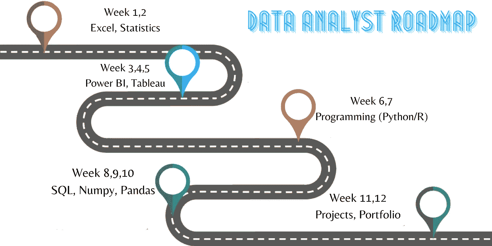

# 数据分析师路线图

> 原文：<https://medium.com/analytics-vidhya/data-analyst-roadmap-e8f9de05f93a?source=collection_archive---------0----------------------->

## 如何在 3 个月内靠自己成为一名数据分析师？

***数据分析师和数据科学家是当今的流行语。最近，我们看到人们突然倾向于走这条职业道路。数据分析师的工作角色有数不清的好处，最明显的是它的报酬，这也是为什么每个人都对它如此兴奋的众多原因之一。但数据分析不是小菜一碟，有自己的挣扎。所以，在你被它更好的一面动摇之前，做一个事实检查，确保这个角色是你的正确选择。***

***既然是新兴角色，就没有固定的课程可循。目前，有大量的在线付费课程和训练营，保证让你成为一名工作就绪的数据分析师。但说实话，我觉得你不用花一毛钱就能成为数据分析师。你所需要的就是每天投入 3-4 个小时和一个稳定的网络连接。为了帮助你的旅程，我在这里写了一个简短的博客，介绍谁是数据分析师，更重要的是，如何在不花太多钱的情况下成为一名数据分析师。***

> PS: 虽然证书有它自己的位置来证明你的技能，但是仅仅为了证书而完成一门课程对你没有任何帮助。因此，无论你选择什么课程，请确保你学习、练习并获得了这种技能。

# **谁是数据分析师**

## **“在现代，数据掌握着所有的答案，但最重要的是提出正确的问题！！!"。**

简单来说，数据分析师的角色是收集、处理和执行大型数据集的分析。
这个时代产生了海量的数据，现在有了一个术语，**大数据**。这些数据可以是客户反馈、账目、物流、市场调研等形式。数据分析师利用这些数据，计算出许多衡量标准，例如如何改善客户体验、对新材料定价以及如何降低运输成本等等。

换句话说，数据分析师就是将原始数据转化为信息，从而得出有意义、可操作的见解的人。这些见解随后被用来帮助企业做出明智的决策。这些见解被公司用于许多方面，从制定营销策略到改进生产过程。

*注意:这里提到的所有资源都是我个人的建议，您可以从任何您可以访问的资源中选择主题。*

# **统计数据**

成为一名优秀的数据分析师所需的首要技能是统计学。统计技能对于正确解读数据至关重要。应涵盖基本主题，如数据类型、基本图表类型、数据汇总、数据变化，一周时间足够了。统计学的初级专业知识就足够了。

> **资源:
> 可汗书院:【https://www.khanacademy.org/math/statistics-probability **
> 
> **可汗学院 YouTube:**https://www.youtube.com/playlist?list=PL1328115D3D8A2566
> 
> **马林统计:**[https://www.youtube.com/playlist?list = plqzol 9-ejtnbzdg 8 januhap 1c 9 q 6 vhy va](https://www.youtube.com/playlist?list=PLqzoL9-eJTNBZDG8jaNuhap1C9q6VHyVa)
> 
> **Statquest YouTube 频道:**[https://www.youtube.com/user/joshstarmer](https://www.youtube.com/user/joshstarmer)

# 高级 Excel

微软 Excel 是迄今为止业界最著名的数据处理工具。Excel 不仅仅是一个电子表格，它还提供了构建数据所需的大量功能。数据过滤器、函数、公式、图表和绘图、数据透视表、vlookup 和 VBA 宏等功能应在一周内完成，以便进行数据分析。一个好的数据分析师需要从初级到高级水平的 Excel 专业知识。

> **资源:
> Datacamp 课程:**[https://learn . data camp . com/skill-tracks/spread sheet-fundamentals？版本=1](https://learn.datacamp.com/skill-tracks/spreadsheet-fundamentals?version=1)
> 
> 【https://www.youtube.com/channel/UC8uU_wruBMHeeRma49dtZKA】Chandoo 的 youtube 频道:T23

# 结构化查询语言

毫无疑问，数据在数据分析师的生活中扮演着非常关键的角色，因此您需要精通数据管理，包括数据提取、转换和加载。SQL 是一个运行查询的优秀工具，通过它，您可以执行存储数据、读取数据、创建新表以及删除旧数据或垃圾等任务来操作数据。应该涵盖诸如连接、联合、排序依据和分组依据等主题。因此，中级 SQL 专业知识是必要的。

> **资源:
> 库达文卡特播放列表(前 16 名):**[https://www.youtube.com/playlist?list=PL08903FB7ACA1C2FB](https://www.youtube.com/playlist?list=PL08903FB7ACA1C2FB)
> 
> **khanacademy SQL 课程:**[https://www . khanacademy . org/computing/computer-programming/SQL](https://www.khanacademy.org/computing/computer-programming/sql)

# 商务智能工具

数据可视化有助于用简单的语言传达你的故事，让每个人都能理解。第 3 周和第 4 周可以用来学习用于数据可视化的 BI 工具。数据可视化使您能够发现数据中的模式，通过这些模式您可以创建一个好的故事呈现给客户。
Power BI、Tableau 和 Qlik sense 是业内最受欢迎的三款工具。然而，你可以只学习一两个工具，这应该足以让你成为一名优秀的数据分析师。我个人推荐 Tableau，因为我觉得相对来说它更容易和方便。初级到中级专业知识是必需的。

> **资源:**
> 
> **Simplilearn Tableau 课程:**[https://LMS . simpli learn . com/courses/2926/Tableau-Training/提纲](https://lms.simplilearn.com/courses/2926/Tableau-Training/syllabus)
> 
> **阿布舍克·阿加瓦尔:**[https://www.youtube.com/playlist?list = PL6 _ d 9 uswkg 1 C4 racotltf _ OQ 4 xnnnntm 9](https://www.youtube.com/playlist?list=PL6_D9USWkG1C4raCOTlTf_oq4XnNNNtm9)
> 
> **巴帝咨询公司:**[https://www.youtube.com/playlist?list = ply D1 xcira 3 gqmn 73 dhw qwr 4 r 08 abzfmtz](https://www.youtube.com/playlist?list=PLyD1XCIRA3gQmN73dHwQWr4R08ABZFMtZ)

# 计算机编程语言

编程在你的旅程中有着非凡的地位。尽管 Python 和 R 都是被广泛接受的数据分析编程语言，但我还是建议使用 Python，因为它可读性强，易于学习。
Python 或任何语言的基础到中级概念，如条件、循环、函数、读写等。，应该覆盖以做有效的分析。如果你已经是一名 python 程序员，你可以跳过这一步，专注于 python 库，而如果你是初学者，你将需要大约 1-2 周的时间来完成这些主题。

> **资源:【https://www.youtube.com/playlist?】code basics python 教程(第 16 期)——**[资源 list = pleo 1k 3 hjs 3 uv 5 u-lmlnucd 7 gqf-3 ehih 0](https://www.youtube.com/playlist?list=PLeo1K3hjS3uv5U-Lmlnucd7gqF-3ehIh0)
> 
> **Codebasics python 印地语教程—**[https://www.youtube.com/playlist?list = plpbgcxhespe 1 djkfdko 58 _ aizrit 0 JPO](https://www.youtube.com/playlist?list=PLPbgcxheSpE1DJKfdko58_AIZRIT0TjpO)

# Numpy，Pandas，Matplotlib

这些是 Python 为数据可视化和其他目的提供的库。Numpy 和 pandas 对于分析数据是必不可少的，而 matplotlib 和 seaborn 可以让你可视化你的数据。你可以学习 Matplotlib 或 Seaborn，因为它们的目的是一样的。

> **资源:
> Codebasics Numpy 播放列表:【https://www.youtube.com/playlist?】**T3list = pleo 1 k3hjs 3 uset 9 zivzjwqplawbiacteu
> 
> **Codebasics 熊猫播放列表(前 9 名):**[https://www.youtube.com/playlist?list = pleo 1 k3hjs 3 uu aspe-1 ljfg 5f 14 bnozjwy](https://www.youtube.com/playlist?list=PLeo1K3hjS3uuASpe-1LjfG5f14Bnozjwy)
> 
> **Codebasics matplotlib 播放列表**:[https://www.youtube.com/playlist?list = pleo 1k 3 hjs 3 uu 4 lr 8 _ kro 2 aqao 6 cfygkol](https://www.youtube.com/playlist?list=PLeo1K3hjS3uu4Lr8_kro2AqaO6CFYgKOl)
> 
> **Codebasics seaborn 教程:**[https://www.youtube.com/playlist?list = pljior 9 je 9 wzht-ptgfelpt 2 nyx 4 vgx _ j9](https://www.youtube.com/playlist?list=PLJIOr9Je9wzHT-ptgfelpt2Nyx4VGX_j9)
> 
> **Simplilearn 课程(仅涵盖 numpy、matplotlib 和 Pandas 的章节):**[https://LMS . Simplilearn . com/courses/2772/Data-Science-with-Python/syllabu](https://lms.simplilearn.com/courses/2772/Data-Science-with-Python/syllabus)s

# 项目、投资组合和简历

现在你已经获得了所有合适的技能，你需要展示你的技能并从其他人中脱颖而出以获得一份工作。项目和投资组合会为你做到这一点，所以投入大量的时间来准备这些。你可以在 Kaggle 中找到足够多的数据集来做项目。做一点研究，并开始工作。一旦完成，准备一份有见地的简历，开始申请工作和实习。

> 【https://www.simplilearn.com/data-analyst-resume-guide-pdf?资源:
> 数据分析师简历指南- [source = FRS _ recommended _ resource _ clicked](https://www.simplilearn.com/data-analyst-resume-guide-pdf?source=frs_recommended_resource_clicked)
> 
> Kaggle 探索性数据分析
> *笔记本:[https://www.kaggle.com/notebooks](https://www.kaggle.com/notebooks)
> *数据集:[https://www.kaggle.com/datasets](https://www.kaggle.com/datasets)
> 
> 项目思路:
> Alex the Analyst Portfolio 项目系列:[https://www.youtube.com/watch?v=qfyynHBFOsM&list = plu ab-1 hjhk 8h 48 pj 32 z 4 gzggwylqv 85 f&t = 0s](https://www.youtube.com/watch?v=qfyynHBFOsM&list=PLUaB-1hjhk8H48Pj32z4GZgGWyylqv85f&t=0s)

**沟通技巧—** 为了让别人理解你的数据和发现，你需要以讲故事的形式展示你的数据，并附上具体的结果和价值，这样别人才能理解你在说什么。因此，良好的沟通技巧是数据分析师的必备技能。