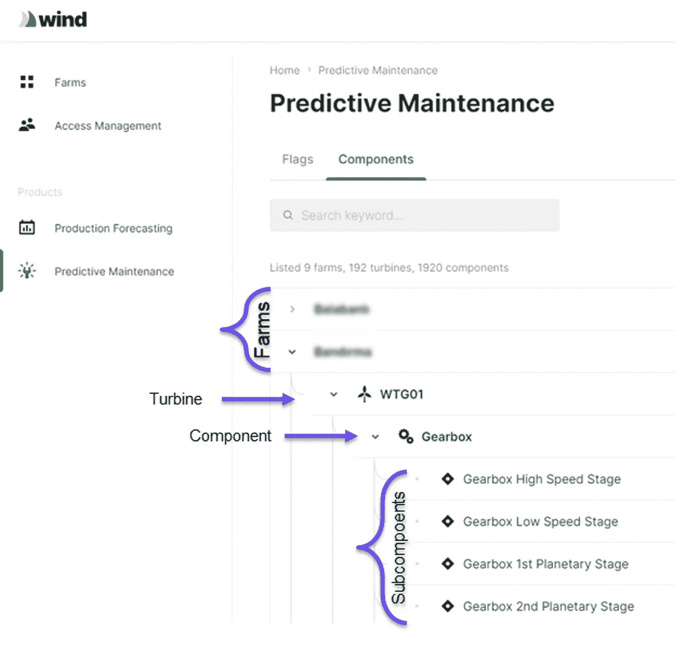
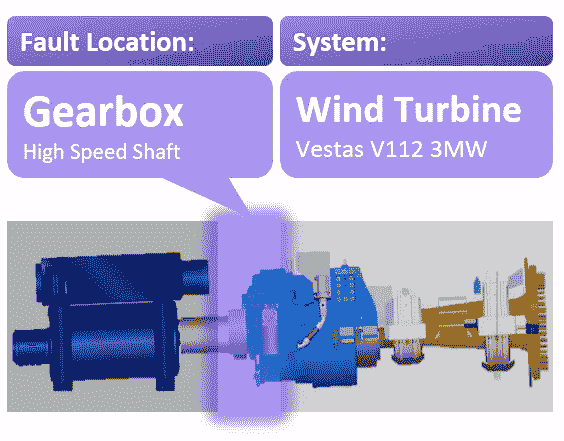
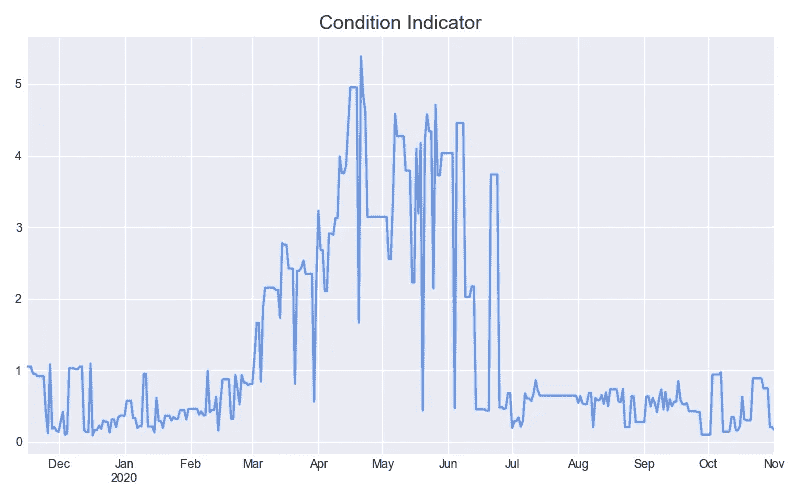
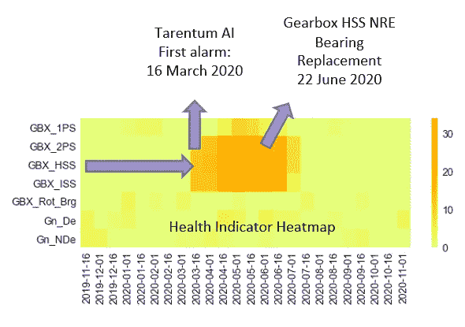
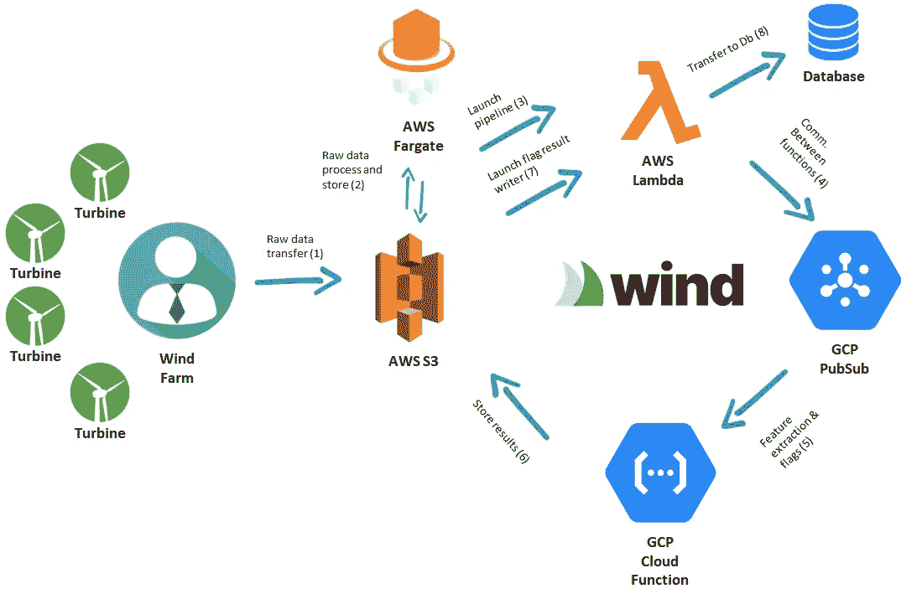

# 工业应用的数据分析:第二部分，人工智能如何预测风力涡轮机部件故障

> 原文：<https://medium.com/analytics-vidhya/data-analytics-for-industrial-applications-part-ii-how-ai-predicts-wind-turbine-component-cd992fa1280a?source=collection_archive---------8----------------------->

在我们的预测性维护系列的第一部分中，我们讨论了维护的理念和历史([点击此处查看第一部分](/@omerfarukeker/data-analytics-for-industrial-applications-part-i-a-history-of-predictive-maintenance-553e616d641b))。本系列的第二部分重点介绍风力涡轮机，并举例说明 Tarentum 的风力套件解决方案如何提前发现可能的主要部件故障，以避免高达数十万美元的生产损失和设备成本。

Wind Suite 的预测性维护模块是一个交互式 SaaS 平台，用户可以在该平台上跟踪其涡轮机的状况，还可以查看之前生成的警报。该平台还会自动发送电子邮件，提醒用户某个组件可能出现故障。

下图显示了预测性维护模块的快照。故障报警以分层下拉列表的形式组织。

Tarentum AI 的智能故障检测算法集合一起使用多个传感源，以给出自动故障警报。这些使用的来源包括:

*   加速度计(振动)传感器
*   SCADA 传感器

振动传感器是测量部件(如发电机驱动端轴承)振动或运动加速度的装置。一般来说，这些都有一个转换器，利用压电效应将振动或运动变化产生的机械力转化为电流。

当涉及到旋转部件的机械退化时，它们最敏感。如今，大多数关键的旋转设备，如风力涡轮机、燃气涡轮机、蒸汽涡轮机、齿轮箱、离心式压缩机、高压电机和大型离心泵，都配备了这些传感器，并受到连续监控。

SCADA 是 **S** 监督 **C** 控制 **A** 和 **D** ata **A** 采集系统的缩写，已经安装在大多数中压规模的风力发电机上。它提供了丰富的连续时间监控资源，可用于监控整体涡轮机性能。基于这些系统数据的故障检测为风力发电场运营商带来了巨大的好处。

# 借助人工智能进行故障检测

Tarentum AI 的数据驱动方法能够通过使用其历史 SCADA 和振动数据来捕捉涡轮机的正常行为。在训练期间，为每个涡轮机的每个子部件(例如齿轮箱转子轴承)创建一组异常检测模型，并用历史数据进行训练。借助故障/零件更换/维修日期的系统日志，优化模型参数。

根据可用的传感器，Tarentum AI 模型能够检测风力涡轮机以下部件中的故障:

**变速箱**

*   第一行星级
*   第二行星级
*   低速阶段
*   中速阶段
*   高速阶段
*   转子轴承

**发电机**

*   驱动端轴承
*   非驱动端轴承

**主轴承**

通过使用一组机器学习算法来确定每个子组件的正常行为。这些算法的输出被放入智能投票机制，然后生成最终诊断，并自动更新 Tarentum Wind Suite 平台的 flags 页面。

算法集成采用了无监督学习算法和多维距离度量的混合，这些度量基于从原始数据创建的统计和光谱特征(例如，偏斜度、光谱质心),以给出设备子部件如何偏离其正常行为。

# 个案研究

我们想在这里分享一个案例研究，其中 Tarentum AI 算法成功检测到 Vestas V112 风力涡轮机齿轮箱高速轴部分的轴承故障。

如下图所示，从 2020 年 3 月开始，齿轮箱子部件的状况指标急剧增加，导致系统在 3 月 16 日发出故障标志。

下图显示了状态指标 15 天聚合的热图，这实际上是确定系统状态的最终输出。在图表中，单元格越暗，情况越严重。Tarentum AI 算法在 3 月 16 日对第二行星级(GBX_2PS)、高速级(GBX_HSS)和中速级(GBX_ISS)子组件进行标记，因为它们超过了学习和优化的阈值。

在 6 月进行内窥镜检查和定期检查后，维修人员确认齿轮箱 HSS 轴承出现故障，需要更换。这表明 Tarentum 算法在代价高昂的故障发生前三个月就检测到了故障。这些算法还捕捉到了 GBX 2PS 和 GBX ISS 的性能下降，因为它们靠近变速箱 HSS 和加速度计传感器的灵敏度。

*财务影响:*

由于该故障已被预防，财务影响可计算如下。

*   消除了因计划外停机造成的 45 天生产损失，相当于 13 万美元。
*   降低设备和维护成本，大致是~**3.5 万美元。**

这些数字更多地代表了一种保守的情况，如果故障没有得到预防并会影响整个齿轮箱，财务影响将远远高于这些数字。

一般来说，每个主要部件故障预防将导致节省**3 万-25 万**美元的生产损失和**1 万-40 万**美元的设备和维护成本。这些范围取决于故障的严重程度、风况、备件可用性、维护人员和起重机可用性、农场位置和涡轮机类型。

# 数据管道

本节概述了提取、传输和加载(ETL)过程。Tarentum AI 预测性维护模块建立在无服务器架构上。所有计算和过程(例如，特征提取、模型预测、集合投票机制)在云函数上并行运行。

工艺流程可总结如下:

*   定期从客户管道获取原始振动和 SCADA 传感器数据
*   处理振动和 SCADA 传感数据
*   从传感器数据中提取特征，用于模型训练和预测
*   通过使用涡轮机相应部分的传感器数据，运行子部件级预测
*   运行智能投票机制以获取最终诊断标志(如果有)
*   存储结果并在模块上显示更新

这就把我们带到了这篇文章的结尾。当准备好新的案例研究时，我们将继续添加新的帖子。