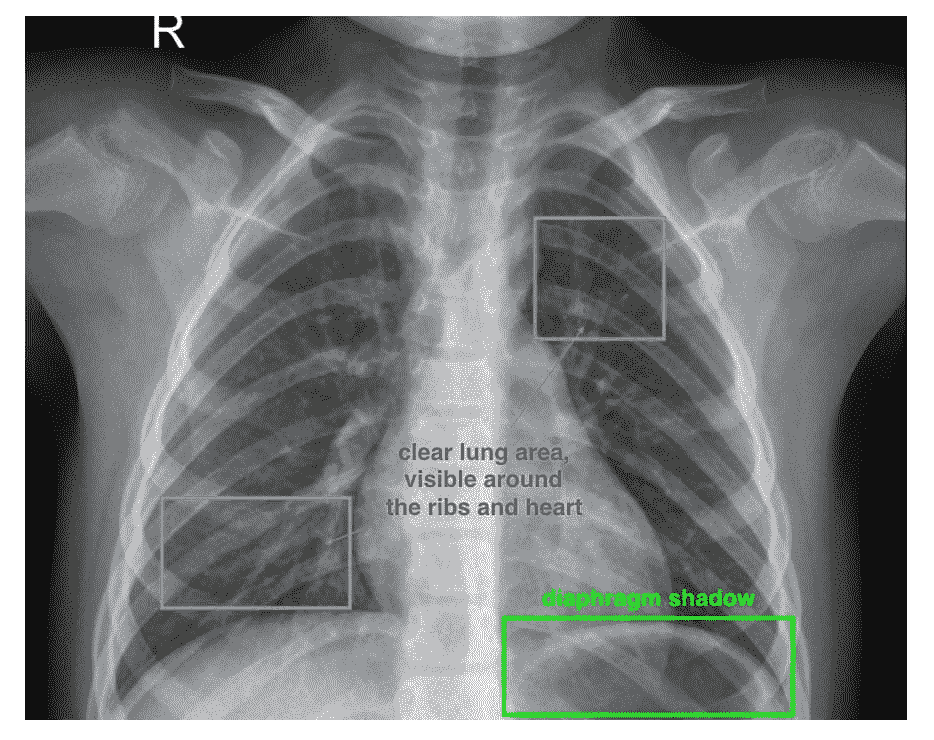
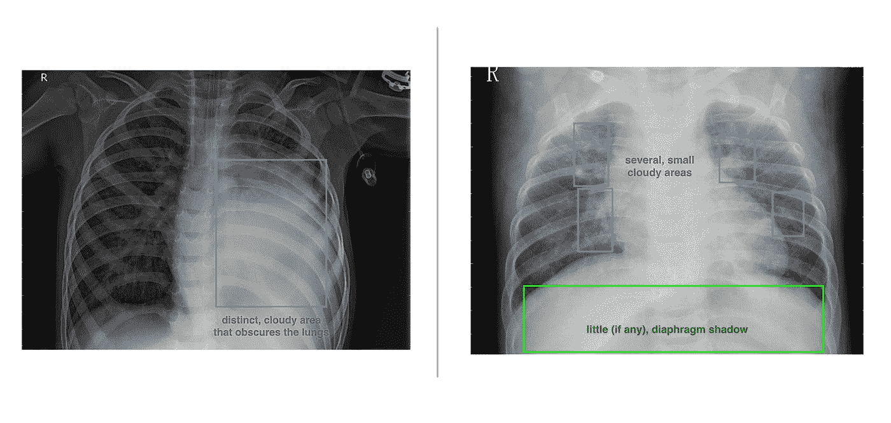
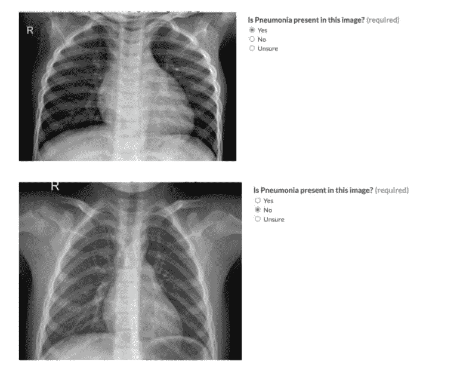

# 数据注释和标签

> 原文：<https://medium.com/analytics-vidhya/data-annotation-and-labeling-b3510507f5eb?source=collection_archive---------22----------------------->

根据阿彭的说法，数据注释是对人工智能应用程序的数据进行分类和标记。这种分类和标记是为了实现与您试图解决的业务问题相关的特定用例。

有些人的工作是为机器学习应用程序注释这些数据，他们被称为注释者。这些未经测试验证的标注器会导致数据中的偏差，因为人类会无意识地产生偏差，并可能导致不准确或不适当的标注。

我将演示如何使用阿彭提供的注释软件来创建用于在 X 射线图像中检测肺炎的注释。

# 概述:

肺炎是一种呼吸系统疾病，有超过 50 万美国人住院治疗，死亡率很高。这种疾病跨越所有年龄层，婴儿和老年人是高危人群。尽管如此，这种疾病可以通过疫苗来治疗和预防。

在这个项目中，注释者将帮助我们从 x 射线图像中识别出具有肺炎症状的图像，以便于识别，帮助医疗从业者进行精确医疗。

**步骤:**

为了取得成功，我们提供了三个标签:yes 表示存在肺炎，no 表示不存在肺炎，不确定注释者是否不确定被指派的测试人员是否具有领域知识，并为轻度病例和假阳性留出空间。需要遵循以下步骤:

1.  仔细检查图像。
2.  如果出现肺炎，选择是。如果没有，选择否。如果不确定，轻度病例或未确定，标记为不确定。

**规则:**

1.  只寻找肺炎的迹象。
2.  如果没有迹象，标记不确定。

为了减轻上述练习的压力，附上示例图像以区分健康肺和肺炎病变肺的指标。

健康的肺具有以下特征:

1.  清晰的肺部区域，可见肋骨和心脏周围。
2.  隔膜阴影。

肺炎病肺的特征是:

1.  明显的多云区域模糊了肺部。
2.  几个小的多云区域。
3.  很少或没有隔膜阴影。

即使采取了所有这些步骤，仍然存在偏差，包括:

1.  图像的亮度或不透明度的影响，可导致健康的肺看起来有病。这种偏差可以通过使用具有相同规格的器件来改善，或者对具有不同规格的器件的图像应用偏移。
2.  算法偏差也可能是一个因素。这种偏差源于模型的开发和训练模式，可以通过 A/B 测试来减少。

**测试:**

我继续创建了 25 个测试问题，为测试人员提供了一种评估不清楚案例的方法，并为所做的选择提供了信心。

在进行这些注释时，请记住，通过将领域专家纳入数据标签、对当前示例集的反馈、问题或提示、关于说明和示例质量的用户研究中，来进行长寿设计。

# 结论:

数据标注是任何机器学习应用的重要过程，因为它是建立执行模型的基础。所有的例子、数据和建议都可以在我的 [Github](https://github.com/Nwosu-Ihueze/AI_for_PM) 中找到，你可以在 [LinkedIn](https://www.linkedin.com/in/rosemary-nwosu-ihueze/) 上与我联系。这个项目是我的人工智能产品管理课程的一部分。