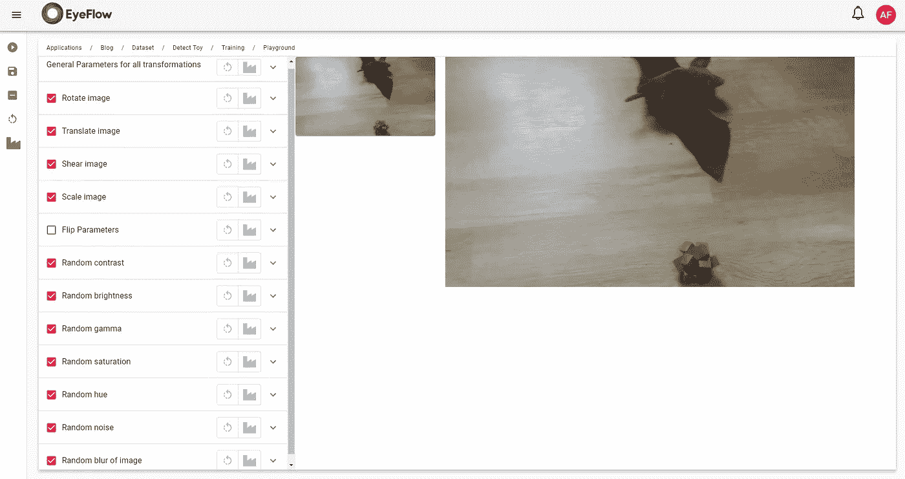
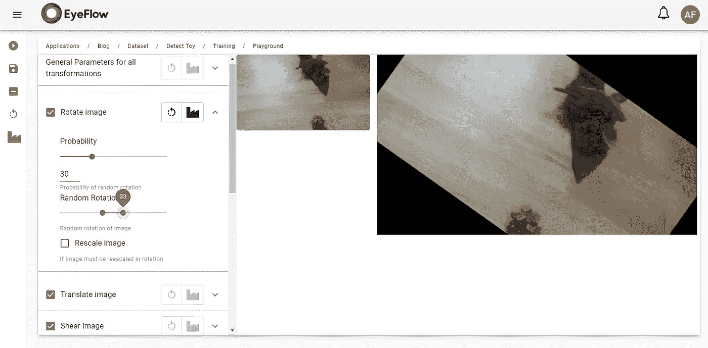
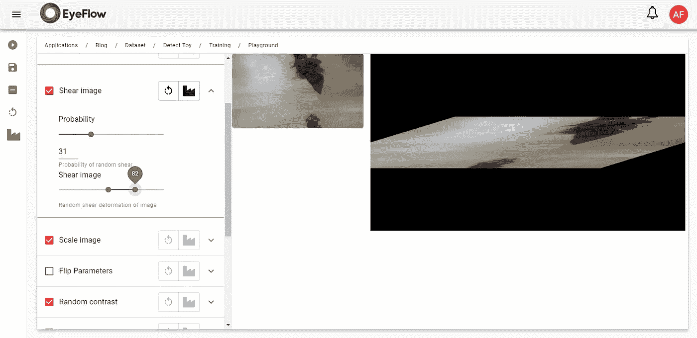
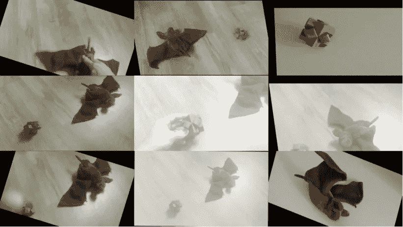

# 数据扩充和例子倍增的奇迹

> 原文：<https://medium.com/analytics-vidhya/data-augmentation-and-the-wonder-of-multiplication-of-examples-c8dccc8a6459?source=collection_archive---------9----------------------->

如何大幅减少数据注释工作

伯纳德·赫曼特在 [Unsplash](https://unsplash.com?utm_source=medium&utm_medium=referral) 上的照片

在以前的帖子中，我展示了我们如何设法训练一个神经网络来检测带有少量注释示例的对象，现在我将告诉你我们的“秘密”是什么。

深度神经网络是一种软件/数学人工制品，它从数据集收敛到对数据建模算法。这是一个本质上非常复杂的过程，但如果我们直观地理解其内部工作原理，我们就可以理解如何指导神经网络收敛/学习，以快速达到最佳结果。

我认为理解卷积深度神经网络的关键点是它的主要元素，即特征图。

> 您可以将特征映射理解为一个小的图像剪辑，它被训练来检测示例中的特定模式，并且每当在图像中发现该模式时将进行标记。

[https://medium . com/analytics-vid hya/convolutionary-neural-network-an-official-intro-part-1-db 9 FCA 86 a 750](/analytics-vidhya/convolutional-neural-network-an-informal-intro-part-1-db9fca86a750)

如果神经网络的特征图学习了我们想要检测的对象的基本模式，那么神经网络的训练将是有效的。

然而，注释大量的例子是非常费力的，在这一点上，数据扩充成为了一个很好的工具。数据扩充包括在图像中产生变化，将它们转换成不同的图像，但仍然作为有效的例子。因此，在每个训练季节中，神经网络的示例呈现不同，迫使特征图学习对象的基本模式。

让我们用我们的演示应用程序来看看数据扩充在实践中是如何工作的。在 Eyeflow。我们有一个操场，用户可以在那里表达和配置图像中的几种转换，从而创建一个转换管道，将应用于他们在训练中的例子。

数据增强游乐场

在左侧面板中，我们可以看到几个可以应用于示例图像的效果。它们中的每一个都有定义其行为的参数，以及在训练的每一步应用于示例的概率。

让我们尝试“旋转图像”并观察结果。

旋转图像

> 概率被设置为 30，这意味着在 30%的情况下，这种效果将被应用于训练中的示例。范围设置为-30 到+30，设置将应用的最小和最大旋转。因此，对于训练中呈现给网络的每个示例，图像将有 30%的机会以从-30°到+30°的随机角度旋转。

了解每种效果如何改变图像并正确设置参数非常重要。一些效果会在图像中产生剧烈的变形，使对象无法识别。如果在训练中把这样的例子呈现给网络，就会产生负面效应，混淆学习。见下面极端“切变”的情况。

极端剪切—对象变得无法识别

在设置好每一个效果后，我们可以对一批图像进行测试，看看它们是如何粘在一起的。请记住，我们的目标是在将通过网络提交学习的示例中生成转换，因此对象仍然需要很好地识别，以便特征地图可以学习模式。

批量转换图像

## 最后的话

我经常看到一些文章谈论使用人工智能是多么的费力和困难，因为需要大量带注释的例子才能工作。但是对于眼流公司的我们来说。人工智能，这个过程已经变得更快更容易，因为我们正在向我们的视频分析平台添加所有的工具和进步。

如果你不知道，来拜访我们吧。 [https://eyeflow.ai](https://eyeflow.ai)