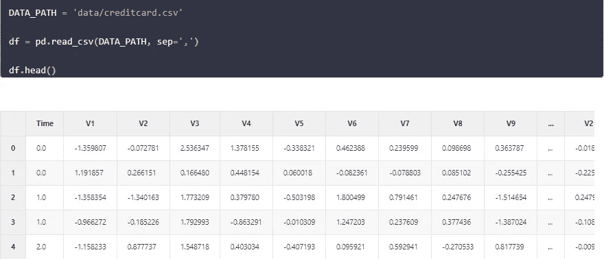

# 表格数据的数据扩充

> 原文：<https://medium.com/analytics-vidhya/data-augmentation-for-tabular-data-f75c94398c3e?source=collection_archive---------0----------------------->

JOSHUA COLEMAN 在 [Unsplash](https://unsplash.com?utm_source=medium&utm_medium=referral) 上拍摄的照片

为什么以及如何使用深度学习在表格数据上创建数据增强的主要思想在[我之前关于这个主题的博客](/analytics-vidhya/tabular-data-augmentation-with-deep-learning-7270584e7ff)中有所描述。从那以后过了相当一段时间，我决定重写代码，以便更容易使用。在这篇博文中，我想向你展示如何使用这种新方法，它对于你想要使用的模型有多灵活，以及你如何使用你自己的定制回调来更好地了解模型在后台做了什么。其中一些功能我已经内置了，下面是如何使用它们。

同样，我们使用来自 kaggle 的信用卡欺诈数据集。

deep_tabular_augmentation 的工作原理很简单，即我们希望将数据与模型一起保存在一个专用的类中(我们称之为学习者)。数据必须以 dataloader 对象的形式出现，我将它存储在 DataBunch 类中。其中有用于训练和测试数据的数据加载器。然后，runner 类定义流。

我们首先扩展数据，只保留我们想要扩充的类的数据:

如前所述，然后我将 train 和 testloader 放入一个名为 DataBunch 的类中，它只是一个数据容器。您可以轻松地创建自己的数据加载器，并将它们放在数据集中。

为了使用 deep_data_augmentation，我们需要指定输入形状(基本上就是数据集中有多少变量)、我们想要扩充的目标类的列名和相应的数字，最后是输入变量的列名。

然后，文可以定义我们想要的任何模型架构。我们只是将它作为一个列表传递给模型。我们还可以定义多少潜在维度，我们想添加到我们的自动编码器。

然后，runner 类为我们提供数据流，并让我们添加回调。其中一个内置的 Classbacks 是一个学习率查找器，您可以这样使用它:

我们也可以使用回调来创建一个学习率调度器。这里有一个例子:使用 30%的预算从 0.01 到 0.1，遵循余弦，然后最后 70%的预算从 0.1 到 0.01，仍然遵循余弦。

现在我们可以训练我们的自动编码器。我们希望跟踪损失，我们希望能够绘制一些损失图，我们希望添加我们的学习率计划:

我们可以看看训练损失:

以及各个时期的学习率:

您可以创建您想要的任何类型的回调，并将其传递给培训。在 runner 中，我创建了一些钩子，在这些钩子之后你可以直接链接你的回调函数，例如 *begin_batch* ， *begin_epoch* ， *after_pred* ， *after_fit* 等等。当您创建回调函数时，您可以直接引用这些函数来确定回调函数应该在哪里执行特定的任务。这是 LossTracker 的样子:

当开始训练时，我从一个空单开始，在每一批之后，我加上损失。在每个时期之后，我打印损失。

此外，跑步者还为您提供了通过训练模型创建增强数据的可能性。您可以指定想要多少指定类的样本，还可以添加一些噪声，我发现这可以为以后的使用创建更好的输入。

让我们看看我们的模型在复制欺诈案例时表现如何。首先，我们在非欺诈案例中绘制 V1 与 V2 的对比图，然后我们在欺诈案例中绘制同样的图:

他们看起来很不一样。让我们看看我们的假数据是如何做到的:

这看起来真的很神奇。如果你有任何问题或者想在包裹里添加什么，就问我。

拉塞

*原载于 2021 年 11 月 07 日*[*https://lschmiddey . github . io*](https://lschmiddey.github.io/fastpages_/2021/04/10/DeepLearning_TabularDataAugmentation.html)*。*