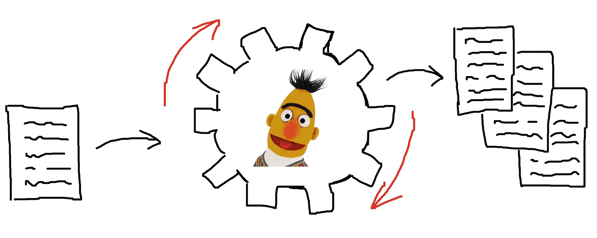
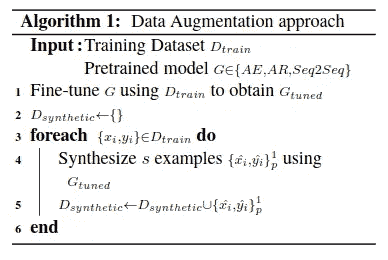

# 用于命名实体识别的变压器模型的数据扩充

> 原文：<https://medium.com/analytics-vidhya/data-augmentation-with-transformer-models-for-named-entity-recognition-a662e834b524?source=collection_archive---------13----------------------->



基于语言模型的预训练模型，如[伯特](https://www.depends-on-the-definition.com/named-entity-recognition-with-bert/)已经在不同的 NLP 任务中提供了显著的增益。对于许多 [NLP](https://www.depends-on-the-definition.com/tags/nlp/) 任务来说，带标签的训练数据是稀缺的，并且获取它们是一项昂贵且要求高的任务。数据扩充可以通过人工扰动标记的训练样本来增加可用数据点的绝对数量，从而有助于提高数据效率。在 NLP 中，这通常是通过用基于词典的同义词替换单词或者[翻译成不同的语言然后返回](https://arxiv.org/abs/2005.05909)来实现的。

这篇文章探索了一种不同的方法。根据 Kumar 等人的建议，我们将从预训练的变压器中采样，以增强用于[命名实体识别](https://www.depends-on-the-definition.com/tags/named-entity-recognition)的小型、带标签的文本数据集。艾尔。他们提出使用 transformer 模型从文本数据生成增强版本。他们提出了以下算法:



[图片来源:库马尔等人。艾尔。](https://arxiv.org/abs/2003.02245)

为了简单起见，我们跳过第 1 行中的微调步骤，直接从预先训练的模型生成。让我们看看如何使用预训练的基于转换器的模型，如自动编码器模型，如 BERT，用于使用 pytorch 进行命名实体识别的条件数据增强。

```
**import** **torch**
**import** **torch.nn** **as** **nn**
**import** **torch.nn.functional** **as** **F**
**import** **torch.optim** **as** **optim**
**from** **torch.utils.data** **import** TensorDataset, DataLoader
**from** **tqdm.notebook** **import** tqdm

torch.manual_seed(2020)

**print**(torch.cuda.get_device_name(torch.cuda.current_device()))
**print**(torch.cuda.is_available())
**print**(torch.__version__)
```

# 加载数据

在我们做任何事情之前，我们加载示例数据集。你可能从我在命名实体识别上的其他[帖子中了解到这一点。](https://www.depends-on-the-definition.com/tags/named-entity-recognition)

```
**import** **pandas** **as** **pd**
**import** **numpy** **as** **np**

data = pd.read_csv("ner_dataset.csv", encoding="latin1")
data = data.fillna(method="ffill")**class** **SentenceGetter**(object):

    **def** __init__(self, data):
        self.n_sent = 1
        self.data = data
        self.empty = False
        agg_func = **lambda** s: [(w, p, t) **for** w, p, t **in** zip(s["Word"].values.tolist(),
                                                           s["POS"].values.tolist(),
                                                           s["Tag"].values.tolist())]
        self.grouped = self.data.groupby("Sentence #").apply(agg_func)
        self.sentences = [s **for** s **in** self.grouped]

    **def** get_next(self):
        **try**:
            s = self.grouped["Sentence: {}".format(self.n_sent)]
            self.n_sent += 1
            **return** s
        **except**:
            **return** Nonegetter = SentenceGetter(data)
sentences = getter.sentencestags = ["[PAD]"]
tags.extend(list(set(data["Tag"].values)))
tag2idx = {t: i **for** i, t **in** enumerate(tags)}

words = ["[PAD]", "[UNK]"]
words.extend(list(set(data["Word"].values)))
word2idx = {t: i **for** i, t **in** enumerate(words)}
```

现在，我们生成一个用于验证目的的训练测试分割。

```
test_sentences, val_sentences, train_sentences = sentences[:15000], sentences[15000:20000], sentences[20000:]
```

# 使用转换器模型构建数据增强器

在 [huggingface transformer 库](https://huggingface.co/transformers/)之上，我们构建了一个小的 python 类来扩充一段文本。注意，这种实现效率很低，因为我们需要保持原始的标记化结构来匹配标签，而`fill-mask pipeline`一次只允许替换一个屏蔽的标记。有了更复杂的机制来将标签匹配回扩充的文本，这可以变得非常快。为了简单起见，这里省略了这种方法。

我们为输入样本创建一个扩充示例，通过用屏蔽令牌`<mask>`递增地替换令牌，并用预训练模型生成的令牌填充它。我们使用 DistilRoBERTa 基本模型来生成文本。

```
**import** **random**
**from** **transformers** **import** pipeline**class** **TransformerAugmenter**():
    """
    Use the pretrained masked language model to generate more
    labeled samples from one labeled sentence.
    """

    **def** __init__(self):
        self.num_sample_tokens = 5
        self.fill_mask = pipeline(
            "fill-mask",
            topk=self.num_sample_tokens,
            model="distilroberta-base"
        )

    **def** generate(self, sentence, num_replace_tokens=3):
        """Return a list of n augmented sentences."""

        *# run as often as tokens should be replaced*
        augmented_sentence = sentence.copy()
        **for** i **in** range(num_replace_tokens):
            *# join the text*
            text = " ".join([w[0] **for** w **in** augmented_sentence])
            *# pick a token*
            replace_token = random.choice(augmented_sentence)
            *# mask the picked token*
            masked_text = text.replace(
                replace_token[0],
                f"{self.fill_mask.tokenizer.mask_token}",
                1            
            )
            *# fill in the masked token with Bert*
            res = self.fill_mask(masked_text)[random.choice(range(self.num_sample_tokens))]
            *# create output samples list*
            tmp_sentence, augmented_sentence = augmented_sentence.copy(), []
            **for** w **in** tmp_sentence:
                **if** w[0] == replace_token[0]:
                    augmented_sentence.append((res["token_str"].replace("Ġ", ""), w[1], w[2]))
                **else**:
                    augmented_sentence.append(w)
            text = " ".join([w[0] **for** w **in** augmented_sentence])
        **return** [sentence, augmented_sentence]augmenter = TransformerAugmenter()
```

让我们看看一个增强的句子是什么样子的。

```
augmented_sentences = augmenter.generate(train_sentences[12], num_replace_tokens=7); augmented_sentences[[('In', 'IN', 'O'),
  ('Washington', 'NNP', 'B-geo'),
  (',', ',', 'O'),
  ('a', 'DT', 'O'),
  ('White', 'NNP', 'B-org'),
  ('House', 'NNP', 'I-org'),
  ('spokesman', 'NN', 'O'),
  (',', ',', 'O'),
  ('Scott', 'NNP', 'B-per'),
  ('McClellan', 'NNP', 'I-per'),
  (',', ',', 'O'),
  ('said', 'VBD', 'O'),
  ('the', 'DT', 'O'),
  ('remarks', 'NNS', 'O'),
  ('underscore', 'VBP', 'O'),
  ('the', 'DT', 'O'),
  ('Bush', 'NNP', 'B-geo'),
  ('administration', 'NN', 'O'),
  ("'s", 'POS', 'O'),
  ('concerns', 'NNS', 'O'),
  ('about', 'IN', 'O'),
  ('Iran', 'NNP', 'B-geo'),
  ("'s", 'POS', 'O'),
  ('nuclear', 'JJ', 'O'),
  ('intentions', 'NNS', 'O'),
  ('.', '.', 'O')],
 [('In', 'IN', 'O'),
  ('Washington', 'NNP', 'B-geo'),
  (',', ',', 'O'),
  ('a', 'DT', 'O'),
  ('White', 'NNP', 'B-org'),
  ('administration', 'NNP', 'I-org'),
  ('spokesperson', 'NN', 'O'),
  (',', ',', 'O'),
  ('Scott', 'NNP', 'B-per'),
  ('McClellan', 'NNP', 'I-per'),
  (',', ',', 'O'),
  ('said', 'VBD', 'O'),
  ('his', 'DT', 'O'),
  ('remarks', 'NNS', 'O'),
  ('underscore', 'VBP', 'O'),
  ('his', 'DT', 'O'),
  ('Bush', 'NNP', 'B-geo'),
  ('administration', 'NN', 'O'),
  ("'s", 'POS', 'O'),
  ('concerns', 'NNS', 'O'),
  ('about', 'IN', 'O'),
  ('Iran', 'NNP', 'B-geo'),
  ("'s", 'POS', 'O'),
  ('nefarious', 'JJ', 'O'),
  ('intentions', 'NNS', 'O'),
  (',', '.', 'O')]]
```

# 生成扩充数据集

我们从一个只有 1000 个标记句子的小数据集开始。从那里我们用我们的增强方法产生更多的数据。

```
*# only use a thousand senteces with augmentation*
n_sentences = 1000

augmented_sentences = []
**for** sentence **in** tqdm(train_sentences[:n_sentences]):
    augmented_sentences.extend(augmenter.generate(sentence, num_replace_tokens=7))len(augmented_sentences)
```

所以现在我们产生了 1000 个新样本。

# 建立一个 LSTM 模型

```
**import** **pytorch_lightning** **as** **pl**
**from** **pytorch_lightning.metrics.functional** **import** accuracy, f1_score**from** **keras.preprocessing.sequence** **import** pad_sequencespl.__version__'0.9.0'
```

我们用 [pytorch-lightning](https://github.com/PyTorchLightning/pytorch-lightning) 建立了一个相对简单的 LSTM 模型。

```
EMBEDDING_DIM = 128
HIDDEN_DIM = 256
BATCH_SIZE = 64
MAX_LEN = 50**class** **LightningLSTMTagger**(pl.LightningModule): **def** __init__(self, embedding_dim, hidden_dim):
        super(LightningLSTMTagger, self).__init__()
        self.hidden_dim = hidden_dim
        self.word_embeddings = nn.Embedding(len(word2idx), embedding_dim)
        self.lstm = nn.LSTM(embedding_dim, hidden_dim)
        self.fc = nn.Linear(hidden_dim, len(tag2idx)) **def** forward(self, sentence):
        embeds = self.word_embeddings(sentence)
        lstm_out, _ = self.lstm(embeds)
        lstm_out = lstm_out
        logits = self.fc(lstm_out)
        **return** logits

    **def** training_step(self, batch, batch_idx):
        x, y = batch
        y_hat = self(x)
        y_hat = y_hat.permute(0, 2, 1)
        loss = nn.CrossEntropyLoss()(y_hat, y)
        result = pl.TrainResult(minimize=loss)
        result.log('f1', f1_score(torch.argmax(y_hat, dim=1), y), prog_bar=True)
        **return** result

    **def** validation_step(self, batch, batch_idx):
        x, y = batch
        y_hat = self(x)
        y_hat = y_hat.permute(0, 2, 1)
        loss = nn.CrossEntropyLoss()(y_hat, y)
        result = pl.EvalResult()
        result.log('val_f1', f1_score(torch.argmax(y_hat, dim=1), y), prog_bar=True)
        **return** result

    **def** test_step(self, batch, batch_idx):
        x, y = batch
        y_hat = self(x)
        y_hat = y_hat.permute(0, 2, 1)
        loss = nn.CrossEntropyLoss()(y_hat, y)
        **return** {'test_f1':  f1_score(torch.argmax(y_hat, dim=1), y)}

    **def** configure_optimizers(self):
        **return** torch.optim.Adam(self.parameters(), lr=5e-4)
```

# 比较

现在，我们用小的训练数据集和扩充的训练数据集训练出 LSTM 模型。然后我们在一个大的测试集上比较结果。首先，我们构建数据加载机制并设置数据加载器。

```
**def** get_dataloader(seqs, max_len, batch_size, shuffle=False):
    input_ids = pad_sequences([[word2idx.get(w[0], word2idx["[UNK]"]) **for** w **in** sent] **for** sent **in** seqs],
                              maxlen=max_len, dtype="long", value=word2idx["[PAD]"],
                              truncating="post", padding="post") tag_ids = pad_sequences([[tag2idx[w[2]] **for** w **in** sent] **for** sent **in** seqs],
                              maxlen=max_len, dtype="long", value=tag2idx["[PAD]"],
                              truncating="post", padding="post")

    inputs = torch.tensor(input_ids)
    tags = torch.tensor(tag_ids)
    data = TensorDataset(inputs, tags)
    **return** DataLoader(data, batch_size=batch_size, num_workers=16, shuffle=shuffle)ner_train_ds = get_dataloader(train_sentences[:2*n_sentences], MAX_LEN, BATCH_SIZE, shuffle=True)
ner_aug_train_ds = get_dataloader(augmented_sentences, MAX_LEN, BATCH_SIZE, shuffle=True)
ner_valid_ds = get_dataloader(val_sentences, MAX_LEN, BATCH_SIZE)
ner_test_ds = get_dataloader(test_sentences, MAX_LEN, BATCH_SIZE)
```

# 在小训练数据集上训练 LSTM

为了比较，我们首先在较小版本的训练数据集上训练 LSTM 网络。

```
tagger = LightningLSTMTagger(
    EMBEDDING_DIM,
    HIDDEN_DIM
)trainer = pl.Trainer(
    max_epochs=30,
    gradient_clip_val=100
)GPU available: True, used: False
TPU available: False, using: 0 TPU corestrainings_results = trainer.fit(
    model=tagger,
    train_dataloader=ner_train_ds,
    val_dataloaders=ner_valid_ds
)| Name            | Type      | Params
----------------------------------------------
0 | word_embeddings | Embedding | 4 M   
1 | lstm            | LSTM      | 395 K 
2 | fc              | Linear    | 4 K Saving latest checkpoint..test_res = trainer.test(model=tagger, test_dataloaders=ner_test_ds, verbose=0)
**print**("Test F1-Score: {:.1%}".format(np.mean([res["test_f1"] **for** res **in** test_res])))Test F1-Score: 33.9%
```

这还不是一个令人信服的表现，但我们也用了很少的数据。

# 在增强的训练数据上训练 LSTM

现在，我们在增强的训练数据集上训练 LSTM。这使用了先前模型的一半数量的非扩充训练数据。

```
tagger = LightningLSTMTagger(
    EMBEDDING_DIM,
    HIDDEN_DIM
)trainer = pl.Trainer(
    max_epochs=30,
    gradient_clip_val=100
)GPU available: True, used: False
TPU available: False, using: 0 TPU corestrainer.fit(
    model=tagger,
    train_dataloader=ner_aug_train_ds,
    val_dataloaders=ner_valid_ds
)| Name            | Type      | Params
----------------------------------------------
0 | word_embeddings | Embedding | 4 M   
1 | lstm            | LSTM      | 395 K 
2 | fc              | Linear    | 4 K    Saving latest checkpoint..test_res = trainer.test(model=tagger, test_dataloaders=ner_test_ds, verbose=0)
**print**("Test F1-Score: {:.1%}".format(np.mean([res["test_f1"] **for** res **in** test_res])))Test F1-Score: 32.4%
```

请注意，我们可以仅使用一半的数据获得与上面类似的 F1 分数。这个挺好看的！

# 总结

我们看到了如何使用 transformer 模型来扩充用于命名实体识别的小型数据集。我们可能可以通过在可用的训练数据或更大的领域特定数据集上微调所使用的语言模型来提高该方法的性能。试试吧，让我知道它对你有什么用。尝试将这种方法应用于其他架构，如[角色列表](https://www.depends-on-the-definition.com/lstm-with-char-embeddings-for-ner/)。

这篇文章最初发表在 https://www.depends-on-the-definition.com/的[上](https://www.depends-on-the-definition.com/)。查看更多关于自然语言处理和机器学习的内容。

# 资源

1.  莫里斯等人。al:text attack:NLP 中对抗性攻击、数据增强和对抗性训练的框架
2.  [库马尔等人。a1:使用预先训练的变压器模型进行数据扩充](https://arxiv.org/abs/2003.02245)