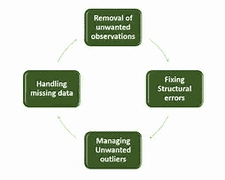

# 数据清理 101

> 原文：<https://medium.com/analytics-vidhya/data-cleaning-101-a5dccd695dfe?source=collection_archive---------1----------------------->

数据清洗是数据科学中一个重要而密集的过程，它有助于数据分析和建立机器学习模型。了解如何清理您的数据是有利的，原因有很多:

1.  防止错误的分析和错误的结论。
2.  正确、适当清理和格式化的数据可以加快高级算法的计算速度。

在本文中，我们将根据我们遇到的数据污垢类型——缺失数据、异常值、无效数据、重复、不一致等——来研究不同的清理技术。开始吧！

# 如何清理你的数据？

虽然有一个清理数据的方法大纲，但是步骤可能会根据我们正在处理的数据类型和我们希望实现的结果类型而有所不同。

## **缺失数据**

NaN，NULL，NA，“不适用”，None，“N/A”，空字符串等。是丢失数据值的不同伪装。有时我们会遇到缺少值的行。有时，几乎整列都是空的。有 3 种主要方法来清除丢失的数据:

1.  从分析中删除缺失数据或有价值数据的行和/或列。
2.  将丢失的数据重新编码成不同的格式。例如，具有空行的列“付款日期”可以被重新编码为具有 0:否、1:是的列“已付款日期”。
3.  用*最佳猜测值填充缺失值，*也称为插补。我们可以使用移动平均和回填来估计该点最可能的数据值。这在缺失值会扭曲我们的结论的用例中很重要。

## **离群值**

异常值是指明显偏离其余数据点并以不同方式表现的数据点。它们通常比下一个最近的数据点具有非常高或非常低的值。有三种处理异常值的方法:

1.  通过移除数据的上下 X 百分位来从分析中移除异常值，因为异常值会通过提高或降低平均值来扭曲我们的统计分析。
2.  在进行兴趣分析时，我们可以将“正常数据”和异常数据分成不同的组，并针对目标策略和营销分别进行分析。
3.  为了不遭受异常值的负面影响，我们可以使用不同的统计方法进行分析，如加权平均值和修整平均值。

## **重复数据**

重复数据意味着相同的值在一个观察点重复，这可能会缩小/扩大我们的数字。这可能是由于来自不同来源的数据被合并，并且每个来源将相同的数据带到我们的数据库。或者，用户可能提交两次信息。
我们可以通过以下方式消除重复:

1.  找到相同的记录并删除所有记录，只留下一个。
2.  两两匹配记录，比较它们，取最相关/最近的一个。
3.  通过聚类将记录合并到实体中(例如，关于客户 ABC 的信息聚类，它具有与之相关联的所有数据)。

## **无效数据**

这种类型的数据通常不合逻辑，是由数据处理或特征准备中的问题引起的。让我们举个例子:

你正在为你的 CEO 准备一份关于你最近发布的移动应用平均使用时间的报告。一切都很好，活动时间看起来很棒，除了几个流氓例子——你注意到一些用户在应用上花了-22 小时。深入挖掘异常的根源，你会发现*的应用内时间*是按照*的完成小时-开始小时计算的。*换句话说，某人在 23:00 开始使用应用程序，并在凌晨 1:00 结束，那么他的应用程序内时间将为-22 小时(1–23 =-22)。

清理无效数据通常意味着修改导致数据无效的函数和转换。如果不是这样，我们只需删除无效数据。

## **数据类型问题**

根据我们使用的数据类型——日期时间对象、字符串、整数或浮点数，我们可能会遇到特定于数据类型的问题。

**清理字符串**
字符串通常是数据清理中最混乱的部分，因为它们通常是人工生成的，因此容易出错。常见的琴弦清洁技术包括:

1.  跨字符串标准化大小写。
2.  删除前导空格和尾随空格。
3.  表示为字符串的热编码分类变量。
4.  纠正错别字

**清洗日期和时间**
日期和时间可能有些棘手。有时，直到对日期和时间进行计算时，错误才显现出来(如上面的活动持续时间示例)。
清洁过程包括:

1.  确保所有的日期和时间都是 DateTime 对象或 unix 时间戳(通过类型强制)。不要被伪装成日期时间对象的字符串欺骗，如“2019 年 10 月 24 日”。检查数据类型，并在必要时进行强制。
2.  国际化和时区。DateTime 对象通常是带时区或不带时区记录的。如果我们正在进行特定于区域的分析，请将日期时间对象转换为正确的时区。否则，跨所有 DateTime 对象标准化时区。

## 结论

数据科学家花 80%的时间清理和组织数据，以避免错误的结论和预测。正如老机器学习智慧所说:*垃圾进，垃圾出。*
优质数据随时击败花哨算法。这是数据驱动的决策所依赖的支柱。

感谢阅读！